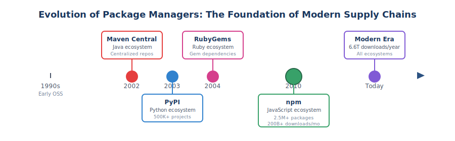
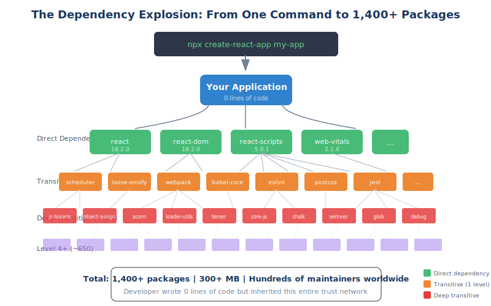

# 1.1 How Software Is Built Today

Software development has undergone a fundamental transformation over the past three decades. Where engineers once wrote applications largely from scratch—crafting everything from data structures to network protocols—today's developers assemble software from a vast ecosystem of pre-built components. This shift has enabled unprecedented speed and capability, but it has also created a complex web of dependencies that most organizations barely understand. To appreciate why software supply chain security matters, we must first understand how profoundly the practice of building software has changed.

## From Artisan Craft to Industrial Assembly

In the early days of commercial software development, teams wrote the majority of their code internally. A banking application in the 1980s might include custom implementations of sorting algorithms, date calculations, and string manipulation—functionality that today's developers would never consider building themselves. This approach was time-consuming and expensive, but it offered a form of implicit security: organizations knew exactly what was in their software because they had written it.

The shift began gradually in the 1990s with the rise of shared libraries and the open source movement. The release of the Linux kernel in 1991 and the founding of the Apache Software Foundation in 1999 signaled a new era in which high-quality software components would be freely available for anyone to use. But the true revolution came with the emergence of **package managers**—tools that automated the discovery, download, and integration of external components.

Maven Central launched in 2002, providing Java developers with a centralized repository for sharing libraries. Python's Package Index (PyPI) followed in 2003. RubyGems arrived in 2004. But it was npm's launch in 2010 that truly democratized package management, making it trivially easy for JavaScript developers to add functionality with a single command. Today, npm hosts over 2.5 million packages, with developers initiating more than 200 billion package downloads per month.[^npm-stats]

This timeline matters because it illustrates how quickly we have moved from a world of carefully vetted, internally developed code to one where applications are assembled from thousands of external components with minimal scrutiny. The infrastructure for distributing and consuming open source software matured far faster than the practices for securing it.

## The Modern Application: A Tower of Dependencies

Contemporary applications are not so much written as composed. When a developer creates a new project, they immediately inherit a complex tree of **dependencies**—external packages that their code relies upon, plus the packages those packages rely upon, and so on. This phenomenon of nested requirements creates what we call **transitive dependencies**: components that exist in your application not because you chose them, but because something you chose depends on them.

The scale of this dependency accumulation is staggering. According to [Synopsys's 2024 Open Source Security and Risk Analysis (OSSRA) report][ossra-2024] (page 8, "Open Source Risk Summary"), the average commercial application contains 526 open source components. The [Sonatype 2024 State of the Software Supply Chain report][sonatype-2024] (Chapter 2, "Open Source Supply Grows") found that the average Java application downloads 148 dependencies, while JavaScript applications routinely exceed 1,000. These numbers have grown consistently year over year, with no signs of slowing. (Section 2.4 provides a detailed comparison of dependency scale across major ecosystems.)

Consider a concrete example: a developer begins building a simple web application using React, a popular JavaScript framework. They run `npm create vite@latest my-app -- --template react` and, within seconds, have downloaded over 200 packages[^vite-react]. The developer has written zero lines of code, yet their application already includes components maintained by dozens of different individuals and organizations across the globe. As they add common dependencies—a UI component library, state management, form validation, data fetching—that number can quickly grow to 500 or more packages, each representing code the developer never explicitly wrote and may not fully understand.

[^vite-react]: Empirical measurement using Vite 5.x with React template. Note: create-react-app, the previous standard, was deprecated in early 2024 in favor of frameworks like Next.js and Vite. The deprecation itself illustrates how the supply chain evolves—organizations that built tooling around create-react-app now face migration decisions, and their dependency trees will change significantly.

This is not a JavaScript-specific phenomenon. A new Spring Boot project in Java will bring in approximately 50-70 direct dependencies, which expand to several hundred when transitive dependencies are included. A Python machine learning project using TensorFlow inherits a dependency tree spanning scientific computing libraries (NumPy, SciPy), data manipulation tools (pandas), and visualization packages (Matplotlib)—each with their own nested dependencies.

## Microservices and Distributed Architectures

The shift toward component-based development has been amplified by architectural changes in how applications are designed. The **microservices** pattern, which gained prominence in the 2010s, decomposes applications into dozens or hundreds of independently deployable services. Each service typically has its own codebase, its own dependencies, and often its own technology stack.

While microservices offer benefits in scalability and team autonomy, they multiply the supply chain challenge. An organization running 100 microservices might maintain 100 distinct dependency trees, each requiring monitoring and updating. The services communicate through APIs, creating integration points where security assumptions must be validated. Third-party services—payment processors, authentication providers, analytics platforms—add external dependencies that exist outside the organization's control entirely.

Container technologies like Docker have further complicated the picture. A containerized application includes not just application-level dependencies but also operating system packages, language runtimes, and system libraries. The Linux Foundation's Census II study found that the most widely deployed open source software often resides in this infrastructure layer—packages like curl, OpenSSL, and glibc that developers rarely think about but that form the foundation of modern computing.

## Build, Buy, or Borrow: The Modern Calculus

Today's development teams face a continuous series of decisions about whether to build functionality themselves, purchase commercial solutions, or incorporate open source components. This **build-buy-borrow** calculus has shifted dramatically toward borrowing, driven by competitive pressures and the extraordinary quality of available open source software.

The economics are compelling. Why spend weeks implementing a date parsing library when `date-fns` exists? Why build authentication infrastructure when you can integrate Auth0 or Keycloak? Why create a machine learning framework when TensorFlow and PyTorch offer world-class capabilities for free? Organizations that insisted on building everything internally would find themselves hopelessly uncompetitive, unable to match the development velocity of competitors who leverage the collective work of the open source community.

This rational economic choice, multiplied across thousands of decisions in every organization, has created the modern software supply chain. We have traded direct control for leverage, accepting external dependencies in exchange for the ability to build more capable software more quickly. This trade-off has been overwhelmingly positive for innovation, but it has created security challenges that most organizations are only beginning to understand.

## The AI-Assisted Development Frontier

The most recent evolution in software development adds another dimension to supply chain complexity. **AI coding assistants** like GitHub Copilot, Claude Code, Cline, and OpenAI Codex have rapidly become standard tools for developers, with GitHub reporting[^github-copilot] that Copilot generates an average of 46% of code in files where it is enabled (based on accepted suggestions in enabled files, as measured in 2023). These tools suggest code, recommend packages, and generate entire functions based on natural language prompts.

This capability introduces new supply chain considerations. AI assistants may suggest dependencies that developers would not have discovered otherwise—sometimes excellent choices, sometimes obscure packages with minimal maintenance. When an AI suggests importing a package, it is drawing on patterns learned from vast codebases, which may include outdated practices or packages that have since been deprecated or compromised.

More fundamentally, AI-generated code raises questions about provenance and understanding. When a developer writes code manually, they typically understand what each line does and why each dependency is included. When an AI generates code, that understanding may be incomplete. The developer accepts the suggestion because it works, not necessarily because they have evaluated its security implications.

This is not an argument against AI-assisted development—these tools offer genuine productivity benefits that organizations cannot ignore. But it does mean that supply chain security practices must evolve to account for a world where humans exercise less direct control over what enters their applications.

## The Bargain We Have Made

Modern software development practices have enabled remarkable innovation. Applications that would have taken years to build can now be assembled in months. Small teams can create products that compete with those from large enterprises. The collective intelligence of the open source community has raised the quality floor for all software.

But this transformation has come with an implicit bargain: we depend on code we did not write, maintained by people we do not know, with security practices we have not verified. The average organization has no comprehensive inventory of the open source components in their applications, no process for evaluating the security of new dependencies, and no clear plan for responding when a critical vulnerability is discovered in one of their thousands of transitive dependencies.

The chapters that follow examine this bargain in detail—the benefits of open source, the threats that target supply chains, and the practices that can help organizations manage their exposure. But the essential first step is recognizing the nature of modern software development: we are all building on foundations we did not lay, and we must learn to secure what we did not create.

[ossra-2024]: https://www.synopsys.com/software-integrity/resources/analyst-reports/open-source-security-risk-analysis.html
[sonatype-2024]: https://www.sonatype.com/state-of-the-software-supply-chain/introduction
[^github-copilot]: GitHub, "The State of Open Source and AI" (2023). https://github.blog/news-insights/research/the-state-of-open-source-and-ai/
[^npm-stats]: npm, "npm Registry Statistics," npm Blog, 2024. https://www.npmjs.com/; Sonatype, "2024 State of the Software Supply Chain Report," 2024.
