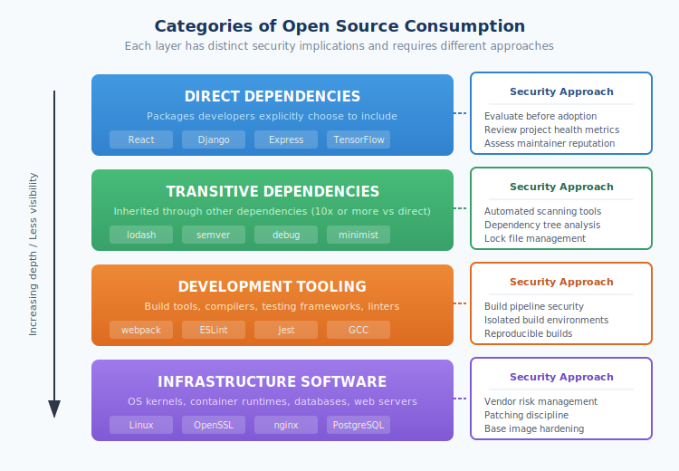

# 1.2 The Role of Open Source in Modern Software

The component-based development model described in the previous section has a defining characteristic: the vast majority of those components are open source. Open source software has become so deeply embedded in modern technology that discussing software security without centering open source is like discussing automotive safety without mentioning roads. Understanding the scale, value, and ubiquity of open source is essential for grasping why supply chain security has become one of the most critical challenges facing the technology industry.

## The Scale of Open Source Adoption

Open source software has moved from the margins to the mainstream with remarkable speed. What began as an ideological movement in the 1990s has become the dominant mode of software development and distribution worldwide. The statistics are unambiguous: open source is not merely a significant part of modern software—it is the foundation upon which nearly all software is built.

According to [Synopsys's 2024 Open Source Security and Risk Analysis report][ossra-2024], 96% of commercial codebases contain open source components. The [Linux Foundation and Harvard's Census II study][census-ii] found that 70-90% of any given modern software solution consists of open source software. [GitHub's 2023 Octoverse report][octoverse-2023] documented over 300 million contributions to open source projects in a single year, with more than 98 million developers participating in the platform's open source ecosystem.

These percentages translate into staggering absolute numbers. The npm registry alone serves nearly 200 billion package downloads monthly.[^npm-stats] Maven Central exceeded one trillion downloads in 2024 alone for the Java ecosystem.[^maven-stats] PyPI, the Python Package Index, distributes over 700,000 projects to millions of developers.[^pypi-stats] Behind each download is a decision—often implicit, often unexamined—to incorporate external code into an application.

The trajectory is consistently upward. [Sonatype's 2024 State of the Software Supply Chain report][sonatype-2024] documented 6.6 trillion open source downloads in 2024 alone, with JavaScript (npm) accounting for 4.5 trillion requests—a 70% year-over-year increase—and Python (PyPI) reaching 530 billion requests, up 87% year-over-year driven by AI and cloud adoption. Organizations are not merely maintaining their open source usage; they are dramatically accelerating it.

## The Economic Foundation of Modern Technology

Analyses of open source’s economic impact routinely conclude that it enables multi-trillion-dollar demand-side value, meaning downstream value to firms and consumers using open source as an input. Because these estimates depend heavily on modeling assumptions and definitions, we treat them as order-of-magnitude indicators, rather than precise accounting.

In 2021, the [European Commission published a study][ec-oss-study] on the economic impact of open source software and hardware, concluding that open source contributed between €65 and €95 billion to the European Union's GDP in 2018, with the potential for significantly larger contributions if investment increased. The study found that a 10% increase in open source contributions would generate additional annual GDP growth of 0.4% to 0.6% for the EU.

These numbers reflect a fundamental economic reality: open source software represents a shared infrastructure that virtually all technology companies build upon. Just as businesses benefit from public roads without bearing the full cost of highway construction, software companies benefit from open source without paying for its development. This creates enormous economic efficiency but also raises profound questions about who bears responsibility for maintaining and securing this shared infrastructure.

The Harvard study highlighted a troubling asymmetry in this equation. While the demand-side value of open source reaches into the trillions, the supply-side investment—the resources actually devoted to creating and maintaining this software—is orders of magnitude smaller. Much of the most critical open source infrastructure is maintained by volunteers or small teams with minimal funding, creating a fragility at the foundation of the digital economy.

## Categories of Open Source Usage

Organizations consume open source software in multiple ways, each with distinct security implications. Understanding these categories is essential for developing comprehensive security strategies.

**Direct dependencies** are packages that developers explicitly choose to include in their applications. When a team decides to use React for their frontend or Django for their backend, they are selecting direct dependencies. These choices typically receive some level of evaluation, even if informal—developers consider functionality, documentation, community support, and sometimes security posture.

**Transitive dependencies**, as introduced in Section 1.1, are packages that enter applications through the dependencies of direct dependencies. A developer choosing Express.js for a Node.js web application might knowingly evaluate that package but unknowingly inherit dozens of transitive dependencies like `accepts`, `content-type`, `cookie`, and `debug`. These transitive dependencies often outnumber direct dependencies by a factor of ten or more, yet they receive far less scrutiny.

**Development tooling** represents another category of open source consumption. Compilers, build systems, testing frameworks, linters, and deployment tools are almost universally open source. While these tools do not typically ship in production applications, they have profound security implications: a compromised build tool can inject malicious code into any software it compiles.

**Infrastructure software** forms the deepest layer of open source usage. Operating system kernels, container runtimes, web servers, databases, and message queues are predominantly open source. This infrastructure often runs in production environments, handling sensitive data and critical operations, yet it may receive less attention than application-level code because it is perceived as "someone else's responsibility."

Each category requires different security approaches. Direct dependencies can be evaluated before adoption. Transitive dependencies require automated tooling to track and assess. Development tooling demands careful attention to build pipeline security. Infrastructure software requires vendor management practices and patching discipline.

## Industry Variations in Open Source Consumption

While open source adoption is universal, patterns of usage vary significantly across industries, shaped by regulatory requirements, risk tolerance, and organizational culture.

**Technology companies** are the most aggressive consumers of open source, often operating with minimal friction in adopting new packages. Startups particularly rely on open source to achieve development velocity that would otherwise be impossible. The same [Synopsys OSSRA report][ossra-2024] found that technology companies average over 600 open source components per codebase, with some applications exceeding several thousand.

**Financial services** organizations consume open source extensively but often with more governance overhead. Regulatory requirements around third-party risk management (OCC guidance, FFIEC expectations) create frameworks that increasingly apply to open source. Major banks have established Open Source Program Offices (OSPOs) to manage consumption policies, and many contribute actively to projects they depend upon.

**Healthcare** presents a complex picture. While startups and digital health companies embrace open source freely, traditional healthcare organizations often move more cautiously, concerned about regulatory implications around software in medical devices (FDA guidance) and data protection (HIPAA). The rise of FHIR (Fast Healthcare Interoperability Resources) as an open standard has accelerated open source adoption for interoperability use cases.

**Government agencies** have dramatically increased open source adoption over the past decade, driven by policies like the [U.S. Federal Source Code Policy](https://obamawhitehouse.archives.gov/sites/default/files/omb/memoranda/2016/m_16_21.pdf) and similar initiatives internationally. The irony is notable: governments that once viewed open source with suspicion now recognize it as essential for avoiding vendor lock-in and enabling interoperability. However, government procurement and security assessment processes often struggle to accommodate the realities of open source development models.

## Strategic Imperatives Driving Adoption

Organizations do not adopt open source merely because it is available—they do so because it provides strategic advantages that proprietary alternatives cannot match.

**Speed** is perhaps the most compelling factor. Integrating an existing open source library takes hours; building equivalent functionality internally might take months. In competitive markets where time-to-market determines success, this acceleration is decisive.

**Cost efficiency** extends beyond avoiding license fees. Open source enables organizations to invest engineering resources in differentiated functionality rather than commodity infrastructure. A startup can build a sophisticated product because they are not spending years recreating databases, web frameworks, and machine learning libraries.

**Innovation access** ensures that organizations can immediately adopt cutting-edge capabilities. When new techniques emerge in machine learning, cryptography, or data processing, they typically appear first in open source implementations. Organizations relying solely on proprietary software often find themselves months or years behind.

**Talent acquisition and retention** increasingly depends on open source engagement. Developers prefer working with modern open source tools and often evaluate potential employers based on their open source practices. Organizations that contribute to open source projects attract engineers who want their work to have broader impact.

These strategic advantages explain why open source adoption continues to accelerate despite growing awareness of supply chain risks. The question is not whether to use open source—that choice has been made, irrevocably, by competitive necessity. The question is how to use it securely.

## The Inescapable Conclusion

The data leads to an inescapable conclusion: open source security *is* software security. Any strategy that treats open source as a peripheral concern—a special case requiring separate consideration—fundamentally misunderstands modern software development. The code that organizations write themselves represents a small minority of their actual running software. The overwhelming majority comes from open source projects they did not create, maintained by people they do not employ, following practices they have not verified.

This reality is neither good nor bad—it simply is. Open source has enabled extraordinary innovation and democratized software development in ways that benefit society broadly. But it has also created dependencies that require new approaches to security, new forms of collaboration between consumers and producers of software, and new investment in shared infrastructure. The chapters that follow explore these challenges and the emerging practices for addressing them.

[ossra-2024]: https://www.synopsys.com/software-integrity/resources/analyst-reports/open-source-security-risk-analysis.html
[census-ii]: https://www.linuxfoundation.org/research/census-ii-of-free-and-open-source-software-application-libraries
[octoverse-2023]: https://github.blog/news-insights/research/the-state-of-open-source-and-ai/
[sonatype-2024]: https://www.sonatype.com/state-of-the-software-supply-chain/introduction
[harvard-oss-value]: https://www.hbs.edu/faculty/Pages/item.aspx?num=65230
[ec-oss-study]: https://digital-strategy.ec.europa.eu/en/news/commission-publishes-study-impact-open-source-european-economy

[^npm-stats]: Socket.dev, "npm in Review: A 2023 Retrospective" (2024). https://socket.dev/blog/2023-npm-retrospective
[^maven-stats]: Sonatype, "Maven Central: Addressing the Tragedy of the Commons" (2024). https://www.sonatype.com/blog/maven-central-and-the-tragedy-of-the-commons
[^pypi-stats]: PyPI Statistics. https://pypi.org/stats/

