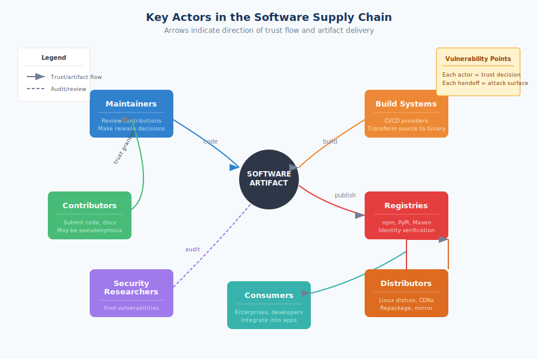
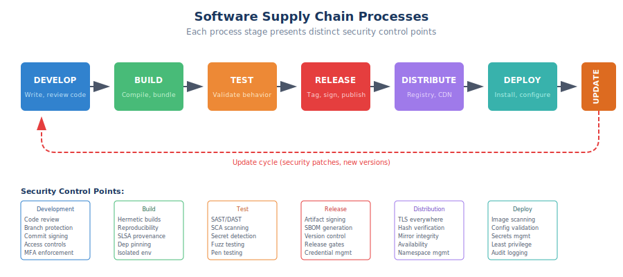

# 1.3 Defining the Software Supply Chain

Having established that modern software is assembled from components (Section 1.1) and that those components are overwhelmingly open source (Section 1.2), we need a precise framework for discussing the security implications. The term "software supply chain" has gained prominence in recent years, but its meaning varies across contexts. This section provides a comprehensive definition that will serve as the foundation for all subsequent discussions in this book.

## A Working Definition

!!! info "Definition: Software Supply Chain"

    The **software supply chain** encompasses all people, processes, tools, code, and infrastructure involved in creating, building, distributing, and deploying software—from the earliest conception of a component through its eventual execution in production environments.

The **software supply chain** encompasses all people, processes, tools, code, and infrastructure involved in creating, building, distributing, and deploying software—from the earliest conception of a component through its eventual execution in production environments. This definition, aligned with guidance from NIST Special Publication 800-161 Rev. 1 (Cybersecurity Supply Chain Risk Management Practices for Systems and Organizations)[^nist-800-161r1] and CISA software supply chain risk management resources[^cisa-scrm], recognizes that software does not appear fully formed but rather travels through a complex journey involving numerous actors and transformations.

Unlike physical supply chains, where goods move linearly from raw materials to finished products, software supply chains form intricate webs of dependencies. A single application might incorporate code from thousands of sources, each with its own development history, build process, and distribution channel. These dependencies can extend many layers deep, creating relationships that even the developers assembling the final product may not fully understand.

The supply chain perspective is valuable because it shifts focus from isolated components to the relationships between them. Security failures rarely occur because a single element is weak; they occur because attackers find paths through the chain—exploiting trust relationships, compromising handoff points, or subverting transformations that occur as code moves from source to execution.

## Key Actors in the Software Supply Chain

The software supply chain involves diverse actors, each with distinct roles, responsibilities, and potential vulnerabilities. Understanding these actors is essential for analyzing where security controls should be applied.

!!! info inline end "Who Are Maintainers?"

    Individuals or teams with primary responsibility for a software project. They review contributions, make release decisions, and manage infrastructure. A single maintainer's compromise could impact millions of systems.

**Maintainers** are individuals or teams who hold primary responsibility for a software project. They review contributions, make release decisions, manage project infrastructure, and set technical direction. Maintainers occupy positions of extraordinary trust: their decisions directly affect every downstream consumer of their software. For widely-used projects, a single maintainer's compromised credentials or malicious intent could impact millions of systems. The Linux Foundation's Census II study found that many of the most critical open source projects rely on remarkably few maintainers—sometimes just one or two individuals.

**Contributors** provide code, documentation, bug reports, or other improvements to projects they do not maintain. The open source model's power derives from enabling contributions from anyone, but this openness creates security challenges. Contributors may be pseudonymous, their motivations unknown. The XZ Utils compromise of 2024 demonstrated how patient, seemingly helpful contributors can spend years building trust before exploiting their position.

**Package registry operators** manage the infrastructure that distributes software components. Organizations like npm, Inc. (for JavaScript), the Python Software Foundation (for PyPI), and Sonatype (for Maven Central) operate repositories that developers trust implicitly when they run installation commands. These registries make decisions about identity verification, malware scanning, namespace management, and package integrity that profoundly affect supply chain security. When a developer runs `npm install`, they are placing trust not just in the package author but in npm's security practices.

**Build system and CI/CD providers** operate infrastructure where source code is transformed into executable artifacts. Services like GitHub Actions, GitLab CI, Jenkins, CircleCI, and Travis CI execute build scripts with access to source code, secrets, and publishing credentials. A compromised build system can inject malicious code into otherwise legitimate software without modifying source repositories—attacks that are particularly difficult to detect.

**Security researchers and auditors** examine software for vulnerabilities, sometimes as employees of dedicated security firms, sometimes as independent researchers, and sometimes as participants in bug bounty programs. Their work identifies vulnerabilities before attackers can exploit them, but the disclosure process itself introduces supply chain considerations: how vulnerabilities are reported, how quickly patches are developed, and how information flows to affected parties all influence security outcomes.

**Consumers and integrators** are organizations and individuals who incorporate open source components into their own software. This category includes enterprises building internal applications, software vendors creating commercial products, and system integrators assembling solutions for clients. Consumers make decisions about which components to trust, how to evaluate them, and how quickly to adopt updates—decisions that determine their exposure to supply chain risks.

**Distributors** package and redistribute software through channels separate from original sources. Linux distributions like Debian, Red Hat, and Ubuntu maintain their own repositories, applying patches, making configuration decisions, and providing long-term support. Cloud providers distribute container images through registries like Docker Hub, Amazon ECR, and Google Container Registry. These distributors add value through curation and support but also introduce additional links in the chain where security failures can occur.

## Artifacts Across the Supply Chain

Software takes different forms as it moves through the supply chain, and each form presents distinct security considerations.

**Source code** is the human-readable form of software, typically managed in version control systems like Git. Source code repositories contain not just the code itself but also commit history, contributor information, and metadata that can be valuable for security analysis. The integrity of source code depends on access controls, signing practices, and the security of hosting platforms.

**Dependencies** are external components incorporated into software. As discussed in previous sections, these may be direct (explicitly chosen) or transitive (inherited through other dependencies). Dependencies are typically specified in manifest files (`package.json`, `requirements.txt`, `pom.xml`) and resolved through package managers. The exact versions resolved may vary based on timing and configuration, creating reproducibility challenges.

**Build artifacts** result from compilation, transpilation, bundling, or other transformations applied to source code. These include compiled binaries, minified JavaScript bundles, Java JAR files, and Python wheels. Build artifacts may not correspond directly to source code if the build process is compromised or non-deterministic. The SLSA (Supply-chain Levels for Software Artifacts) framework specifically addresses the integrity of this transformation process.[^slsa]

**Container images** package applications with their runtime dependencies into deployable units. Images are constructed in layers, typically starting from base images that include operating systems and common libraries. Each layer represents a potential source of vulnerabilities. Container registries commonly support content-addressed image *digests* (immutable identifiers), while human-readable *tags* (like `latest`) can be mutable pointers that change over time.

**Configuration and infrastructure code** defines how software is deployed and operated. Terraform modules, Kubernetes manifests, Ansible playbooks, and similar artifacts determine runtime behavior and security posture. These are increasingly managed as code, subject to the same supply chain considerations as application code, yet often receive less security scrutiny.

**Machine learning models and datasets** represent an emerging category of supply chain artifact. Pre-trained models downloaded from repositories like Hugging Face become part of applications that use them. These models can contain embedded vulnerabilities, exhibit unexpected behaviors, or be trained on compromised data. As AI integration becomes standard practice, model provenance and integrity become supply chain concerns.

## Processes That Define the Chain

The software supply chain is not merely a collection of actors and artifacts but a series of processes that transform and transfer software from creation to execution.

**Development** encompasses writing code, reviewing contributions, and managing project evolution. Security-relevant development practices include code review rigor, branch protection policies, and commit signing requirements. Development increasingly involves AI assistance, introducing new actors into this process.

**Build** transforms source code into executable artifacts. Secure build processes are hermetic (isolated from external influence), reproducible (producing identical outputs from identical inputs), and auditable (generating provenance information). The build process is a critical control point because it can detect tampering in earlier stages or introduce tampering that affects all later stages.

**Test** validates that software behaves as expected. Security testing—including static analysis, dynamic analysis, dependency scanning, and penetration testing—identifies vulnerabilities before release. The test process depends on trusted test infrastructure and tooling.

**Release** makes software available for distribution. Release processes typically involve creating tagged versions, generating release notes, signing artifacts, and publishing to registries. The release process is often where credentials and signing keys are most exposed.

**Distribution** delivers software to consumers through registries, mirrors, CDNs, and other channels. Distribution infrastructure must maintain integrity (ensuring consumers receive what was released), availability (ensuring software remains accessible), and authenticity (enabling consumers to verify provenance).

**Deployment** installs software into target environments. Deployment processes make decisions about configuration, secrets management, and access controls that determine operational security. Container orchestration, serverless platforms, and infrastructure-as-code tools automate deployment but also expand the attack surface.

**Update** delivers new versions to replace or augment running software. Update mechanisms must balance the security imperative of rapid patching against the stability imperative of avoiding breaking changes. Compromised update mechanisms have been the vector for some of the most damaging supply chain attacks.

## The Supply Chain as a Trust Graph

A useful mental model represents the software supply chain as a directed graph where nodes are actors or artifacts and edges represent trust relationships or transformations. When you deploy an application, you are implicitly trusting:

!!! warning "The Hidden Trust Graph"

    When you deploy an application, you implicitly trust:
    
    - Every maintainer of every dependency, direct or transitive
    - Every contributor whose code those maintainers accepted
    - Every registry that distributed those dependencies
    - Every build system that compiled them
    - Every network path through which they traveled
    - Every tool used in your own build and deployment process

- Every maintainer of every dependency, direct or transitive
- Every contributor whose code those maintainers accepted
- Every registry that distributed those dependencies
- Every build system that compiled them
- Every network path through which they traveled
- Every tool used in your own build and deployment process

This graph can be extraordinarily deep. A vulnerability or compromise at any node can propagate to all dependent nodes. The graph's complexity explains why supply chain attacks are so effective: attackers need only compromise one well-connected node to affect thousands or millions of downstream systems.

Trust in this graph is largely implicit and unexamined. Developers run `npm install` or `pip install` without consciously choosing to trust the maintainers of each transitive dependency. Organizations deploy container images without auditing every package in the base image. This implicit trust is necessary for productivity—explicit verification of every element would be paralyzing—but it creates security exposures that require systematic management.

## Non-Human Actors: Automation and AI

!!! note "Non-Human Supply Chain Actors"

    Modern supply chains include automated actors that make security-affecting decisions: **CI/CD systems** that build and deploy code, **bots** like Dependabot that commit changes, and **AI coding assistants** that suggest dependencies. These actors complicate traditional security models based on human identity and accountability.

Modern supply chains increasingly involve non-human actors that make decisions and take actions affecting security. Recognizing these actors is essential for comprehensive supply chain security.

**CI/CD systems** are automated processes that build, test, and deploy software in response to triggers like code commits or scheduled events. These systems operate with credentials and access rights, make decisions about which code to build, and determine what reaches production. They are actors in the supply chain, not merely tools, and must be secured accordingly.

**Bots and automated contributors** perform tasks like dependency updates (Dependabot, Renovate), security scanning, and code formatting. These bots commit code, open pull requests, and sometimes merge changes. Their actions affect supply chain integrity, and their compromise could enable widespread attacks.

**AI coding assistants and agents** represent the newest category of non-human actors. Tools like GitHub Copilot suggest code, including dependency choices. Emerging AI agents can autonomously write, test, and deploy code with minimal human oversight. As these tools become more capable, they become more significant supply chain actors—potentially introducing dependencies, making security decisions, or creating vulnerabilities at scale.

The presence of non-human actors complicates traditional security models based on human identity and accountability. Questions of responsibility become complex when an AI agent introduces a vulnerable dependency or when a CI system automatically merges a compromised update. Supply chain security frameworks must evolve to address these automated actors explicitly.

## A Foundation for Analysis

This definition of the software supply chain—encompassing actors from individual maintainers to automated AI agents, artifacts from source code to deployed containers, and processes from development through continuous updates—provides the vocabulary for analyzing supply chain security throughout this series. When we discuss attacks in Chapters 5-10, we will locate them within this framework. When we explore defenses in Books 2 and 3, we will identify which actors, artifacts, and processes each control addresses.

The supply chain perspective reveals that software security is not a property of individual components but an emergent characteristic of complex systems. Securing the supply chain requires understanding and managing relationships, not just hardening individual elements.

[^nist-800-161r1]: NIST, *Cybersecurity Supply Chain Risk Management Practices for Systems and Organizations* (NIST SP 800-161 Rev. 1, 2022). https://csrc.nist.gov/pubs/sp/800/161/r1/final
[^cisa-scrm]: CISA, supply chain security resources (includes software supply chain risk management guidance). https://www.cisa.gov/supply-chain
[^slsa]: SLSA, *Supply-chain Levels for Software Artifacts*. https://slsa.dev/

