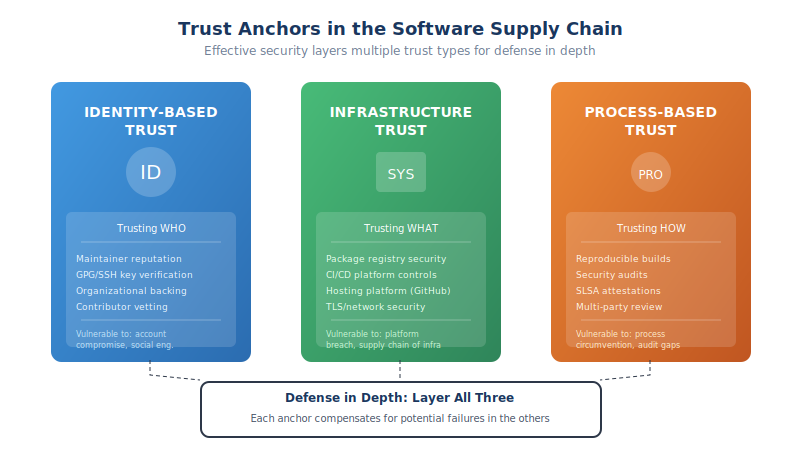

# 1.4 The Trust Relationships Embedded in Software Development

Every line of code that executes on a computer arrived there through a chain of trust. Someone wrote it, someone reviewed it, someone built it, someone distributed it, and someone decided to run it. At each step, trust was extended—sometimes explicitly after careful evaluation, but far more often implicitly, without conscious consideration. Understanding these trust relationships is essential for securing the software supply chain because attacks succeed by exploiting trust, not by overpowering defenses.

In 1984, Ken Thompson delivered his Turing Award lecture, "Reflections on Trusting Trust," which remains the foundational text on supply chain security.[^thompson-1984] Thompson demonstrated how a compiler could be modified to insert a backdoor into any program it compiled—including future versions of the compiler itself. The malicious code would persist invisibly, propagating through every subsequent build. His conclusion was stark: "You can't trust code that you did not totally create yourself."[^thompson-1984] Four decades later, in a world where applications routinely incorporate thousands of external components, Thompson's observation has evolved from theoretical concern to practical crisis.

## Implicit Trust in Direct Dependencies

When a developer adds a dependency to their project, they are making a trust decision, whether they recognize it or not. Consider what happens when you add a popular package to a JavaScript project by running `npm install lodash`. In that moment, you are trusting:

- The maintainers of Lodash have not inserted malicious code
- The maintainers' accounts have not been compromised
- The npm registry correctly delivered the package the maintainers published
- The package you received matches what the maintainers intended to release
- The build process that created the package was not compromised
- No one tampered with the package during transit to your machine

For a well-known package like Lodash, most developers make this trust decision instantly, without conscious evaluation. The package has millions of weekly downloads, a long history, and a strong reputation. This heuristic—trusting what others trust—is rational and necessary. Without it, modern software development would be impossible. But it is still a trust decision, and it can be wrong.

The event-stream incident of 2018 demonstrated exactly this failure mode.[^event-stream] Event-stream was a popular npm package with approximately two million weekly downloads. Its original maintainer, Dominic Tarr, had lost interest in the project and transferred maintenance to a new contributor who had been helpful and responsive. That new maintainer then added a dependency on a malicious package called `flatmap-stream`, which contained code designed to steal cryptocurrency from applications using the Copay Bitcoin wallet. The attack succeeded precisely because the implicit trust in a popular package was exploited: users trusted event-stream, so they trusted its new dependency, which they had never evaluated.

[^event-stream]: npm, "Details about the event-stream incident," npm Blog, November 27, 2018, https://blog.npmjs.org/post/180565383195/details-about-the-event-stream-incident

## The Multiplication of Transitive Trust

The trust challenge compounds dramatically when we consider transitive dependencies. When you trust a package, you implicitly trust everything that package trusts—its dependencies, their dependencies, and so on through the entire graph.

Consider a concrete example: a development team decides to use Next.js, a popular React framework, for a new web application. They evaluate Next.js carefully, reviewing its security practices, maintenance activity, and reputation. They trust it. But Next.js depends on dozens of packages directly, and those packages have their own dependencies. A fresh Next.js project ultimately incorporates over 300 packages from the npm ecosystem.

The team explicitly trusted one package. They implicitly trusted 300. Among those 300 packages are tools maintained by individual developers, libraries that haven't been updated in years, and components whose maintainers they could not name. The attack surface is not the one package they evaluated but the hundreds of packages they never examined.

This transitive trust creates mathematical challenges. If each maintainer account has even a 0.1% chance of being compromised in a given year, and your application depends on 500 packages maintained by different individuals, the probability that at least one is compromised becomes significant. Supply chain security is fundamentally a problem of managing compound risk across trust relationships you did not choose and may not even know exist.

## Trust Anchors: Identity, Infrastructure, and Process

Trust in the software supply chain attaches to different types of anchors, each with distinct characteristics and vulnerabilities.

**Identity-based trust** places confidence in specific individuals or organizations. When you trust a package because it's maintained by Google or the Apache Software Foundation, you're anchoring trust to organizational identity. When you verify a signed commit came from a known maintainer's GPG key, you're anchoring trust to individual cryptographic identity. Identity-based trust can be powerful but is vulnerable to account compromise, insider threats, and social engineering. The XZ Utils attack of 2024 exploited identity-based trust: the attacker spent years building a trusted identity within the project before exploiting that position.

**Infrastructure-based trust** places confidence in systems and platforms. When you download packages from npm or Maven Central, you're trusting those registries to correctly associate package names with content, to authenticate publishers, and to prevent tampering. When you use GitHub Actions for CI/CD, you're trusting GitHub's infrastructure with your code, secrets, and publishing credentials. Infrastructure-based trust is efficient—you make one trust decision about the platform and inherit it for all interactions—but it concentrates risk. A compromise of critical infrastructure can affect every user simultaneously.

**Process-based trust** places confidence in methodologies and controls. You might trust a package because it's produced through reproducible builds, because it has been audited by a reputable security firm, or because it's part of a distribution that applies additional vetting (like Debian's packaging process). Process-based trust is more robust than pure identity or infrastructure trust because it creates verifiable evidence, but processes can be circumvented and audits can miss vulnerabilities.

Effective supply chain security layers these trust anchors. You trust packages from maintainers with established identities (identity), distributed through registries with strong security practices (infrastructure), built through reproducible processes with cryptographic attestation (process). Each layer compensates for potential failures in the others.

## Trust in Automation

Modern software development involves extensive automation that operates with significant privileges and makes decisions affecting security. These automated systems are not merely tools—they are actors in the trust network, and they require explicit trust decisions.

**CI/CD systems** execute code from repositories, often with access to production credentials and the ability to publish packages. When the Codecov Bash Uploader was compromised in early 2021[^codecov-2021], attackers modified a script that thousands of organizations executed in their CI pipelines. The script exfiltrated environment variables, including secrets and credentials, from every build that ran it. Organizations had trusted Codecov's infrastructure implicitly, including it in their pipelines without the scrutiny they would apply to adding a new dependency.

**Automated dependency updates** from services like Dependabot, Renovate, and Snyk propose changes to dependency specifications based on new releases or security advisories. These tools can introduce new code into projects with minimal human review, especially when organizations enable auto-merge for "safe" updates. Each update is a trust decision, yet the automation can obscure this reality.

**AI coding assistants** represent the newest category of automated actors requiring trust decisions. When GitHub Copilot suggests code that includes an import statement for a particular package, it is effectively recommending a trust relationship. Developers using AI assistants may adopt dependencies they would not have discovered or chosen independently, based on patterns learned from training data that may include outdated or vulnerable code. As AI agents become more autonomous—capable of writing, testing, and deploying code with minimal human oversight—the trust implications become more significant.

Trust in automation requires careful consideration of what decisions the automation can make, what access it requires, and how its behavior is monitored. Automated systems should generally operate with minimal privileges, their actions should be logged and auditable, and their recommendations should be subject to human review for security-significant changes.

## The Impossibility of Verification at Scale

A fundamental challenge in supply chain security is that thorough trust verification does not scale. The practices that would provide high assurance—reading all source code, auditing all dependencies, verifying all maintainer identities, inspecting all build processes—are impractical when applications include hundreds or thousands of components.

Consider what rigorous verification would require: for each dependency, you would need to audit the current code, review the change history, evaluate the security practices of all maintainers, examine the build and release processes, and recursively apply this analysis to all transitive dependencies. For a typical modern application, this would require years of security engineering effort—effort that would need to be repeated every time any component was updated.

Organizations therefore rely on heuristics and sampling. They might thoroughly evaluate a handful of critical dependencies while applying lighter-weight checks to the rest. They might trust packages above certain download thresholds on the theory that popularity implies scrutiny. They might rely on automated scanning tools to detect known vulnerabilities without examining code directly.

These approaches are rational adaptations to an impossible situation, but they leave gaps. The event-stream attacker specifically targeted a package popular enough to provide access to valuable targets but not so prominent that it received constant scrutiny. Supply chain attackers deliberately exploit the verification gap, targeting the packages and processes that fall between thorough evaluation and automated detection.

## Trust Erosion: When Confidence Collapses

Trust violations do not merely affect the compromised component—they can undermine confidence in entire ecosystems. When a widely-trusted component is compromised, users must question their assumptions about similar components.

The SolarWinds attack of 2020 exemplified this erosion. When it emerged that a sophisticated adversary had compromised SolarWinds' build process and distributed malware through legitimate software updates for months, organizations across government and industry faced a crisis of confidence. If SolarWinds—a major vendor with presumably robust security practices—could be compromised so thoroughly, what did that imply about other vendors? About other updates? The attack didn't just affect SolarWinds customers; it prompted industry-wide reassessment of trust in software distribution.

The XZ Utils discovery in 2024 triggered similar reflection in the open source community. The attacker had spent years patiently building trust—contributing helpful patches, responding to issues, gradually earning commit access. When the backdoor was discovered through fortunate accident, the community confronted an uncomfortable question: how many other projects might harbor similar long-term infiltrations? Trust in the vetting processes used to grant maintainer access eroded broadly.

Trust erosion is particularly damaging because trust, unlike code, cannot be patched or updated. Once the possibility of compromise becomes salient, every unexplained behavior becomes suspicious. Organizations begin treating even legitimate software with distrust, adding friction that impedes productivity. The recovery of trust requires not just fixing the immediate vulnerability but demonstrating that the conditions enabling the breach have been addressed—a far more difficult undertaking.

## Living with Necessary Trust

The analysis in this section might seem to counsel despair: trust is unavoidable, verification is impossible, and any trust can be betrayed. But the conclusion is not that trust should be abandoned—that path leads to paralysis. The conclusion is that trust should be conscious, layered, and proportionate.

Conscious trust means recognizing when trust decisions are being made, even implicit ones. Adding a dependency is a trust decision. Enabling a GitHub Action is a trust decision. Auto-merging Dependabot updates is a trust decision. Making these decisions visible is the first step toward making them deliberate.

Layered trust means not relying on any single anchor. Identity, infrastructure, and process controls should reinforce each other so that failure in one does not cascade to total compromise. Cryptographic verification, reproducible builds, and multiple-party review create defense in depth for trust.

Proportionate trust means calibrating verification effort to risk. Components with broad access to sensitive resources warrant more scrutiny than those with narrow functionality. Critical dependencies justify thorough evaluation; peripheral utilities may not. Resources are limited; they should flow toward the trust relationships that matter most.

The chapters that follow will explore how these principles translate into practice—how to model threats to trust relationships, how to evaluate dependencies, how to build systems that verify rather than assume. But the foundation is recognizing what Thompson articulated forty years ago: every act of using software someone else created is an act of trust, and that trust shapes everything that follows.

[^thompson-1984]: Ken Thompson, "Reflections on Trusting Trust," *Communications of the ACM*, Vol. 27, No. 8 (August 1984), pp. 761-763. https://dl.acm.org/doi/10.1145/358198.358210
[^codecov-2021]: Codecov, "Bash Uploader Security Update" (April 15, 2021). The compromise began January 31, 2021 and was detected April 1, 2021. https://about.codecov.io/security-update/

