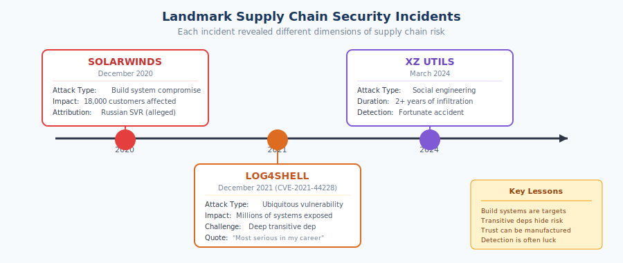
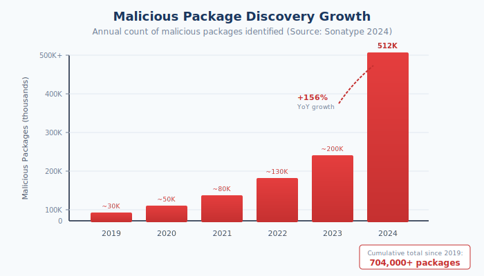

# 1.5 Why Supply Chain Security Has Become Urgent Now

Software supply chain security is not a new concept. Security researchers have warned about these risks for decades, and sophisticated attackers have exploited supply chains for just as long. Yet within the past five years, supply chain security has transformed from a concern discussed primarily at specialized security conferences to a board-level priority commanding attention from heads of state. This section examines the confluence of factors that created this urgency, establishing why the material in this book matters now more than at any previous moment.

## High-Profile Incidents as Catalysts

Three incidents, more than any others, forced supply chain security into mainstream consciousness. Each demonstrated a different dimension of supply chain risk, and together they made the abstract threat concrete for audiences far beyond the security community.

**SolarWinds (December 2020)** revealed what a sophisticated, well-resourced adversary could achieve through supply chain compromise. Attackers—attributed by U.S. government agencies and other investigators to Russia's Foreign Intelligence Service (SVR)[^solarwinds-cisa]—infiltrated SolarWinds' development environment and inserted malicious code into the Orion network management platform. The compromised software was distributed through SolarWinds' legitimate update mechanism to approximately 18,000 customers (downloaded the trojanized update), with a smaller number of organizations receiving follow-on exploitation.[^solarwinds-cisa]

**Log4Shell (December 2021)** demonstrated a different threat model: a critical vulnerability in a ubiquitous component rather than a deliberate compromise. CVE-2021-44228, a remote code execution vulnerability in the Apache Log4j logging library, was embedded so deeply in so many systems—often as a transitive dependency—that organizations struggled to determine whether they were affected. Attacks began quickly after public disclosure.[^log4shell-apache] CISA director Jen Easterly called it "the most serious vulnerability I have seen in my decades-long career."[^easterly-quote]

**XZ Utils (March 2024)** exposed the vulnerability of open source maintenance itself. An attacker operating under the pseudonym "Jia Tan" spent over two years contributing to the XZ compression library, gradually building trust until granted maintainer access. The attacker then inserted a sophisticated backdoor affecting certain downstream uses of xz/liblzma. The issue was publicly reported after unusual SSH latency was detected during performance investigation by Microsoft engineer Andres Freund.[^xz-oss-security]

These incidents shared a common lesson: the software supply chain had become a single point of failure for digital security. Attackers who successfully compromised supply chains could bypass perimeter defenses, endpoint protection, and network monitoring. The traditional security model—protecting individual systems and networks—was insufficient when threats arrived through trusted software channels.

## The Surge in Supply Chain Attacks

The prominent incidents captured headlines, but they represented only the visible peak of a rapidly growing threat. Sonatype's 2024 State of the Software Supply Chain report documented over 512,000 malicious packages discovered in the past year alone—a 156% year-over-year increase—bringing the total to more than 704,000 malicious packages identified since 2019.[^sonatype-2024] The European Union Agency for Cybersecurity (ENISA) identified supply chain attacks as one of the top threats in its annual threat landscape, noting increasing sophistication and frequency.

The growth is not merely in raw numbers but in attacker capability and targeting. Early supply chain attacks were often opportunistic—typosquatting on popular package names, hoping unwary developers would install malicious components by mistake. Recent attacks show more sophistication: long-term social engineering campaigns to gain maintainer access, exploitation of build infrastructure, injection of malicious code that activates only under specific conditions to evade detection. Attackers have learned that supply chain vectors offer advantages no other attack path provides.

## Expanding Attack Surface

The attack surface available to supply chain adversaries has expanded dramatically, driven by the trends described in earlier sections. Applications contain more dependencies than ever before, each dependency representing a potential entry point. The Synopsys 2024 OSSRA report (page 8, "Open Source Risk Summary") found that the average codebase contains 526 open source components, a figure that has grown consistently year over year.

Beyond direct dependencies, the infrastructure supporting software development has become more complex and more exposed. Organizations rely on cloud-based CI/CD services, third-party build tools, external package registries, and container image repositories. Each of these infrastructure components represents a potential target. The Codecov breach of 2021, in which attackers modified a bash script used by thousands of CI pipelines, demonstrated that build infrastructure could provide access rivaling direct code compromise.

The shift toward microservices and distributed architectures multiplies these exposures. An organization running hundreds of microservices maintains hundreds of separate dependency trees, each requiring monitoring and management. Cloud-native development practices, while offering operational benefits, expand the surface area that adversaries can target.

## AI-Assisted Development: New Capabilities, New Risks

The rapid adoption of AI coding assistants adds another dimension to supply chain urgency. GitHub reported that over one million developers used Copilot within its first year, and adoption has accelerated since. These tools increase development velocity but introduce novel supply chain considerations.

AI assistants trained on vast code repositories may suggest deprecated packages, vulnerable code patterns, or dependencies with security issues. When developers accept AI-generated code without thorough review, they potentially introduce risks they would have avoided with manual coding. The dependency choices embedded in AI suggestions reflect training data that may be months or years old, potentially recommending packages that have since been compromised or abandoned.

More fundamentally, AI-assisted development accelerates the creation of software, compounding the scale challenges already discussed. More code produced faster means more dependencies integrated more rapidly, with less time for security review at each step. The productivity benefits are real, but so is the need for security practices that can operate at AI-assisted development speeds.

Emerging AI agents capable of autonomous coding, testing, and deployment intensify these concerns. When AI systems can modify code and dependencies without human review of each change, the implicit trust model of software development becomes even more stretched. Supply chain security practices must evolve to address non-human actors that make decisions affecting security at machine speed.

## Regulatory and Policy Response

Governments worldwide have recognized supply chain security as a matter of national concern, translating that recognition into regulatory requirements.

In the United States, **Executive Order 14028** ("Improving the Nation's Cybersecurity"), issued in May 2021, marked a turning point.[^eo-14028] The order directed federal agencies to enhance software supply chain security and initiated government-wide work on SBOMs.[^eo-14028] Subsequent OMB memoranda (M-22-18 and M-23-16) defined requirements for federal agency use of software, including vendor attestations to secure software development practices.[^omb-m-22-18][^omb-m-23-16] The Cyber Incident Reporting for Critical Infrastructure Act (CIRCIA) of 2022 established reporting requirements for covered cyber incidents in critical infrastructure (rulemaking to implement reporting is ongoing).[^circia]

The European Union has moved even more aggressively. The **Cyber Resilience Act (CRA)**, published as Regulation (EU) 2024/2847, establishes mandatory cybersecurity requirements for products with digital elements sold in the EU market.[^eu-cra] The CRA entered into force on December 10, 2024, with main obligations applying from December 11, 2027 and reporting obligations from September 11, 2026. Non-compliance with essential cybersecurity requirements can result in administrative fines of up to €15 million or 2.5% of total worldwide annual turnover, whichever is higher.

These regulations transform supply chain security from a best practice to a compliance requirement. Organizations selling to government or operating in regulated industries must demonstrate software supply chain controls, driving investment that market forces alone had not motivated. The regulatory trajectory is clearly toward more requirements, not fewer, with additional jurisdictions likely to follow the US and EU lead.

## The Economics of Supply Chain Attack

The urgency of supply chain security reflects not just technical vulnerability but economic reality. For attackers, supply chain compromises offer extraordinary leverage.

Consider the economics from an attacker's perspective: a successful compromise of a widely-used component provides access to every system that uses that component. The XZ Utils backdoor, had it reached production distributions, would have provided potential access to millions of servers—all from a single attack. Compare this to attacking those servers individually, each requiring separate reconnaissance, exploit development, and risk of detection. Supply chain attacks offer scale that direct attacks cannot match.

Attribution is difficult. Malicious code in dependencies can remain dormant for months, activating only under specific conditions. Even when detected, tracing the attack to its origin requires significant forensic effort. The XZ Utils attacker operated for over two years before detection; the true identity remains unknown. This attribution challenge reduces the deterrent effect that would otherwise constrain attackers.

For defenders, the economics are inverted. Securing the supply chain requires continuous vigilance across thousands of components, any one of which might be compromised. The cost of defense scales with the number of dependencies; the cost of attack does not scale with the number of targets. This asymmetry—high leverage for attackers, distributed burden for defenders—ensures continued attacker interest in supply chain vectors.

## Geopolitical Dimensions

Supply chain security has become a matter of national security and geopolitical competition. The SolarWinds attack, attributed to a nation-state intelligence service, demonstrated that software supply chains are vectors for espionage and potentially for destructive attacks. Governments now view the security of software infrastructure through the lens of strategic competition.

This geopolitical dimension shapes policy in multiple ways. Export controls and sanctions regimes increasingly consider software and technology supply chains. Governments invest in understanding dependencies on software originating from adversary nations. Critical infrastructure operators face scrutiny regarding software provenance. The concept of "digital sovereignty" drives some nations to develop domestic alternatives to globally dominant platforms and package ecosystems.

The tension between the global, collaborative nature of open source development and national security concerns creates difficult tradeoffs. Open source has thrived as a global commons, with contributors from every nation collaborating on shared infrastructure. Geopolitical pressures that fragment this collaboration could undermine the security benefits that come from broad review and shared maintenance, even as they address concerns about foreign influence.

## Convergence Creates Urgency

Any one of these factors would demand attention. Their convergence creates the urgency that drives this book. High-profile incidents have demonstrated impact. Attack volumes are increasing exponentially. The attack surface expands with every dependency added. AI-assisted development accelerates both productivity and risk. Regulators mandate compliance. Economic incentives favor attackers. Geopolitical competition raises stakes.

Organizations can no longer treat supply chain security as a specialized concern for security teams to address in isolation. The interconnected nature of modern software means that supply chain compromises affect everyone who uses affected components. The regulatory environment means that compliance requires demonstrable controls. The economic asymmetry means that defenders must work together—sharing information, developing common tools, building collective resilience—because individual organizations cannot secure the supply chain alone.

The chapters that follow provide the framework for responding to this urgency: understanding the threat landscape, implementing defensive controls, building organizational capability, and engaging with the broader ecosystem of standards, regulations, and collective defense. The time for treating supply chain security as a future concern has passed.

[^solarwinds-cisa]: CISA, "Supply Chain Compromise" (SolarWinds / SUNBURST), Alert AA21-008A. https://www.cisa.gov/news-events/cybersecurity-advisories/aa21-008a
[^log4shell-apache]: Apache Software Foundation, CVE-2021-44228 (Log4Shell) security page. https://logging.apache.org/security.html
[^easterly-quote]: Jen Easterly, CISA Director, quoted in CNBC interview (December 16, 2021): "the most serious vulnerability I have seen in my decades-long career." https://www.cnbc.com/video/2021/12/16/log4j-vulnerability-the-most-serious-ive-seen-in-my-decades-long-career-says-cisa-director.html
[^xz-oss-security]: oss-security mailing list, "backdoor in upstream xz/liblzma leading to ssh server compromise" (2024-03-29). https://www.openwall.com/lists/oss-security/2024/03/29/4
[^eo-14028]: The White House, Executive Order 14028 (May 12, 2021). https://bidenwhitehouse.archives.gov/briefing-room/presidential-actions/2021/05/12/executive-order-on-improving-the-nations-cybersecurity/
[^omb-m-22-18]: OMB Memorandum M-22-18, *Enhancing the Security of the Software Supply Chain through Secure Software Development Practices* (Sept 14, 2022). https://www.whitehouse.gov/wp-content/uploads/2022/09/M-22-18.pdf
[^omb-m-23-16]: OMB Memorandum M-23-16, *Update to Memorandum M-22-18: Enhancing the Security of the Software Supply Chain through Secure Software Development Practices* (June 9, 2023). https://www.gsa.gov/system/files/M-23-16-Update-to-M-22-18-Enhancing-Software-Security.pdf
[^circia]: CISA, Cyber Incident Reporting for Critical Infrastructure Act of 2022 (CIRCIA). https://www.cisa.gov/topics/cyber-threats-and-advisories/information-sharing/cyber-incident-reporting-critical-infrastructure-act-2022-circia
[^eu-cra]: Regulation (EU) 2024/2847 (Cyber Resilience Act), Official Journal of the European Union. https://eur-lex.europa.eu/eli/reg/2024/2847/oj
[^sonatype-2024]: Sonatype, *2024 State of the Software Supply Chain Report* (October 2024). https://www.sonatype.com/state-of-the-software-supply-chain/introduction

