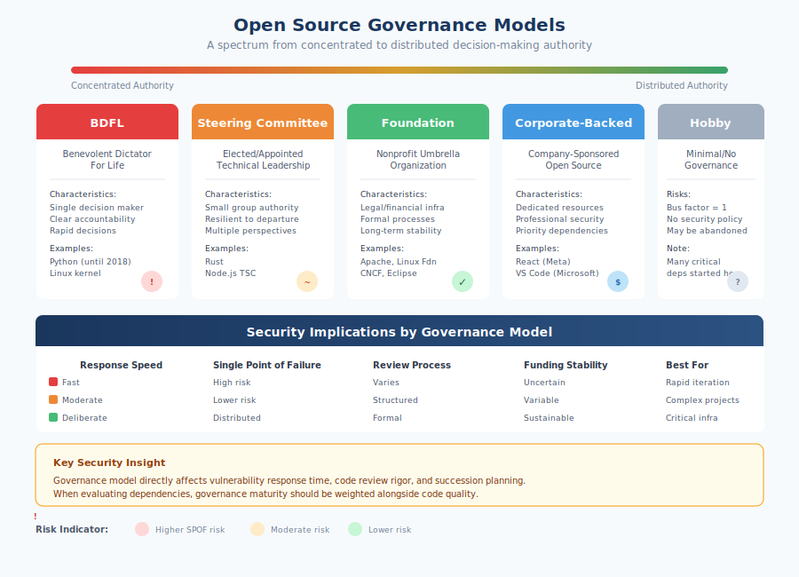

# 2.1 A Brief History of Open Source and Its Philosophy

To understand the security challenges facing open source software today, we must first understand where open source came from and the values that shaped its development. The open source movement emerged not as a business strategy or technical methodology but as a philosophical response to the increasing commodification and restriction of software. These origins continue to influence how open source projects are structured, governed, and maintained—with direct implications for their security posture.

## The Free Software Movement: Software as a Commons

The story begins in 1983, when Richard Stallman, a programmer at MIT's Artificial Intelligence Laboratory, announced the GNU Project. Stallman had grown frustrated watching the software community he loved transform from a culture of sharing into one of proprietary restrictions. Where programmers once freely exchanged code and improvements, companies were increasingly treating software as trade secrets, requiring non-disclosure agreements and refusing to share source code even with customers.

Stallman's response was radical: he would create an entire operating system that would be permanently free—not free as in price, but free as in freedom. The GNU Project (a recursive acronym for "GNU's Not Unix") aimed to develop a complete Unix-compatible system that anyone could use, study, modify, and redistribute. In 1985, Stallman formalized these principles by founding the Free Software Foundation (FSF) and articulating the "four freedoms" that define free software:

!!! info "The Four Freedoms of Free Software"

    1. The freedom to **run** the program for any purpose
    2. The freedom to **study** how the program works and modify it
    3. The freedom to **redistribute** copies
    4. The freedom to **distribute modified versions**

1. The freedom to run the program for any purpose
2. The freedom to study how the program works and modify it
3. The freedom to redistribute copies
4. The freedom to distribute modified versions

!!! info inline end "What Is Copyleft?"

    A licensing mechanism where anyone can use, modify, and distribute software, but distributed modifications must also be released under the same license with source code available. This ensures free software remains free.

To protect these freedoms legally, Stallman developed the GNU General Public License (GPL) in 1989. The GPL employed a clever mechanism called **copyleft**: anyone could use, modify, and distribute GPL-licensed software, but any distributed modifications must also be released under the GPL with source code available. This ensured that free software would remain free, preventing companies from taking community work proprietary.

By the early 1990s, the GNU Project had produced many essential components of an operating system—compilers, editors, utilities—but lacked a working kernel. That gap was filled in 1991 when Linus Torvalds, a Finnish computer science student, released Linux, a Unix-like kernel he had developed. Torvalds initially released Linux under a restrictive license but soon adopted the GPL, allowing it to combine with GNU components to form a complete free operating system. The combination, often called GNU/Linux or simply Linux, would become the foundation of modern internet infrastructure.

## From Free Software to Open Source

While the free software movement grew throughout the 1990s, some participants felt its philosophical framing—emphasizing ethics and user freedom—was alienating potential corporate allies. The rhetoric of "free software" led to constant confusion about price versus liberty, and Stallman's uncompromising stance on proprietary software made business leaders uncomfortable.

In 1997, Eric Raymond published "The Cathedral and the Bazaar," an influential essay analyzing the development model that had made Linux successful. Raymond contrasted two approaches to software development. The **cathedral model** featured careful, centralized design by a small group of developers who released polished code at long intervals—the approach taken by most commercial software and even some free software projects like GNU Emacs. The **bazaar model**, exemplified by Linux kernel development, embraced decentralized, rapid iteration with frequent releases, welcoming contributions from anyone and trusting that problems would be quickly identified and fixed by the community.

Raymond's essay articulated what became known as **Linus's Law**: "Given enough eyeballs, all bugs are shallow." The argument was that open development practices created better software because more people reviewing code meant more bugs discovered and fixed. This framing emphasized practical benefits rather than philosophical principles—a distinction that would prove consequential.

In February 1998, Netscape announced it would release the source code for its Navigator web browser. A group including Raymond, Bruce Perens, and others saw an opportunity to rebrand the movement in terms more appealing to business. They coined the term **open source** and founded the **Open Source Initiative (OSI)** to promote this new framing. The OSI created the Open Source Definition, based on Debian's Free Software Guidelines, establishing criteria that licenses must meet to be considered truly open source.

The distinction between "free software" and "open source" is subtle but significant. Both terms describe largely the same body of software and licenses. The difference lies in emphasis: free software advocates stress ethical obligations and user freedom; open source advocates emphasize practical benefits like reliability, cost, and development speed. Stallman and the FSF rejected the open source label, viewing it as an abandonment of the movement's moral foundation. This philosophical divide persists today, though most practitioners use the terms interchangeably.

## Philosophical Tenets and Their Security Implications

Several core values have shaped open source development, each with implications for security.

**Transparency** is foundational. Open source software is, by definition, available for inspection. Anyone can read the code, understand how it works, and verify that it does what it claims. This transparency theoretically enables security review by anyone with the skills and motivation to examine the code. In practice, as we will explore throughout this book, transparency does not guarantee scrutiny—code can be open for decades without anyone noticing critical vulnerabilities.

**Collaboration** enables contributions from diverse sources. A project might receive improvements from individual hobbyists, corporate engineers, academic researchers, and security professionals worldwide. This diversity can strengthen security by bringing varied perspectives and expertise. However, collaboration also means accepting code from strangers, creating the trust challenges discussed in Chapter 1.

**Meritocracy**—the idea that contributions should be judged on technical quality regardless of the contributor's background—has been a guiding principle, though one increasingly questioned in recent years. For security, this principle means that good security patches should be accepted regardless of source, but it also means that attackers can build reputation through legitimate contributions before exploiting that trust, as the XZ Utils incident demonstrated.

**Community governance** varies widely across projects but generally favors consensus and distributed decision-making over hierarchical authority. This can make security improvements slower to implement when they require coordinated action, but it also prevents single points of failure in project leadership.

The "many eyes" theory—Raymond's suggestion that open inspection leads to rapid bug discovery—deserves particular scrutiny. The theory contains a kernel of truth: some vulnerabilities have been found quickly because source code was available for review. But the theory's limitations have become painfully clear.

!!! warning "The 'Many Eyes' Myth"

    Linus's Law states: "Given enough eyeballs, all bugs are shallow." But "many eyes" look only when people are motivated to look, have the expertise to understand what they see, and have the time for thorough review. For most open source software, these conditions rarely hold. Heartbleed existed in OpenSSL for over two years despite the library's critical importance.

The [Heartbleed vulnerability][heartbleed] (CVE-2014-0160) in OpenSSL, disclosed in April 2014, had existed in widely-deployed code for over two years despite OpenSSL's critical importance to internet security (see Section 5.3 for a detailed case study of Heartbleed). The reality is that "many eyes" look only when people are motivated to look, have the expertise to understand what they see, and have the time to conduct thorough review. For much open source software, especially infrastructure components maintained by small teams, those conditions rarely hold.

## Licensing: Permissive and Copyleft

Open source licenses fall into two broad categories with different implications for how software can be used and combined.

**Copyleft licenses**, most notably the GPL family, require that derivative works be distributed under the same license terms. If you modify GPL software and distribute your modifications, you must make your source code available under the GPL. This "viral" quality ensures that improvements flow back to the community but can create complications for commercial use. Some organizations avoid GPL-licensed components in proprietary products to prevent licensing obligations from extending to their code.

**Permissive licenses**, including the MIT License, BSD licenses, and Apache License 2.0, impose minimal restrictions. Users can incorporate permissively-licensed code into proprietary products without releasing their own source code. This flexibility has made permissive licenses increasingly popular, particularly for libraries and frameworks that companies want to embed in commercial products.

From a security perspective, licensing affects the incentive structure around maintenance and vulnerability response. Copyleft licenses theoretically encourage contribution back to projects, which could include security fixes. Permissive licenses enable wider adoption, potentially creating larger user communities that might fund security work. In practice, neither licensing model guarantees adequate security investment—a problem explored in subsequent chapters.

The **GNU Affero General Public License (AGPL)** extends copyleft to network use: if you run AGPL-licensed software as a service, users who interact with it over a network must be able to obtain the source code. This license addresses a "loophole" in the standard GPL where software-as-a-service providers could modify GPL code without distributing it. From a supply chain perspective, AGPL creates additional compliance considerations for organizations building SaaS products.

The Apache License 2.0 deserves special mention for including an explicit patent grant, providing users with protection against patent claims from contributors. This addresses a supply chain concern distinct from code security: the risk that using open source software might expose organizations to patent litigation.

## The Relevance of History

Understanding this history matters for supply chain security because the values and structures that emerged from the free software and open source movements continue to shape how projects operate. The emphasis on openness created the transparency that makes security review possible but also the accessibility that attackers exploit. The celebration of individual contribution enabled the vibrant ecosystem we depend on but also created projects maintained by single individuals with no security review infrastructure. The commitment to freedom and community governance built trust but also resistance to the formal processes that security sometimes requires.

The open source movement succeeded beyond what its founders imagined, becoming the foundation of modern software infrastructure. But that success created new challenges the original philosophy did not anticipate: how to secure software that the entire world depends upon, maintained by volunteers who never signed up for that responsibility. The sections that follow explore how the ecosystem has evolved to address—or failed to address—these challenges.

[heartbleed]: https://heartbleed.com/

