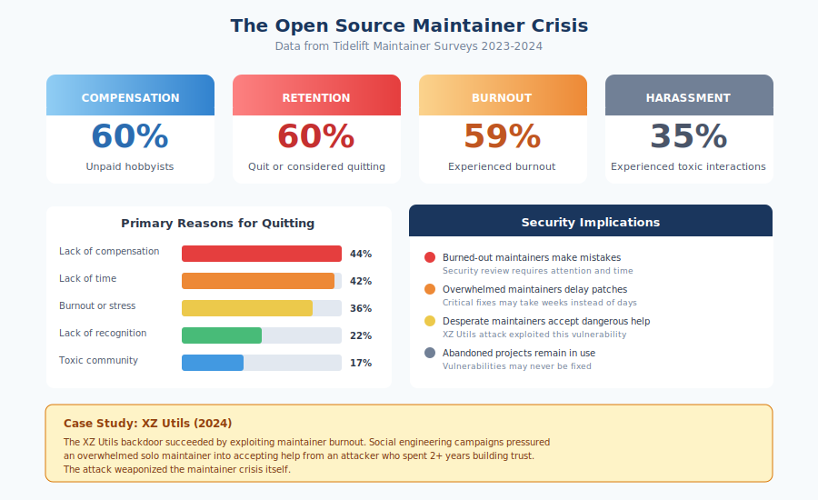

# 2.2 How Open Source Projects Are Governed and Maintained

Understanding who makes decisions in open source projects—and how those decisions are made—is essential for assessing supply chain security. A project's governance model determines how vulnerabilities are prioritized, how security patches are reviewed, who can commit code, and how quickly critical updates reach users. The open source ecosystem encompasses an extraordinary range of governance approaches, from single-maintainer hobby projects to enterprise-grade infrastructure managed by well-funded foundations. This diversity means that security postures vary dramatically, often in ways that are not immediately visible to consumers of the software.

#### Governance Models: A Spectrum of Approaches

Open source governance exists on a spectrum, with different models offering distinct tradeoffs between agility, accountability, and resilience.

The **Benevolent Dictator For Life (BDFL)** model—a term coined to describe leadership where a single person holds final authority—concentrates decision-making in an individual, typically the project's founder. This person has final say on technical direction, contribution acceptance, and release decisions. The term originated to describe Guido van Rossum's role in Python, which he held from the language's creation in 1991 until stepping down in 2018. Linus Torvalds maintains a similar position in Linux kernel development, though he delegates significant authority to subsystem maintainers.

The BDFL model offers clear accountability and rapid decision-making. When security issues arise, there is no ambiguity about who can approve and merge fixes. However, the model creates a single point of failure: if the BDFL becomes unavailable, incapacitated, or simply loses interest, the project may struggle to continue. Van Rossum's resignation from Python, prompted by exhaustion from contentious debates, demonstrated how this model depends on one person's sustained engagement. From a security perspective, the BDFL model also concentrates trust—compromising the BDFL's account or credentials provides complete control over the project.

**Steering committee governance** distributes authority among a small group, typically elected or appointed based on contribution history. The Rust programming language transitioned to this model after its original BDFL stepped back, establishing teams responsible for different aspects of the language and ecosystem. Node.js operates under a Technical Steering Committee that oversees technical direction and resolves disputes among contributors.

Committee governance provides resilience against individual departure and spreads the burden of decision-making. Security decisions can benefit from multiple perspectives. However, committees can also slow response times when consensus is required, and they introduce complexity around voting rights, term limits, and dispute resolution. The security implications depend heavily on how the committee is structured: does it include members with security expertise? Can it make emergency decisions without full quorum?

**Foundation governance** places projects under the umbrella of nonprofit organizations that provide legal, financial, and operational infrastructure. Major foundations have developed sophisticated governance frameworks that balance community input with organizational sustainability.

The **Apache Software Foundation (ASF)**, founded in 1999, hosts over 350 projects under a consistent governance model. Apache projects operate on principles of community-driven development, consensus decision-making, and transparent communication. The foundation uses a hierarchy of roles: users, contributors, committers (with write access), and Project Management Committee (PMC) members who oversee individual projects. The ASF board provides organizational governance but does not interfere in technical decisions. This model has proven durable—Apache projects like HTTP Server, Kafka, and Hadoop are critical infrastructure—though critics note that the emphasis on consensus can slow decision-making.

The **Linux Foundation** takes a different approach, serving more as an umbrella organization that hosts projects with diverse governance structures. Projects like the Linux kernel, Kubernetes, and Node.js operate under Linux Foundation auspices but maintain their own governance models. The foundation provides shared services—legal support, event management, marketing—while allowing project-level autonomy. This flexibility enables the foundation to host both BDFL-style projects and committee-governed initiatives.

The **Cloud Native Computing Foundation (CNCF)**, a Linux Foundation project, governs the cloud-native ecosystem including Kubernetes, Prometheus, and Envoy. CNCF has developed a maturity model for projects (Sandbox, Incubating, Graduated) with increasing governance and security requirements at each level. Graduated projects must meet specific criteria around security reporting, vulnerability response, and code review practices. This tiered approach explicitly links governance maturity to security expectations.

The **Eclipse Foundation** emphasizes formal governance with detailed project lifecycles and intellectual property management. Eclipse projects undergo structured reviews and must meet specific criteria for releases. This formality provides predictability and legal clarity, making Eclipse projects attractive for enterprise use, though it can create overhead that smaller projects find burdensome.

**Corporate-backed projects** present a distinct governance category. Projects like React (Meta), VS Code (Microsoft), Kubernetes (originally Google, now CNCF), and TensorFlow (Google) are developed primarily by employees of their sponsoring companies, though they accept community contributions. Governance varies: some operate largely as internal projects that happen to be open source; others have transitioned to foundation governance to encourage broader participation.

Corporate backing provides resources—dedicated developers, security teams, infrastructure—that volunteer-run projects often lack. However, it also creates dependencies on corporate priorities. If the sponsoring company loses interest, the project may be abandoned or under-resourced. Security support depends on the company's continued commitment rather than community sustainability.

#### The Project Spectrum: From Hobby to Infrastructure

The governance models described above apply unevenly across the open source ecosystem. At one extreme are **hobby projects**—personal endeavors that happen to be publicly available. These projects may have minimal governance beyond a single maintainer who reviews pull requests when time permits. There is no security policy, no coordinated vulnerability disclosure, no commitment to ongoing maintenance. Yet some of these projects accumulate significant usage, becoming dependencies of larger systems whose maintainers never evaluated the upstream project's sustainability.

At the other extreme are **enterprise-critical infrastructure projects** with formal governance, funded development teams, security audit programs, and documented vulnerability response processes. The Linux kernel, PostgreSQL, and Kubernetes exemplify this category. These projects have governance structures commensurate with their importance.

Between these extremes lies a vast middle ground of projects that have grown beyond their origins but lack governance maturity proportional to their adoption. A library started as a weekend project might now be a transitive dependency of thousands of applications, yet still be maintained by its original author in spare time with no succession plan. This mismatch between usage and governance creates significant supply chain risk.

#### Decision-Making Processes

How projects make decisions affects how quickly security issues can be addressed and how thoroughly changes are reviewed.

**Request for Comments (RFC)** processes formalize significant decisions through written proposals, community discussion, and documented rationale. Rust's RFC process has been particularly influential, requiring detailed proposals for language changes that are then debated and refined before acceptance. RFCs create transparency and accountability but add latency—unsuitable for emergency security responses though valuable for reviewing security-significant design changes.

**Lazy consensus** is common in Apache projects: proposals are considered accepted if no one objects within a specified period. This approach enables progress without requiring active approval from all stakeholders but depends on engaged community members paying attention to proposals. Security-critical changes might slip through if reviewers are absent or overburdened.

**Formal voting** reserves explicit approval for significant decisions. Apache projects typically require three positive votes from PMC members for releases, with no vetoes. This ensures multiple people have reviewed the release but requires active participation from voting members.

**Rough consensus**, used in IETF standards processes and adopted by many open source projects, seeks general agreement without requiring unanimity. A chair or leader judges when discussion has converged sufficiently. This approach balances inclusion with pragmatism but depends on skilled facilitation.

For security, the key questions are: Can critical fixes be merged quickly without full consensus processes? Who has authority to make emergency decisions? Are there enough reviewers with security expertise engaged in decision-making?

#### Community Roles and Dynamics

Open source projects typically distinguish several levels of participation, each with different privileges and responsibilities.

**Users** consume the software without contributing back. They may file bug reports or participate in discussions but have no special privileges. Users vastly outnumber other participants—a popular project might have millions of users, thousands of contributors, and dozens of maintainers.

**Contributors** submit improvements—code, documentation, bug reports, translations—but lack direct commit access to repositories. Their contributions must be reviewed and merged by someone with greater privileges. Contributors may be one-time participants fixing a single bug or sustained community members building reputation toward greater responsibility.

**Committers** (terminology varies by project) have write access to repositories. They can merge their own changes and review contributions from others. Granting commit access is a significant trust decision—committers can directly modify the project's code. Projects vary in how they grant this access: some require sustained contribution over months or years; others are more liberal. From a security perspective, each committer represents an account that, if compromised, could inject malicious code.

**Maintainers** bear responsibility for project direction, release management, and community health. In smaller projects, maintainer and committer roles overlap. In larger projects, maintainers may focus on coordination, review, and decision-making while committers handle implementation. Maintainers typically have the broadest access and the greatest burden—they are the ones who must respond to security reports, coordinate releases, and ensure the project continues functioning.

**Core teams** or **technical committees** exist in larger projects to distribute leadership responsibilities. These groups make architectural decisions, resolve disputes, and set project policy. Membership typically reflects sustained, high-quality contribution and community trust.

The transitions between these roles matter for security. How does a contributor become a committer? What vetting occurs? The XZ Utils attack exploited exactly this transition—the attacker patiently contributed until granted maintainer access, then abused that trust. Projects with rigorous vetting processes and gradual privilege escalation are more resistant to such attacks but may also struggle to attract new maintainers.

#### Security Implications of Governance

Different governance models create different security profiles.

**Concentrated governance** (BDFL, small maintainer teams) enables rapid response to security issues but creates single points of failure. If the maintainer's account is compromised, the entire project is compromised. If the maintainer becomes unavailable, security fixes may be delayed indefinitely.

**Distributed governance** (foundations, steering committees) provides resilience and diverse review but may slow emergency response. Multiple people must coordinate, and reaching consensus takes time. However, the requirement for multiple reviewers can prevent both accidental vulnerabilities and deliberate backdoors.

**Corporate-backed governance** provides resources for security investment but creates dependency on corporate priorities. A company facing financial pressure may reduce investment in open source security, leaving projects vulnerable.

**Minimal governance** (hobby projects, abandoned projects) offers no security assurances. There may be no one monitoring for vulnerabilities, no process for receiving security reports, no commitment to timely fixes.

For organizations consuming open source software, evaluating governance is as important as evaluating code quality. A technically excellent project with fragile governance poses supply chain risks that well-governed alternatives might avoid. The companion volumes in this series provide additional guidance: Book 2, Chapter 13 explores how to assess these factors when selecting dependencies, and Book 3, Chapter 24 provides guidance for maintainers seeking to strengthen their project's governance and security posture.

