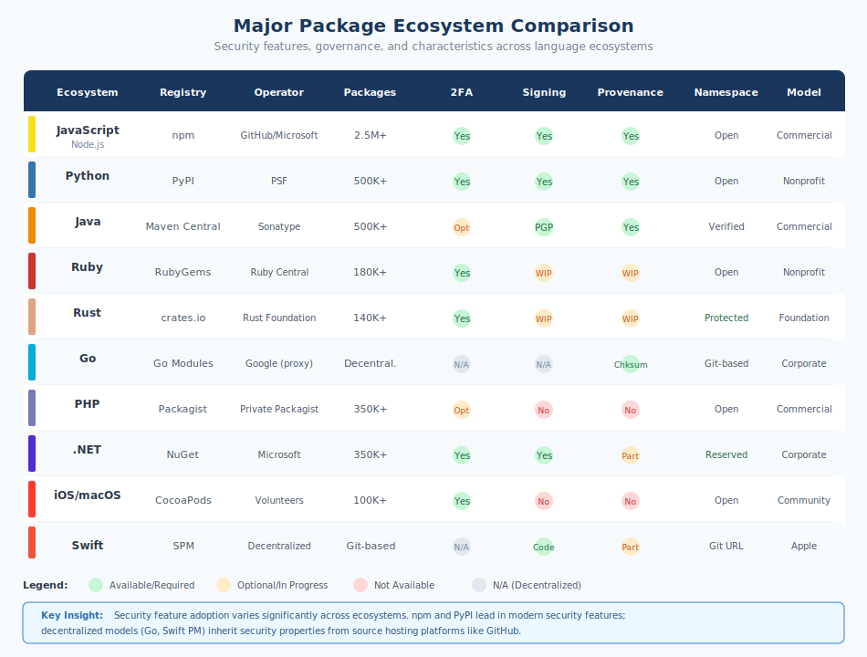

# 2.4 Major Package Ecosystems: A Comparative Survey

The open source ecosystem is not a single entity but a collection of distinct communities, each with its own culture, governance, tooling, and security posture. Understanding these ecosystems—their strengths, weaknesses, and idiosyncrasies—is essential for anyone managing software supply chain security. A vulnerability disclosure process that works well in one ecosystem may not exist in another. Security features considered standard in one registry may be absent elsewhere. This section surveys the major package ecosystems, providing reference material for practitioners who must secure applications spanning multiple language communities.

## JavaScript/Node.js: npm

The **npm registry** is the largest package ecosystem in the world by a substantial margin, hosting over 2.5 million packages with more than 200 billion downloads per month. This scale reflects JavaScript's ubiquity: it runs in every web browser, powers countless server applications through Node.js, and has expanded into mobile development, desktop applications, and even embedded systems.

npm, Inc. was founded in 2014 to provide commercial stewardship of the registry created by Isaac Schlueter in 2010. GitHub acquired npm in 2020, integrating it into Microsoft's developer platform portfolio. The registry operates as a centralized service; there is no federated alternative for the npm ecosystem comparable to what exists in some other language communities.

The npm ecosystem's security posture has evolved significantly following high-profile incidents. The **event-stream compromise** of 2018 demonstrated how social engineering could transfer control of popular packages to malicious actors. The **ua-parser-js**, **coa**, and **rc** hijackings in 2021 showed that even widely-used packages remained vulnerable to account takeover.

In response, npm has implemented substantial security improvements:

- **Mandatory two-factor authentication** for maintainers of high-impact packages (top 100 by dependents) since 2022, extended to top 500 packages subsequently
- **npm provenance** using Sigstore, allowing packages built in CI/CD environments to include cryptographic attestation of their build origin
- **Trusted publishing** through OpenID Connect, eliminating the need for long-lived API tokens
- **Automated malware detection** scanning packages upon publication
- **Security advisories** integrated with GitHub's advisory database

Despite these improvements, npm's scale creates ongoing challenges. The registry processes millions of package versions, making comprehensive review impossible. The JavaScript culture of small, single-purpose packages means applications often have hundreds or thousands of transitive dependencies. The `package-lock.json` mechanism helps ensure reproducible installations, but many projects do not commit lockfiles or keep them updated.

## Python: PyPI

The **Python Package Index (PyPI)** hosts over 500,000 projects with billions of downloads annually. Managed by the Python Software Foundation with significant infrastructure support from sponsors, PyPI has grown from a minimal package index into critical infrastructure for data science, machine learning, web development, and automation.

PyPI's governance reflects Python's community-driven ethos. The Python Packaging Authority (PyPA) develops packaging standards and tools, while the PSF provides organizational oversight. Unlike npm's corporate ownership, PyPI operates as community infrastructure supported by donations and sponsorship.

Security improvements have accelerated in recent years:

- **Mandatory 2FA** for critical projects and new project creation as of 2023-2024
- **Trusted Publishers** enabling GitHub Actions, GitLab CI, and other CI systems to publish without stored credentials
- **Sigstore integration** providing cryptographic attestation for package provenance
- **Malware detection** through automated scanning and community reporting
- **PEP 740 attestations** establishing standards for digital attestations accompanying packages

PyPI has experienced significant attacks. The **ctx package hijacking** in 2022 saw an attacker claim an abandoned package name and publish a version that exfiltrated environment variables. **Typosquatting campaigns** regularly target PyPI, exploiting the registry's open namespace to publish malicious packages with names similar to popular libraries. The **Ultralytics breach** in late 2024, where a compromised GitHub token led to malicious package publication, demonstrated supply chain risks even for well-known projects.

Python's `requirements.txt` format historically encouraged loose version specifications, though `pip-tools`, `poetry`, and modern dependency management promote pinned versions and lockfiles. The ecosystem's diversity of packaging tools (setuptools, poetry, flit, hatch) can create confusion but also enables experimentation with security-focused approaches.

## Java: Maven Central

**Maven Central** is the primary repository for Java and JVM-language artifacts, hosting over 500,000 unique artifacts with hundreds of billions of downloads annually. Operated by Sonatype, Maven Central serves the enterprise Java ecosystem where stability and verification have historically been priorities.

Maven Central's publication process is more rigorous than most ecosystems. Publishers must verify domain ownership, provide PGP signatures for artifacts, and submit through a staging process. This verification creates friction but also barriers against casual malicious publication.

Sonatype provides additional security capabilities:

- **PGP signatures** required for all published artifacts
- **Namespace verification** tying package coordinates to verified identities
- **Vulnerability scanning** through Sonatype's commercial security products
- **Repository policies** enforced through Nexus repository managers
- **Sigstore adoption** bringing keyless signing to the Java ecosystem

The Java ecosystem's security incidents have often involved dependency confusion or compromised build processes rather than direct registry attacks. The **Log4Shell vulnerability** (CVE-2021-44228) in Apache Log4j represented the ecosystem's most significant security event—not a supply chain attack per se, but a critical vulnerability in a ubiquitous logging library that affected virtually every Java application.

Maven's dependency resolution is deterministic given a `pom.xml` file, and enterprise users typically employ repository managers that proxy and cache artifacts. This architecture provides natural points for security controls but requires proper configuration to be effective.

## Ruby: RubyGems

**RubyGems.org** hosts over 180,000 gems (Ruby's package terminology) serving the Ruby community, particularly web developers using Ruby on Rails. The registry is operated by Ruby Central, a nonprofit organization that also supports Ruby development and the RubyConf conference series.

RubyGems was an early package ecosystem, launching in 2004, and some of its design decisions reflect that era. The ecosystem has historically had a smaller maintainer community than JavaScript or Python, creating both intimacy and concentration risk.

Security features have improved significantly:

- **Mandatory MFA** for high-profile gem owners
- **WebAuthn support** for strong authentication
- **API key scoping** allowing limited-privilege tokens
- **Ownership confirmation** for gem transfers
- **Sigstore integration** through ongoing community efforts

The Ruby ecosystem experienced one of the earliest high-profile supply chain incidents with the **RubyGems.org credential compromise** in 2013, where database access allowed attackers to potentially modify gems. More recently, **typosquatting attacks** have targeted popular gems, and the ecosystem has seen occasional **dependency confusion** attempts.

The Ruby community's relatively close-knit nature has some security benefits: maintainers often know each other, and unusual activity may be noticed. However, many critical gems are maintained by small teams or individuals, creating bus factor risks.

## Rust: crates.io

**crates.io** hosts over 140,000 crates for the Rust programming language. Operated by the Rust Foundation, crates.io was designed with explicit attention to lessons learned from earlier ecosystems.

Rust's ecosystem benefits from launching after major supply chain incidents had raised awareness. Security-conscious design choices include:

- **Immutable package versions**: Once published, a version cannot be modified or deleted (only yanked, which prevents new installations but doesn't remove existing cached copies)
- **Mandatory source availability**: Packages link to source repositories
- **Namespace policies**: Preventing some common typosquatting patterns
- **cargo-audit**: First-party tooling for vulnerability checking
- **cargo-vet**: Mozilla's tool for tracking dependency audits
- **Sigstore integration**: Through community tooling

crates.io has experienced relatively few major security incidents compared to older ecosystems, though researchers have demonstrated **typosquatting vulnerabilities** and identified **malicious crates** that were removed. The ecosystem's smaller size and newer vintage make comparison difficult—it may simply have not yet attracted the same attacker attention as larger ecosystems.

Rust's memory safety guarantees address an entire class of vulnerabilities at the language level, but supply chain risks remain. Crates can still contain logic bugs, backdoors, or malicious functionality that memory safety does not prevent.

## Go Modules

Go's package ecosystem takes a distinctive decentralized approach. Rather than a central registry, Go modules are fetched directly from source repositories (primarily GitHub). The **Go Module Mirror** (proxy.golang.org) and **Go Checksum Database** (sum.golang.org), operated by Google, provide caching and integrity verification.

This architecture has unique security properties:

- **Checksum database**: Once a module version is fetched anywhere, its checksum is recorded in a global transparency log; subsequent fetches verify against this record
- **Minimal Version Selection**: Go's dependency resolution algorithm prioritizes stability over freshness
- **Module proxies**: Organizations can run private proxies for caching and access control
- **No central authentication**: Package ownership is determined by source repository access
- **go.sum files**: Lockfiles recording expected checksums for all dependencies

The decentralized model means there is no central registry to compromise, but it also means security depends on the security of source hosting platforms. A compromised GitHub account provides direct access to "publish" new versions of any module the account controls.

Go's ecosystem has seen **typosquatting** attempts and **malicious modules**, though the checksum database provides detection capability once malicious content is identified. The **Codecov incident** of 2021 particularly affected Go projects using that CI service for coverage reporting.

## PHP: Composer and Packagist

**Packagist** serves as the primary repository for PHP packages installed via Composer, hosting over 350,000 packages. PHP powers a substantial portion of the web—WordPress, Laravel, Drupal, and countless custom applications—making Packagist critical infrastructure despite receiving less attention than npm or PyPI.

Packagist is operated by Private Packagist GmbH, which also offers commercial private repository services. The registry's governance is less formalized than foundation-backed ecosystems.

Security features include:

- **Two-factor authentication** available for accounts
- **API tokens** for CI/CD integration
- **Namespace verification** for some organizations
- **Security advisories** through the PHP Security Advisories Database

PHP's ecosystem has experienced security incidents including **typosquatting** and **account compromise**. The **PHPUnit vulnerability** (CVE-2017-9841) demonstrated how widely-used testing tools could become attack vectors when improperly configured.

The PHP community's decentralized nature—with many applications self-hosted rather than deployed through modern CI/CD—creates challenges for security update distribution. WordPress's automatic update mechanism has been crucial for patching vulnerable sites, demonstrating how deployment architecture affects supply chain security.

## .NET: NuGet

**NuGet Gallery** hosts over 350,000 unique packages for the .NET ecosystem. Operated by Microsoft, NuGet benefits from corporate resources and integration with Visual Studio, Azure DevOps, and the broader Microsoft developer platform.

Microsoft's stewardship provides:

- **Package signing**: Both author and repository signatures supported
- **Reserved prefixes**: Protecting official Microsoft package namespaces
- **Vulnerability scanning**: Integration with GitHub security advisories
- **Verified publishers**: Visual indicators for authenticated organizations
- **Two-factor authentication**: Through Microsoft account integration

NuGet has experienced fewer high-profile security incidents than peer ecosystems, possibly due to its enterprise user base and Microsoft's security investment. However, **typosquatting** attacks have been demonstrated, and researchers have identified **malicious packages** that were subsequently removed.

The .NET ecosystem's enterprise orientation means many organizations use private NuGet feeds (through Azure Artifacts, MyGet, or self-hosted solutions), providing isolation from public registry risks but requiring their own security management.

## Swift/Objective-C: CocoaPods and Swift Package Manager

The Apple ecosystem relies on two primary package management systems: **CocoaPods**, a community-driven dependency manager established in 2011, and **Swift Package Manager (SPM)**, Apple's official tool introduced in 2016 and integrated into Xcode.

**CocoaPods** manages over 100,000 pods (libraries) and remains widely used in iOS, macOS, watchOS, and tvOS development. The CocoaPods Trunk[^cocoapods-trunk] serves as the centralized registry, operated by a small team of volunteers under the CocoaPods organization.

CocoaPods has experienced notable security challenges:

- **Trunk server vulnerabilities** (2021): Security researchers identified a vulnerability in the CocoaPods Trunk API that could have allowed attackers to claim ownership of abandoned pods, potentially affecting millions of iOS applications. The issue stemmed from how the trunk server handled ownership verification for pods whose original maintainers had abandoned their email addresses.
- **Dependency confusion risks**: Like other ecosystems, CocoaPods is vulnerable to dependency confusion attacks where private pod names could be claimed on the public trunk.
- **Podspec tampering**: The Podspec files that define pod metadata are fetched from the centralized specs repository, creating a single point where modifications could affect downstream consumers.

Security improvements include:

- **Two-factor authentication** for Trunk accounts
- **Session management** improvements following the 2021 vulnerability disclosures
- **Pod ownership verification** requiring email confirmation
- **Spec repository mirroring** through CDN for improved availability

**Swift Package Manager** represents Apple's modern approach, integrated directly into Xcode and the Swift compiler. Unlike CocoaPods' centralized registry, SPM uses a decentralized model similar to Go modules—packages are referenced by their Git repository URLs and fetched directly from source.

SPM's security properties include:

- **No central registry**: Packages are defined by Git URLs, eliminating registry-based attacks but making discovery more challenging
- **Version pinning**: `Package.resolved` files lock dependencies to specific commits
- **Checksum verification**: Package manifests can specify expected checksums for binary dependencies
- **Code signing**: Xcode integrates with Apple's code signing infrastructure for distributed binaries

However, SPM's decentralized model inherits the security properties of its source hosting platforms. A compromised GitHub account provides direct access to modify package source. The **Swift Package Index** (swiftpackageindex.com), a community catalog of SPM packages, provides discoverability but is not an authoritative registry.

The Apple ecosystem faces unique supply chain considerations:

- **App Store review**: Apple reviews applications before distribution, providing a downstream defense layer not present in server-side ecosystems, though this review focuses on policy compliance rather than dependency security
- **Closed-source prevalence**: Many iOS dependencies are distributed as binary frameworks (XCFrameworks), limiting source code inspection
- **Enterprise certificates**: Organizations distributing apps internally via enterprise certificates bypass App Store review, removing that security layer
- **Binary dependencies**: Both CocoaPods and SPM support pre-compiled binary dependencies, requiring trust in the build process that produced those binaries

Mobile application supply chains deserve particular attention because compromised iOS applications have direct access to user data, device sensors, and payment credentials. The **XcodeGhost incident** (2015), where a modified Xcode compiler injected malware into apps built with it, demonstrated how iOS development toolchains could become supply chain vectors affecting millions of users.

## Comparative Analysis

Examining these ecosystems reveals both common patterns and significant divergences.

**Registry governance varies significantly:**

| Ecosystem | Operator | Funding Model |
|-----------|----------|---------------|
| npm | GitHub/Microsoft | Commercial |
| PyPI | Python Software Foundation | Donations/Sponsors |
| Maven Central | Sonatype | Commercial |
| RubyGems | Ruby Central | Nonprofit/Sponsors |
| crates.io | Rust Foundation | Foundation |
| Go modules | Google (mirror/checksum) | Corporate |
| Packagist | Private Packagist GmbH | Commercial |
| NuGet | Microsoft | Corporate |
| CocoaPods | CocoaPods Volunteers | Community/Donations |
| Swift PM | Apple (decentralized) | N/A (uses Git hosts) |

**Dependency scale varies dramatically by ecosystem:**

The "dependency explosion" phenomenon—where a single installation brings in hundreds or thousands of packages—is well-documented but varies significantly across ecosystems. The following table illustrates how common starter projects expand into complex dependency trees:

| Ecosystem | Package | Contributors | Direct Deps | Transitive Deps | Total Size |
|-----------|---------|--------------|-------------|-----------------|------------|
| npm | `create-react-app` | ~890 | ~40 | ~1,500+ | ~200-250 MB |
| npm | `next` | ~3,700 | ~20 | ~300-400 | ~150 MB |
| npm | `express` | ~340 | 31 | ~60 | ~2.1 MB |
| PyPI | `django` | ~2,700 | 3 | ~5 | ~30 MB |
| PyPI | `tensorflow` | ~3,800 | ~40 | ~150+ | ~600+ MB |
| PyPI | `pandas`[^ds-stack] | ~3,600 | ~5 | ~200+ | ~1+ GB |
| Maven | `spring-boot-starter-web` | ~1,200 | ~15 | ~80-100 | ~50 MB |
| RubyGems | `rails` | ~5,000 | 13 | ~80-100 | ~30 MB |
| crates.io | `tokio` (full features) | ~930 | ~25 | ~50-70 | ~15 MB |
| Go | `k8s.io/client-go` | ~640 | ~40 | ~100+ | ~50 MB |
| NuGet | `Microsoft.AspNetCore.App` | ~1,350 | ~15 | ~100-150 | ~80 MB |

[^ds-stack]: Data science stack totals include `pandas`, `scikit-learn`, `matplotlib`, and their shared dependencies (NumPy, etc.). Contributor count shown is for pandas alone.

Note: Contributor counts from GitHub as of late 2024. Create React App is now deprecated; dependency measurements from version 5.x. Size estimates from Package Phobia and ecosystem-specific tools. The Sonatype 2024 State of the Software Supply Chain Report provides additional ecosystem analysis.

Several patterns emerge from this analysis:

- **JavaScript/npm exhibits the highest expansion ratios**, often 30-50x between direct and transitive dependencies. This reflects the ecosystem's culture of small, single-purpose packages—what some call the "one-liner package" phenomenon.
- **Python shows bimodal behavior**: simple web frameworks like Django have minimal dependencies, while data science and ML tooling creates massive dependency trees including native code.
- **Java/Maven tends toward larger but fewer packages**, with enterprise applications averaging 150 components according to Sonatype's research.
- **Rust and Go exhibit more controlled growth**, partly due to ecosystem design (Rust's feature flags, Go's minimal version selection) and cultural emphasis on reducing dependencies.
- **Install size correlates loosely with dependency count**; packages with native code (TensorFlow, NumPy) are much larger per dependency than pure JavaScript packages.

These numbers matter for security because each dependency represents code that must be trusted, monitored for vulnerabilities, and updated when issues arise. An organization with 1,500 transitive dependencies has 1,500 potential points of compromise—and the Sonatype 2024 report found that 86% of vulnerabilities originate in transitive dependencies that developers never explicitly chose.

**Security feature adoption is uneven:**

All major ecosystems now support or require 2FA for privileged accounts, though enforcement varies. Sigstore-based signing and attestation is becoming common but is not yet universal. Trusted publishing (eliminating stored credentials for CI/CD) is available in npm and PyPI but not all ecosystems. Malware scanning exists in most registries but with varying sophistication.

**Namespace policies differ:**

Some ecosystems (npm, PyPI) allow anyone to claim any unclaimed name, enabling typosquatting. Others (Maven Central, NuGet) verify namespace ownership, reducing but not eliminating name-based attacks. Go's decentralized model ties packages to source repository URLs, providing a different form of namespace authority.

**Immutability policies vary:**

crates.io prohibits modification or deletion of published versions. npm allows unpublication within time limits. PyPI permits deletion but discourages it. These policies affect how incidents can be remediated and whether attacks can be rolled back.

## Cross-Ecosystem Risks

Modern applications frequently span multiple ecosystems. A web application might use JavaScript on the frontend, Python for backend services, and Go for infrastructure tooling. Each component brings its ecosystem's security properties and risks.

Cross-ecosystem dependencies create particular challenges:

- **Native extensions**: npm packages may include native code built with C/C++ toolchains. Python packages frequently wrap C libraries. These native dependencies operate outside the managed ecosystem's security model.

- **Polyglot builds**: Applications using multiple package managers must secure each dependency graph independently. Security tooling often focuses on single ecosystems.

- **Shared infrastructure**: Many packages across ecosystems depend on the same CI/CD services (GitHub Actions, CircleCI), source platforms (GitHub, GitLab), and CDN infrastructure. Compromises at these shared layers affect multiple ecosystems simultaneously.

- **Inconsistent security postures**: A security-conscious Rust application might depend on a Python tool with weaker supply chain controls. The overall security is constrained by the weakest ecosystem in the dependency chain.

Organizations securing multi-ecosystem applications need tooling and processes that span all involved package managers. Single-ecosystem solutions leave gaps that attackers can exploit. Book 2, Chapter 13 explores dependency management strategies that address this cross-ecosystem reality.

[^cocoapods-trunk]: CocoaPods Trunk, https://trunk.cocoapods.org

