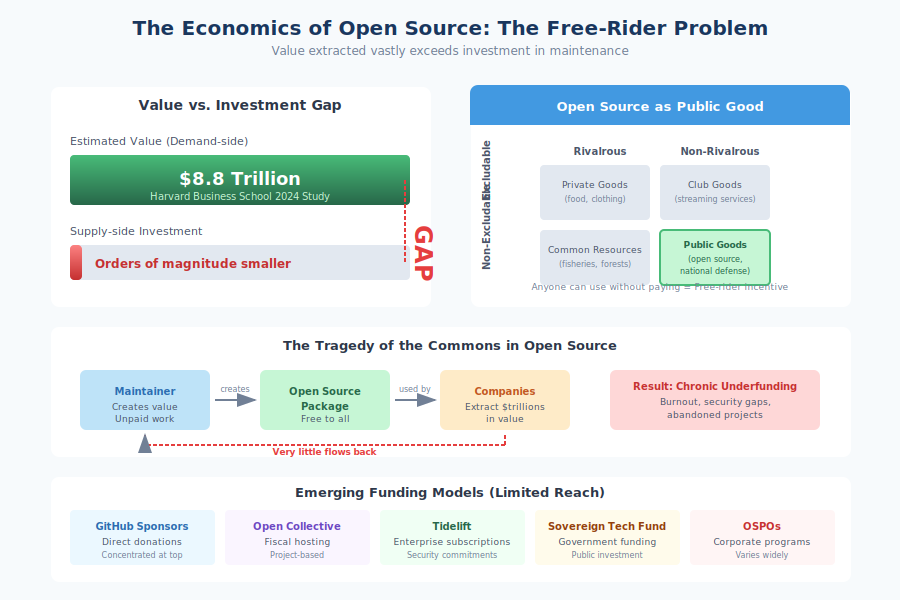

# 2.6 The Economics of Open Source

The previous sections have documented a paradox: open source software creates trillions of dollars in value, yet the people who maintain it are often unpaid volunteers struggling with burnout. This is not a moral failing of the technology industry but a predictable outcome of economic structures that make open source simultaneously invaluable and unfundable through traditional market mechanisms. Understanding these economics is essential for anyone seeking to improve supply chain security, because security improvements ultimately require resources that the current economic model fails to provide.

## The Free-Rider Problem and Public Goods

!!! info "Open Source as a Public Good"

    Open source is **non-excludable** (anyone can use it) and **non-rivalrous** (your use doesn't diminish mine). This makes it a *public good*—like national defense or clean air—systematically underproduced by markets due to the **free-rider problem**: when people can benefit without paying, rational actors choose not to pay.

Economists classify goods along two dimensions: whether they are **excludable** (can people be prevented from using them?) and whether they are **rivalrous** (does one person's use diminish what's available to others?). Open source software is both non-excludable—anyone can download and use it—and non-rivalrous—your use of a library doesn't prevent my use of it. This makes open source software a **public good**, the same economic category as national defense, clean air, or public parks.

Public goods are systematically underproduced by markets because of the **free-rider problem**. When people can benefit from a resource without paying for it, rational economic actors choose not to pay. If your company can use an open source library without contributing money or code, why would you contribute? Your competitors who don't contribute get the same software at lower cost, gaining an advantage.

This dynamic explains why millions of companies use open source while vanishingly few contribute to its maintenance. According to [Tidelift's surveys][tidelift-2024], the median maintainer of even widely-used packages receives effectively zero corporate sponsorship. The [2024 Harvard Business School study on open source value][harvard-oss-value] estimated that while demand-side value reaches $8.8 trillion, supply-side investment is orders of magnitude smaller. The gap between value extracted and value reinvested represents the free-rider problem operating at global scale.

The situation parallels what Garrett Hardin famously called the **Tragedy of the Commons** in his [1968 Science article][hardin-1968]. Each individual actor—whether a developer adding a dependency or a company shipping products—makes locally rational decisions that collectively deplete a shared resource. No single company's decision to not contribute is decisive, but the aggregate effect is chronic underinvestment in infrastructure everyone depends on.

## Business Models Around Open Source

Despite the free-rider problem, substantial economic activity has developed around open source software. Several business models have emerged that capture value while navigating the public goods challenge.

**Support and services** was the original open source business model, exemplified by Red Hat's approach to Linux. The software is free; customers pay for enterprise support, integration, certification, and security response. Red Hat's acquisition by IBM for $34 billion in 2019 demonstrated this model's viability at scale. However, support-based models work best for complex infrastructure software; a utility library with straightforward usage generates little support revenue.

**Open core** provides a free open source base with proprietary extensions sold commercially. GitLab, Elastic, and MongoDB have pursued variations of this model. The open source project attracts users and contributors, while premium features generate revenue. Tension can arise when companies decide which features belong in which tier—placing security features in paid tiers, for instance, creates problematic incentives.

**Software as a Service (SaaS)** builds hosted offerings on open source foundations. WordPress.com hosts the open source WordPress; various companies offer managed Kubernetes, PostgreSQL, or Redis services. This model monetizes operational expertise rather than code, but has generated controversy when cloud providers offer managed services based on projects they don't fund, extracting value from maintainers' work without reciprocating.

**Dual licensing** offers software under both open source and commercial licenses. Companies using the software internally typically use the open source license; those embedding it in proprietary products pay for commercial licensing. MySQL pioneered this approach; Qt and MongoDB have used variants. The model requires concentrated copyright ownership, which can conflict with community contribution dynamics.

**Developer tools and platforms** monetize the ecosystem around open source rather than the software itself. GitHub (acquired by Microsoft for $7.5 billion) makes money from hosting, CI/CD services, and enterprise features while contributing to open source projects and providing free hosting for public repositories. npm's commercial ambitions, before GitHub acquisition, followed similar logic.

These business models generate substantial revenue, but they flow primarily to companies building products and services around open source, not to the maintainers of the underlying packages. A startup can raise millions to build a SaaS product on open source foundations while the maintainers of those foundations receive nothing. The economic value creation has been decoupled from the labor that creates it.

## Corporate Open Source Program Offices

Many large technology companies have established **Open Source Program Offices (OSPOs)** to manage their relationship with the open source ecosystem. OSPOs coordinate internal open source usage, govern contributions to external projects, ensure license compliance, and increasingly address security concerns.

Companies with mature OSPOs include Google, Microsoft, Meta, Amazon, Netflix, Comcast, and many others. The TODO Group, a Linux Foundation project, provides a community for OSPO practitioners to share practices.

OSPOs can drive meaningful contribution. Google employs maintainers of critical projects (Python, Linux kernel, Kubernetes). Microsoft contributes extensively to projects in its ecosystem and has released significant code as open source. Meta maintains React, Jest, and numerous other widely-used projects.

However, even substantial corporate contribution fails to address the long-tail problem. Large companies contribute to projects they depend on most visibly or where they derive strategic benefit. The thousands of smaller packages in their dependency trees—including security-critical libraries—receive no attention. An OSPO might fund Python core development while ignoring the hundreds of PyPI packages the company's applications actually import.

Some companies have addressed this through targeted programs. The FOSS Contributor Fund, pioneered by Indeed and adopted by other companies, allocates budget for employees to direct toward open source projects they depend on. Salesforce, Sentry, and others have similar programs. These initiatives demonstrate growing recognition that dependency security requires dependency support, but participation remains limited to a small fraction of companies benefiting from open source.

## Funding Mechanisms for Maintainers

A variety of mechanisms have emerged to channel funding to maintainers, with varying reach and effectiveness.

**GitHub Sponsors** enables users to make recurring payments to developers and organizations. Launched in 2019, it has disbursed millions of dollars but remains concentrated among a small number of recipients. Most maintainers receive little or nothing through the platform.

**Open Collective** provides fiscal hosting for open source projects, handling legal entity requirements and financial administration. Projects like webpack, Babel, and Vue.js have raised significant funds through Open Collective, but success correlates with project visibility rather than project criticality.

**Tidelift** takes a different approach, connecting enterprise subscribers to a curated set of packages whose maintainers commit to security and maintenance standards. Maintainers receive income in exchange for vulnerability response, secure release practices, and documentation. The model addresses the incentive alignment problem—companies pay for security assurances, maintainers are compensated for providing them—but reaches only a small subset of the ecosystem.

**Foundation funding** from organizations like the Linux Foundation, Apache Software Foundation, and Python Software Foundation supports critical infrastructure projects. The **Sovereign Tech Fund**, backed by the German government, directly funds open source infrastructure maintenance, representing an emerging model of public investment in digital public goods.

**Bug bounties and security rewards** occasionally reach open source projects. Google's Patch Reward Program compensates for security improvements to open source projects. The Internet Bug Bounty provides rewards for vulnerabilities in critical infrastructure. These programs fund specific security work but not ongoing maintenance.

Despite these mechanisms, the overall picture remains one of chronic underfunding.

!!! quote "Filippo Valsorda, Cryptographer and Maintainer"

    "Open Source software runs the Internet, and by extension the economy. This is an undisputed fact about reality... And yet, the role of Open Source maintainer has failed to mature from a hobby into a proper profession."

As Filippo Valsorda, a cryptographer and open source maintainer, [wrote in his influential essay "Professional Maintainers"][valsorda-essay]:

> "Open Source software runs the Internet, and by extension the economy. This is an undisputed fact about reality... And yet, the role of Open Source maintainer has failed to mature from a hobby into a proper profession."

## Why Security Is Particularly Hard to Fund

!!! warning "Why Security Goes Unfunded"

    Security work faces unique funding barriers:
    
    - **Invisible when it works**: No obvious benefit vs. neglected packages
    - **Competes with features**: Features attract users; security rarely does
    - **Requires specialized skills**: Scarce, expensive, poorly matched to volunteer economics
    - **Creates liability concerns**: Disclosure may expose maintainers to criticism/risk
    - **Communal benefits, individual costs**: The free-rider problem is especially acute

Security work faces additional funding challenges beyond general maintenance. Several dynamics make security the least likely aspect of open source to receive investment.

**Security is invisible when it works.** A well-maintained package with no vulnerabilities provides no obvious benefit over a neglected package that hasn't yet been exploited. Funders, whether companies or individuals, struggle to value prevention. They notice when things break, not when careful work prevents breakage.

**Security competes with features.** When maintainers have limited time, they face choices between adding functionality users request and conducting security reviews no one asked for. Features attract users and sponsors; security work rarely generates equivalent recognition or funding.

**Security requires specialized skills.** Effective security review requires expertise that many maintainers lack. Even motivated maintainers may not recognize vulnerabilities or understand secure development practices. The skills are scarce and expensive, poorly matched to volunteer economics.

**Security disclosure creates liability concerns.** Maintainers who discover vulnerabilities in their own code face awkward choices. Transparent disclosure might expose them to criticism or legal risk. The incentive structure discourages rather than encourages honest security assessment.

**Security is communal but costs are individual.** When a maintainer invests time in security, the benefits flow to all users while the costs fall entirely on the maintainer. The free-rider problem is especially acute for security because there is no way to exclude non-payers from security benefits.

The result is that security work is precisely the maintenance activity least likely to receive funding, while being the area where underfunding creates the most systemic risk. The Log4Shell vulnerability existed in Log4j for years, affecting virtually every Java application, while the project struggled for resources. The XZ Utils maintainer, overwhelmed and under-resourced, was vulnerable to the social engineering that enabled the backdoor.

## The Hidden Costs of "Free" Software

The framing of open source as "free" obscures substantial costs that organizations bear whether or not they recognize them.

**Vulnerability exposure**: Organizations using unsupported packages bear remediation costs when vulnerabilities are discovered. These costs—emergency patching, incident response, breach impacts—dwarf what contribution to maintenance would have cost.

**Technical debt**: Unmaintained dependencies accumulate incompatibilities and require increasing effort to update. Organizations eventually face the choice of expensive migration or permanent vulnerability.

**Opportunity cost**: Engineering time spent debugging issues in dependencies, working around limitations, or maintaining forks represents time not spent on core business objectives.

**Security program overhead**: Organizations build elaborate programs to monitor dependencies, scan for vulnerabilities, and manage updates—overhead that could be reduced if dependencies were well-maintained in the first place.

These hidden costs often exceed what funding maintenance would require, but they are diffused across time and organizations while maintenance costs are concentrated on maintainers. The economic structure privatizes benefits while socializing costs—exactly the dynamic that public goods theory predicts.

Book 3, Chapter 30 explores potential solutions to these economic challenges in greater depth, examining models from government funding to insurance markets to collective action frameworks. For now, the essential insight is that supply chain security cannot be solved through technical measures alone. The economic structures that underfund maintenance generally underfund security specifically, and changing those structures requires engaging with incentives, not just tools.

[tidelift-2024]: https://www.tidelift.com/open-source-maintainer-survey-2024
[harvard-oss-value]: https://www.hbs.edu/faculty/Pages/item.aspx?num=65230
[hardin-1968]: https://www.science.org/doi/10.1126/science.162.3859.1243
[valsorda-essay]: https://words.filippo.io/professional-maintainers/

