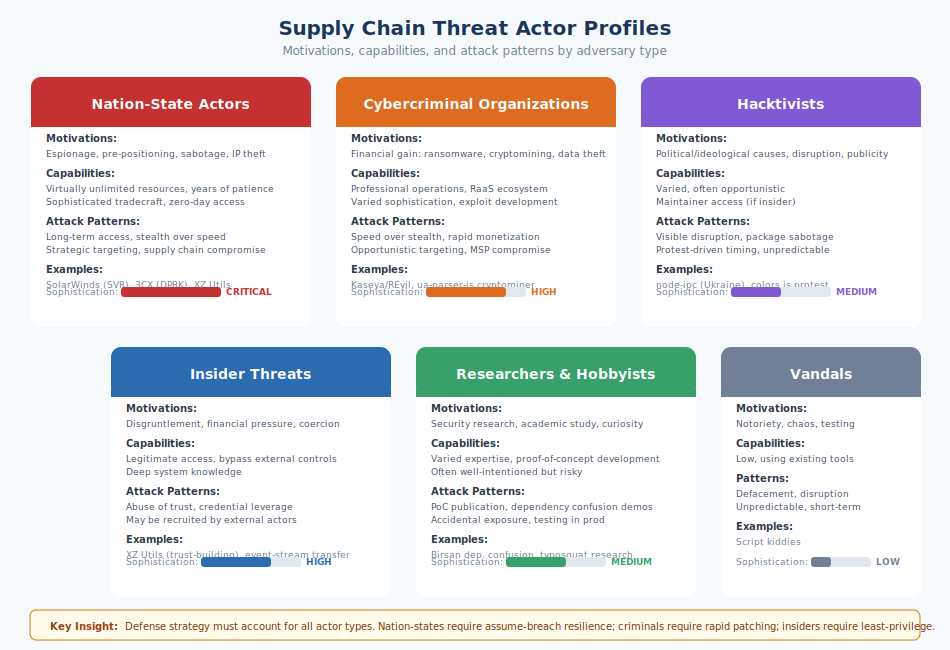

# 3.1 Adversary Motivations

Effective defense requires understanding who is attacking and why. The software supply chain attracts a diverse range of threat actors, from nation-states with virtually unlimited resources to individual vandals seeking notoriety. Each actor type brings different motivations, capabilities, and attack patterns. A defense strategy that protects against one type may be irrelevant against another. This section profiles the major threat actor categories, providing the foundation for threat modeling discussions in Chapter 4.

#### Nation-State Actors

Nation-state threat actors represent the most sophisticated and persistent adversaries targeting software supply chains. These groups operate with substantial resources, long time horizons, and strategic objectives that extend far beyond immediate financial gain. Their motivations typically include:

**Espionage**: Gaining access to sensitive information in government, defense, technology, and critical infrastructure organizations. Supply chain compromise provides efficient access to many targets through a single operation.

**Pre-positioning**: Establishing persistent access to systems that might be needed for future operations. Backdoors planted today might be activated years later during a geopolitical crisis.

**Sabotage**: Maintaining capability to disrupt or destroy critical systems. Supply chain access to industrial control systems, financial infrastructure, or communications networks provides options for future offensive operations.

**Intellectual property theft**: Acquiring trade secrets, research data, and proprietary technology to benefit domestic industries or close capability gaps.

The **SolarWinds attack** (discovered December 2020) exemplifies nation-state supply chain operations. The SVR, Russia's foreign intelligence service, compromised SolarWinds' build infrastructure and inserted malicious code into the Orion network management platform. The trojanized software was distributed to approximately 18,000 organizations through legitimate update channels. Among the victims were the U.S. Treasury, Commerce Department, Department of Homeland Security, and numerous Fortune 500 companies. The operation demonstrated patience—access was maintained for months before discovery—and sophistication—the malware included anti-analysis features and mimicked legitimate network traffic.

The **3CX compromise** (March 2023) followed a similar pattern. Attackers, attributed by multiple security firms to North Korean threat actors, compromised 3CX's build environment and distributed a trojanized version of the company's VoIP application. The attack specifically targeted cryptocurrency companies, reflecting North Korea's strategic use of cyber operations to generate revenue under sanctions.

The **XZ Utils backdoor** (discovered March 2024), while not officially attributed at the time of discovery, bore hallmarks of nation-state tradecraft: years of patient social engineering to gain maintainer access, sophisticated code hiding techniques, and targeting of SSH—the protocol used to administer virtually every Linux server on the internet. The operation's scope would have provided access to critical infrastructure globally. It is important to note that public attribution remains unconfirmed, and conclusions about attacker identity drawn from tradecraft analysis alone are inherently uncertain—sophisticated non-state actors can mimic nation-state techniques, and nation-states can deliberately obscure their involvement. The attribution question may never be definitively resolved.

Nation-state actors are distinguished by their capability for long-term operations, their willingness to invest years in developing access, and their targeting of strategic rather than opportunistic objectives. Defense against these actors requires assuming that sufficiently motivated adversaries can eventually succeed and designing systems that limit the impact of compromise.

#### Cybercriminal Organizations

Financially motivated criminal groups have increasingly recognized supply chain attacks as efficient vectors for their objectives. Unlike nation-states, criminals seek direct monetization, typically through ransomware, cryptomining, or data theft for sale or extortion.

The **Kaseya VSA attack** (July 2021) demonstrated criminal supply chain operations at scale. The REvil ransomware group exploited vulnerabilities in Kaseya's remote management software, used by managed service providers (MSPs) to administer client systems. By compromising Kaseya, attackers gained access to the MSPs' customers—an estimated 800 to 1,500 businesses worldwide. REvil initially demanded $70 million for a universal decryptor. The attack showed criminals applying supply chain thinking: rather than targeting individual businesses, they targeted the infrastructure businesses depended on.

Cryptomining malware frequently enters the supply chain through compromised packages. The **ua-parser-js incident** (October 2021) saw attackers compromise the npm account of a popular package maintainer and publish versions containing cryptomining malware. With millions of weekly downloads, the package provided immediate access to developer machines and CI/CD environments with computational resources to exploit.

Criminal organizations vary in sophistication. Some operate as professional enterprises with human resources functions, customer service for victims, and quality assurance for their malware. Others are loose affiliations of individuals. The ransomware-as-a-service model has lowered barriers to entry, enabling less sophisticated actors to deploy advanced tooling developed by others.

Financial motivation shapes attack patterns. Criminals prefer targets that will pay ransoms or generate cryptocurrency mining revenue. They favor speed over stealth—extracting value quickly before detection. They often operate opportunistically, exploiting whatever access they can achieve rather than pursuing specific strategic targets. These patterns suggest different defensive priorities than nation-state threats: detection and response speed matter more than preventing initial access against adversaries who prioritize quick monetization over long-term persistence.

#### Hacktivists

**Hacktivists** are individuals or groups who use cyber attacks to promote political or ideological agendas. Their motivations center on disruption, embarrassment of targets, and attention for their causes rather than financial gain or intelligence collection.

The **node-ipc incident** (March 2022) represents a supply chain attack driven by ideological motivation. The maintainer of the popular npm package modified code to detect systems with Russian or Belarusian IP addresses and overwrite files with heart emojis, in protest of Russia's invasion of Ukraine. While the maintainer apparently intended to make a political statement rather than cause serious harm, the incident demonstrated how maintainer access could be weaponized for ideological purposes.

The **colors.js and faker.js incidents** (January 2022) showed a different form of hacktivism. The maintainer, frustrated by corporations profiting from his unpaid work, deliberately corrupted the packages to print gibberish and enter infinite loops. While framed as protest against open source exploitation rather than a political cause, the attack used supply chain access to make an ideological point, disrupting thousands of dependent applications.

Hacktivist attacks tend toward visible disruption rather than subtle compromise. Website defacement, data leaks, and denial of service align better with goals of publicity and embarrassment than backdoors that might go unnoticed. However, the supply chain provides hacktivists with amplification: compromising a single package can affect millions of systems, generating impact disproportionate to the attacker's resources.

Hacktivist threats are difficult to predict because they correlate with political events and social movements. Organizations that become targets of ideological opposition—whether for their industry, policies, or perceived associations—face elevated risk. The node-ipc incident showed that even geographic location of end-users could trigger targeting.

#### Insider Threats

**Insider threats** arise from individuals with legitimate access who abuse that access for malicious purposes. In the supply chain context, insiders include maintainers who turn malicious, employees of package registries or build services, and developers who have been coerced or recruited by external threat actors.

The distinction between insider and external threats blurs in open source. The XZ Utils attacker functioned as an insider after spending years building trust as a contributor. The event-stream compromise involved a legitimate maintainer transferring control to someone who then turned malicious. These "trusted insiders" are particularly dangerous because they bypass external security controls.

Insider motivations vary:

**Disgruntlement**: Employees or maintainers who feel wronged may sabotage systems out of revenge. The colors.js incident reflected maintainer frustration with the open source ecosystem.

**Financial pressure**: Individuals may be recruited or extorted into providing access. Nation-state services actively recruit insiders; criminals purchase credentials from employees.

**Ideological conversion**: People may come to sympathize with causes that motivate attacks against their employers or projects.

**Coercion**: Threats against individuals or their families can compel cooperation with attackers.

The **Ubiquiti insider incident** (2021) demonstrated insider threats in a supply chain-adjacent context. A senior developer at Ubiquiti Networks posed as an anonymous whistleblower while actually being the perpetrator of a security breach, using his insider access to steal data and then attempt to extort the company. While not a traditional supply chain attack, the incident illustrated how insider access and knowledge could be weaponized.

Defending against insider threats requires different approaches than defending against external attackers. Access controls, monitoring, and separation of duties matter more than perimeter security. The principle of least privilege—granting only necessary access—limits what any single insider can compromise.

#### Researchers and Hobbyists

Not all supply chain incidents result from malicious intent. Security researchers, academics, and hobbyists sometimes cause harm through well-intentioned but poorly considered activities.

**Proof-of-concept publications** can provide blueprints for attacks. When researchers publish detailed exploitation techniques for supply chain vulnerabilities, they enable less skilled attackers to operationalize the findings. The tension between disclosure for defensive improvement and enabling offensive use is inherent in security research.

**Dependency confusion research** illustrated this dynamic. After Alex Birsan's 2021 publication explaining how private package names could be hijacked through public registries, attackers rapidly adopted the technique. Birsan's responsible disclosure and coordination with affected companies was exemplary, but the published methodology was soon weaponized by criminals.

**Bug bounty programs** occasionally generate supply chain risk. Researchers testing package registries or build systems might accidentally publish malicious packages, demonstrate vulnerabilities in production systems, or disclose issues before patches are available. The Ultralytics GitHub token exposure in 2024 resulted from a security researcher's actions that inadvertently enabled the very attack they were investigating.

**Academic research** on open source ecosystems sometimes involves activities that could be considered attacks. Researchers have published typosquatting packages to measure adoption, created malicious packages to test detection, and enumerated vulnerabilities in live systems. The ethics of such research remain contested.

Hobbyists and tinkerers present lower-stakes versions of similar risks. Someone experimenting with package publishing might create confusingly named packages. A developer testing CI/CD pipelines might accidentally push sensitive data. These incidents lack malicious motivation but can still create security exposures.

Researcher and hobbyist threats are generally lower severity than adversarial attacks but more common. They are also more amenable to community solutions—responsible disclosure norms, ethical guidelines for research, and clear policies from registries about acceptable testing.

#### Thrill-Seekers and Vandals

Some supply chain incidents stem from neither strategic objectives nor financial motivation but from the simple desire to cause chaos, gain notoriety, or test capabilities.

**Script kiddies**—a term for inexperienced attackers using tools developed by others—may target package registries because they can, not because they have specific objectives. The low barrier to publishing packages in most ecosystems enables experimentation that occasionally causes harm.

**Vandalism** in open source sometimes mirrors physical vandalism: destruction for its own sake. Defacing websites, corrupting packages, or disrupting services provides satisfaction to certain personality types regardless of any tangible benefit.

The **left-pad removal** (March 2016), while not vandalism per se, demonstrated how non-malicious individual action could cause widespread disruption. When the developer unpublished his packages following a dispute with npm, builds across the JavaScript ecosystem broke instantly. The incident was not an attack, but it showed how supply chain dependencies created fragility that vandals or thrill-seekers could exploit.

Thrill-seeker attacks typically lack sophistication and persistence. Attackers in this category rarely have the patience for long-term campaigns or the expertise for advanced tradecraft. However, they contribute to the overall attack volume that defenders must handle, and their unpredictability makes them difficult to model.

#### Implications for Defenders

Understanding adversary motivations has practical implications for defense strategy.

**Threat modeling must account for multiple actor types.** A defense designed solely against nation-states may be irrelevant against ransomware criminals; a defense against opportunistic vandals may be trivially bypassed by sophisticated adversaries. Comprehensive threat models consider the full spectrum.

**Motivation predicts attack patterns.** Nation-states favor persistence and stealth. Criminals favor rapid monetization. Hacktivists favor visibility. Insiders leverage their access. These patterns inform where to focus detection and prevention efforts.

**Capability differences affect prioritization.** Defending against nation-state actors requires assuming they will eventually succeed and focusing on limiting impact. Defending against less sophisticated actors may succeed through baseline security hygiene that raises attack costs above what they will invest.

**Attribution affects response.** Knowing who attacked and why informs legal options, disclosure decisions, and expectations about future activity. Criminal attacks may warrant law enforcement involvement; nation-state attacks may trigger government coordination.

**The threat landscape evolves.** Techniques pioneered by nation-states diffuse to criminals; criminal infrastructure is sometimes co-opted by states. Defender strategies must adapt as the ecosystem of threat actors changes.

The chapters that follow examine specific attack surfaces, techniques, and defenses in detail. This foundation in adversary motivations will inform the threat modeling approaches presented in Chapter 4, helping readers assess which threats are most relevant to their specific contexts.

