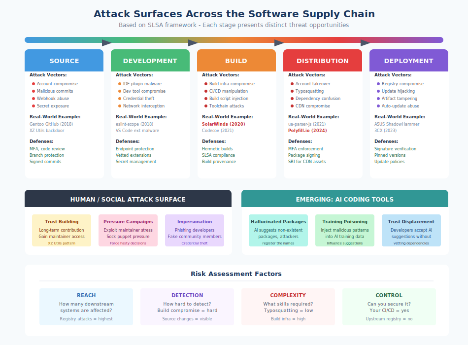

# 3.2 Attack Surfaces Across the Supply Chain

Understanding who attacks software supply chains (Section 3.1) is only half the picture. We must also understand *where* those attacks occur. The software supply chain presents a distributed attack surface spanning source code management, development environments, build systems, distribution infrastructure, and deployment pipelines. Each stage offers distinct opportunities for adversaries, and a single weakness at any point can compromise everything downstream. This section maps these attack surfaces systematically, providing the foundation for the threat modeling approaches discussed in Chapter 4 and the detailed attack analysis in Chapters 5-10.

#### A Framework for Attack Surfaces

The **[Supply-chain Levels for Software Artifacts (SLSA)][slsa]** framework, developed by Google and now stewarded by the Open Source Security Foundation, provides a useful model for understanding supply chain attack surfaces. SLSA identifies the path from source code to deployed artifact and enumerates threats at each transition:

1. **Source** → Threats to code as authored
2. **Build** → Threats during transformation from source to artifact
3. **Dependencies** → Threats from external components
4. **Deployment** → Threats during distribution and installation

We expand this model to include the human and environmental factors that SLSA's technical focus necessarily omits. The attack surface is not merely technical—it includes the people who write code, the systems they work on, and the trust relationships they navigate.

#### Source Code Repositories

Source code repositories—GitHub, GitLab, Bitbucket, self-hosted instances—serve as the starting point for most software supply chains. Compromising source creates downstream effects in every artifact built from that source.

**Account compromise** provides direct access to modify source code. The **Gentoo GitHub incident** (June 2018) saw attackers gain access to a Gentoo Linux organization administrator account and push malicious commits to the repository.[^gentoo-github] The attackers modified ebuilds (package build scripts) to download malicious payloads. Detection came quickly because the commits were visible, but the incident demonstrated how repository access translates to supply chain access.

[^gentoo-github]: Gentoo Linux, "GitHub Gentoo Organization Incident Report," Gentoo News, June 28, 2018, https://www.gentoo.org/news/2018/06/28/Github-gentoo-org-hacked.html

**Malicious commits** can be submitted through compromised accounts or, more subtly, through legitimate-appearing contributions. The **XZ Utils backdoor** entered the repository through commits from an attacker who had gained maintainer trust over two years of legitimate contributions. The SLSA framework addresses this through requirements for code review and verified provenance, but social engineering can subvert review processes (see §6.3 for full technical details and §19.1 for detection story).

**Repository configuration weaknesses** enable attacks even without direct code access. Unprotected branches, missing code review requirements, or overly permissive access controls create opportunities. Exposed secrets in repository history remain a persistent problem—credentials committed accidentally and then "removed" often remain accessible through Git history.

**Webhook and integration abuse** exploits the automation connected to repositories. CI/CD pipelines triggered by repository events inherit the permissions of those integrations. Attackers who can trigger builds—sometimes merely by opening a pull request—may be able to exfiltrate secrets or execute code in privileged environments.

#### Developer Environments

The machines where developers write code represent a distributed, heterogeneous, and often poorly secured attack surface. Compromising a developer's environment provides access to their credentials, their code, and potentially the systems they interact with.

**IDE extensions and plugins** execute with the developer's privileges and access their code. Malicious or compromised extensions can exfiltrate source code, inject backdoors into projects, or steal credentials. The VS Code marketplace, IntelliJ plugin repository, and similar channels present supply chain risks themselves—a compromised popular extension could affect millions of developers.

**Local development tools** present similar risks. Package managers, linters, formatters, and other tools run frequently with broad access. The **eslint-scope incident** (July 2018) demonstrated how development tool compromise enables credential theft: a compromised npm package harvested npm tokens from developers who installed it, enabling further supply chain attacks.[^eslint-scope]

[^eslint-scope]: npm, "Details about the event-stream incident and eslint-scope security issue," npm Blog, July 2018; Kompotkot, "Malicious packages in npm," Medium, July 12, 2018.

**Credential exposure** on developer machines provides keys to further access. SSH keys, API tokens, cloud credentials, and package registry tokens stored on local systems become targets. Developers often have elevated access to systems that production code never touches—making their machines valuable targets disproportionate to their visible role.

**Network position** matters because developers often operate on networks with different security properties than production environments. Coffee shop WiFi, home networks, and conference venues create interception opportunities that enterprise networks mitigate.

#### Build Systems

Build systems transform source code into deployable artifacts. This transformation process is a critical control point: whoever controls the build can modify what users receive regardless of what the source code says.

**Build infrastructure compromise** was the vector for the **SolarWinds attack** (§7.2). Attackers modified the build process to inject malicious code into compiled artifacts while the source code repository remained clean—demonstrating why source code review alone cannot guarantee binary integrity.

**CI/CD pipeline manipulation** exploits the automation that has replaced manual builds. The **Codecov breach** (January 2021) compromised a bash script used in CI pipelines to upload coverage data.[^codecov-breach] The modified script exfiltrated environment variables from builds—including credentials and secrets used by downstream systems. The attack demonstrates both the criticality of build infrastructure and CI/CD environments' access to sensitive credentials. See §19.1 for the detection case study.

[^codecov-breach]: Codecov, "Bash Uploader Security Update," Codecov Blog, April 2021, https://about.codecov.io/security-update/; "Codecov Supply Chain Attack," CISA Alert AA21-151A, May 2021.

**Build script modification** can occur through the repository itself, since build configurations (`Makefile`, `build.gradle`, `package.json` scripts) typically live alongside source code. An attacker who can modify build scripts can introduce arbitrary behavior without touching application code. The scripts that run during `npm install`, `pip install`, or Maven builds execute with full user privileges.

**Compiler and toolchain attacks** represent Thompson's "Trusting Trust" scenario made practical. While actual compiler backdoors remain rare, build toolchains include many components—preprocessors, linkers, optimization passes—that could be subverted. Container build environments inherit whatever tools are in base images, extending trust transitively.

#### Package Registries

Package registries—npm, PyPI, Maven Central, and the ecosystems surveyed in Section 2.4—serve as distribution bottlenecks where compromises have maximum leverage. A malicious package in a popular registry can reach millions of systems.

**Account takeover** enables publishing malicious versions of legitimate packages. The **ua-parser-js attack** (October 2021) demonstrates this vector: attackers compromised the maintainer's npm account and published malicious versions of a highly-popular package (7 million weekly downloads).[^ua-parser-js] Registry security features like 2FA adoption directly affect this attack surface. See §6.4 for the full case study and §19.1 for detection through automated scanning.

[^ua-parser-js]: Ax Sharma, "Popular npm package ua-parser-js poisoned with cryptominer, password stealer," BleepingComputer, October 22, 2021; GitHub Advisory GHSA-pjwm-rvh2-c87w.

**Typosquatting** exploits human error in package names. Attackers register packages with names similar to popular packages—`coffe-script` for `coffee-script`, `cross-env.js` for `cross-env`—hoping developers will make typos. [Sonatype's 2024 report][sonatype-2024] documented over 512,000 malicious packages discovered in major ecosystems in the past year—a 156% year-over-year increase—many using typosquatting techniques.

**Dependency confusion** exploits namespace collisions between public and private registries. If an organization uses internal packages named `company-utils`, an attacker can publish `company-utils` to public npm. Misconfigured package managers may prefer the public version, pulling attacker-controlled code into builds. Alex Birsan's 2021 research demonstrated successful dependency confusion attacks against Apple, Microsoft, and dozens of other companies.[^birsan-dependency-confusion]

[^birsan-dependency-confusion]: Alex Birsan, "Dependency Confusion: How I Hacked Into Apple, Microsoft and Dozens of Other Companies," Medium, February 9, 2021, https://medium.com/@alex.birsan/dependency-confusion-4a5d60fec610

**Package metadata manipulation** can redirect users to malicious content without modifying package contents. Repository URLs, homepage links, and documentation pointers can be changed to direct users toward phishing sites or compromised resources.

#### Deployment Infrastructure

Between build completion and production execution lies deployment infrastructure: container registries, artifact repositories, content delivery networks, and orchestration systems.

**Container registry compromise** provides access to the images deployed across organizations. Docker Hub has experienced credential breaches; private registries may have weaker security. The **Codecov attack** ultimately targeted container images, using harvested credentials to access customer container registries and modify deployed images.

**Artifact repository manipulation** affects organizations using repository managers like Nexus, Artifactory, or cloud equivalents. These systems cache and proxy external packages while hosting internal artifacts—combining external supply chain risk with internal infrastructure criticality.

**CDN and distribution network attacks** can modify content in transit at scale. The **Polyfill.io incident** (June 2024) demonstrated how CDN compromise affects supply chains: after new owners acquired the popular polyfill.io domain, they began serving malicious JavaScript to sites that included the CDN-hosted script. Over 100,000 websites were affected because they referenced a URL they did not control.

**Deployment automation compromise** provides the final opportunity to modify what reaches production. Kubernetes admission controllers, deployment scripts, and infrastructure-as-code tools make security decisions about what gets deployed. Subverting these controls enables running arbitrary code in production environments.

#### Update Mechanisms

Software updates present a unique attack surface because they leverage existing trust relationships. Users have already accepted software; updates arrive through channels they have reason to trust.

**Automatic update abuse** was central to the SolarWinds attack (§7.2). The trojanized Orion software was distributed through the vendor's legitimate update mechanism, exploiting the trust customers had placed in those updates.

**Update server compromise** enables replacing legitimate updates with malicious versions. The **ASUS Live Update attack** (Operation ShadowHammer, 2019) compromised ASUS's update servers to distribute backdoored software to hundreds of thousands of users.[^asus-shadowhammer] The updates were signed with legitimate ASUS certificates, bypassing signature verification that would have caught unsigned tampering.

[^asus-shadowhammer]: Kim Zetter, "The Hunt for the Missing Data from the World's Biggest Hack," Wired, October 23, 2019; Kaspersky, "Operation ShadowHammer: a high-profile supply chain attack," Kaspersky Securelist, March 2019.

**Dependency update automation** creates opportunities when tools like Dependabot or Renovate automatically create pull requests for new dependency versions. If attackers can publish malicious versions that appear legitimate, automation may incorporate them with minimal human review.

#### Developer-to-Developer Trust

Technical attack surfaces are only part of the picture. Human trust relationships create social engineering opportunities that bypass technical controls entirely.

**Maintainer recruitment** through sustained legitimate contributions can transform attackers into trusted insiders. **Pressure campaigns** using sock puppet accounts and coordinated social engineering can manipulate maintainers into accepting help or making poor decisions. The XZ Utils attack exemplified both techniques, exploiting the maintainer crisis discussed in Section 2.3 through years of trust-building and coordinated pressure (see §6.3 for technical details).

**Impersonation and phishing** target developers' credentials and trust. Attackers impersonate known community members, send malicious pull requests with legitimate-seeming explanations, or create convincing phishing sites targeting developer platforms.

**Community manipulation** at scale can shape which packages gain adoption. Fake reviews, inflated download counts, and coordinated promotion can make malicious packages appear trustworthy.

#### AI Coding Tools

The newest category of attack surface involves AI coding assistants that have become intermediaries between developers and the packages they choose.

**Hallucinated packages** occur when AI assistants suggest packages that do not exist. Attackers can monitor AI suggestions, identify commonly hallucinated package names, and register those names with malicious implementations. [Research by Vulcan Cyber][vulcan-hallucination] found that AI assistants repeatedly suggested specific non-existent packages—creating predictable opportunities for attackers.

**Training data poisoning** could influence AI suggestions toward malicious packages. If attackers can inject examples into AI training data that associate certain contexts with certain dependencies, the AI may recommend those dependencies to future users.

**AI-assisted code injection** becomes possible if AI tools can be manipulated through prompt injection or adversarial inputs to suggest code containing vulnerabilities or backdoors. The security implications of AI coding assistants are still emerging as adoption increases.

**Trust displacement** is perhaps the most significant AI-related concern. Developers increasingly accept AI suggestions without the evaluation they would apply to manual dependency selection. The human judgment that historically provided some supply chain protection is being automated away.

#### Risk Assessment Across Surfaces

Not all attack surfaces present equal risk. Several factors affect the practical danger of each:

**Reach** determines how many downstream systems a compromise affects. Package registry attacks have enormous reach; individual developer machine compromises have limited reach unless the developer has privileged access.

**Detection difficulty** varies by surface. Source code changes in public repositories are visible; build system compromises may leave no public trace. Attacks that are harder to detect persist longer and cause more damage.

**Attack complexity** affects who can exploit a surface. Account takeover requires only credential theft; build system compromise may require sophisticated persistent access. Lower complexity means more potential attackers.

**Control availability** determines whether defenders can actually secure a surface. Organizations control their own CI/CD systems but cannot directly secure upstream registries or maintainer accounts.

For most organizations, the highest-priority surfaces are those combining broad reach with limited organizational control: package registries, upstream dependencies, and the update mechanisms that bridge external code to internal systems. Chapters 5-10 examine attacks against these surfaces in detail, providing the foundation for the defensive strategies presented in Book 2.

[slsa]: https://slsa.dev/
[sonatype-2024]: https://www.sonatype.com/state-of-the-software-supply-chain/introduction
[vulcan-hallucination]: https://www.bleepingcomputer.com/news/security/ai-hallucinated-code-dependencies-become-new-supply-chain-risk/

