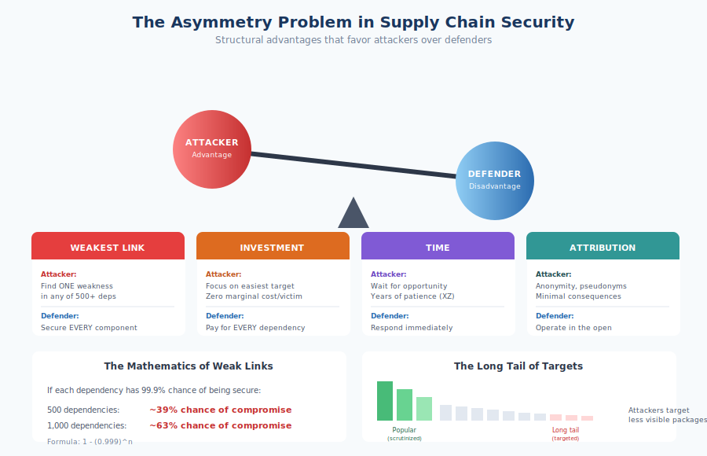

# 3.3 The Asymmetry Problem

Supply chain security is structurally difficult. This is not merely a matter of inadequate investment or immature tooling—though both are real—but a fundamental asymmetry between attackers and defenders. Attackers need to find one weakness in a vast attack surface; defenders must secure every component in an ever-growing dependency graph. Attackers can wait patiently for opportunities; defenders must maintain vigilance indefinitely. Attackers enjoy anonymity; defenders operate in the open. Understanding these asymmetries is essential for developing realistic security strategies that acknowledge what is achievable rather than pursuing the impossible goal of perfect security.

## The Weakest Link Dynamic

!!! danger "The Weakest Link Problem"

    If your application depends on 500 packages, an attacker need only compromise **one**. The 499 well-secured packages provide no protection. With 500 dependencies at 99.9% security each, you face a **39% probability** that at least one is compromised. With 1,000 dependencies: **63%**.

Traditional security thinking emphasizes **defense in depth**: layering multiple controls so that failure of any single control does not result in compromise. This approach assumes that attackers must penetrate multiple barriers, making attack progressively harder as defenses accumulate.

Supply chain security inverts this logic. Rather than requiring attackers to bypass multiple defenses in sequence, supply chain attacks exploit the **weakest link** in a parallel array of components. If your application depends on 500 packages, an attacker need only compromise one. The 499 well-secured packages provide no protection against the one that is vulnerable.

This weakest-link dynamic means that security is determined not by your strongest defenses but by your most vulnerable dependency. An organization that has invested heavily in application security, network security, and endpoint protection can be compromised through a single vulnerable package deep in their dependency tree—a package they may not even know they use.

Consider the mathematics. If each package has a 99.9% chance of being secure in any given year—an optimistic assumption—an application with 500 dependencies faces a probability of approximately 39% that at least one dependency will be compromised: 1 - (0.999)^500 = ~0.39. With 1,000 dependencies, common in JavaScript applications, the probability approaches 63%. Defense in depth cannot help when any single failure is sufficient for attack success.

## The Economics of Attack Versus Defense

!!! warning "Economics Favor Attackers"

    - **Investment asymmetry**: Defenders must secure every component; attackers can focus on the single most vulnerable
    - **Marginal cost**: Once compromised, cost to reach additional victims approaches zero
    - **Opportunity cost**: Security competes with other priorities; attackers have no such trade-offs
    - **Time investment**: Attackers can spend years developing access; defenders must respond immediately

Supply chain attacks offer attackers extraordinary leverage. A single successful compromise can provide access to thousands or millions of downstream systems. The SolarWinds attack (§7.2) reached 18,000 organizations through one compromised build system.[^solarwinds-victims] The ua-parser-js compromise reached millions of downloads within hours. This leverage makes supply chain attacks economically attractive compared to attacking targets individually.

[^solarwinds-victims]: SolarWinds, "SolarWinds SEC Filings and Investor Relations Updates," December 2020; U.S. Senate Select Committee on Intelligence, "SolarWinds Cyberattack Hearing," February 2021.

The economics favor attackers in several dimensions:

**Investment asymmetry**: Defenders must secure every component; attackers can focus resources on the single most vulnerable target. An organization might spend millions on security tools and personnel while remaining vulnerable to a package maintained by a single unpaid volunteer.

**Marginal cost**: Once an attacker compromises a supply chain component, the cost of reaching additional victims approaches zero. Each additional download, each additional dependent application, comes at no additional cost to the attacker. Defenders, by contrast, must expend resources to secure each additional dependency they adopt.

**Opportunity cost**: Security investment competes with other organizational priorities. Every dollar spent on dependency review is a dollar not spent on product development. Attackers face no such trade-offs—their entire focus is exploitation.

**Time investment**: Attackers can spend months or years developing access, as the XZ Utils attacker demonstrated. Defenders must respond immediately when compromises are discovered, often with inadequate preparation. The attacker chooses the timing; the defender must react.

This economic asymmetry explains why supply chain attacks have proliferated despite growing awareness. From an attacker's perspective, supply chains offer better return on investment than most alternative attack vectors.

## Scale Challenges

The sheer number of dependencies in modern applications creates a security challenge that manual processes cannot address.

As discussed in Chapter 1, modern applications routinely incorporate hundreds or thousands of open source components. [Synopsys's 2024 OSSRA report][ossra-2024] found an average of 526 open source components per codebase. JavaScript applications frequently exceed 1,000 dependencies. Each dependency represents a potential attack vector.

These dependencies are not static. Packages release new versions continuously—sometimes multiple times per day. Each update could potentially introduce vulnerabilities or malicious code. Dependabot, GitHub's automated dependency update tool, processes hundreds of millions of updates monthly across the projects it monitors. The volume of change exceeds any organization's capacity for manual review.

Transitive dependencies compound the challenge. Developers choose direct dependencies consciously, but transitive dependencies enter applications through the choices of other maintainers. You might carefully evaluate the packages you directly import, but you have no visibility into the evaluation—if any—applied to their dependencies. A compromised package three or four levels deep in your dependency tree is effectively invisible.

The scale challenge is asymmetric because attackers can use automation to scan the entire ecosystem for vulnerabilities while defenders must secure their specific subset of that ecosystem. Attackers benefit from the law of large numbers; defenders suffer from it.

## Time Asymmetry

!!! note "The Vulnerability Twilight Zone"

    The window between attacker discovery and public disclosure can extend for years:
    
    - **Heartbleed** existed 2+ years in 17% of secure web servers—exploitable with defenders unaware
    - **Log4Shell** remained undiscovered for 8+ years after introduction
    - **XZ Utils** backdoor was developed over 2+ years of patient contribution

Vulnerabilities can exist for years before discovery, giving attackers extended windows of opportunity while defenders remain unaware of their exposure.

The [Heartbleed vulnerability][heartbleed] (§5.5) existed for over two years before discovery, present in an estimated 17% of secure web servers worldwide—exploitable throughout with defenders unaware.[^heartbleed-prevalence]

[^heartbleed-prevalence]: Robert McMillan, "The Heartbleed Bug: How a Flaw in OpenSSL Caused a Security Crisis," The Guardian, April 15, 2014; Netcraft, "Half a million widely trusted websites vulnerable to Heartbleed bug," Netcraft Blog, April 2014.

The Log4Shell vulnerability (§5.1) remained undiscovered for over eight years after introduction. Attackers who independently discovered it during this window had nearly a decade to exploit it silently.

This time asymmetry creates a troubling dynamic: defenders can only protect against known vulnerabilities, but attackers may have discovered vulnerabilities that are not yet public. The window between attacker discovery and public disclosure—sometimes called the **vulnerability twilight zone**—can extend for years, during which defense is effectively impossible.

For supply chain attacks involving malicious code rather than unintentional vulnerabilities, the time asymmetry is even more pronounced. The XZ Utils backdoor was developed over more than two years of patient contribution. Had it reached stable Linux distributions, it might have persisted indefinitely until chance detection or active exploitation revealed it.

## Attribution Challenges

Identifying who conducted a supply chain attack is significantly harder than attributing other forms of cyber attack, reducing the deterrent effect that would otherwise constrain attackers.

Supply chain attacks often leave minimal forensic evidence. Malicious code delivered through legitimate channels—npm, PyPI, official update mechanisms—may be indistinguishable from legitimate software until its behavior is analyzed. Attackers can operate entirely through pseudonymous accounts, VPNs, and Tor, leaving no identifying information.

The XZ Utils attacker operated under the pseudonym "Jia Tan" for over two years. Despite the sophistication of the attack and the resources presumably devoted to investigation after discovery, public attribution remains uncertain. The attacker's true identity and affiliation—nation-state, criminal, or other—has not been definitively established.

Even when sophisticated analysis enables attribution, public disclosure involves trade-offs. Intelligence agencies may be reluctant to reveal attribution that would expose their sources and methods. Prosecutors may lack jurisdiction over overseas attackers. Victims may prefer silence over the reputational damage of public disclosure.

The attribution challenge means that supply chain attackers face minimal risk of consequences. Nation-states can operate through proxies that provide plausible deniability. Criminals can operate from jurisdictions that do not cooperate with international law enforcement. Even when attackers are identified, extradition and prosecution remain rare.

This impunity encourages further attacks. Traditional deterrence—the threat of punishment—requires reliable attribution and effective consequences. When attackers can operate anonymously with little fear of reprisal, deterrence fails, and the only remaining defense is prevention.

## The Long Tail of Targets

Not all packages receive equal security attention. Popular packages may benefit from broad scrutiny, active maintenance, and security investment. The vast **long tail** of less popular packages often has none of these benefits.

An attacker evaluating the supply chain ecosystem sees a distribution of targets. At one end are highly visible packages: React, TensorFlow, Spring Framework. These packages have large maintainer teams, corporate backing, security programs, and many observers who might detect malicious changes. At the other end are thousands of packages with minimal usage, single maintainers, and no security scrutiny.

Rational attackers target the long tail. Event-stream had approximately 2 million weekly downloads when compromised—significant usage, but not in the top tier that might attract security attention. The package had been transferred to a new maintainer without extensive vetting because it was important enough to need maintenance but not important enough to attract security resources.

The long tail is particularly attractive because these packages often serve as dependencies of more popular packages. Compromising a utility library used by a popular framework provides access to the framework's users without directly attacking the hardened target. The supply chain enables attackers to route around strong defenses by finding weaker upstream components.

This dynamic creates a paradox for defenders: the packages most likely to be attacked are precisely those with the least security investment. Resources flow to visible packages; attacks flow to invisible ones.

## Strategic Implications

!!! tip "Living with Asymmetry"

    The asymmetries are structural, not incidental. Effective strategy must:
    
    1. **Accept imperfect defense**: Focus on reducing risk to acceptable levels
    2. **Prioritize based on criticality**: Concentrate resources on highest-impact components
    3. **Limit blast radius**: Design for containment when prevention fails
    4. **Invest in detection**: If prevention can't be complete, detection becomes essential
    5. **Participate in collective defense**: Support ecosystem-wide security improvements

The asymmetries described here are structural, not incidental. They cannot be eliminated through better tools or larger budgets, though both help. Effective supply chain security strategy must acknowledge these constraints:

**Accept imperfect defense**: Perfect security is unachievable given the scale of dependencies and the attacker's advantages. Strategy should focus on reducing risk to acceptable levels, not eliminating it entirely.

**Prioritize based on criticality**: Since not all dependencies can receive equal attention, concentrate security resources on components with the greatest impact if compromised.

**Limit blast radius**: Assume compromises will occur and design systems that contain their impact. Least privilege, network segmentation, and monitoring for anomalous behavior limit damage when prevention fails.

**Invest in detection**: If prevention cannot be complete, detection becomes essential. Monitoring dependency behavior, auditing changes, and maintaining visibility into what is actually running enables faster response when compromises occur.

**Participate in collective defense**: Individual organizations cannot secure the supply chain alone. Supporting ecosystem-wide security improvements—contributing to projects, funding security work, sharing threat intelligence—benefits everyone including the contributor.

The asymmetry problem is daunting but not hopeless. Understanding the structural advantages attackers enjoy enables realistic strategy rather than false confidence in unachievable perfect security. The chapters that follow explore how to manage supply chain risk within these constraints.

[heartbleed]: https://heartbleed.com/
[ossra-2024]: https://www.synopsys.com/software-integrity/resources/analyst-reports/open-source-security-risk-analysis.html

