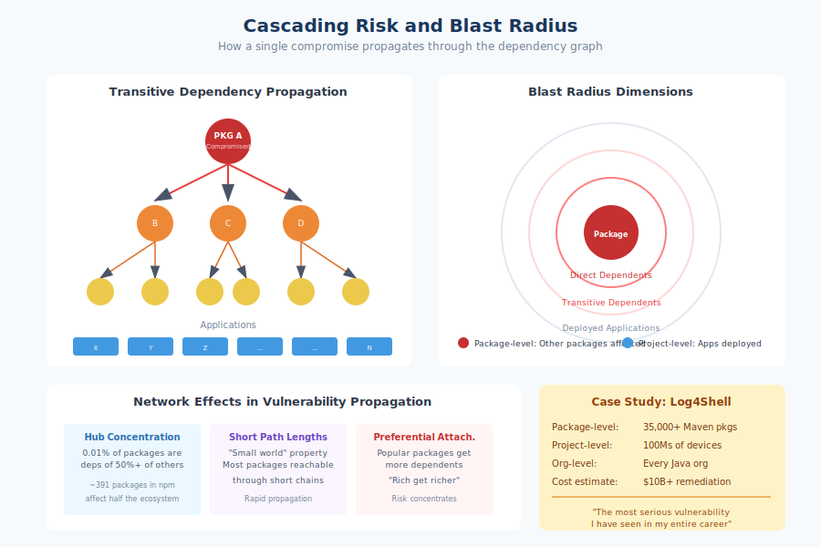

# 3.4 Cascading Risk and Blast Radius

The previous section examined why supply chain security is structurally difficult. This section explores what happens when those difficulties translate into actual compromise. Unlike attacks that target specific organizations, supply chain attacks propagate through dependency relationships, reaching victims the attacker may never have anticipated. A single compromised package can affect thousands of downstream projects, millions of deployed applications, and billions of end users. Understanding this cascade—and learning to measure and limit it—is essential for managing supply chain risk.

## The Mechanics of Propagation

When a package is compromised, the impact does not remain localized. Every package that depends on the compromised package becomes a potential vector for further propagation. This is the nature of **transitive dependencies**: your application depends on packages that themselves depend on other packages, creating chains of trust that extend far beyond your direct choices.

Consider a simplified example. Package A is compromised. Package B depends on A. Package C depends on B. Applications X, Y, and Z depend on C. The attacker compromised only A, but applications X, Y, and Z are all affected—three degrees removed from the initial compromise. None of the developers building X, Y, or Z may even be aware that A exists in their dependency tree.

In real ecosystems, these chains are not linear but branching. A popular utility package might be a direct or transitive dependency of thousands of other packages. Each of those packages might itself have thousands of dependents. The result is exponential propagation: a single compromise at a well-connected node reaches victims throughout the ecosystem.

The npm ecosystem illustrates this density of connections. According to research analyzing npm's dependency graph, the median package depends on approximately 80 other packages (including transitive dependencies), but the distribution has a very long tail. Popular packages like `lodash` or `debug` are dependencies of hundreds of thousands of other packages. Compromise of these central nodes would cascade instantly across a significant fraction of the entire ecosystem.

## Defining Blast Radius

!!! info "Understanding Blast Radius"

    Blast radius has multiple dimensions:
    
    - **Package-level**: How many other packages depend on it (ecosystem propagation)
    - **Project-level**: How many applications incorporate it (organizational exposure)
    - **User-level**: How many end users run affected systems (human impact)
    - **Organizational**: How many distinct organizations are exposed
    
    A package might have low package-level radius but high project-level radius within one organization.

**Blast radius** describes the scope of impact from a security incident. In supply chain contexts, blast radius has several dimensions:

**Package-level blast radius** measures how many other packages depend on a compromised package, directly or transitively. This indicates ecosystem-wide propagation potential.

**Project-level blast radius** measures how many applications and deployments incorporate the compromised package. This translates ecosystem impact into organizational exposure.

**User-level blast radius** estimates how many end users are affected by systems running compromised code. This captures the ultimate human impact of supply chain incidents.

**Organizational blast radius** counts how many distinct organizations are exposed. A package used by one company's many applications represents different risk than a package used across thousands of companies.

These dimensions do not map neatly to each other. A package might be a dependency of few other packages (low package-level blast radius) but installed in millions of deployments at a single organization (high project-level blast radius for that organization). Conversely, a package with many downstream packages might be deployed primarily in low-stakes development tools rather than production systems.

Effective risk assessment requires considering multiple blast radius dimensions. A vulnerability in a package with modest download counts but deployment in critical infrastructure poses different risks than a vulnerability in a highly downloaded package used mainly for development convenience.

## Network Effects in Vulnerability Propagation

!!! note "Network Effects Amplify Risk"

    - **Hub concentration**: Just 391 npm packages (0.01%) are dependencies of over half of all other packages
    - **Short path lengths**: "Small world" properties mean compromises propagate quickly
    - **Clustering**: Packages cluster by domain; compromise affects entire functional areas
    - **Preferential attachment**: New packages depend on popular packages, reinforcing concentration

Software ecosystems exhibit **network effects** that amplify vulnerability propagation. The value of participating in an ecosystem increases with ecosystem size—more packages mean more functionality available for reuse—but this same interconnection increases aggregate risk.

Several network properties shape how vulnerabilities spread:

**Hub concentration**: Package ecosystems are not uniform networks but follow power-law distributions. A small number of highly connected "hub" packages have vastly more dependents than typical packages. Compromising these hubs provides disproportionate reach. Research on npm found that just 391 packages (0.01% of the registry) are direct or transitive dependencies of over half of all other packages.[^npm-hubs]

**Short path lengths**: Despite containing millions of packages, ecosystems exhibit "small world" properties—most packages can be reached through short dependency chains from most other packages. This means compromises propagate quickly across seemingly distant parts of the ecosystem.

**Clustering**: Packages tend to cluster by domain (web development, machine learning, infrastructure). Compromise of a package central to a cluster affects that entire functional area. An attack on a popular testing framework might compromise development environments across an industry segment.

**Preferential attachment**: New packages tend to depend on already-popular packages, reinforcing hub concentration over time. This "rich get richer" dynamic means ecosystem risk concentration increases rather than decreases as ecosystems grow.

These network effects mean that supply chain risk cannot be understood by examining packages in isolation. The package's position in the ecosystem network matters as much as its intrinsic properties.

## Case Study: Log4Shell's Cascade

!!! example "Case Study: Log4Shell's Cascade"

    Log4j was a direct dependency of 7,800+ Maven packages and transitive dependency of 35,000+. The vulnerability affected products from Apple, Amazon, Google, Microsoft, IBM, Oracle, Cisco, VMware—essentially every major tech company. CISA Director Easterly called it "the most serious vulnerability I have seen in my decades-long career." Total remediation cost likely exceeded **$10 billion globally**.

The Log4Shell vulnerability (CVE-2021-44228), disclosed in December 2021, provides a detailed illustration of cascading supply chain impact.

Log4j is a logging library for Java applications. Logging is a universal requirement—virtually every application records events for debugging, monitoring, and auditing. Log4j became the dominant Java logging implementation, incorporated into countless applications either directly or through frameworks that used it internally.

The vulnerability itself was severe: an attacker who could control logged text (often possible through user input fields, HTTP headers, or other external data) could achieve remote code execution on the vulnerable system. But the vulnerability's impact derived primarily from Log4j's position in the dependency graph.

**Package-level propagation**: Log4j was a direct dependency of over 7,800 other Maven packages. When counting transitive dependencies—packages that depended on packages that depended on Log4j—the number reached into the tens of thousands. [Google's Open Source Insights team][google-oss-insights] estimated that over 35,000 packages had Log4j somewhere in their dependency tree.

**Project-level propagation**: The affected packages were themselves incorporated into applications throughout the Java ecosystem. Security researchers estimated that hundreds of millions of devices ran software containing vulnerable Log4j versions. The vulnerability affected products from Apple, Amazon, Google, Microsoft, IBM, Oracle, Cisco, VMware, and essentially every major technology company.

**Organizational propagation**: Virtually every organization with Java in their technology stack required remediation. Government agencies issued emergency directives. Critical infrastructure operators scrambled to identify affected systems. The vulnerability was so pervasive that CISA director Jen Easterly called it "the most serious vulnerability I have seen in my decades-long career."

The remediation challenge illustrated cascading risk in reverse. Organizations could update Log4j directly, but vulnerable versions persisted in third-party applications, vendor products, and embedded systems. Even organizations that patched immediately remained exposed through systems they did not control. The propagation that enabled the vulnerability also complicated its remediation.

Estimates of the total cost of Log4Shell remediation vary, but the direct response effort alone—identifying affected systems, applying patches, monitoring for exploitation—likely exceeded $10 billion globally. The incident demonstrated how a single vulnerability in a well-connected package could generate economic damage vastly exceeding any conceivable security investment in the package itself.

## The Interconnected Ecosystem

Modern software does not exist in isolation. Applications connect to services, services depend on platforms, platforms run on infrastructure—each layer incorporating its own supply chain. This vertical integration means supply chain compromises can cascade not just horizontally (through package dependencies) but vertically (through infrastructure dependencies).

**Shared infrastructure amplifies blast radius**: Many packages are built using the same CI/CD platforms, distributed through the same registries, and hosted on the same source code platforms. A compromise at the infrastructure layer—GitHub, npm, cloud build services—can affect packages that have no direct dependency relationship.

**Cross-ecosystem propagation occurs**: Packages in one language ecosystem often wrap or call code from another. Python packages incorporate C libraries. JavaScript packages invoke system utilities. A vulnerability in a C library can propagate into applications written in any language that uses bindings to that library.

**Operational dependencies extend exposure**: Beyond code dependencies, applications depend on operational services: DNS, certificate authorities, content delivery networks. The Polyfill.io incident demonstrated how JavaScript served from a CDN could become a supply chain vector affecting over 100,000 websites—no package manager involved.

These interconnections mean that blast radius calculations must consider not just direct package dependencies but the broader ecosystem of infrastructure and services that software relies upon.

## Implications for Risk Management

Understanding cascading risk shapes how organizations should approach supply chain security.

**Prioritize high-connectivity dependencies**: Packages with many downstream dependents represent higher aggregate risk if compromised. These central packages—often infrastructure utilities, logging libraries, or serialization tools—warrant more security investment than peripheral packages with limited downstream impact.

**Map your actual blast radius**: Generic statistics about ecosystem-wide propagation matter less than your organization's specific exposure. Understanding which critical systems depend on which packages enables targeted risk management. Software composition analysis tools can map dependency graphs and identify exposure to specific vulnerabilities.

**Design for containment**: Accept that compromises will occur and design systems that limit propagation. Network segmentation prevents compromised applications from reaching other systems. Least privilege limits what compromised code can access. Monitoring detects anomalous behavior that indicates propagation in progress.

**Consider systemic risk**: Individual organizations face risk from their own dependencies, but the ecosystem faces systemic risk from concentrated dependence on critical packages. The Log4j incident demonstrated that vulnerabilities in sufficiently central packages become everyone's problem regardless of individual preparedness.

Book 2 explores risk measurement and management in detail, building on the concept of blast radius to develop practical approaches for prioritizing security investment. The cascading nature of supply chain risk means that organizational risk management cannot succeed in isolation—it requires attention to ecosystem health and collective investment in shared infrastructure.

[google-oss-insights]: https://security.googleblog.com/2021/12/understanding-impact-of-apache-log4j.html
[^npm-hubs]: Markus Zimmermann et al., "Small World with High Risks: A Study of Security Threats in the npm Ecosystem," USENIX Security 2019. <https://www.usenix.org/conference/usenixsecurity19/presentation/zimmerman>

