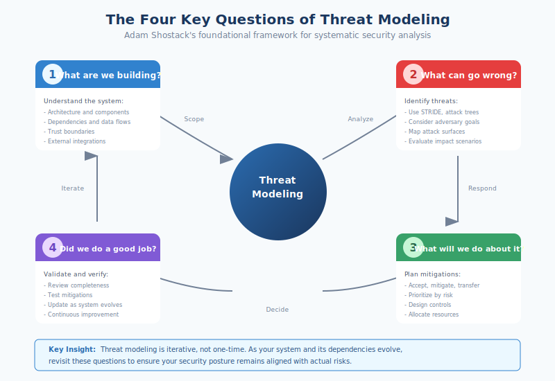
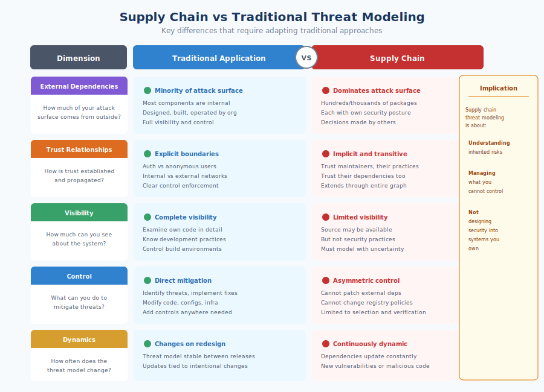
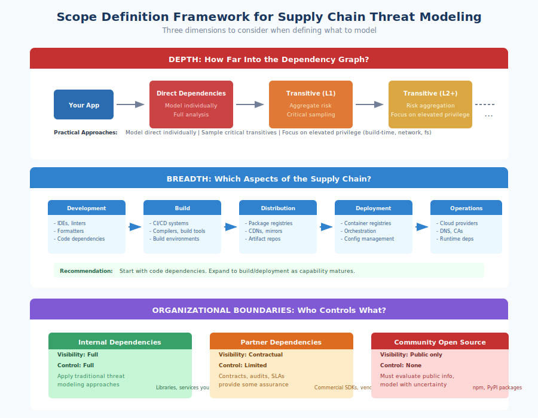
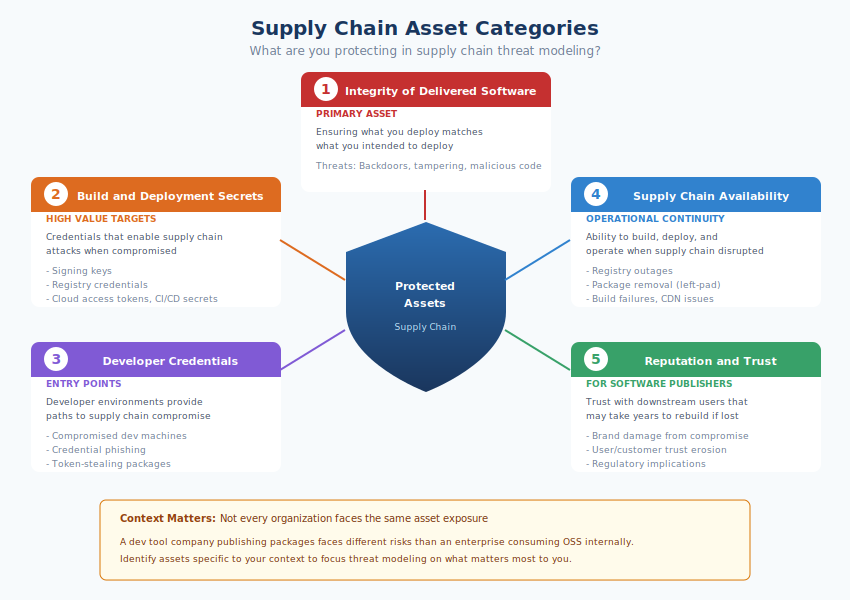
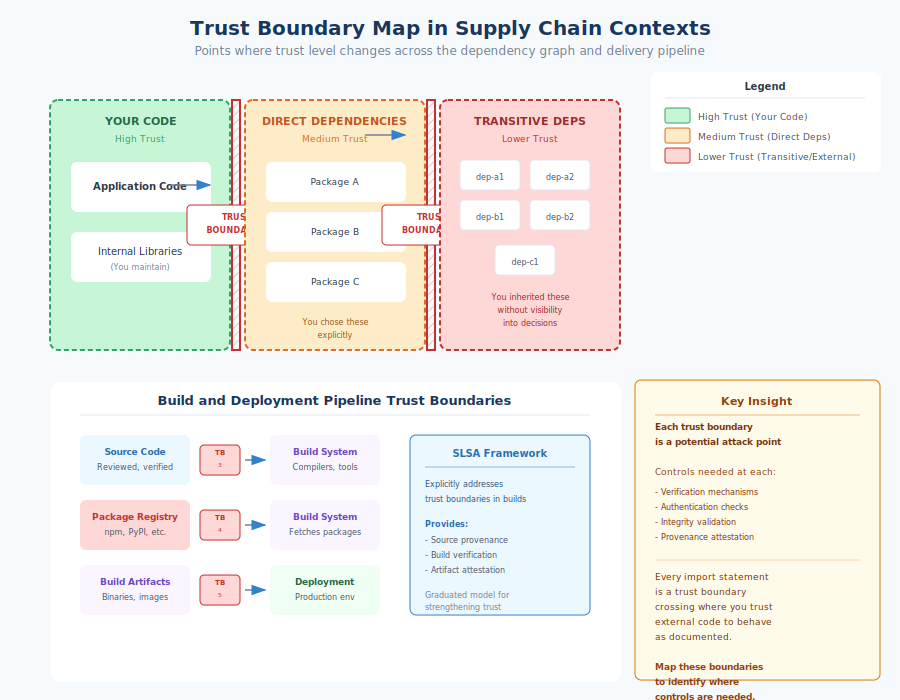
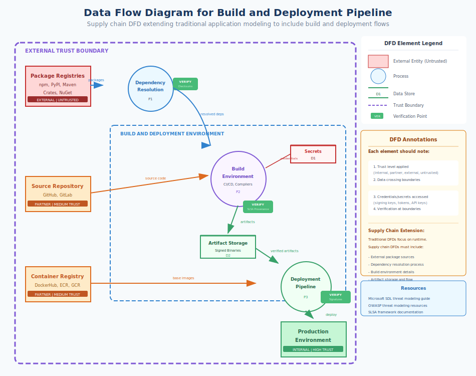
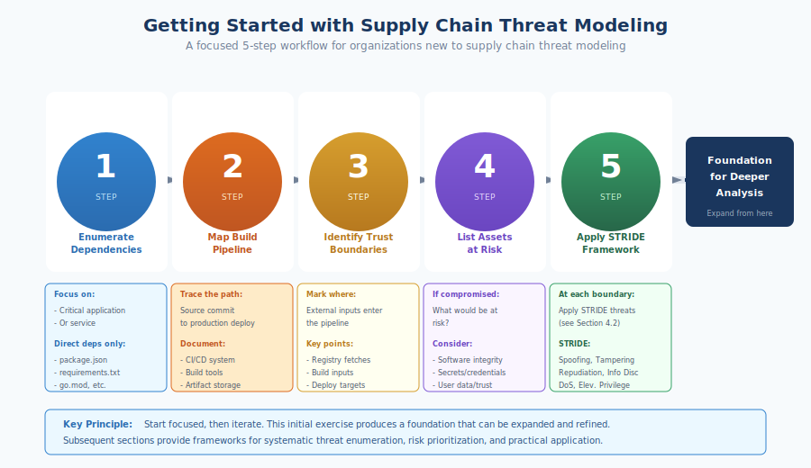

# 4.1 Supply Chain Threat Modeling Fundamentals

The threat landscape described in Chapter 3 presents a daunting array of adversaries, attack surfaces, and cascading risks. Faced with this complexity, organizations need a systematic approach to identify which threats matter most to their specific context and where to focus limited security resources. **Threat modeling** provides this approach—a structured method for analyzing systems, identifying potential threats, and prioritizing mitigations. However, traditional threat modeling techniques were developed for applications and systems under the organization's direct control. Adapting these techniques for software supply chains requires rethinking fundamental assumptions about scope, trust, and control.

#### What Is Threat Modeling?

Threat modeling is the practice of systematically identifying and evaluating potential security threats to a system. As Adam Shostack defines it in *[Threat Modeling: Designing for Security][shostack-book]* (2014), threat modeling answers four key questions:

1. What are we building (or using)?
2. What can go wrong?
3. What are we going to do about it?
4. Did we do a good enough job?

The goal is not to enumerate every conceivable attack but to develop a shared understanding of risks that informs security decisions. Effective threat modeling helps teams prioritize security investment, design systems that are resilient to likely attacks, and identify gaps in existing defenses.

Traditional threat modeling approaches—including Microsoft's STRIDE, PASTA (Process for Attack Simulation and Threat Analysis, developed by VerSprite), and OWASP's various methodologies—typically focus on applications or systems that the modeling team designs and controls. These approaches assume you can enumerate components, understand data flows, identify trust boundaries, and implement controls at any point where threats are identified.

Supply chain threat modeling shares these goals but faces different constraints. Much of what you need to model lies outside your organization. The components you depend on were designed by others, built by others, and are maintained by others. Your visibility into their security properties is limited, and your ability to implement controls within them is essentially nonexistent. This fundamental difference in control requires adapting traditional approaches rather than applying them directly.

#### Why Supply Chains Differ from Traditional Applications

Several characteristics distinguish supply chain threat modeling from traditional application threat modeling:

**External dependencies dominate the attack surface.** In traditional threat modeling, most components are internal—designed, built, and operated by the organization. Supply chain threat modeling must account for hundreds or thousands of external components, each with its own security posture, development practices, and potential vulnerabilities. The threats you face depend largely on decisions made by people outside your organization.

**Trust relationships are implicit and transitive.** Traditional applications have explicit trust boundaries: authenticated users versus anonymous users, internal networks versus external networks. Supply chain trust is more diffuse. When you depend on a package, you implicitly trust its maintainers, their development practices, their dependencies, and the infrastructure through which the package reaches you. This transitive trust extends through the entire dependency graph.

**Visibility is limited.** You can examine your own code in detail, but external dependencies are often opaque. You may have access to source code, but you typically lack visibility into maintainers' security practices, build environments, or the vetting applied to contributions. Threat modeling must account for this uncertainty rather than assuming complete knowledge.

**Control is asymmetric.** Traditional threat modeling identifies threats and then implements mitigations. Supply chain threats often cannot be mitigated directly—you cannot patch a vulnerability in a dependency you don't maintain, change a registry's authentication policies, or improve a maintainer's security practices. Your controls are limited to choices about what to depend on, how to verify what you receive, and how to limit the impact of compromise.

**The system is dynamic.** Dependencies update continuously. New versions introduce new functionality—and potentially new vulnerabilities or malicious code. Threat models for traditional applications change when the application is redesigned; supply chain threat models change every time a dependency updates.

These differences mean that supply chain threat modeling is less about designing security into systems you control and more about understanding and managing risks in systems you inherit.

#### Defining Scope: Where Does Your Supply Chain Begin and End?

One of the most challenging aspects of supply chain threat modeling is defining scope. Unlike an application with clear boundaries, a supply chain extends outward through dependencies, infrastructure, and trust relationships without obvious limits.

**Depth decisions** determine how far into the dependency graph you model. Your application has direct dependencies, and those have their own dependencies (transitive), which have further dependencies. Modeling every transitive dependency—potentially thousands of packages—is impractical. Yet ignoring transitive dependencies misses real risks; the Log4j vulnerability affected applications that had no direct relationship with Log4j.

Practical approaches to depth include:

- **Model direct dependencies individually** and treat transitive dependencies as aggregate risk
- **Extend analysis to critical transitive dependencies** identified through dependency analysis or known criticality
- **Sample transitive dependencies** to understand risk characteristics without exhaustive enumeration
- **Focus on dependencies with elevated privilege** (build-time execution, network access, filesystem access)

**Breadth decisions** determine which aspects of the supply chain to include. Beyond code dependencies, supply chains encompass:

- Development tools (IDEs, linters, formatters)
- Build infrastructure (CI/CD systems, compilers, build tools)
- Distribution infrastructure (registries, CDNs, mirrors)
- Deployment infrastructure (container registries, artifact repositories)
- Operational dependencies (cloud providers, DNS, certificate authorities)

Attempting to model everything produces analysis paralysis. We recommend starting with the code dependency graph—the packages your application imports—and expanding to build and deployment infrastructure as capability matures. Chapter 3's attack surface analysis provides a framework for deciding which infrastructure elements warrant inclusion.

**Organizational boundaries** affect what you can model effectively. For dependencies maintained within your organization, you have visibility and control approaching traditional application threat modeling. For dependencies from trusted partners, you may have some visibility through contracts or audits. For community-maintained open source, you typically have only public information. Your threat model should distinguish these categories, applying different assumptions and techniques to each.

#### Asset Identification: What Are You Protecting?

Threat modeling begins with understanding what you're protecting. In supply chain contexts, assets extend beyond the traditional focus on data and functionality.

**Integrity of delivered software** is the primary asset. Supply chain attacks ultimately aim to modify what runs in production—inserting backdoors, stealing credentials, deploying ransomware, or achieving other malicious objectives. Protecting integrity means ensuring that what you deploy matches what you intended to deploy.

**Build and deployment secrets** enable supply chain attacks when compromised. Signing keys, registry credentials, cloud access tokens, and CI/CD secrets provide attackers with the ability to publish malicious code under legitimate identities. These secrets are high-value targets specifically because they enable supply chain compromise.

**Developer credentials and environments** provide entry points for supply chain attacks. Compromised developer machines can be used to inject malicious code, steal credentials, or pivot to build infrastructure. Developer-targeted attacks (credential phishing, malicious packages that steal tokens) specifically target this asset category.

**Availability of the supply chain** matters for operational continuity. If package registries become unavailable, builds fail. If dependencies are removed (as in the left-pad incident), applications break. Modeling availability threats helps organizations build resilience through caching, mirroring, and fallback mechanisms.

**Reputation and trust** can be assets for organizations that publish software others depend on. A supply chain compromise affecting your users damages trust that may take years to rebuild.

Identifying assets specific to your context helps focus threat modeling on what matters. Not every organization faces the same asset risks; a development tool company publishing widely-used packages faces different asset exposure than an enterprise consuming open source for internal applications.

#### Trust Boundary Analysis in Dependency Graphs

**Trust boundaries** are points in a system where the level of trust changes—where data or control crosses from a more trusted context to a less trusted one (or vice versa). Traditional threat modeling identifies trust boundaries as places requiring security controls: authentication, authorization, input validation, and similar mechanisms.

In supply chain contexts, trust boundaries occur throughout the dependency graph:

**Between your code and direct dependencies**: When your application calls a dependency, you trust that dependency to behave as documented and not perform malicious actions. This boundary exists at every import statement.

**Between dependencies and their dependencies**: Your direct dependencies made their own trust decisions about their dependencies. You inherit those decisions without necessarily having visibility into them.

**Between package registries and your build system**: When you fetch packages from npm, PyPI, or Maven Central, you trust the registry to deliver what maintainers published—that the registry has not been compromised and that it has correctly authenticated publishers.

**Between source code and build artifacts**: The transformation from source to binary involves trust in compilers, build tools, and build environments. Source code you have reviewed may produce binaries you have not if the build process is compromised.

**Between build systems and deployment targets**: Artifacts produced by CI/CD systems are deployed to production. This boundary requires trust that build systems have not been compromised and that artifacts in transit have not been modified.

Mapping these trust boundaries helps identify where controls are needed. Each boundary crossing is a potential attack point; each boundary should have appropriate verification. The SLSA framework explicitly addresses trust boundaries in build systems, providing a graduated model for strengthening trust at the source-to-artifact boundary.

#### Data Flow Diagrams for Build and Deployment Pipelines

**Data Flow Diagrams (DFDs)** are a standard threat modeling technique that visualizes how data moves through a system. For supply chains, DFDs should capture not just runtime data flows but the flows through build and deployment pipelines.

A supply chain DFD includes elements not found in traditional application DFDs:

**External package sources** represent registries, repositories, and other sources of dependencies. These are external entities outside your trust boundary that supply inputs to your build process.

**Dependency resolution** is a process that transforms dependency specifications (package.json, requirements.txt) into concrete packages. This process involves network requests to external sources, resolution algorithms that select versions, and caching that may serve previously-fetched content.

**Build environments** are execution contexts where source code is transformed into artifacts. These environments have access to source code, secrets, and network resources. They receive inputs from dependency resolution and produce outputs for deployment.

**Artifact storage** holds build outputs pending deployment. This may include container registries, artifact repositories, or cloud storage. Artifacts in storage may be signed, scanned, or otherwise verified before deployment proceeds.

**Deployment pipelines** move artifacts from storage to production environments. These pipelines make decisions about what to deploy, have access to production credentials, and determine what actually runs.

Each element in the DFD should be annotated with:

- What trust level applies (internal, partner, external, untrusted)
- What data crosses the element's boundaries
- What credentials or secrets the element has access to
- What verification occurs at boundary crossings

Microsoft's SDL threat modeling guidance and OWASP's threat modeling resources provide detailed instruction on creating and analyzing DFDs. The adaptation for supply chains involves extending these techniques to model the build and deployment flows that are typically out of scope for application-focused threat modeling.

#### Getting Started

For organizations new to supply chain threat modeling, we recommend beginning with a focused scope:

1. **Enumerate direct dependencies** for a critical application or service
2. **Map the build pipeline** from source commit to production deployment
3. **Identify trust boundaries** at each point where external inputs enter the pipeline
4. **List assets** that would be at risk if any component were compromised
5. **Apply STRIDE or similar framework** to each trust boundary (covered in Section 4.2)

This initial exercise produces a foundation that can be expanded and refined. Subsequent sections in this chapter provide frameworks for systematic threat enumeration, risk prioritization, and practical application of threat modeling to dependency selection and pipeline security.

[shostack-book]: https://shostack.org/books/threat-modeling-book

