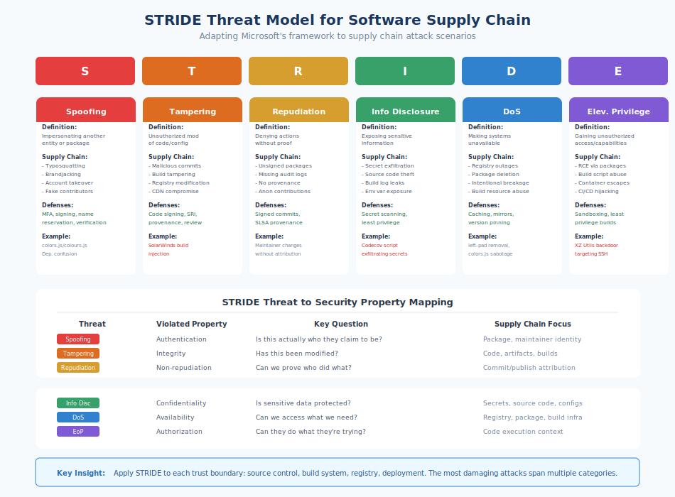

# 4.2 Threat Modeling Methodologies Applied

Threat modeling methodologies provide structured approaches for identifying what can go wrong. They transform the open-ended question "what threats exist?" into systematic analysis that teams can execute consistently. However, these methodologies were developed primarily for applications and systems under organizational control. Applying them to supply chains requires understanding both the methodology's core approach and how supply chain contexts change what you're looking for. This section demonstrates how established methodologies—STRIDE, PASTA, attack trees, and LINDDUN—can be adapted for supply chain threat modeling.

!!! note "Methodologies Are Thinking Tools"

    Methodologies are not compliance checklists. Their value lies in helping you ask the right questions and consider threats you might otherwise overlook. Mechanically completing a STRIDE table without genuine analysis produces documentation, not security insight. The goal is structured thinking, not form completion.

## STRIDE for Supply Chains

!!! info inline end "STRIDE Categories"

    **S**poofing · **T**ampering · **R**epudiation · **I**nformation Disclosure · **D**enial of Service · **E**levation of Privilege

**STRIDE** is Microsoft's threat categorization framework, developed as part of the Security Development Lifecycle (SDL). The acronym identifies six threat categories: Spoofing, Tampering, Repudiation, Information Disclosure, Denial of Service, and Elevation of Privilege. For each element in a system diagram, analysts consider which STRIDE categories apply and what specific threats exist.

Applying STRIDE to supply chains means considering these categories not just for your application but for the entire path from source code to production deployment.

**Spoofing** occurs when an attacker pretends to be something or someone they are not. In supply chain contexts, spoofing threats include:

- **Package impersonation**: An attacker creates a package with a name designed to be confused with a legitimate package (typosquatting). The `crossenv` package on npm impersonated the popular `cross-env`, capturing credentials from developers who mistyped the package name.

- **Maintainer impersonation**: An attacker gains access to a legitimate maintainer's account and publishes malicious versions under that identity. The ua-parser-js compromise succeeded because attackers published from the real maintainer's account.

- **Registry impersonation**: An attacker creates a fake registry or intercepts traffic to the real registry, serving malicious packages. Dependency confusion attacks exploit internal package names by publishing spoofed packages to public registries that misconfigured clients prefer.

- **Build system spoofing**: An attacker impersonates legitimate CI/CD infrastructure, perhaps through compromised credentials, to inject malicious builds into the pipeline.

Mitigations for spoofing include multi-factor authentication for maintainer accounts, package signing that binds packages to verified identities, namespace policies that prevent confusingly similar names, and registry pinning that prevents clients from accidentally contacting wrong registries.

**Tampering** involves unauthorized modification of data or code. Supply chain tampering threats include:

- **Source code tampering**: An attacker modifies code in a repository, either through compromised credentials or malicious pull requests. The XZ Utils backdoor entered through seemingly legitimate commits from an attacker who had gained maintainer trust.

- **Build-time tampering**: An attacker modifies code during the build process without changing source repositories. The SolarWinds attack (§7.2) injected malicious code during compilation, leaving source code clean.

- **Package tampering**: An attacker modifies a package after it is built but before it reaches consumers. This could occur through registry compromise, man-in-the-middle attacks, or compromised mirrors.

- **Artifact tampering**: An attacker modifies container images, binaries, or other artifacts in storage or transit before deployment.

Mitigations include cryptographic signing at each stage (source commits, build outputs, package publications), integrity verification at consumption points, reproducible builds that enable independent verification, and transparency logs that make tampering detectable.

**Repudiation** threats involve actors denying they performed an action. In supply chains:

- **Maintainer repudiation**: A maintainer claims they did not publish a particular version, making incident investigation difficult. Without audit logs and signing, attributing package publications can be challenging.

- **Build repudiation**: Without build provenance, it's difficult to determine who or what produced a particular artifact, when, from what source, using what process.

- **Contributor repudiation**: Contributors to a project may deny having submitted particular code, especially if commits are unsigned or if they claim account compromise.

Mitigations include signed commits and releases, build provenance attestations (as specified by SLSA), comprehensive audit logging, and transparency logs that create immutable records of publications.

**Information Disclosure** involves unauthorized access to information. Supply chain information disclosure threats include:

- **Secret leakage in repositories**: Developers accidentally commit API keys, credentials, or other secrets to source code repositories. The TruffleHog and GitLeaks tools exist specifically because this threat is so common.

- **Secret exposure in builds**: CI/CD systems often have access to secrets for deployment and publication. Attacks like Codecov specifically targeted secret exfiltration from build environments.

- **Dependency metadata leakage**: Information about what dependencies an organization uses can inform targeted attacks. Knowing that a target runs a particular vulnerable package version guides attacker prioritization.

- **Source code exposure**: Private code inadvertently exposed through misconfigured repositories, leaked backups, or insider threats.

Mitigations include secret scanning in CI/CD pipelines, secret management systems that avoid storing credentials in code, minimal permissions for build environments, and dependency information hygiene.

**Denial of Service** involves making resources unavailable. Supply chain DoS threats include:

- **Registry availability attacks**: DDoS attacks against package registries prevent developers from installing dependencies, breaking builds globally. The npm outage scenarios that have occurred demonstrate how registry availability affects the entire ecosystem.

- **Dependency removal**: A maintainer removing packages (as in left-pad) or an attacker convincing a registry to remove packages can break dependent applications.

- **Build resource exhaustion**: Malicious packages can consume excessive build resources—CPU, memory, network—degrading or preventing legitimate builds.

- **Update storms**: Coordinated publication of many package updates could overwhelm organization's update review processes or automated systems.

Mitigations include caching and mirroring dependencies locally, lockfiles that ensure builds can succeed with cached packages, resource limits in build environments, and rate limiting for automated update processing.

**Elevation of Privilege** involves gaining capabilities beyond what was intended. Supply chain EoP threats include:

!!! danger "Build-Time Code Execution"

    Many package managers execute installation scripts with the installing user's privileges. Malicious packages can exploit this for privilege escalation, as demonstrated by numerous npm and PyPI malware samples.

- **Build-time code execution**: Many package managers execute installation scripts with the installing user's privileges.

- **CI/CD privilege abuse**: Packages or build scripts that access secrets or capabilities beyond what they need for their stated purpose.

- **Transitive privilege escalation**: A deeply nested dependency gains access to privileges (secrets, network, filesystem) that its position in the graph would not seem to warrant.

- **Container escape through dependencies**: Vulnerabilities in dependencies running in containers that enable escaping container isolation.

Mitigations include minimal privilege for build and runtime environments, sandboxing package installation, capability-based permission systems (where available), and dependency review focusing on privilege requirements.

## PASTA for Supply Chain Dependencies

**[PASTA][pasta-book]** (Process for Attack Simulation and Threat Analysis), developed by Tony UcedaVélez and Marco Morana (2015), is a risk-centric threat modeling methodology that proceeds through seven stages: defining objectives, defining technical scope, application decomposition, threat analysis, vulnerability analysis, attack modeling, and risk and impact analysis. Unlike STRIDE's focus on threat categories, PASTA emphasizes understanding attacker motivations and simulating realistic attack scenarios.

PASTA's structured approach is particularly valuable for supply chain analysis because it explicitly incorporates business context and attacker perspective.

**Stage 1: Define Objectives** begins with business requirements and security goals. For supply chain threat modeling, objectives might include maintaining software integrity, protecting customer data, ensuring build availability, or meeting regulatory requirements. These objectives shape which supply chain threats matter most.

**Stage 2: Define Technical Scope** identifies what systems and components are included. For supply chains, this includes dependency graphs, build infrastructure, distribution channels, and deployment pipelines—the scope considerations discussed in Section 4.1.

**Stage 3: Application Decomposition** breaks down the system into components and data flows. For supply chains, this produces dependency trees, build pipeline diagrams, and data flow maps showing how code moves from source to production.

**Stage 4: Threat Analysis** examines threat intelligence relevant to the scoped components. For supply chains, this means reviewing known attacks against similar package ecosystems, understanding which threat actors target your industry, and identifying components that have been historically vulnerable.

**Stage 5: Vulnerability Analysis** identifies weaknesses in the decomposed system. For dependencies, this includes known CVEs, but also structural vulnerabilities: unmaintained packages, dependencies with poor security practices, single-maintainer projects vulnerable to account compromise.

**Stage 6: Attack Modeling** simulates how attackers might exploit identified vulnerabilities to achieve malicious objectives. This is where attack trees (discussed below) become useful, constructing realistic attack paths through the supply chain.

**Stage 7: Risk and Impact Analysis** evaluates the business impact of successful attacks and prioritizes mitigations accordingly. A vulnerability in a test utility differs in impact from the same vulnerability in a package that processes user input in production.

PASTA's explicit focus on business objectives and attacker simulation makes it well-suited for organizations that need to justify security investment to non-technical stakeholders. The methodology produces risk-prioritized findings that connect technical threats to business impact.

## Attack Trees for Supply Chain Scenarios

**Attack trees** model threats as hierarchical structures where the root node represents an attacker's goal and child nodes represent ways to achieve that goal. Each node can be decomposed further until reaching atomic attack steps. Attack trees provide visual, analyzable representations of threat scenarios that can be quantitatively evaluated.

Consider an attack tree for the goal "Compromise Production Application Through Supply Chain":

```
Goal: Execute malicious code in production
├── Compromise a direct dependency
│   ├── Compromise maintainer account
│   │   ├── Credential phishing
│   │   ├── Password reuse from breached sites
│   │   └── Session hijacking
│   ├── Social engineering for maintainer access
│   │   ├── Long-term trust building (XZ Utils pattern)
│   │   └── Pressure campaign on overwhelmed maintainer
│   └── Exploit registry vulnerability
│       ├── Package metadata manipulation
│       └── Direct package content modification
├── Compromise a transitive dependency
│   └── [Same sub-tree as direct dependency, but targeting less visible packages]
├── Compromise build infrastructure
│   ├── Compromise CI/CD credentials
│   │   ├── Secret leakage in logs
│   │   ├── Credential theft from developer machines
│   │   └── Third-party integration compromise (Codecov pattern)
│   ├── Malicious modification of build scripts
│   └── Compromise build environment images
├── Compromise distribution infrastructure
│   ├── Registry/CDN compromise
│   ├── DNS hijacking
│   └── Man-in-the-middle attacks
└── Compromise deployment pipeline
    ├── Container registry compromise
    └── Deployment automation credential theft
```

Each node can be annotated with:

- **Likelihood**: How probable is this attack step?
- **Cost to attacker**: What resources does this step require?
- **Detection probability**: How likely is this step to be detected?
- **Mitigations in place**: What controls currently address this node?

Attack trees help identify which attack paths are most feasible and where mitigations would be most effective. If multiple attack paths converge through a single node (like "CI/CD credential compromise"), securing that node provides high-leverage protection. If attack paths have many independent routes to the goal, defense in depth across multiple nodes becomes necessary.

Tools like OWASP Threat Dragon, Microsoft Threat Modeling Tool, and specialized attack tree software support creating and analyzing attack trees systematically.

## LINDDUN for Privacy in Supply Chains

**[LINDDUN][linddun]** is a privacy-focused threat modeling framework developed by researchers at KU Leuven that complements security-focused approaches like STRIDE. The acronym covers Linkability, Identifiability, Non-repudiation, Detectability, Disclosure of information, Unawareness, and Non-compliance. While privacy might seem tangential to supply chain security, several LINDDUN categories are directly relevant.

**Disclosure of Information** overlaps with STRIDE's Information Disclosure but emphasizes personal data. Supply chain contexts where this matters include:

- Telemetry collected by development tools or packages
- User data accessible to dependencies at runtime
- Developer information exposed through commits and package metadata

**Unawareness** concerns users not knowing how their data is processed. Developers may be unaware that dependencies collect telemetry, phone home to external services, or include analytics. The controversy over various packages including undisclosed analytics code reflects this concern.

**Non-compliance** with privacy regulations affects supply chains when dependencies process personal data in ways that violate GDPR, CCPA, or other requirements. Organizations are responsible for their dependencies' data handling practices.

For organizations handling sensitive data, LINDDUN analysis of dependencies that process user information provides important complement to security-focused threat modeling.

## MITRE ATT&CK for Supply Chain Threats

The **[MITRE ATT&CK framework][attack]** provides a comprehensive knowledge base of adversary tactics and techniques based on real-world observations. While ATT&CK was originally focused on enterprise intrusion and endpoint threats, its scope has expanded to include supply chain attack techniques that are directly relevant to threat modeling.

ATT&CK organizes adversary behavior into **tactics** (the adversary's goals) and **techniques** (how they achieve those goals). For supply chain threat modeling, several tactics and techniques are particularly relevant:

**Initial Access (TA0001)** includes supply chain-specific techniques:

| Technique ID | Technique Name | Supply Chain Relevance |
|--------------|----------------|------------------------|
| T1195 | Supply Chain Compromise | Parent technique for all supply chain attacks |
| T1195.001 | Compromise Software Dependencies and Development Tools | Malicious packages, compromised build tools |
| T1195.002 | Compromise Software Supply Chain | Modification of source code, binaries, or updates |
| T1195.003 | Compromise Hardware Supply Chain | Hardware implants, firmware modifications |
| T1199 | Trusted Relationship | Exploiting vendor access, third-party integrations |

**Persistence (TA0003)** techniques relevant to supply chains:

| Technique ID | Technique Name | Supply Chain Relevance |
|--------------|----------------|------------------------|
| T1574.001 | DLL Search Order Hijacking | Malicious dependencies loaded via search order |
| T1574.002 | DLL Side-Loading | Legitimate applications loading malicious libraries |

**Defense Evasion (TA0005)** techniques seen in supply chain attacks:

| Technique ID | Technique Name | Supply Chain Relevance |
|--------------|----------------|------------------------|
| T1036 | Masquerading | Typosquatting, impersonating legitimate packages |
| T1027 | Obfuscated Files or Information | Hiding malicious code within packages |
| T1553.002 | Code Signing | Abusing stolen or fraudulently obtained signing keys |

**Collection (TA0009)** and **Exfiltration (TA0010)** techniques used in supply chain attacks:

| Technique ID | Technique Name | Supply Chain Relevance |
|--------------|----------------|------------------------|
| T1119 | Automated Collection | Malicious packages harvesting credentials/tokens |
| T1041 | Exfiltration Over C2 Channel | Stolen data sent to attacker infrastructure |

**Mapping your threat model to ATT&CK** provides several benefits:

1. **Common vocabulary**: ATT&CK technique IDs provide unambiguous references that security teams, threat intelligence, and detection engineering can use consistently.

2. **Detection guidance**: Each ATT&CK technique includes detection recommendations that can inform monitoring strategy. If your threat model identifies T1195.001 (Compromise Software Dependencies), ATT&CK's detection guidance helps design appropriate monitoring.

3. **Threat intelligence correlation**: Threat reports increasingly reference ATT&CK techniques. Mapping your threat model enables connecting your specific risks to broader threat intelligence about adversary groups using those techniques.

4. **Coverage analysis**: ATT&CK Navigator allows visualizing which techniques your defenses address. Threat models mapped to ATT&CK can be compared against defensive coverage to identify gaps.

5. **Prioritization support**: ATT&CK data includes information about which techniques are commonly used, helping prioritize threats that are more likely to be encountered.

**Practical application**: When applying STRIDE or constructing attack trees, annotate identified threats with corresponding ATT&CK technique IDs. For example:

- A STRIDE "Spoofing" threat involving typosquatting maps to T1036 (Masquerading)
- A "Tampering" threat involving build script modification maps to T1195.002 (Compromise Software Supply Chain)
- An attack tree node for "credential theft from CI/CD" maps to T1552.001 (Credentials In Files) or T1528 (Steal Application Access Token)

This mapping creates bridges between threat modeling and detection engineering, enabling security teams to translate threat analysis into concrete monitoring and response capabilities.

[attack]: https://attack.mitre.org/

## Selecting and Combining Methodologies

No single methodology covers all supply chain threat modeling needs. Selection depends on context:

**Use STRIDE** when you need comprehensive threat enumeration across a system. STRIDE's categories provide broad coverage and are well-understood by security practitioners. Apply STRIDE to each component in your supply chain diagram—dependencies, build systems, registries, deployment pipelines—to generate a thorough threat inventory.

**Use PASTA** when you need to connect threats to business objectives and communicate with non-technical stakeholders. PASTA's structured progression from business context through attack simulation produces findings that translate to business risk language.

**Use attack trees** when you need to analyze specific, high-concern scenarios in depth. Attack trees excel at modeling targeted attack paths and identifying critical nodes where mitigations would be most effective.

**Use LINDDUN** when privacy implications of dependencies are a concern, particularly for organizations subject to privacy regulations or handling sensitive data.

**Hybrid approaches** combine methodologies for comprehensive coverage. A practical hybrid might:

1. Use STRIDE for initial threat enumeration across the supply chain
2. Prioritize identified threats using PASTA's business-impact analysis
3. Develop attack trees for the highest-priority threat scenarios
4. Apply LINDDUN to dependencies that handle personal data

The specific combination matters less than applying structured thinking consistently. Organizations should select methodologies their teams can execute effectively and adapt them to supply chain contexts rather than treating methodology compliance as the goal.

Whatever methodology you select, remember that the output is a living analysis, not a compliance artifact. Supply chains change continuously as dependencies update and new threats emerge. Threat models require regular review and revision to remain relevant—a topic we address in Section 4.5.

[pasta-book]: https://www.wiley.com/en-us/Risk+Centric+Threat+Modeling:+Process+for+Attack+Simulation+and+Threat+Analysis-p-9780470500965
[linddun]: https://linddun.org/

