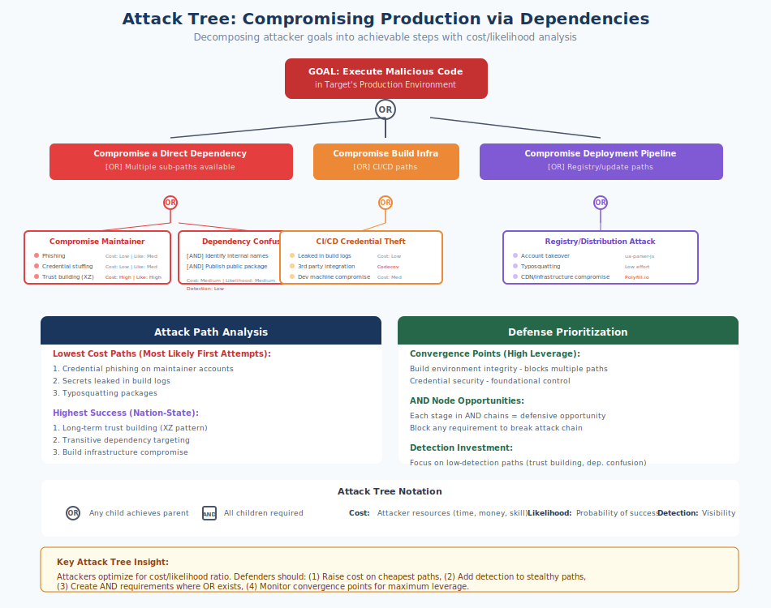

# 4.3 Identifying Crown Jewels in Your Dependency Graph

Threat modeling produces long lists of potential threats. With hundreds or thousands of dependencies, each subject to multiple threat categories, the output can be overwhelming. Practical security requires prioritization—focusing limited resources on the dependencies whose compromise would cause the greatest harm. This section provides frameworks for identifying which dependencies matter most, enabling risk-based investment rather than attempting to apply equal scrutiny everywhere.

!!! info inline end "Crown Jewels"

    An organization's most valuable assets—systems, data, and capabilities that must be protected above all else.

The term **crown jewels** in security typically refers to an organization's most valuable assets: the systems, data, and capabilities that must be protected above all else. In supply chain contexts, we extend this concept to dependencies: which external components, if compromised, would cause the greatest damage to your organization? Identifying these critical dependencies enables targeted security investment where it matters most.

## Criticality Assessment Criteria

Not all dependencies are equally important. Several factors contribute to a dependency's criticality:

**Functional criticality** measures how essential the dependency is to your application's core purpose. A web application's authentication library is more functionally critical than its logging formatter. Compromise of authentication affects every user and every operation; compromise of formatting affects operational visibility but not core functionality.

Questions to assess functional criticality:

- Would the application function at all without this dependency?
- Does this dependency implement core business logic or security controls?
- How many features or code paths depend on this component?

**Privilege level** indicates what capabilities the dependency has when it executes. Some dependencies run with elevated privileges: access to credentials, network connections, filesystem operations, or system calls. Others are purely computational, transforming data without external interactions.

High-privilege dependency categories include:

- **Cryptographic libraries** that protect data confidentiality and integrity
- **Authentication and authorization** components that control access
- **Serialization libraries** that parse untrusted input (a common vulnerability source)
- **Network libraries** that establish external connections
- **Database drivers** that access persistent data stores
- **Build plugins** that execute during compilation with developer privileges

A compromised cryptographic library can undermine every security control that depends on it. A compromised date formatting utility, while problematic, has limited blast radius.

**Execution context** matters alongside privilege level. Dependencies that execute server-side in production environments pose different risks than those that run only in development. Build-time dependencies execute with developer credentials and CI/CD secrets. Test dependencies may run in isolated environments with limited access.

Map your dependencies to execution contexts:

- Production runtime (highest exposure)
- Build and CI/CD (access to secrets, publishing credentials)
- Development environment (access to source code, developer credentials)
- Test environment (typically isolated, lower risk)

**Data exposure** indicates what sensitive information the dependency can access. Components that process user input, handle personal data, or manage credentials warrant more scrutiny than those that never touch sensitive information.

**Replaceability** affects your options if a dependency is compromised. A dependency with many alternatives can be quickly replaced; a dependency that implements unique functionality or that is deeply integrated into your codebase creates lock-in that limits response options.

## Single Points of Failure

!!! danger "Single Point of Failure (SPOF)"

    A component whose failure causes system-wide impact. In dependency graphs, SPOFs are packages that sit on critical paths with no alternatives—if they fail or are compromised, your application cannot function.

Identifying SPOFs requires tracing dependency relationships:

**Direct SPOFs** are dependencies your application imports directly that cannot be easily replaced. If your entire application is built on a particular framework, that framework is a SPOF. If you use a specific database driver with no alternatives for your database, that driver is a SPOF.

**Transitive SPOFs** are less visible but equally dangerous. A utility library that appears in the dependency tree of many of your direct dependencies creates common-mode failure risk—a single compromise affects multiple components simultaneously. The Log4j vulnerability was severe partly because Log4j was a transitive dependency of countless Java applications through various frameworks and libraries.

**Infrastructure SPOFs** extend beyond code to the systems your supply chain depends on. If all your dependencies come from a single registry, that registry is a SPOF. If your builds run on a single CI/CD platform, that platform is a SPOF.

Tools can help identify SPOFs:

- **Dependency tree analysis** reveals which packages appear most frequently across your dependency graph
- **Software Composition Analysis (SCA)** tools often highlight widely-shared transitive dependencies
- **OpenSSF Criticality Score** rates open source projects based on factors including dependent project count, contributor activity, and organizational diversity

We recommend explicitly documenting SPOFs and evaluating mitigation options: caching, mirroring, identifying alternatives, or accepting the risk with enhanced monitoring.

## Common Mode Failures

!!! warning "Common Mode Failures"

    When a single cause produces failures across multiple independent components. Shared dependencies create correlated vulnerabilities that affect all components simultaneously—undermining the risk diversification that distributed architectures are supposed to provide.

Consider an organization running five microservices. If each service uses the same vulnerable version of a logging library, a single vulnerability affects all five services simultaneously. The services may have independent deployment pipelines and separate maintainers, but they share a common failure mode through their shared dependency. Microservices, redundant deployments, and multi-cloud strategies provide resilience against independent failures—but shared dependencies create correlated vulnerabilities that affect all components simultaneously.

Identifying common mode failure risk requires cross-service analysis:

1. **Aggregate dependency data** across all applications and services
2. **Identify shared dependencies** that appear in multiple components
3. **Assess the blast radius** if shared dependencies were compromised
4. **Prioritize** shared dependencies that are widely deployed, high-privilege, or historically vulnerable

Organizations often discover surprising commonalities when they perform this analysis. Components believed to be independent share utility libraries, framework dependencies, or transitive dependencies that create hidden correlations.

## High-Criticality Dependency Categories

Certain categories of dependencies warrant elevated scrutiny regardless of specific context:

**Cryptographic libraries** (OpenSSL, libsodium, BouncyCastle, python-cryptography) underpin security for data protection, authentication, and secure communication. The Heartbleed vulnerability (§5.5) demonstrated how a single cryptographic library flaw can expose hundreds of thousands of systems worldwide.

**Authentication and identity** packages (OAuth libraries, JWT handlers, identity providers) control who can access your systems. Compromise enables account takeover, privilege escalation, and unauthorized access.

**Serialization and parsing** libraries (Jackson, Gson, PyYAML, xml parsers) convert external data into internal objects. These libraries process untrusted input and have historically been rich sources of vulnerabilities, including remote code execution. The Log4j vulnerability was fundamentally a parsing issue—interpreting attacker-controlled strings as code.

**Network and HTTP** libraries handle communication with external systems. Compromise can enable man-in-the-middle attacks, request smuggling, or server-side request forgery.

**Database drivers and ORMs** have access to persistent data stores. SQL injection vulnerabilities in these components affect every query the application makes.

**Build tools and plugins** (Maven plugins, npm scripts, Gradle plugins) execute during build with access to source code, environment variables, and publishing credentials. The SolarWinds attack (§7.2) targeted build infrastructure precisely because it provides such privileged access.

**Package managers and installers** (pip, npm, cargo) determine what code enters your environment. Compromise of package management tools could affect every subsequent installation.

For dependencies in these categories, we recommend:

- More thorough evaluation before adoption
- Active monitoring for security advisories
- Faster patching when vulnerabilities are disclosed
- Consideration of defense-in-depth measures that limit impact if the dependency is compromised

## Mapping Business Impact

Technical criticality must be translated to business impact for effective prioritization. A cryptographic library is technically critical, but its business impact depends on what it protects and for whom.

Business impact assessment connects dependencies to outcomes stakeholders care about:

**Revenue impact**: Which dependencies, if compromised, could disrupt revenue-generating activities? E-commerce applications should prioritize payment processing dependencies; SaaS products should prioritize authentication and authorization.

**Data breach impact**: Which dependencies have access to data that would trigger breach notification if exfiltrated? Dependencies processing personal data, health information, or financial records warrant scrutiny proportional to regulatory and reputational consequences of breach.

**Operational impact**: Which dependencies could cause service outages if compromised or removed? Dependencies that could be targeted for denial of service or that represent availability SPOFs affect operational continuity.

**Reputational impact**: Which dependencies could cause reputational damage if compromised? Organizations publishing software to others face amplified reputational risk if their products become supply chain attack vectors.

**Compliance impact**: Which dependencies affect regulatory compliance? Dependencies processing regulated data or implementing required security controls have compliance implications beyond their technical function.

Creating a business impact mapping requires collaboration between security teams and business stakeholders. Security practitioners understand technical risk; business stakeholders understand which systems and data matter most to the organization.

## A Practical Prioritization Framework

Synthesizing these factors into actionable prioritization, we recommend a tiered approach:

**Tier 1: Crown Jewels** (highest priority)

- Direct dependencies implementing security-critical functions (crypto, auth, serialization)
- Dependencies with access to highly sensitive data
- SPOFs with no alternatives
- Dependencies in production runtime with network/filesystem access

For Tier 1 dependencies:

- Conduct thorough evaluation before adoption
- Review maintainer security practices and project health
- Monitor security advisories actively
- Patch critical vulnerabilities within days
- Consider security audits for the most critical

**Tier 2: Important** (elevated priority)

- Direct dependencies with elevated privileges
- Common mode failure risks (widely shared dependencies)
- Build-time dependencies with secret access
- Dependencies processing external input

For Tier 2 dependencies:

- Evaluate before adoption using standard criteria
- Monitor security advisories
- Patch critical vulnerabilities within weeks
- Review when major versions change

**Tier 3: Standard** (normal priority)

- Direct dependencies with limited privilege
- Well-maintained packages from reputable sources
- Dependencies with alternatives available

For Tier 3 dependencies:

- Apply standard dependency management practices
- Update on regular cadence
- Address vulnerabilities based on severity and exploitability

**Tier 4: Low priority**

- Development-only dependencies in isolated environments
- Test utilities without production exposure
- Transitive dependencies of Tier 3 packages

For Tier 4 dependencies:

- Include in regular update cycles
- Address high-severity vulnerabilities
- Limited proactive scrutiny

## Tools for Identifying Critical Dependencies

Several tools can assist in identifying crown jewel dependencies:

**[OpenSSF Criticality Score][criticality-score]** provides ecosystem-level criticality ratings based on factors like dependent project count, contributor count, and commit frequency. High scores indicate packages that are widely depended upon across the ecosystem.

**[OpenSSF Scorecard][scorecard]** evaluates project security practices including code review, CI/CD security, dependency management, and vulnerability disclosure. Low scores on critical dependencies indicate elevated risk.

**Software Composition Analysis (SCA)** tools like Snyk, Dependabot, and FOSSA map dependency graphs, identify vulnerabilities, and often provide risk ratings that incorporate factors beyond CVE severity.

**Dependency graph visualization** tools help identify centrality and shared dependencies. GitHub's dependency graph, npm's dependency viewer, and dedicated visualization tools make structural risk visible.

**SBOM analysis** on Software Bills of Materials can identify which dependencies appear across multiple products, revealing common mode failure risks at the organizational level.

Book 2 examines risk measurement and management in greater depth, building on the prioritization concepts introduced here. The crown jewel identification process produces a priority-ordered list of dependencies warranting enhanced scrutiny—the starting point for resource allocation decisions that distinguish effective supply chain security from security theater.

[criticality-score]: https://github.com/ossf/criticality_score
[scorecard]: https://securityscorecards.dev/

