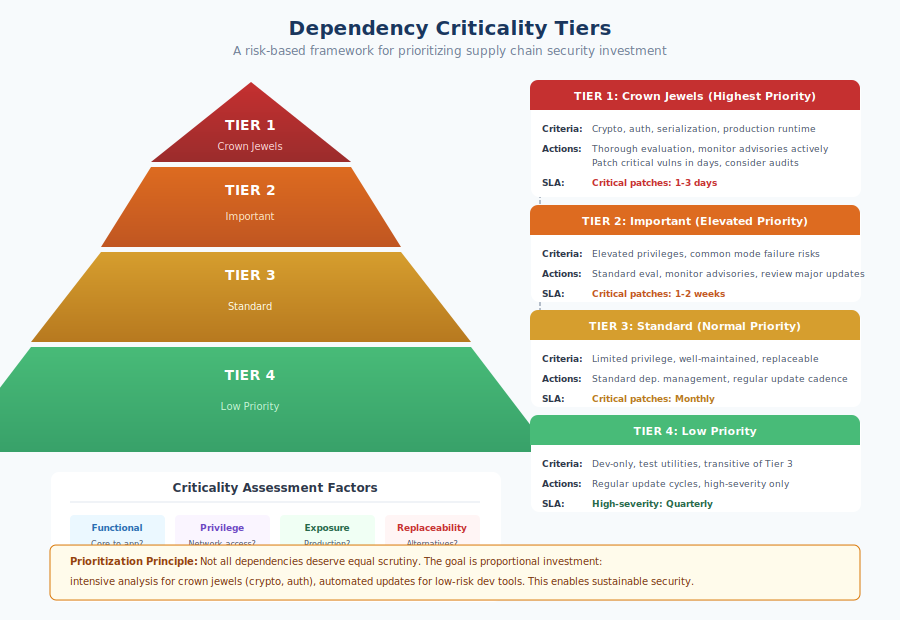

# 4.4 Building Attack Trees for Supply Chain Scenarios

Attack trees, introduced briefly in Section 4.2, deserve deeper treatment because they are particularly well-suited to supply chain threat modeling. Unlike methodologies that enumerate threats by category, attack trees model specific attack scenarios in detail, revealing the paths an adversary might take and the points where defenses would be most effective. This section provides practical guidance for constructing attack trees tailored to supply chain threats, with worked examples that demonstrate both the methodology and its application.

## Attack Tree Methodology and Notation

**Attack trees** decompose an adversary's goal into the steps required to achieve it. The root node represents the attacker's objective. Child nodes represent different ways to achieve the parent node's goal or prerequisites that must be satisfied. Trees are constructed by repeatedly asking: "How could an attacker accomplish this?"

!!! info "Node Types"

    **OR nodes**: Any one child is sufficient to achieve the parent goal. The parent succeeds if *any* child succeeds.

    **AND nodes**: All children must be achieved. The parent succeeds only if *all* children succeed.

Nodes can be annotated with additional attributes:

- **Cost**: Resources (time, money, expertise) the attacker must invest
- **Likelihood**: Probability of success given an attempt
- **Detection probability**: Chance that defenders will notice the attack
- **Feasibility**: Assessment of whether the attack is practical
- **Prerequisites**: Conditions that must exist for the attack to be possible

These annotations enable quantitative analysis. For OR nodes, the overall attack inherits the attributes of the easiest child path. For AND nodes, costs accumulate, and likelihood multiplies across children.

## Example: Compromising Production Through Dependencies

Consider an attacker whose goal is to execute malicious code in a target organization's production environment by compromising their software supply chain. We construct an attack tree working backward from this goal.

```
GOAL: Execute malicious code in target's production environment
├── [OR] Compromise a direct dependency
│   ├── [OR] Compromise maintainer account
│   │   ├── Phishing attack on maintainer
│   │   │   Cost: Low | Likelihood: Medium | Detection: Low
│   │   ├── Credential stuffing (reused passwords)
│   │   │   Cost: Low | Likelihood: Medium | Detection: Medium
│   │   └── [AND] Long-term trust building (XZ Utils pattern)
│   │       ├── Create helpful contributor persona
│   │       ├── Contribute legitimate code over months/years
│   │       └── Request and receive maintainer access
│   │       Cost: Very High | Likelihood: High | Detection: Very Low
│   ├── [OR] Exploit registry vulnerability
│   │   ├── Package metadata manipulation
│   │   │   Cost: High | Likelihood: Low | Detection: Medium
│   │   └── Direct package content modification
│   │       Cost: Very High | Likelihood: Very Low | Detection: High
│   └── [OR] Dependency confusion attack
│       ├── [AND] Identify internal package names
│       │   ├── Error message leakage
│       │   └── Social engineering
│       └── Publish malicious public package with same name
│       Cost: Medium | Likelihood: Medium | Detection: Low
│
├── [OR] Compromise a transitive dependency
│   └── [Same sub-tree as direct dependency, targeting less visible packages]
│   Cost: Lower | Likelihood: Higher | Detection: Lower
│
├── [OR] Compromise build infrastructure
│   ├── [OR] Compromise CI/CD credentials
│   │   ├── Secrets leaked in build logs
│   │   │   Cost: Low | Likelihood: Medium | Detection: Low
│   │   ├── Compromised third-party integration
│   │   │   Cost: Medium | Likelihood: Medium | Detection: Low
│   │   └── Developer machine compromise
│   │       Cost: Medium | Likelihood: Medium | Detection: Medium
│   └── [OR] Malicious modification of build configuration
│       ├── Pull request with hidden build script changes
│       └── Compromised build plugin/action
│       Cost: Medium | Likelihood: Medium | Detection: Medium
│
└── [OR] Compromise deployment pipeline
    ├── Container registry credential theft
    └── Modification of deployment automation
    Cost: High | Likelihood: Low | Detection: Medium
```

!!! tip "Key Insights from Attack Tree Analysis"

    - **Lowest-cost paths**: Credential compromise (phishing, credential stuffing) and secrets leakage from build systems—attractive to resource-constrained attackers
    - **Highest-likelihood paths**: Transitive dependencies receive less scrutiny and their maintainers may be more susceptible to social engineering
    - **XZ Utils pattern**: Expensive in time but high success and very low detection probability—viable for nation-state actors

**Analysis of this tree** reveals several insights:

The lowest-cost paths involve credential compromise (phishing, credential stuffing) and secrets leakage from build systems. These paths require minimal investment and have reasonable success probability, making them attractive to resource-constrained attackers.

The highest-likelihood paths for sophisticated attackers involve transitive dependencies. These packages receive less scrutiny, their maintainers may be more susceptible to social engineering, and detection probability is lower because organizations rarely examine their transitive dependency tree in detail.

The XZ Utils pattern (long-term trust building) is expensive in time but has high success probability and very low detection probability. This path is viable for nation-state actors with patience and resources.

Dependency confusion provides a medium-cost path with reasonable likelihood, particularly against organizations that have not configured their package managers to prefer private registries.

## Example: Data Exfiltration Through Build Systems

A different attacker goal—stealing source code and secrets through build infrastructure—produces a different tree:

```
GOAL: Exfiltrate secrets and source code from target's CI/CD
├── [OR] Gain execution in build environment
│   ├── [OR] Malicious code in dependency
│   │   ├── Compromise existing dependency
│   │   │   [Reference: previous tree's dependency compromise paths]
│   │   ├── Typosquatting package with build-time execution
│   │   │   Cost: Low | Likelihood: Low | Detection: Medium
│   │   └── Malicious contribution to project dependency
│   │       Cost: Medium | Likelihood: Medium | Detection: Medium
│   │
│   ├── [OR] Malicious build script modification
│   │   ├── [AND] Compromised developer account
│   │   │   ├── Phishing or credential theft
│   │   │   └── Push malicious commit to build scripts
│   │   └── [AND] Social engineering via pull request
│   │       ├── Submit PR with hidden script changes
│   │       └── Convince reviewer to merge
│   │       Cost: Medium | Likelihood: Medium | Detection: Medium
│   │
│   └── [OR] Compromise CI/CD platform directly
│       ├── Exploit vulnerability in CI/CD service
│       │   Cost: High | Likelihood: Low | Detection: High
│       └── Compromise third-party CI/CD integration
│           Cost: Medium | Likelihood: Medium | Detection: Low
│
├── [AND] Access valuable secrets
│   ├── [OR] Secrets exposed as environment variables
│   │   ├── Read from process environment
│   │   └── Access CI/CD secret storage
│   └── [OR] Secrets in source code or configuration
│       ├── Hardcoded credentials
│       └── Configuration files with secrets
│   Likelihood varies by target's secret management practices
│
└── [AND] Exfiltrate data successfully
    ├── [OR] Network exfiltration
    │   ├── DNS tunneling
    │   ├── HTTPS to attacker infrastructure
    │   └── Steganography in build artifacts
    └── [NOT] Detection and blocking by security controls
    Cost: Low | Likelihood: High | Detection: Variable
```

**Analysis of this tree** highlights that:

The Codecov attack pattern (third-party integration compromise) appears as a medium-cost, medium-likelihood path with low detection probability—explaining why this attack vector has been successful in practice.

The attack requires successful completion of multiple AND conditions: gaining execution, accessing secrets, and exfiltrating without detection. This creates multiple defensive opportunities; blocking any stage prevents the attack from succeeding.

Secret management practices dramatically affect likelihood. Organizations that inject secrets only for specific jobs, use short-lived credentials, and avoid environment variable exposure reduce the "Access valuable secrets" branch's success probability.

Build environment network restrictions affect the exfiltration stage. Air-gapped or heavily restricted build environments force attackers to use more detectable exfiltration methods.

## Example: Maintainer Account Takeover

A more focused tree examines paths to taking over an open source maintainer's account:

```
GOAL: Gain publishing access to target package
├── [OR] Compromise existing maintainer
│   ├── [OR] Credential theft
│   │   ├── Phishing (fake registry login page)
│   │   ├── Credential stuffing from breach databases
│   │   ├── Keylogger/infostealer on maintainer machine
│   │   └── Session token theft
│   ├── [OR] Account recovery hijacking
│   │   ├── [AND] Compromise associated email
│   │   │   ├── Email credential compromise
│   │   │   └── Initiate password reset
│   │   └── Social engineering of registry support
│   └── [OR] MFA bypass
│       ├── SIM swapping (if SMS-based MFA)
│       ├── MFA fatigue attack (push notification spam)
│       └── Real-time phishing proxy
│
├── [OR] Become a new maintainer legitimately
│   ├── [AND] Trust building over time
│   │   ├── Create credible developer identity
│   │   ├── Submit valuable contributions
│   │   └── Request maintainer access
│   └── [AND] Exploit maintainer burnout
│       ├── Identify overwhelmed maintainer
│       ├── Offer to "help" with maintenance burden
│       └── Receive delegation of access
│
└── [OR] Exploit registry/platform vulnerability
    ├── Namespace takeover (abandoned maintainer email)
    ├── Registry permission bypass vulnerability
    └── OAuth/integration exploitation
```

This tree reveals that MFA enforcement significantly prunes the credential theft branches, but social engineering paths (trust building, exploiting burnout) remain viable regardless of technical controls. Registry namespace takeover through expired email domains represents an underappreciated risk that some ecosystems have begun to address.

## Estimating Costs and Likelihood

Attack tree analysis becomes more valuable when nodes are quantified, but estimation is inherently uncertain. We recommend the following approach:

**Use relative scales rather than precise values.** A five-point scale (Very Low, Low, Medium, High, Very High) is often more defensible than precise percentages or dollar amounts. The goal is comparing paths, not predicting exact outcomes.

**Base estimates on historical data when available.** The frequency of npm account compromises, the success rate of phishing attacks, and the cost of purchasing breached credentials can inform estimates for relevant nodes.

**Distinguish capability from opportunity.** Some attacks require significant capability (exploitation development) but present frequent opportunity. Others require little capability but rare opportunity (finding exposed credentials).

**Consider detection probability separately from success likelihood.** An attack might have high success probability but also high detection probability, changing its risk profile.

**Update estimates as threat landscape evolves.** Widespread MFA adoption changes credential theft likelihood. New attack techniques change capability requirements. Trees should be living documents.

For AND nodes, overall likelihood is the product of child likelihoods; overall cost is the sum of child costs. For OR nodes, attackers choose the path with the best cost/likelihood ratio, so the overall node inherits the most favorable child's attributes.

## Translating Trees into Defensive Priorities

Attack trees identify where defenses provide the greatest leverage:

**Convergence points** are nodes through which multiple attack paths pass. In the production compromise tree, "gain execution in build environment" is a convergence point—many attack paths require it. Securing build environment execution provides leverage against multiple threats.

**Low-cost, high-likelihood nodes** represent attractive paths that defenders should address first. If credential stuffing against maintainer accounts is low-cost with medium likelihood, enforcing MFA across the ecosystem provides high-impact defense.

**AND node requirements** create multiple defensive opportunities. For the data exfiltration attack, defenders can focus on any of: preventing execution, protecting secrets, or detecting exfiltration. Success at any stage breaks the attack chain.

**Nodes affecting detection probability** guide monitoring investment. If an attack path has low detection probability, adding monitoring at that stage improves overall security posture.

We recommend prioritizing defenses that:

1. Block the lowest-cost attack paths (raising the bar for all attackers)
2. Address convergence points (providing leverage against multiple paths)
3. Create detection opportunities for paths that cannot be blocked
4. Increase cost for the paths that remain viable

## Tools for Attack Tree Development

Several tools support attack tree creation and analysis:

**OWASP Threat Dragon** is an open source threat modeling tool that supports attack tree creation with a visual interface. It integrates with development workflows and supports export to various formats.

**ADTool** (Attack-Defense Tree Tool) is academic software specifically designed for attack tree analysis, supporting quantitative evaluation and defense placement optimization.

**Microsoft Threat Modeling Tool** supports tree-like threat decomposition as part of its broader threat modeling capabilities, though it is oriented toward STRIDE rather than pure attack trees.

**Draw.io/diagrams.net** and similar general-purpose diagramming tools can create attack tree visualizations without specialized features. This approach works well for presentation and documentation.

**Text-based representations** using indentation (as in this section's examples) are simple to create and version-control, making them practical for teams that want to maintain trees alongside code.

For most organizations, we recommend starting with simple tools—text files or general-purpose diagrams—and adopting specialized tools only if quantitative analysis or complex tree management becomes necessary. The value of attack trees lies in the thinking process they structure, not in the sophistication of the tools used to draw them.

Attack trees connect directly to the red teaming approaches discussed in Book 2, Chapter 15. The trees you construct during threat modeling become roadmaps for offensive testing, validating whether the attack paths you identified are actually viable and whether the defenses you implemented actually work.

