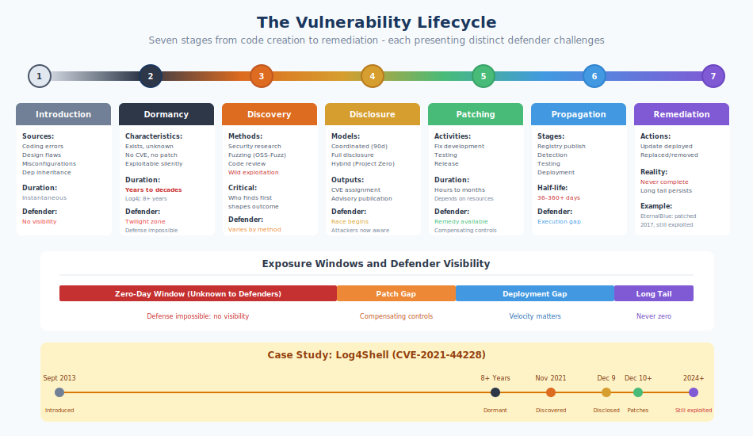

# 5.1 The Lifecycle of a Vulnerability

Every security vulnerability has a story. It begins when flawed code is written, continues through an often lengthy period of dormancy, and eventually reaches resolution when patches propagate to affected systems—or, in less fortunate cases, when attackers exploit it first. Understanding this lifecycle is essential for managing supply chain security, because vulnerabilities in dependencies follow the same trajectory as vulnerabilities in your own code, but with reduced visibility and control at each stage.

The vulnerability lifecycle can be conceptualized as a series of stages:

**Introduction → Dormancy → Discovery → Disclosure → Patching → Propagation → Remediation**

Each stage presents distinct challenges and opportunities for defenders. The time spent in each stage varies dramatically—from hours to decades—and these timing dynamics fundamentally shape supply chain risk.

## Introduction: How Vulnerabilities Enter Code

Vulnerabilities are born when code is written, reviewed, tested, and merged—yet still contains exploitable flaws. This happens constantly, across all software projects, regardless of the developers' skill or intentions.

**Coding errors** are the most common source. A developer writes code that behaves correctly for expected inputs but fails dangerously for unexpected ones. Buffer overflows, SQL injection, cross-site scripting, and similar vulnerability classes result from code that lacks proper input validation, boundary checking, or output encoding. The Log4j vulnerability (CVE-2021-44228) emerged from code that interpreted user-controlled strings as commands—a coding decision that seemed reasonable for legitimate use cases but created a remote code execution vector.

**Design flaws** are more fundamental. The code may work exactly as designed, but the design itself is insecure. Authentication bypasses, insecure default configurations, and cryptographic weaknesses often stem from design decisions rather than implementation errors. The Heartbleed vulnerability (CVE-2014-0160) in OpenSSL resulted from a design that trusted client-supplied length values without verification—a design choice that implementation-level review might not catch.

**Misconfigurations** introduce vulnerabilities at deployment rather than development time. Default credentials, overly permissive access controls, and exposed management interfaces are configuration-level issues that affect security regardless of code quality. While not strictly code vulnerabilities, misconfigurations in dependencies—especially in infrastructure components like databases and web servers—represent significant supply chain risk.

**Dependency inheritance** brings in vulnerabilities through the supply chain itself. When you incorporate a dependency, you inherit whatever vulnerabilities it contains. This is recursive: your dependencies' dependencies' vulnerabilities become yours. Introduction occurs not when the vulnerability is written but when you add the affected dependency to your project.

The introduction stage is significant because vulnerabilities introduced today may not be discovered for years. Every line of code merged represents potential future risk.

## Dormancy: The Silent Period

After introduction, vulnerabilities enter a **dormancy period** during which they exist in code but remain unknown. This period can be remarkably long.

Research by security firms and academics consistently finds that vulnerabilities often persist for years before discovery. Studies on vulnerability lifetimes in open source software have found that vulnerabilities can remain dormant for extended periods before receiving CVE assignment. For widely-used open source projects, dormancy periods of five to ten years are not unusual.

The Heartbleed vulnerability was introduced in December 2011 and discovered in April 2014—over two years of dormancy in one of the most security-critical libraries in the world. The Log4j vulnerability was dormant for over eight years. The XZ Utils backdoor was introduced through a sophisticated multi-year campaign, but once planted, it nearly reached stable Linux distributions before chance discovery.

During dormancy, the vulnerability is exploitable by anyone who discovers it. There is no CVE, no advisory, no patch, and no scanner detection. Organizations running affected software have no indication of their exposure. This is the **vulnerability twilight zone** discussed in Chapter 3—a period when defense is effectively impossible because the threat is unknown.

From a supply chain perspective, dormancy means you cannot rely on vulnerability databases to assess current exposure. Your dependencies may contain undiscovered vulnerabilities that attackers have already found. The absence of known vulnerabilities does not mean the absence of vulnerabilities.

## Discovery: Finding the Flaw

Vulnerability discovery occurs through various channels, each with different implications for what happens next.

**Security researchers** actively seek vulnerabilities through code review, fuzzing, reverse engineering, and other techniques. The security research community includes independent researchers, employees of security firms, academics, and bug bounty hunters. Their discoveries typically lead to responsible disclosure and coordinated remediation.

**Fuzzing and automated testing** identify vulnerabilities through systematic input generation. **Fuzzing** (or fuzz testing) is a technique that automatically generates thousands or millions of random, malformed, or unexpected inputs to a program, watching for crashes, hangs, or unexpected behavior that might indicate security vulnerabilities. Rather than manually crafting test cases, fuzzing tools essentially throw random data at software to see what breaks.

Tools like **AFL** (American Fuzzy Lop), **libFuzzer**, and [Google's OSS-Fuzz][oss-fuzz] have industrialized this process. AFL pioneered "coverage-guided" fuzzing, which tracks which parts of the code each input exercises and intelligently mutates inputs to explore new code paths—dramatically more effective than purely random input generation. OSS-Fuzz applies these techniques at scale, continuously fuzzing critical open source projects. It has identified over 13,000 security vulnerabilities and found more than 50,000 bugs across 1,000+ projects.[^oss-fuzz-stats]

[^oss-fuzz-stats]: Google OSS-Fuzz, "Trophies," 2025, https://google.github.io/oss-fuzz/; Oliver Chang and Abhishek Arya, "OSS-Fuzz: Five Years Later, and Continuous Fuzzing for Open Source Software," Google Security Blog, December 2021.

**Routine code review** occasionally surfaces security issues. Maintainers or contributors examining code for unrelated purposes sometimes notice security flaws. The XZ Utils backdoor was discovered not through security research but because a Microsoft engineer noticed unusual SSH latency and investigated.

**Exploitation in the wild** represents discovery by attackers who then use the vulnerability for malicious purposes. When this occurs, defenders are in the worst possible position: attackers have working exploits while the security community is unaware of the issue. The [CISA Known Exploited Vulnerabilities (KEV) catalog][cisa-kev] tracks vulnerabilities confirmed to be exploited in the wild, providing defenders with high-confidence prioritization data.

The method of discovery significantly affects subsequent stages. Researcher discovery typically leads to coordinated disclosure with time for patch development. Wild exploitation may mean attackers have had extended access before defenders learn of the problem.

## Disclosure: Revealing the Vulnerability

Once discovered, vulnerabilities must be disclosed for remediation to occur. **Vulnerability disclosure** is the process of communicating information about a security flaw to those who need to know—typically the software maintainer, affected users, and the broader security community.

Three disclosure models dominate the conversation:

**Coordinated disclosure** (sometimes called "responsible disclosure") involves the finder privately notifying the affected vendor or maintainer, providing time for a patch to be developed before public disclosure. This model is formalized in ISO/IEC 29147 and recommended by FIRST (Forum of Incident Response and Security Teams). Typical coordination windows range from 30 to 90 days, though complex vulnerabilities may require longer.

Coordinated disclosure protects users by ensuring patches exist before attackers learn of vulnerabilities. Critics argue it allows vendors to delay indefinitely, leaving users exposed while the vendor prioritizes other work.

**Full disclosure** involves immediate public release of vulnerability details without vendor coordination. Proponents argue this forces vendors to address issues quickly and provides defenders with information needed to protect themselves. Critics note that full disclosure often benefits attackers more than defenders—attackers can weaponize vulnerability details faster than organizations can deploy patches.

**Hybrid approaches** have emerged to balance competing concerns. Google's Project Zero uses a 90-day disclosure deadline: vendors receive 90 days to patch, after which disclosure occurs regardless of patch availability. This approach incentivizes timely patching while still providing a coordination window.

The disclosure process typically includes assigning a **CVE (Common Vulnerabilities and Exposures)** identifier. CVE IDs provide unique, stable references that enable coordination across the security ecosystem. The National Vulnerability Database (NVD) enriches CVE records with severity scores, affected product information, and references to patches and advisories.

For open source supply chains, disclosure dynamics matter because the projects you depend on may have disclosure processes ranging from sophisticated (Linux kernel security team) to nonexistent (abandoned side project). Understanding how your dependencies handle vulnerability reports influences your exposure during the disclosure-to-patch window.

## Patching: Developing the Fix

Once a vulnerability is disclosed (or discovered internally), maintainers must develop, test, and release a fix. The **time-to-patch** measures the duration from disclosure to patch availability.

For well-resourced projects, patching can occur within hours of disclosure. Linux kernel security issues are often patched within days. Major commercial software vendors typically aim for patches within 30 days of notification.

For under-resourced open source projects, patching can take much longer. Volunteer maintainers may not have time to address issues immediately. Complex vulnerabilities may require significant rearchitecture. The maintainer may lack security expertise to develop an effective fix.

Time-to-patch statistics vary widely by ecosystem and project. Research consistently shows that median time-to-patch for high-severity vulnerabilities is measured in weeks, not days. Lower-severity issues may remain unpatched for months or years.

For supply chain consumers, time-to-patch determines how long you are exposed between disclosure (when attackers learn of the vulnerability) and patch availability (when you can remediate). During this window, you may need compensating controls—Web Application Firewalls, network restrictions, or feature disabling—to reduce risk.

## Propagation: Reaching End Users

A patch existing does not mean a patch is deployed. **Propagation** is the process by which patches move from maintainer release to production deployment across affected systems.

Propagation involves multiple stages:
1. Maintainer releases patched version
2. Distribution channels (npm, PyPI, Linux distributions) make patched version available
3. Organizations detect that updates are available
4. Organizations test updates for compatibility
5. Organizations deploy updates to production

Each stage introduces delay. Distribution channels typically propagate packages within hours, but Linux distribution backporting can take days or weeks. Organizational detection depends on monitoring practices—some organizations learn of updates immediately; others discover them only during periodic reviews.

Testing and deployment delays are often the longest part of the propagation timeline. Organizations with mature DevOps practices may deploy non-breaking updates within days. Organizations with complex change management processes may require weeks or months. Critical infrastructure with high availability requirements may defer updates until maintenance windows.

The **vulnerability half-life** measures how long until 50% of vulnerable instances are patched. [Research by Kenna Security (now Cisco Vulnerability Management) and the Cyentia Institute][kenna-cyentia] found that vulnerability half-lives vary significantly by asset type and industry—from around 36 days for Windows systems to over 360 days for network appliances. This means that weeks to months after a patch is released, half of vulnerable systems remain unpatched.

Some vulnerabilities have extremely long tails. The EternalBlue vulnerability (CVE-2017-0144) was patched by Microsoft in March 2017, but vulnerable systems remained common years later—as the WannaCry and NotPetya ransomware attacks demonstrated.

## Remediation: The (Incomplete) End

Remediation occurs when a vulnerable instance is updated to a patched version, replaced with an alternative, or removed from service. Complete remediation across all affected systems is rarely achieved.

For any significant vulnerability, a long tail of unpatched systems persists indefinitely. Some systems are abandoned but still running. Some organizations defer updates perpetually. Some instances are embedded in devices that cannot be easily updated.

This long tail creates persistent risk. Attackers can exploit known vulnerabilities in the confident expectation that some targets remain vulnerable. The economics favor attackers: they need only find one vulnerable system, while defenders must patch every instance.

## A Complete Lifecycle Example: Log4Shell

The Log4Shell vulnerability (CVE-2021-44228) illustrates the complete lifecycle:

**Introduction (September 2013)**: The vulnerable logging functionality was introduced in Log4j 2.0-beta9.

**Dormancy (2013-2021)**: The vulnerability existed in production code for over eight years, present in countless applications, unknown to the security community.

**Discovery (November 2021)**: Researchers at Alibaba Cloud Security discovered the vulnerability while examining Log4j.

**Disclosure (December 9, 2021)**: After coordinated disclosure to Apache, details became public. The vulnerability received immediate attention due to its severity and ubiquity.

**Patching (December 2021)**: Apache released Log4j 2.15.0 on December 6, 2021, with subsequent fixes in 2.16.0 and 2.17.0 as initial patches proved incomplete. This "patch cascade" pattern—where urgency leads to incomplete initial fixes requiring rapid follow-on patches—recurs in high-severity vulnerabilities. Log4j 2.15.0 addressed CVE-2021-44228, but researchers quickly discovered bypass techniques leading to CVE-2021-45046 (fixed in 2.16.0) and then CVE-2021-45105 (fixed in 2.17.0), all within approximately one week. Organizations that patched to 2.15.0 believing they were protected found themselves patching again days later—twice. This pattern underscores why vulnerability management requires continuous monitoring, not one-time remediation, and why "patch and forget" approaches fail during active exploitation of critical flaws.

**Propagation (December 2021 - ongoing)**: Organizations scrambled to identify and update affected systems. Within a month, exploitation attempts were observed against most internet-facing systems. Months later, vulnerable instances remained common.

**Remediation (incomplete)**: Years after disclosure, Log4Shell-vulnerable systems persist. The vulnerability is regularly included in CISA's most-exploited-vulnerabilities lists.

## Supply Chain Implications

The vulnerability lifecycle has distinct implications for supply chain security:

**You inherit lifecycle risk for all dependencies.** Every package in your dependency tree may contain dormant vulnerabilities. The typical application with hundreds of dependencies includes thousands of potential vulnerabilities in various lifecycle stages.

**Visibility varies by stage.** You can assess known vulnerabilities (post-disclosure) using SCA tools. You cannot assess dormant vulnerabilities. Your visibility is fundamentally limited.

**Control diminishes through the chain.** You control patching and propagation for your own code. For dependencies, you depend on maintainer responsiveness for patching and must actively monitor for updates. For transitive dependencies, even monitoring becomes difficult.

**Time is the enemy.** At every stage, delays accumulate. Dormancy periods of years. Disclosure windows of weeks. Patching delays of days to weeks. Propagation delays of days to months. Each delay represents exposure.

Book 2 examines how to manage this lifecycle risk through monitoring, prioritization, and response processes. The fundamental insight is that vulnerability management for supply chains must address the complete lifecycle, not merely the detection of known CVEs.

[oss-fuzz]: https://google.github.io/oss-fuzz/
[cisa-kev]: https://www.cisa.gov/known-exploited-vulnerabilities-catalog
[kenna-cyentia]: https://www.cyentia.com/research/

