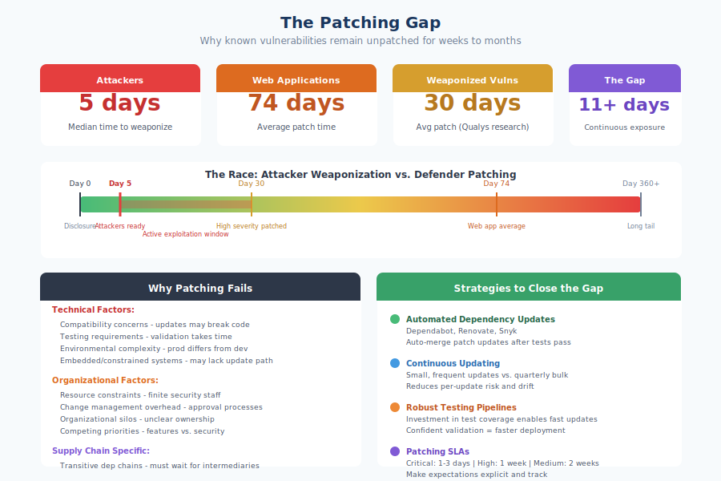

# 5.3 Zero-Days vs. Known Vulnerabilities

Security discussions often focus on zero-day vulnerabilities—the unknown flaws that enable sophisticated attacks and generate dramatic headlines. This focus, while understandable, can distort risk perception. The data consistently shows that most successful attacks exploit known vulnerabilities that organizations simply have not patched. Understanding the distinction between zero-day and known vulnerability risk is essential for allocating defensive resources effectively.

## Defining Zero-Days

!!! info inline end "Zero-Day"

    A security flaw unknown to those responsible for patching it—defenders have had "zero days" to address it.

A **zero-day vulnerability** is a security flaw unknown to those responsible for patching it. The term derives from the idea that defenders have had "zero days" to address the issue since becoming aware of it. More precisely, a zero-day is a vulnerability for which no patch exists at the time of exploitation.

Zero-days represent the period between vulnerability discovery by an attacker (or researcher) and patch availability—the asymmetric window during which attackers can exploit a flaw while defenders cannot remediate it. Once a vendor releases a patch, the vulnerability is no longer a zero-day, even if most systems remain unpatched.

Related concepts include:

**Zero-day exploit**: Working code or technique that leverages a zero-day vulnerability to achieve a malicious objective. The exploit is what makes the vulnerability dangerous in practice.

**N-day vulnerability**: A known vulnerability for which a patch exists but has not been universally applied. The "N" represents the number of days since patch availability. N-day vulnerabilities occupy the space between zero-day (unknown/unpatched) and remediated.

**Forever-day**: A vulnerability that will never be patched, typically because the affected software is abandoned or the vendor has declined to address it. These persist indefinitely in the known-but-unpatched category.

The XZ Utils backdoor discovered in March 2024 exemplified zero-day dynamics: attackers had a working backdoor that defenders were unaware of. Had the backdoor reached stable Linux distributions before discovery, exploitation would have proceeded while defenders had no knowledge of the threat—the essence of zero-day risk.

## The Zero-Day Market

Zero-day vulnerabilities have significant economic value because they enable attacks that cannot be prevented through patching. This value has created a market with distinct participants:

**Government buyers** acquire zero-days for intelligence collection, law enforcement, and military operations. Agencies in the United States, Israel, China, Russia, and other nations purchase exploits for offensive cyber capabilities. Estimates suggest government spending on zero-days reaches hundreds of millions of dollars annually.

**Commercial exploit brokers** like Zerodium publicly advertise bounties for zero-day exploits, with prices ranging from tens of thousands to millions of dollars depending on target and impact. Zerodium has offered up to $2.5 million for zero-click iOS exploits. These brokers sell to government customers.

**Vulnerability research firms** like NSO Group develop exploits for products sold to government customers. The Pegasus spyware, which exploited multiple iOS and Android zero-days, demonstrates the sophistication of commercial exploit development.

**Criminal organizations** increasingly invest in zero-day capabilities, though they more commonly use known vulnerability exploits. Ransomware groups have occasionally deployed zero-days for initial access.

**Defensive researchers** discover zero-days and report them through responsible disclosure, often motivated by bug bounties. Google Project Zero, independent researchers, and security firms contribute significantly to zero-day discovery and patching.

The economics shape the threat landscape. High zero-day prices reflect their value—and their relative scarcity. Nation-states and well-resourced criminal groups can afford zero-days; most attackers cannot. This concentration of zero-day capability among sophisticated adversaries has implications for defensive prioritization.

## Known Vulnerabilities: The Greater Practical Threat

!!! note "Known Vulnerabilities Cause Most Damage"

    The 2025 Verizon DBIR found vulnerability exploitation increased 34% from the previous year, now accounting for 20% of all breaches. Edge device and VPN vulnerabilities grew nearly eight-fold. These are known vulnerabilities being actively exploited while patches sit unapplied.

The **[Verizon Data Breach Investigations Report (DBIR)][verizon-dbir]** consistently finds that vulnerability exploitation as an initial access vector predominantly involves known, patchable vulnerabilities.

**[CISA's Known Exploited Vulnerabilities (KEV) catalog][cisa-kev]** tracks vulnerabilities confirmed to be exploited in the wild. Of the 1,000+ vulnerabilities in the KEV catalog, the vast majority had patches available before exploitation was detected. Attackers exploit known vulnerabilities because they work—many organizations fail to patch even actively exploited flaws.

Threat intelligence analysis consistently shows that known vulnerabilities with available patches are exploited far more frequently than zero-days. Even advanced persistent threat (APT) groups—nation-state actors with resources for zero-days—commonly use known vulnerability exploits because they are effective and preserve expensive zero-day capabilities for high-value targets.

The implication is counterintuitive but important: organizations facing typical threat actors are more likely to be compromised through unpatched known vulnerabilities than through zero-days. Defensive investment should reflect this reality.

## The Patch Gap Problem

The **patch gap** is the time between patch availability and patch deployment across vulnerable systems. As discussed in Section 5.1, vulnerability half-lives are measured in months—meaning half of vulnerable instances remain unpatched for extended periods after fixes are released.

This gap exists for multiple reasons:

- Organizations may not know they are running vulnerable software
- Patch testing and deployment processes take time
- Change management policies delay updates
- Legacy systems may be difficult or impossible to update
- Resource constraints limit patching capacity

Attackers understand the patch gap and exploit it systematically. When a critical vulnerability is disclosed and patched, sophisticated attackers reverse-engineer the patch to understand the vulnerability, develop exploits, and scan for unpatched systems—all while many organizations are still testing updates.

The Log4Shell timeline illustrates this dynamic. Within 24 hours of disclosure, mass exploitation began. Organizations that took weeks to patch faced weeks of exposure to commodity attacks. The patch existed; the gap was in deployment.

## Defensive Strategies for Each Threat Type

Zero-days and known vulnerabilities require different defensive approaches:

**For zero-day threats:**

- **Assume breach mentality**: Accept that zero-days may enable initial compromise; focus on detection, containment, and limiting impact.
- **Defense in depth**: Multiple security layers mean zero-day exploitation of one component does not grant complete access.
- **Behavioral detection**: Since signature-based detection cannot identify unknown exploits, focus on detecting anomalous behavior that indicates compromise.
- **Attack surface reduction**: Disable unnecessary features, limit exposed services, reduce the footprint available for zero-day exploitation.
- **Network segmentation**: Limit lateral movement even if initial access succeeds.
- **Rapid response capability**: When zero-days become known (transition to N-day), respond quickly before attackers exploit the window.

Zero-day defense is fundamentally about resilience—limiting the value attackers can extract from successful exploitation.

**For known vulnerabilities:**

- **Comprehensive visibility**: Know what software runs in your environment, including dependencies. You cannot patch what you do not know exists.
- **Continuous monitoring**: Track vulnerability disclosures affecting your software inventory. Subscribe to vendor advisories and NVD feeds.
- **Prioritized patching**: Not all vulnerabilities warrant immediate attention. Focus on exploited, exploitable, and exposed vulnerabilities.
- **Patching velocity**: Reduce time from patch availability to patch deployment. Streamlined processes and automation accelerate response.
- **Compensating controls**: When patching is delayed, apply mitigations: firewall rules, WAF signatures, feature disabling, or network isolation.

Known vulnerability defense is fundamentally about execution—identifying and remediating vulnerabilities before attackers exploit them.

## Prioritization Frameworks

With thousands of CVEs disclosed annually, prioritization is essential. Not every vulnerability warrants emergency response. But how do you decide which ones matter most? Several frameworks have emerged to answer this question, each approaching prioritization from a different angle:

- **CVSS (Common Vulnerability Scoring System)** measures *how bad* a vulnerability could be technically—its potential impact if exploited. A CVSS score of 9.8 means the vulnerability could allow complete system compromise, but it does not tell you whether anyone is actually exploiting it.
- **KEV** tells you *what is actually being exploited* right now in the real world—invaluable for knowing where attackers are focusing.
- **EPSS** predicts *how likely* a vulnerability is to be exploited in the near future, even if it has not been yet.
- **SSVC** helps you decide *what to do about it* based on your specific organizational context.

Understanding these distinctions helps explain why CVSS alone is insufficient and why modern vulnerability management combines multiple signals.

**[CISA Known Exploited Vulnerabilities (KEV)][cisa-kev]** catalogs vulnerabilities confirmed to be actively exploited. Federal agencies must remediate KEV entries within specified timeframes. For any organization, KEV entries deserve priority attention—these are not theoretical risks but active threats.

!!! info "KEV Now Covers Developer Toolchains"

    KEV entries are not limited to production-facing software. In early 2026, CISA added two developer-toolchain vulnerabilities: **CVE-2025-11953** (React Native Metro server OS command injection, CVSS 9.8) and **CVE-2025-15556** (Notepad++ WinGUp updater missing integrity check, CVSS 7.5). These additions signal that CISA treats developer-facing software as infrastructure warranting the same remediation urgency as production systems — a meaningful reframing for supply chain defenders.

The KEV catalog's expansion into developer tooling has direct implications for supply chain security prioritization. Developer workstations and CI/CD runners hold signing keys, publishing tokens, cloud credentials, and source code. A vulnerability on a developer machine is not merely an endpoint risk — it is a potential entry point for upstream supply-chain attacks. Organizations should ensure their KEV monitoring and remediation workflows cover developer-facing software, build tooling, and IDE components, not just production infrastructure.

**[Exploit Prediction Scoring System (EPSS)][epss]**, maintained by FIRST, predicts the probability that a vulnerability will be exploited in the next 30 days. EPSS uses machine learning on vulnerability characteristics and threat intelligence to estimate exploitation likelihood. High EPSS scores indicate vulnerabilities that, even if not yet exploited, are likely to be soon.

**Stakeholder-Specific Vulnerability Categorization (SSVC)**, developed by CISA and Carnegie Mellon, provides a decision-tree approach to prioritization. SSVC considers exploitation status, technical impact, and the specific organization's exposure to generate actionable recommendations: track, track*, attend, or act.

These frameworks share a common insight: CVSS severity alone is insufficient for prioritization. A critical-severity vulnerability in unexposed internal software may be less urgent than a medium-severity vulnerability being actively exploited against internet-facing systems. Context and threat intelligence matter.

!!! tip "Combining Multiple Prioritization Signals"

    1. **Is it in the KEV catalog?** If yes, prioritize immediately.
    2. **What is the EPSS score?** High scores indicate likely near-term exploitation.
    3. **Is your environment exposed?** Internet-facing systems face the highest risk.
    4. **What is the business impact?** Critical systems warrant faster response.

These frameworks share a common insight: CVSS severity alone is insufficient for prioritization.

**Patching capability is foundational.** Before investing in advanced zero-day detection, ensure you can effectively patch known vulnerabilities. The basics prevent more breaches than sophisticated controls.

**Visibility enables response.** Both zero-day and known vulnerability defense require knowing what software you run. Software composition analysis, asset inventory, and dependency mapping are prerequisites for either defensive approach.

**Speed matters for known vulnerabilities.** Once a vulnerability is public, the race begins. Organizations that patch within days face less risk than those taking months. Investments in patching velocity—automation, streamlined testing, reduced change management overhead—provide concrete security returns.

**Resilience matters for zero-days.** Since you cannot patch what you do not know about, zero-day defense focuses on limiting the impact of inevitable compromises. Segmentation, detection, and response capability provide value when prevention fails.

**Threat intelligence guides prioritization.** Knowing what attackers are actually exploiting—through KEV, EPSS, threat feeds, and industry sharing—enables rational prioritization that CVSS alone cannot provide.

The next section examines the patching gap in greater detail, exploring why organizations fail to remediate known vulnerabilities and what can be done to accelerate the process.

[verizon-dbir]: https://www.verizon.com/business/resources/reports/dbir/
[cisa-kev]: https://www.cisa.gov/known-exploited-vulnerabilities-catalog
[epss]: https://www.first.org/epss/

