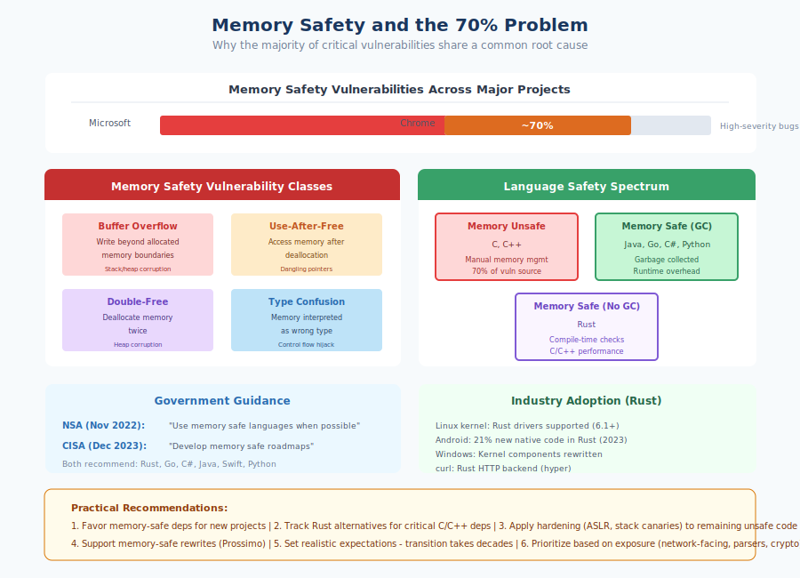

# 5.4 The Patching Gap

The previous section established that known, unpatched vulnerabilities cause more breaches than zero-days. This raises an obvious question: why do organizations fail to patch vulnerabilities when fixes are available? The answer lies in a complex interplay of technical constraints, organizational factors, and supply chain dynamics that together create the **patching gap**—the period during which vulnerable systems remain exposed despite available remediation.

Understanding why the patching gap exists is the first step toward closing it. For supply chain security specifically, the challenge is compounded because many vulnerabilities exist in code you did not write and cannot directly modify.

## The Scale of the Problem

!!! note "The Attacker Advantage"

    Qualys TruRisk Research found attackers weaponize vulnerabilities in an average of 19.5 days, while organizations patch in 30.6 days—an 11-day gap of continuous exposure. Web applications average 74.3 days to patch.

Research consistently shows that patching takes longer than security teams would like and policy often demands:

The **[Kenna Security/Cyentia Institute Prioritization to Prediction research][kenna-p2p]** on vulnerability remediation found that organizations typically remediate only about 10% of their vulnerabilities in any given month. Their analysis of 3.6 billion vulnerability observations across hundreds of organizations showed that this ratio remains remarkably constant regardless of organization size—every tenfold increase in open vulnerabilities is met with a roughly tenfold increase in closed vulnerabilities. High-severity vulnerabilities receive faster attention, but even critical CVEs have a median remediation time measured in weeks, not days.

**[Verizon's 2025 DBIR][verizon-dbir]** has documented that web applications take an average of 74.3 days to patch—significantly longer than network vulnerabilities at 54.8 days. This extended exposure window provides ample opportunity for attackers, who can begin mass exploitation of vulnerabilities within a median of just 5 days. The 2025 report found that edge device and VPN vulnerabilities saw an eight-fold increase in exploitation, yet only 54% of these critical vulnerabilities were fully remediated throughout the year—with a median time of 32 days to patch.

**[Qualys TruRisk Research][qualys-trurisk]** found that weaponized vulnerabilities are patched within an average of 30.6 days, while attackers weaponize those same vulnerabilities in just 19.5 days on average. This 11-day gap represents continuous exposure to significant cyber risk. For vulnerabilities on CISA's Known Exploited Vulnerabilities list, the disparity is even more pronounced.

For supply chain dependencies specifically, patching is often slower than for directly controlled code. Transitive dependency vulnerabilities are particularly challenging—as [Snyk's documentation notes][snyk-transitive], you cannot automatically fix transitive dependencies due to their relationships with other components. Organizations must wait for intermediate packages to update before they can incorporate fixes, adding delays at each level of the dependency tree.

[kenna-p2p]: https://www.cyentia.com/research/
[verizon-dbir]: https://www.verizon.com/business/resources/reports/dbir/
[qualys-trurisk]: https://blog.qualys.com/vulnerabilities-threat-research/2023/03/28/risk-fact-1-speed-is-the-key-to-out-maneuvering-adversaries
[snyk-transitive]: https://docs.snyk.io/scan-with-snyk/snyk-open-source/manage-vulnerabilities/vulnerability-fix-types

## Why Patching Fails: Technical Factors

Several technical factors contribute to delayed patching:

**Compatibility concerns** top the list. Updates to dependencies can introduce breaking changes, alter behavior in subtle ways, or create incompatibilities with other components. Development teams reasonably fear that updating a library to fix a security vulnerability might break production functionality. This fear is not unfounded—major version updates frequently require code changes, and even minor updates occasionally introduce regressions.

The JavaScript ecosystem's experience with `left-pad` and other incidents has made some teams cautious about automatic updates. A library update that breaks the build at 2 AM is a memorable experience that can make teams permanently gun-shy about patching.

**Testing requirements** consume significant resources. Responsible organizations test updates before deployment, but testing takes time. For complex applications, comprehensive testing might require days or weeks—during which the vulnerability remains unpatched. Organizations face a genuine tradeoff between patching speed and patching safety.

**Environmental complexity** makes updates difficult. Enterprise environments often run diverse software versions, custom configurations, and interconnected systems. An update that works in development might fail in production due to environmental differences. Legacy integrations and undocumented dependencies create uncertainty about update impacts.

**Embedded and constrained systems** cannot always be updated. IoT devices, industrial controllers, and medical equipment may lack update mechanisms or require vendor involvement to patch. Some systems must be taken offline for updates—unacceptable for critical infrastructure. Others run on hardware that cannot support newer software versions.

## Why Patching Fails: Organizational Factors

Technical challenges are often compounded by organizational dynamics:

**Resource constraints** limit patching capacity. Security teams and operations staff have finite time. When thousands of CVEs are disclosed annually and applications have hundreds of dependencies, triaging and patching everything is simply not possible. Teams must prioritize, and lower-severity or less-exposed vulnerabilities get deferred—sometimes indefinitely.

**Change management overhead** slows updates. Many organizations require formal approval for production changes. Change advisory boards may meet weekly or less frequently. Emergency change processes exist but create overhead and scrutiny. The processes designed to prevent outages from hasty changes also delay security updates.

**Organizational silos** fragment responsibility. The security team identifies vulnerabilities but cannot deploy patches. The development team can modify code but focuses on feature delivery. The operations team deploys changes but is measured on stability. Without clear ownership and aligned incentives, vulnerabilities fall between groups.

**Competing priorities** push patching down the list. Product releases, customer issues, revenue-generating features, and other urgent matters consume attention. Security patching competes with everything else demanding engineering time, and it often loses unless vulnerability severity is extreme or regulatory pressure applies.

## The Transitive Dependency Challenge

!!! danger "You Cannot Patch What You Do Not Control"

    When a vulnerability exists in a transitive dependency, you must wait for your direct dependency to update its dependency, then update your dependency, then update your application. Each step introduces delay. If any maintainer is slow, unresponsive, or has abandoned their project, the chain breaks.

Supply chain dependencies create patching challenges that go beyond what organizations face with their own code:

Consider a concrete scenario: A critical vulnerability is disclosed in a utility library. Your application uses Framework A, which uses Library B, which uses the vulnerable utility. The fix propagates as follows:

1. Utility maintainer releases patched version
2. Library B maintainer updates their dependency on the utility (days to weeks)
3. Library B releases a new version
4. Framework A maintainer updates their dependency on Library B (days to weeks)
5. Framework A releases a new version
6. Your team updates Framework A dependency (days)
7. Your application is rebuilt and deployed

Each step in this chain introduces delay. If any maintainer is slow, unresponsive, or has abandoned their project, the chain breaks.

**Pinned versions create intentional lag.** Many projects pin dependency versions for stability, only updating deliberately. This prevents surprise breakage but also prevents automatic propagation of security fixes. A project that updates dependencies quarterly will be vulnerable for up to three months after any dependency vulnerability is fixed.

**Dependency conflicts prevent updates.** Sometimes you cannot update a vulnerable dependency because doing so would conflict with version requirements of other dependencies. Resolving these conflicts may require updating multiple packages simultaneously, increasing complexity and risk.

## The Exploitability Rationalization

One common reason for deferred patching deserves specific attention: the claim that a vulnerability is "not exploitable in our context."

This rationalization proceeds as follows: A vulnerability is disclosed in a library. Analysis suggests that exploitation requires specific conditions—particular configurations, exposed interfaces, or usage patterns. The security team determines that the organization's use of the library does not meet those conditions, concluding the vulnerability is not exploitable and patching is unnecessary.

Sometimes this analysis is correct. Vulnerabilities often require preconditions for exploitation, and not all deployments meet those conditions. Reasonable risk assessment considers exploitability.

However, this rationalization is frequently misused:

- **Analysis may be incomplete.** Understanding whether complex applications meet exploitation conditions is difficult. Edge cases and unusual code paths may create exposure that analysis missed.

- **Conditions change.** Future code changes or configuration modifications might create the conditions for exploitation. A vulnerability dismissed today may become exploitable tomorrow.

- **Defense in depth erodes.** Leaving known vulnerabilities in place relies on other conditions preventing exploitation. If those conditions change, vulnerability remains.

- **Institutional memory fades.** The rationale for not patching may be forgotten while the vulnerability remains. Future security assessments discover the vulnerable version without the context of why patching was skipped.

We recommend treating the "not exploitable" determination as risk acceptance requiring formal documentation and periodic review, not as a reason to ignore vulnerabilities indefinitely.

## Strategies for Closing the Gap

Organizations can reduce their patching gap through deliberate process and tooling investments:

!!! tip "Automated Dependency Updates"

    Tools like **Dependabot**, **Renovate**, and **Snyk** shift the burden from actively monitoring for updates to reviewing and merging proposed changes. Configure auto-merge for patch-level updates, require human review for major versions, and prioritize security updates.

**Automated dependency updates** fundamentally change patching dynamics.

Configuration options allow tuning automation to organizational risk tolerance:

- Auto-merge patch-level updates after tests pass
- Require human review for minor and major version updates
- Prioritize security updates over feature updates
- Group updates to reduce pull request volume

**Continuous updating** rather than periodic updates reduces both individual update risk and cumulative drift. Small, frequent updates are easier to test and less likely to introduce compatibility issues than large version jumps accumulated over months.

**Robust testing pipelines** enable confident patching. Investments in automated testing—unit tests, integration tests, end-to-end tests—pay security dividends by enabling faster update cycles. Teams that can quickly validate update safety can patch faster.

**Risk acceptance frameworks** provide structure for vulnerability management decisions. Not every vulnerability can be patched immediately; formal frameworks ensure that:

- Risk acceptance is explicit rather than default
- Acceptance requires appropriate authorization
- Accepted risks are documented with rationale
- Accepted risks are reviewed periodically
- Mitigating controls are identified and implemented

CISA's SSVC framework (discussed in Section 5.3) provides a structured approach to categorizing vulnerabilities and determining appropriate response timelines.

**Reducing dependency count** limits patching burden. Fewer dependencies mean fewer vulnerabilities to track and fewer updates to manage. Judicious dependency selection (covered in Book 2, Chapter 13) reduces ongoing maintenance load.

**SBOM-driven vulnerability management** connects vulnerability databases to actual deployments. Software Bills of Materials enable automated matching of disclosed CVEs to deployed software, reducing the discovery portion of the patching process.

## Recommendations

Closing the patching gap requires commitment across technical, process, and organizational dimensions:

1. **Implement automated dependency updates.** Configure Dependabot, Renovate, or equivalent for all repositories. Start with auto-merge for patch updates; expand as confidence grows.

2. **Invest in testing automation.** Every hour spent on test coverage pays dividends in patching confidence. Good tests enable fast, safe updates.

3. **Establish patching SLAs.** Define target timeframes for patching based on severity and exposure. Critical vulnerabilities in internet-facing systems warrant hours to days, not weeks.

4. **Formalize risk acceptance.** When patching is delayed or declined, document the decision with rationale, mitigating controls, review timeline, and appropriate approval.

5. **Monitor dependency update velocity.** Track metrics on update adoption. How quickly do dependency updates flow through your development process? Where are the bottlenecks?

6. **Prefer actively maintained dependencies.** Dependencies with responsive maintainers who release patches quickly reduce your transitive dependency delay. Abandoned or slow-moving dependencies extend your exposure window.

7. **Consider update practices in dependency selection.** Book 2, Chapter 13 explores dependency evaluation criteria; maintainer responsiveness to security issues should be among them.

The patching gap will never close completely—resource constraints, testing requirements, and coordination challenges are inherent to complex systems. But organizations that deliberately invest in patching capability dramatically reduce their exposure to the known vulnerability attacks that dominate real-world breaches.

