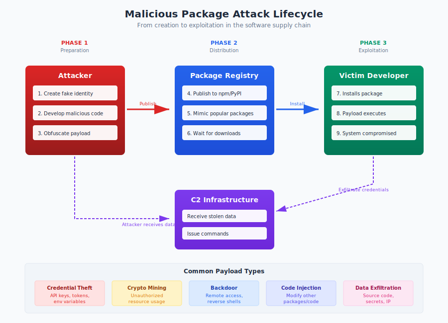

# 6.1 Typosquatting and Namesquatting

Package managers have made software dependency management remarkably convenient. A single command—`npm install lodash` or `pip install requests`—retrieves code from a registry and integrates it into your project. This convenience depends on package names being reliable identifiers: when you request `lodash`, you expect to receive the popular JavaScript utility library, not something else. Attackers exploit this trust through **typosquatting** and **namesquatting**, claiming package names designed to deceive developers into installing malicious code instead of legitimate dependencies.

These attacks are particularly insidious because they exploit human error rather than technical vulnerabilities. A single keystroke mistake can be the difference between installing a trusted package and executing an attacker's code.

#### How Typosquatting Works

**Typosquatting** in the package ecosystem involves registering package names that are visually or typographically similar to popular legitimate packages. When developers mistype package names—whether due to keyboard errors, memory lapses, or confusion about correct spelling—they may install the attacker's package instead of the intended one.

The attack mechanism is straightforward:

1. Attacker identifies popular packages with high download counts
2. Attacker generates variations of those names likely to result from typing errors
3. Attacker publishes packages with those names, containing malicious code
4. Developer makes a typing mistake when installing a package
5. Malicious package is installed and executed

The malicious payload often executes during installation, before the developer has any opportunity to inspect what they've installed. Package managers that support installation scripts (npm's `postinstall`, Python's `setup.py`) provide immediate code execution opportunity.

The attack scales efficiently. An attacker can register dozens of typosquat variations for popular packages with minimal effort. Each registration costs nothing on most registries and requires only a few minutes. The attacker then waits for victims to make mistakes—a passive attack that requires no active exploitation.

#### Common Typosquatting Patterns

Research on typosquatting has identified several common patterns that attackers exploit:

**Character substitution** replaces one character with a similar-looking or nearby character. Examples include:
- `djang0` instead of `django` (zero for letter 'o')
- `requets` instead of `requests` (transposed letters)
- `loadsh` instead of `lodash` (missing character)

Adjacent keyboard keys are common substitution targets: 's' for 'a', 'o' for 'i', 'n' for 'm'. Visually similar characters—'l' and '1', 'o' and '0'—also feature heavily.

**Character omission** removes a character from the name:
- `coffe-script` instead of `coffee-script`
- `electon` instead of `electron`
- `require` instead of `requires`

Doubled letters are particularly vulnerable to omission typos; developers frequently type `runing` when they mean `running`.

**Character addition** inserts an extra character:
- `lodashs` instead of `lodash`
- `expresss` instead of `express`
- `djangoo` instead of `django`

**Character transposition** swaps adjacent characters:
- `teh` instead of `the` (a famously common typo)
- `moent` instead of `moment`
- `reqeusts` instead of `requests`

**Vowel swapping** substitutes similar vowels:
- `raquests` instead of `requests`
- `djungo` instead of `django`

**Bitsquatting** exploits single-bit memory errors that could theoretically change characters:
- `coogle` instead of `google` (single bit flip)

**Delimiter variation** exploits confusion about package naming conventions:
- `cross-env.js` instead of `cross-env`
- `crossenv` instead of `cross-env`
- `python_dateutil` instead of `python-dateutil`

Different ecosystems use different conventions (hyphens vs. underscores, dots vs. no delimiters), and developers may apply the wrong convention when installing packages.

**Scope/namespace confusion** in ecosystems with namespacing:
- `@angular-devkit/core` vs. `@angulardevkit/core`
- `@typescript_eslinter/eslint` mimicking `@typescript-eslint` (2024 attack that gained hundreds of downloads daily)
- Public package named to resemble a scoped private package

**Combosquatting** adds common suffixes or prefixes to legitimate package names, piggybacking on brand recognition while appearing to be official extensions:
- `lodash-js`, `lodash-utils`, or `lodash-core` instead of `lodash`
- `axios-api` or `django-tools` appending common terms
- `noblox.js-async` and `noblox.js-proxy-server` targeting Roblox developers (2024 campaign)

**Brandsquatting** exploits cross-ecosystem name recognition by registering a package name popular in one ecosystem within a different ecosystem:
- Registering Python's `scipy` name in a Rust repository
- Using `org.fasterxml.jackson.core` instead of `com.fasterxml.jackson.core` on Maven (exploiting `.org` vs `.com` confusion)

A [2016 academic study by Nikolai Tschacher][tschacher-2016] at the University of Hamburg demonstrated the scale of the threat: his experiment uploading typosquatting packages to PyPI, npm, and RubyGems infected over 17,000 machines within days, with half executing the code as administrator. This early research proved that typing errors occur frequently enough to make the attack profitable for adversaries.

#### Namesquatting: Claiming Territory

**Namesquatting** differs from typosquatting in its mechanism but shares the goal of exploiting package name trust. Namesquatters register package names that:

- Match names of popular packages in other ecosystems (registering `requests` on RubyGems to match the Python package)
- Anticipate names of packages not yet published (claiming `aws-sdk-v4` before AWS releases version 4)
- Match names of internal corporate packages that might be requested from public registries (the dependency confusion vector discussed in Section 6.2)
- Use generic names that developers might guess (`` `mysql-connector` ``, `` `json-parser` ``)

Namesquatting may not involve malicious payloads initially. Some namesquatters simply reserve names for later use, potential sale, or to block others. Others immediately publish malicious content under the squatted name.

Registry policies on namesquatting vary. npm has policies against reserving names without intent to publish meaningful content but enforcement is inconsistent. PyPI generally operates on a first-come, first-served basis with limited active policing of squatted names.

#### Case Study: crossenv (2017)

The **crossenv incident** on npm in August 2017 became a defining example of typosquatting attacks against package registries.

`cross-env` is a popular npm package that allows setting environment variables in a way that works across different operating systems. It had millions of downloads, making it an attractive typosquatting target.

An attacker registered `crossenv`—the same name without the hyphen—and published a package containing malicious code. The package's `postinstall` script would:

1. Collect environment variables from the developer's machine
2. Harvest npm authentication tokens
3. Send the collected data to an attacker-controlled server

Environment variables often contain sensitive data: API keys, database credentials, cloud access tokens. Npm tokens would allow the attacker to publish further malicious packages under the victim's identity, potentially escalating the attack.

The package accumulated approximately 700 downloads before detection and removal—700 developers (or CI systems) that potentially exposed credentials to the attacker.

The incident prompted npm to implement additional monitoring for typosquatting patterns and led to broader industry awareness of the threat. It demonstrated that even security-conscious developers could fall victim to simple typing errors, and that package installation hooks provided immediate, powerful code execution.

Similar incidents have occurred across ecosystems:
- **`` `colourama` ``** (PyPI, 2018): Typosquat of the popular `colorama` package
- **`` `python3-dateutil` ``** (PyPI, 2019): Exploited confusion between pip and OS package naming
- **`` `electorn` ``** (npm, various): Multiple typosquats of the popular Electron framework

#### Case Study: PyPI March 2024 Campaign (500+ Packages)

In March 2024, [Check Point researchers identified a massive typosquatting campaign][checkpoint-pypi] on PyPI comprising over 500 malicious packages deployed in two waves. The attack's sophistication lay in its automation and scale:

- **First wave**: ~200 packages uploaded on March 27, 2024
- **Second wave**: 300+ additional packages followed immediately
- **Automation signals**: Each package came from a unique maintainer account (different names/emails), with each account uploading exactly one package
- **Uniformity**: All packages shared version 1.0.0 and contained identical malicious code

The typosquatting names were generated through randomization, producing simplistic variations like `reqjuests` and `tensoflom`. The packages targeted popular libraries including `requests`, `colorama`, and `CapMonster Cloud`.

The malicious payload, linked to the **zgRAT** malware family, was embedded in `setup.py` and executed during installation. It would:
- Steal cryptocurrency wallets
- Harvest browser data (cookies, extension data, credentials)
- Establish persistence mechanisms to survive reboots

The attack was severe enough that [PyPI suspended new user registration and project creation][pypi-suspension] for 10 hours on March 28, 2024—an unprecedented step demonstrating the operational impact of large-scale typosquatting campaigns.

#### Case Study: Maven Central Jackson Typosquatting (2025)

A December 2025 attack on Maven Central demonstrated how typosquatting techniques adapt to different ecosystems. [Aikido Security discovered][aikido-jackson] a malicious package exploiting namespace confusion:

- **Legitimate package**: `com.fasterxml.jackson.core:jackson-databind`
- **Malicious package**: `org.fasterxml.jackson.core:jackson-databind`

The attack exploited the `.org` vs `.com` domain pattern familiar from web typosquatting, applied to Maven's namespace structure. The attackers registered the domain `fasterxml.org` just days before deploying the malicious package.

The malware showed significant sophistication:
- **Spring Boot integration**: Disguised as a `@Configuration` class that auto-executed via Spring's bean initialization
- **Anti-analysis techniques**: Heavy code obfuscation including attempts to confuse LLM-based code analyzers
- **Multi-stage delivery**: AES-encrypted configuration with remote C2 infrastructure
- **Platform-specific payloads**: Downloaded different binaries for Windows, macOS, and Linux
- **Cobalt Strike beacon**: The final payload provided full remote access capabilities

The attack was identified and removed within 1.5 hours of reporting to Maven Central, but it demonstrated that typosquatting remains effective even in ecosystems with more structured naming conventions.

#### Detection Challenges and Registry Responses

Detecting typosquatting is conceptually simple but operationally challenging:

**Scale defeats manual review.** Major registries process hundreds or thousands of new package publications daily. Manual review of each for potential typosquatting is impractical.

**Legitimate similar names exist.** Not every package with a name similar to a popular package is malicious. A package named `requests-extra` might be a legitimate extension. Detection systems must distinguish typosquatting from legitimate naming.

**Attacker adaptation.** When registries implement detection for one pattern, attackers shift to others. Detection is an ongoing arms race.

**Cross-ecosystem blind spots.** A typosquat targeting confusion between ecosystems (npm name squatting a PyPI package name) may not be detected by either registry in isolation.

Registries have implemented various countermeasures:

**Edit distance checking** flags new packages whose names are within a small edit distance (one or two character changes) of highly popular packages. npm uses this approach to trigger additional review.

**Popularity-weighted analysis** applies more scrutiny to names similar to high-download packages. A typosquat of a package with 10 downloads matters less than one targeting a package with 10 million downloads.

**Community reporting** enables users to flag suspicious packages for review. Both npm and PyPI support abuse reporting, though response times vary.

**Automated malware scanning** analyzes package contents for known malicious patterns. This catches some typosquatting packages based on payload rather than name.

**Namespace/scoping** reduces typosquatting risk by associating packages with verified publishers. A package published under `@google/package-name` has different trust properties than `google-package-name` from an anonymous account.

Research by security firms suggests that despite these measures, typosquatting packages regularly reach registries. [Sonatype's 2024 State of the Software Supply Chain report][sonatype-2024] documented over 512,000 malicious packages discovered across major ecosystems in the past year—a 156% year-over-year increase—many using typosquatting techniques.

#### Recommendations

**For individual developers:**

1. **Type carefully and verify package names.** Before running install commands, double-check the package name. Copy-paste from authoritative sources (official documentation, verified websites) rather than typing from memory.

2. **Verify package details before installation.** Check download counts, publication dates, and maintainer information. A package with 50 downloads claiming to be a popular library warrants suspicion.

3. **Use lockfiles.** After initial installation, lockfiles (`package-lock.json`, `poetry.lock`) prevent accidental substitution of different packages with similar names.

4. **Review new dependencies.** Before adding a new dependency, spend a moment confirming you have the correct package from the correct maintainer.

**For organizations:**

1. **Implement allowlists for approved packages.** Rather than allowing any package to be installed, maintain a list of vetted dependencies that developers can use without additional approval.

2. **Use private registries with upstream filtering.** Tools like Nexus, Artifactory, or Cloudsmith can proxy public registries while applying additional filtering rules.

3. **Monitor for typosquats of your own packages.** If your organization publishes open source packages, monitor registries for typosquatting variations of your package names.

4. **Consider defensive registration.** Register obvious typosquatting variations of your important packages before attackers do. This is imperfect (you cannot register all variations) but raises the bar.

5. **Audit installation logs.** Monitor what packages are actually installed in your environments. Unexpected package names warrant investigation.

**For registry operators:**

1. **Implement edit distance checking** for new packages with names similar to high-popularity packages.

2. **Enforce verification for popular namespaces.** Packages claiming affiliation with known organizations or projects should require verification.

3. **Provide clear reporting mechanisms** for suspected typosquatting, with prompt response processes.

4. **Share intelligence across registries** about known typosquatting campaigns and attacker patterns.

Typosquatting exploits the convenience that makes package managers valuable. Complete prevention is impossible without eliminating that convenience, but awareness, verification habits, and organizational controls significantly reduce risk.

[tschacher-2016]: https://incolumitas.com/2016/06/08/typosquatting-package-managers/
[sonatype-2024]: https://www.sonatype.com/state-of-the-software-supply-chain/introduction
[checkpoint-pypi]: https://blog.checkpoint.com/securing-the-cloud/pypi-inundated-by-malicious-typosquatting-campaign/
[pypi-suspension]: https://thehackernews.com/2024/03/pypi-halts-sign-ups-amid-surge-of.html
[aikido-jackson]: https://www.aikido.dev/blog/maven-central-jackson-typosquatting-malware

