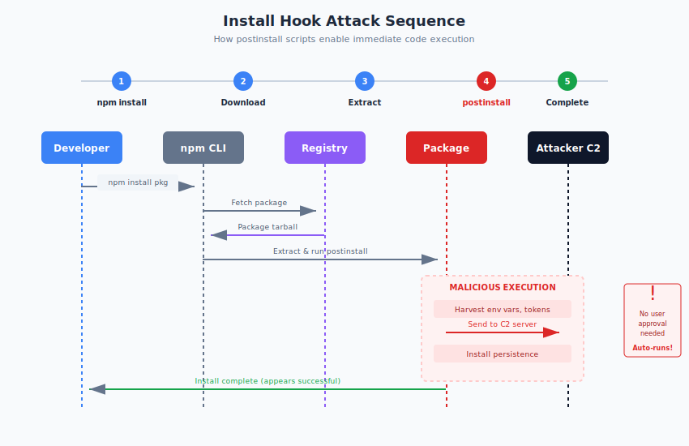

# 6.2 Dependency Confusion Attacks

In February 2021, security researcher Alex Birsan published research that would reshape enterprise understanding of software supply chain risk. By exploiting a simple logic flaw in how package managers resolve dependencies, Birsan gained code execution on internal systems at Apple, Microsoft, PayPal, Shopify, Netflix, Tesla, Uber, and dozens of other major companies. His attacks required no authentication, no exploitation of traditional vulnerabilities, and in most cases, no insider knowledge beyond publicly leaked internal package names. The technique, which Birsan called **dependency confusion**, revealed that the boundary between public and private package ecosystems was far more porous than most organizations realized.

## The Public/Private Package Conflict

Modern enterprises use packages from two sources: **public registries** (npm, PyPI, Maven Central) containing open source software, and **private registries** containing proprietary internal packages. This dual-source model is nearly universal—organizations download public dependencies while also maintaining internal libraries shared across teams.

The dependency confusion attack exploits what happens when both sources contain a package with the same name. If a developer requests `company-internal-utils`, where should the package manager look? The public registry? The private registry? Both?

Different package managers answer this question differently, and none of the default behaviors fully anticipated the security implications. Many package managers, when configured to use both public and private sources, would prefer the package with the higher version number—regardless of which source provided it. An attacker who knew the name of an internal package could register that name on a public registry with an extremely high version number, and the victim's build system would fetch the attacker's malicious package instead of the legitimate internal one.

This is dependency confusion: substituting a public package for a private one by exploiting package resolution logic.

## Alex Birsan's Research and the $130,000 Bug Bounties

Birsan's research,[^birsan-research] published in February 2021, demonstrated the attack against some of the world's most security-conscious organizations.

His methodology was straightforward:

1. **Identify internal package names**: Birsan found internal package names in various public sources—JavaScript files accidentally published to npm, error messages in mobile applications, exposed internal documentation, and other information leaks.

2. **Register public packages with those names**: He registered packages on npm, PyPI, and RubyGems using the discovered internal names.

3. **Publish with high version numbers**: His packages used extremely high version numbers (e.g., 999.0.0) to ensure they would be preferred over legitimate internal packages.

4. **Include callback code**: His packages contained code that would make a DNS request to a server he controlled, demonstrating code execution without causing damage. The request included the hostname of the affected machine, providing proof of impact.

5. **Wait for victims to build**: When companies ran builds that referenced the targeted internal package names, their build systems fetched Birsan's packages from public registries instead of internal ones.

> "I was able to gain access to internal systems of over 35 major technology companies," Birsan wrote. "All of the companies targeted were informed about the issue during the regular bug bounty process."

The results were remarkable. Birsan received bug bounty payments exceeding $130,000 from affected companies, including:

- **Microsoft**: $40,000 bounty, with code execution confirmed on internal build systems
- **Apple**: $30,000 bounty, with code execution confirmed on internal systems
- **PayPal**: Code execution demonstrated
- **Shopify**: $30,000 bounty
- **Netflix**: Vulnerability confirmed
- **Uber**: Vulnerability confirmed
- **Yelp**: Code execution demonstrated

The affected organizations included sophisticated security teams with mature application security programs. The vulnerability succeeded not because these organizations lacked security awareness but because the attack exploited supply chain mechanics that few had considered.

## How Build Systems Resolve Package Names

Understanding dependency confusion requires understanding how package managers resolve names to specific packages. The resolution logic varies by ecosystem, but problematic patterns recur:

**npm** allows multiple registries to be configured through `.npmrc`. When a package is requested, npm checks registries in order unless the package uses scoped naming (`@company/package-name`). Before npm's scope enforcement improvements, organizations using private registries alongside npm's public registry faced dependency confusion risk.

**pip (Python)** historically checked PyPI before private indexes unless explicitly configured otherwise. The `--extra-index-url` flag, commonly used to add private indexes, does not replace PyPI but adds to the search path. Pip then prefers the highest version number across all sources.

**RubyGems** similarly allows multiple sources. When a package exists in multiple sources, resolution behavior can be ambiguous, and version number comparison across sources is possible.

**Maven/Gradle** check repositories in configuration order, but complex inheritance and shadowing rules can create confusion about which repository actually provides a package.

The common vulnerability pattern across ecosystems:

1. Organization configures both public and private package sources
2. Build requests an internal package by name
3. Package manager finds versions in both sources (internal registry and attacker-controlled public package)
4. Package manager selects the higher version number
5. Attacker's package—with version 999.0.0—wins

The version number mechanism is key. Attackers cannot generally predict exact version numbers of internal packages, but they can publish extremely high version numbers that exceed any plausible internal version.

## Ecosystem-Specific Variations

Each package ecosystem presented distinct vulnerability characteristics:

**npm/Node.js**: Organizations using unscoped package names for internal packages were vulnerable. npm's scope feature (`@company/package-name`) provides protection when properly used because scopes are controlled by verified organizations. However, many organizations had legacy internal packages without scopes, or used `--registry` configurations that did not fully isolate sources.

**Python/PyPI**: The pip `--extra-index-url` behavior was particularly problematic. This flag is commonly used in documentation and CI configurations to add private package sources, but it does not disable PyPI—it adds a source while keeping PyPI active. The `--index-url` flag replaces PyPI, but requires explicit listing of both sources if both are needed.

Birsan found that many organizations had misconfigured pip, thinking `--extra-index-url` created isolation when it did not.

**Ruby/RubyGems**: Bundler's source blocks provide some protection, but organizations without strict source configuration faced similar risks.

**NuGet/.NET**: NuGet's package source priority features provide mitigation options, but default configurations could be vulnerable.

## Enterprise Exposure Points

Birsan's research revealed multiple paths through which internal package names leak publicly:

**Embedded in published packages**: JavaScript packages published to npm sometimes contained import statements referencing internal packages. Mobile applications included build manifests. Server-side rendering code was exposed in client bundles.

**Error messages and stack traces**: Error tracking services, crash reports, and log aggregation sometimes captured and exposed internal package names.

**Documentation and code snippets**: Internal documentation published accidentally, blog posts showing example configurations, and conference presentations revealed internal tooling names.

**Open source contributions**: Developers contributing to open source projects sometimes left references to internal packages in code or commit messages.

**Job postings and public profiles**: Technical job descriptions and LinkedIn profiles mentioned internal frameworks and libraries.

Once attackers know an internal package name exists, they can attempt the attack. The attack does not require knowing version numbers, implementation details, or having any internal access—only the name.

## Remediation Strategies

Organizations can protect against dependency confusion through several complementary approaches:

**Use scoped or namespaced packages**: npm scopes (`@company/package-name`), Python namespace packages, and similar mechanisms bind package names to verified organizational identities. Attackers cannot register packages under your scope/namespace. This is the most robust protection.

Migrate internal packages to scoped naming:

- npm: `@yourcompany/internal-utils` instead of `internal-utils`
- PyPI: Consider using a distinct prefix and/or namespace packages

**Configure package sources correctly**: Ensure build systems check internal registries first and public registries only for packages known to be public.

For pip, use `--index-url` with your private registry and `--extra-index-url` for PyPI (reversing the common pattern). Or use pip's dependency link features to explicitly specify sources.

For npm, use scoped packages and configure scopes to route to appropriate registries:
```ini
@yourcompany:registry=https://your-internal-registry.com
```

**Implement repository allowlisting**: Rather than allowing any public package, maintain explicit lists of approved external dependencies. Reject packages not on the list.

**Use private registry proxies with filtering**: Enterprise repository managers ([Nexus][nexus], [Artifactory][artifactory], [Cloudsmith][cloudsmith]) can proxy public registries while applying filtering rules. Configure proxies to block packages matching internal naming patterns.

**Monitor public registries for your internal names**: Regularly check whether anyone has registered packages matching your internal package names on public registries. Treat such registrations as potential attacks requiring investigation.

**Claim your internal names on public registries**: Defensively register your internal package names on public registries with placeholder packages that clearly indicate they are reserved. This prevents attackers from claiming the names.

**Audit for leaked package names**: Review public repositories, error tracking systems, and documentation for exposed internal package names. Treat name exposure as a security issue requiring remediation.

## Registry and Tooling Responses

Following Birsan's publication, package ecosystems implemented various mitigations:

**npm** emphasized scope usage and improved documentation around registry configuration security. The scoped package feature, already available, provides the most robust protection when consistently used.

**pip** and the **Python Packaging Authority** clarified documentation about index configuration. [PEP 708][pep-708], provisionally accepted in 2023, extends the Simple Repository API with "tracks" metadata to help installers safely determine package source relationships, directly addressing dependency confusion risks. Projects like pip's `--require-hashes` provide integrity verification that can limit confusion attacks.

[**Azure Artifacts**][azure-artifacts] and other enterprise package management services added explicit controls for blocking public package fallback and implemented upstream source filtering.

**JFrog Artifactory** and **Sonatype Nexus** added features specifically targeting dependency confusion, including pattern-based blocking and enhanced logging for package resolution decisions.

[**GitHub Advisory Database**][github-advisory] added guidance on dependency confusion remediation.

Despite these improvements, the core vulnerability—ambiguity in package resolution across multiple sources—remains a configuration challenge rather than a solved problem. Organizations must actively implement protections; default configurations often remain vulnerable.

## Ongoing Relevance

Dependency confusion remains an active attack vector. Security firms regularly discover malicious packages exploiting the technique. Organizations that have not implemented specific mitigations continue to be exposed.

The attack's effectiveness derives from exploiting legitimate functionality rather than bugs. Package managers are working as designed—the problem is that design did not anticipate adversarial use of public registries to target private package names.

We recommend treating dependency confusion mitigation as a required security control for any organization using private packages:

1. **Audit current configuration**: Determine whether your build systems are vulnerable by reviewing package manager configuration and testing resolution behavior.

2. **Migrate to scoped/namespaced packages**: This structural solution eliminates the confusion possibility rather than relying on configuration.

3. **Implement registry controls**: Use repository managers with explicit source controls, and configure package managers to enforce expected resolution order.

4. **Monitor for name registration**: Actively watch public registries for packages matching your internal names.

5. **Educate development teams**: Ensure developers understand the risk and follow secure configuration practices.

The dependency confusion attack demonstrated that supply chain security extends beyond malicious packages intentionally installed—it includes the mechanics of how package managers select which package to install in the first place. Organizations must control not just what packages they approve, but how their build systems resolve package names to specific sources.

[^birsan-research]: Alex Birsan, "Dependency Confusion: How I Hacked Into Apple, Microsoft and Dozens of Other Companies," Medium, February 2021, https://medium.com/@alex.birsan/dependency-confusion-4a5d60fec610

[pep-708]: https://peps.python.org/pep-0708/
[nexus]: https://www.sonatype.com/products/nexus-repository
[artifactory]: https://jfrog.com/artifactory/
[cloudsmith]: https://cloudsmith.com/
[azure-artifacts]: https://azure.microsoft.com/en-us/products/devops/artifacts
[github-advisory]: https://github.com/advisories

