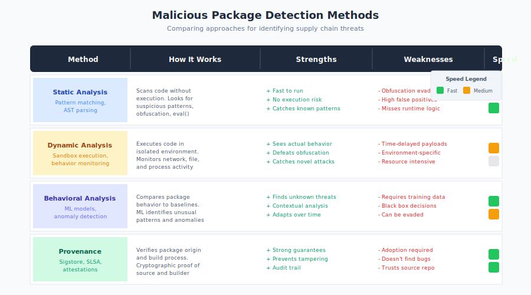

# 6.3 Malicious Packages

Typosquatting and dependency confusion exploit mistakes—typos, misconfigurations, resolution logic flaws. But the most direct supply chain attack is simply publishing code designed to harm anyone who installs it. **Malicious packages** are software intentionally crafted to steal credentials, install backdoors, mine cryptocurrency, or achieve other attacker objectives, published to package registries where unsuspecting developers will incorporate them into their projects.

A note on terminology: this section focuses on malicious packages—those created from the outset with harmful intent. This is distinct from **compromised packages**, which are legitimate packages that attackers take over through account hijacking, social engineering, or other means (such as the `ua-parser-js` and `event-stream` incidents described below). Both categories pose supply chain risks, but they differ in origin: malicious packages are born harmful, while compromised packages become harmful after being corrupted. The defenses against each overlap substantially, though compromised packages often benefit from the legitimate package's established trust and download base.

The scale of this threat has grown dramatically. [Sonatype's 2024 State of the Software Supply Chain report][sonatype-2024] documented 512,847 malicious packages discovered across major ecosystems in the past year—a 156% increase year-over-year, with 704,102 total malicious packages identified since 2019. The arms race between attackers publishing malicious packages and defenders attempting to detect and remove them has become a defining feature of modern package ecosystem security.

## Motivations Behind Malicious Packages

Attackers publish malicious packages for diverse objectives, each influencing the attack's design:

**Credential and token harvesting** is among the most common motivations. Malicious packages target authentication credentials, API keys, cloud access tokens, and other secrets accessible in development and build environments. The `ua-parser-js` compromise (October 22, 2021) exfiltrated environment variables that often contain npm tokens, AWS credentials, and other sensitive values. Stolen credentials enable further attacks: publishing additional malicious packages, accessing cloud infrastructure, or selling credentials in underground markets.

**Cryptocurrency theft** specifically targets developers working with cryptocurrency projects. Attackers seek wallet private keys, seed phrases, and exchange credentials. The `event-stream` incident (November 20, 2018) specifically targeted Copay Bitcoin wallet developers, attempting to steal wallet contents from users of the wallet application.

**Cryptomining** hijacks computational resources for cryptocurrency mining. Unlike credential theft, cryptomining provides ongoing revenue without requiring the attacker to monetize stolen data. Mining packages often attempt persistence, continuing to run after initial installation. The `ua-parser-js` attack included a cryptominer alongside its credential harvesting payload.

**Backdoor installation** provides attackers with persistent remote access to compromised systems. The XZ Utils backdoor ([CVE-2024-3094][cve-2024-3094], discovered March 29, 2024) exemplifies this sophistication: the attacker contributed legitimately for over two years, building trust until granted maintainer access—a patience-intensive approach that defeats technical controls because the attacker becomes an insider. The malicious code was hidden in test files and activated only in specific build configurations designed to provide SSH access while evading detection in security researcher environments. This level of sophistication suggests nation-state or well-funded criminal involvement and demonstrates why backdoors in packages are particularly dangerous: they can persist through updates and are difficult to detect through behavioral analysis that focuses on installation-time activity. For detection details, see Book 2, Section 19.1.

**Protestware** is a category of malicious package created for ideological rather than financial purposes. The `node-ipc` maintainer's modification (March 7-8, 2022) to target systems with Russian or Belarusian IP addresses demonstrated how maintainer access could be weaponized for political expression.[^node-ipc-protestware] While protestware may be seen as distinct from criminal malware, from a security perspective the distinction is irrelevant—unauthorized code execution causing harm is the outcome regardless of motivation.

[^node-ipc-protestware]: Ax Sharma, "Popular npm package 'node-ipc' altered to wipe files on dev machines," BleepingComputer, March 8, 2022; GitHub Advisory GHSA-97m3-w2cp-4xx6.

**Supply chain pre-positioning** involves planting dormant capabilities for later activation. Nation-state actors may publish or compromise packages not for immediate exploitation but to establish access for future operations. The patience demonstrated in the XZ Utils attack—over two years of trust-building before introducing malicious code—suggests sophisticated actors view package ecosystems as strategic targets worth long-term investment.

## Technical Attack Mechanisms

Malicious packages employ various techniques to execute code and achieve attacker objectives:

**Installation script hooks** provide immediate code execution when a package is installed. Most package managers support scripts that run during installation:

- npm: `preinstall`, `install`, `postinstall` scripts in `package.json`
- pip: `setup.py` execution during installation
- RubyGems: `extconf.rb` and extension building
- Maven: Custom plugins can execute during builds

These hooks execute before the developer has any opportunity to review package contents. A single `npm install malicious-package` command executes whatever code the attacker has placed in installation scripts, running with the installing user's privileges.

The `1337qq-js` package (discovered December 30, 2019) demonstrated this technique effectively: its `postinstall` script harvested environment variables containing npm tokens and system information, transmitting them to an attacker-controlled server.[^1337qq-js]

[^1337qq-js]: npm Security Team, "Malicious packages detected in npm registry," GitHub Advisory GHSA-xpxp-3c9h-vww2, December 2019; Socket.dev threat research.

**Runtime code execution** occurs when application code imports and uses the malicious package. Unlike installation hooks, runtime execution requires the package to be imported, but it provides access to the application's context, data, and network connections.

Runtime attacks often target:

- Environment variables and configuration
- Filesystem access to secrets and credentials
- Network connections for exfiltration
- Application data available in memory

**Obfuscated payloads** hide malicious functionality from casual inspection. Techniques include:

- Minification and bundling that obscures code structure
- Base64 or hex encoding of malicious code
- Dynamic code generation (`eval()`, `new Function()`)
- String manipulation to construct commands at runtime
- External payload download at runtime

The sophistication of obfuscation varies. Some malicious packages use trivial encoding easily detected by automated tools. Others employ multiple layers of obfuscation designed to evade static analysis.

**Conditional execution** activates malicious behavior only under specific conditions, evading analysis that occurs in controlled environments:

- Checking environment variables to detect CI/CD systems or sandboxes
- Delaying execution for hours or days after installation
- Triggering only when specific dependencies are present
- Activating only after reaching a download threshold

**Staged payloads** download malicious code from external servers rather than including it in the package. This reduces the malicious content visible in the package itself and allows attackers to update payloads without publishing new package versions. Detection systems analyzing package contents may miss the actual malicious functionality if it's fetched at runtime.

## Evasion Sophistication

The sophistication of malicious package techniques has increased as detection capabilities improve, creating an ongoing arms race:

**First generation attacks** (roughly 2016-2018) were often crude: clearly malicious code with minimal obfuscation, obvious exfiltration endpoints, and immediate execution. Detection relied primarily on community reporting after incidents.

**Second generation attacks** (2018-2021) introduced obfuscation, conditional execution, and more subtle persistence mechanisms. Attackers began targeting specific high-value packages (through typosquatting or account compromise) rather than publishing obviously suspicious standalone packages.

**Current generation attacks** demonstrate patience and sophistication that marks a concerning evolution in supply chain threats:

- Multi-year trust-building campaigns to gain maintainer access (as seen with XZ Utils)
- Legitimate functionality alongside hidden malicious code
- Complex obfuscation defeating static analysis
- Environment detection evading sandbox analysis
- Supply chain attacks targeting package maintainers rather than packages directly

Research by [Socket.dev][socket] found that malicious packages increasingly mimic legitimate package patterns—proper documentation, reasonable functionality, professional presentation—while hiding malicious code in peripheral files or rarely-executed code paths.

## Detection Methods and Tools

Defenders have developed various approaches to identify malicious packages:

**Static analysis** examines package source code for suspicious patterns without execution:

- Obfuscated code detection (high entropy strings, unusual encoding)
- Suspicious API usage (network calls, filesystem access, shell commands)
- Known malicious code signatures
- Dependency graph anomalies

Tools like [**Socket.dev**][socket] specialize in static analysis of package contents, flagging packages with unusual characteristics. The Socket security analyzer examines installation scripts, detects obfuscation patterns, and identifies suspicious network destinations.

**Behavioral analysis** executes packages in controlled environments to observe runtime behavior:

- Network connections to unknown servers
- Filesystem access beyond expected paths
- Environment variable access
- Process spawning and shell execution

Sandbox-based analysis can detect behavior that static analysis misses, but sophisticated packages evade sandboxes through environment detection and delayed execution.

**Provenance verification** validates the relationship between source code and published packages:

- SLSA attestations linking packages to specific builds
- Sigstore signatures verifying publisher identity
- Reproducible build verification

These approaches don't directly detect malicious code but establish trust through verification of the publication chain.

**Community reporting** remains essential despite automated tools. Developers who notice suspicious behavior in packages can report to registry security teams. Many malicious packages are discovered through manual review after something seems wrong, rather than through automated detection.

**Vulnerability databases** track known malicious packages:

- [GitHub Advisory Database][github-advisory] includes malicious package entries
- npm audit checks against known malicious packages
- [Snyk][snyk], Socket, and other Software Composition Analysis (SCA) tools maintain malicious package databases

**Machine learning approaches** attempt to identify malicious packages based on patterns learned from known examples:

- Code similarity to known malware
- Metadata anomalies (new maintainer, sudden capability changes)
- Behavioral clustering identifying packages that act unlike their stated purpose

## Registry Security Measures

Package registries have implemented various security measures:

**npm** employs multiple detection layers:

- Automated scanning of new package publications
- Security holds that prevent installation of flagged packages
- Community reporting and security team investigation
- Integration with GitHub security features

npm processes security reports and can place packages in "security hold" status, preventing installation while investigation proceeds. High-profile incident response (like ua-parser-js) occurs within hours of detection.

**PyPI** has improved security measures significantly:

- Malware scanning using multiple analysis tools
- Automated removal of packages matching known malicious patterns
- Support for Trusted Publishers reducing credential compromise risk
- Two-factor authentication requirements for critical projects

**RubyGems** employs:

- Automated scanning for known malicious patterns
- Community reporting and moderation
- Integration with security databases

**Maven Central** uses:

- Namespace verification preventing impersonation
- Immutable artifacts (published content cannot be modified)
- Security scanning though detection capabilities vary

Detection effectiveness varies across registries. Larger registries with more resources (npm, PyPI) generally detect and remove malicious packages faster than smaller ecosystems. However, no registry achieves comprehensive detection—malicious packages regularly reach users before discovery. Malicious packages can persist for days or weeks before removal, accumulating significant download counts before detection.

## The Ongoing Arms Race

The conflict between attackers and defenders creates evolutionary pressure on both sides:

**Attackers adapt to detection:**

- When registries block known obfuscation patterns, attackers develop new encoding schemes
- When behavioral analysis detects immediate network connections, attackers add delays
- When community reporting catches typosquatting, attackers invest in long-term trust building

**Defenders develop new capabilities:**

- Machine learning identifies novel patterns without explicit signatures
- Provenance verification shifts from code analysis to trust chain validation
- Ecosystem-wide monitoring identifies coordinated campaigns

Neither side achieves decisive advantage. Registries improve detection, but sophisticated attackers continue publishing malicious packages. The economic asymmetry favors attackers: publishing a malicious package costs essentially nothing, while comprehensive defense requires substantial ongoing investment.

The trend suggests this arms race will continue indefinitely. Organizations cannot rely solely on registry detection to protect them from malicious packages—they must implement additional layers of defense including:

1. **Careful dependency selection**: Evaluate packages before adoption, preferring well-established projects with clear provenance.

2. **Lockfile discipline**: Use lockfiles to ensure reproducible installations and prevent silent substitution of packages.

3. **Minimal dependency principles**: Reduce the number of dependencies to reduce attack surface.

4. **SCA tooling**: Deploy tools that check dependencies against malicious package databases and flag suspicious patterns.

5. **Build environment isolation**: Limit what installation scripts can access, restricting credentials and network in build environments.

6. **Monitoring and alerting**: Detect anomalous network connections, unexpected process execution, and credential access that might indicate compromise.

The malicious package threat is not a problem that will be solved but a risk that must be continuously managed. The companion volumes provide detailed guidance: Book 2, Chapter 13 explores dependency selection strategies, and Book 2, Chapter 14 covers scanning and monitoring approaches that address this ongoing threat.

[sonatype-2024]: https://www.sonatype.com/state-of-the-software-supply-chain/introduction
[cve-2024-3094]: https://nvd.nist.gov/vuln/detail/CVE-2024-3094
[socket]: https://socket.dev/
[github-advisory]: https://github.com/advisories
[snyk]: https://snyk.io/

