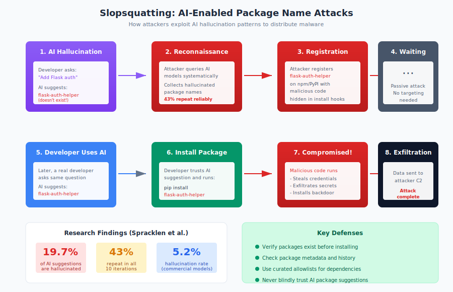

# 6.6 Slopsquatting: AI-Hallucinated Package Attacks

The emergence of AI coding assistants has transformed software development, enabling developers to generate code faster than ever before. Tools like GitHub Copilot, ChatGPT, Claude, and others have become integral to modern development workflows. However, this productivity comes with a novel security risk: AI models sometimes recommend packages that do not exist. Attackers have recognized this vulnerability and begun registering these hallucinated package names, creating a new attack vector that security researcher Seth Larson termed **slopsquatting** in April 2025.

This attack represents a fundamental shift in supply chain threats. Traditional attacks exploit human error or trust relationships. Slopsquatting exploits the behavior of AI systems that developers increasingly rely on, creating risk that scales with AI adoption across the software industry.

## Definition and Origin

The term **slopsquatting** combines "slop"—internet slang for low-quality AI-generated content—with "squatting," the practice of claiming valuable names for malicious purposes. The term emerged from a conversation between Seth Larson, the Python Software Foundation's Security Developer-in-Residence, and Andrew Nesbitt, creator of Ecosyste.ms. [Nesbitt popularized the term on Mastodon in April 2025][nesbitt-slopsquatting], defining it as:

> "Slopsquatting—when an LLM hallucinates a non-existent package name, and a bad actor registers it maliciously. The AI brother of typosquatting."

The attack leverages a well-documented phenomenon: large language models (LLMs) generate plausible-sounding but non-existent package names when asked to solve programming problems. If attackers can predict which non-existent names AI models will recommend, they can register those names with malicious packages and wait for victims to install them.

## How AI Coding Assistants Hallucinate Packages

AI coding assistants are trained on vast corpora of code, documentation, and technical discussions. When generating code recommendations, they predict likely tokens based on patterns in their training data. This prediction can produce package names that:

- **Sound plausible**: The names follow ecosystem naming conventions and seem like reasonable package names
- **Fit the context**: The hallucinated name relates to the problem being solved
- **Do not exist**: The package was never published to any registry

For example, when asked to write code for a specific task, an AI might suggest:

```python
from flask_security_utils import generate_token
```

If `flask-security-utils` does not exist on PyPI, this is a hallucination. The name is plausible—it sounds like something that might exist—but the AI has invented it based on patterns rather than referencing an actual package.

Several factors contribute to hallucination:

- **Training data age**: Models trained on older data may reference packages that were removed, renamed, or never existed
- **Pattern matching over recall**: Models generate names that fit patterns rather than retrieving exact names from memory
- **Context extrapolation**: Models invent names that seem like they should exist given the programming context
- **Frequency bias**: Common words and patterns in training data influence generation even when they produce non-existent combinations

## Research Findings: The Scale of the Problem

Academic research has begun quantifying the slopsquatting risk. A [study by Spracklen et al.][spracklen-study] titled "We Have a Package for You!" systematically tested AI models' tendency to hallucinate package names.

**Key findings:**

- Commercial AI models hallucinated packages in approximately **5.2% of code samples**, while open-source models reached **21.7%**
- Hallucination rates varied by model and ecosystem, with some model-ecosystem combinations exceeding 25%
- **Python (PyPI)** and **JavaScript (npm)** were particularly affected due to their large package ecosystems and prominence in training data
- Newer models did not consistently perform better than older ones on this dimension

The research tested multiple commercial and open-source models across thousands of code generation prompts, providing statistically robust evidence that hallucination is not a rare edge case but a consistent behavior affecting a significant portion of AI-generated code recommendations.

## The Repeatability Problem

Perhaps the most concerning finding from slopsquatting research is that hallucinations are **predictable and repeatable**. If an AI model hallucinates a particular package name once, it is likely to hallucinate the same name again when given similar prompts.

The Spracklen study found that hallucinated package names showed a bimodal distribution: **58% were repeated more than once** across 10 runs of the same prompt, with **43% appearing every time**. This repeatability transforms hallucination from a random error into an exploitable vulnerability:

1. Attackers can systematically query AI models with common programming prompts
2. They collect hallucinated package names that appear repeatedly
3. They register these names on public registries
4. When other developers ask similar questions and receive the same hallucinated recommendations, they install the attacker's packages

This repeatability exists because hallucinations are not truly random—they result from deterministic patterns in model behavior. The same training data biases that cause one developer to receive a hallucinated recommendation will cause other developers with similar prompts to receive the same recommendation.

[Socket.dev research][socket-slopsquatting] confirmed this pattern, identifying specific hallucinated package names that appeared consistently across different AI models and user sessions. Some hallucinated names were recommended thousands of times across the developer community.

## Attack Mechanics

A slopsquatting attack proceeds as follows:

1. **Reconnaissance**: Attacker queries AI coding assistants with common programming questions across various domains (web development, data science, security, etc.)

2. **Harvesting**: Attacker collects package names mentioned in AI responses and checks whether they exist on public registries

3. **Validation**: Attacker re-queries with variations to confirm which hallucinated names appear consistently

4. **Registration**: Attacker registers confirmed hallucinated names on appropriate registries (PyPI, npm, RubyGems, etc.)

5. **Payload deployment**: Attacker publishes packages with malicious functionality—credential theft, cryptomining, backdoors, or other payloads

6. **Waiting**: Attacker waits for developers to receive the same hallucinated recommendations and install the now-registered malicious packages

The attack is particularly efficient because it requires no direct interaction with victims. The AI system serves as an unwitting accomplice, directing developers toward the attacker's packages through its recommendations.

## Comparison to Traditional Typosquatting

While slopsquatting shares surface similarities with typosquatting, the underlying dynamics differ significantly:

| Dimension | Typosquatting | Slopsquatting |
|-----------|---------------|---------------|
| **Error source** | Human typing mistakes | AI hallucination |
| **Target** | Variations of existing packages | Entirely invented names |
| **Predictability** | Based on keyboard layout, common typos | Based on AI model behavior patterns |
| **Scale** | Limited by typing error probability | Scales with AI usage across industry |
| **Evolution** | Relatively static attack surface | Evolves with AI model updates |

Typosquatting exploits the gap between what a developer intends to type and what they actually type. Slopsquatting exploits the gap between what developers need and what AI systems recommend.

The distinction matters for defense. Typosquatting detection focuses on edit distance from known legitimate packages. Slopsquatting involves names that are not close to any existing package—they are novel inventions by the AI. Traditional typosquatting detection will not catch them.

## Vibe Coding and Reduced Verification

The slopsquatting risk is amplified by changing developer practices around AI-generated code. The phenomenon of **"vibe coding"**—accepting AI-generated code with minimal review because it "vibes" correctly—reduces the verification that might catch non-existent packages.

In traditional development, a developer would:

1. Identify a need for external functionality
2. Search registries for suitable packages
3. Evaluate options based on popularity, maintenance, documentation
4. Select and install a package
5. Integrate it into their code

With AI-assisted development, the flow often becomes:

1. Describe the problem to an AI assistant
2. Receive code that includes import statements for packages
3. Copy the code into the project
4. Run install commands to fetch dependencies
5. Proceed when the code appears to work

If the AI hallucinates a package name that an attacker has registered, the developer may install it without ever verifying that the package is what they expected. The AI's authoritative presentation of the code discourages questioning.

[Research on AI-generated code][trendmicro-ai-code] found that developers using AI assistants were significantly less likely to verify packages than developers working without AI assistance. The convenience that makes AI assistants valuable also reduces the friction that previously served as a security check.

## Detection and Defense

Defending against slopsquatting requires adjustments to development workflows and tooling:

**For individual developers:**

1. **Verify package existence independently**: Before installing any AI-recommended package, search for it on the official registry. Confirm it exists, has reasonable download counts, and appears legitimate.

2. **Check package age and history**: A package that was registered recently but is recommended for common tasks may be suspicious. Legitimate utility packages typically have history.

3. **Cross-reference with documentation**: If an AI recommends a package for a specific framework or library, check that library's official documentation to see if the recommended package is mentioned.

4. **Use lockfiles and review changes**: When adding new dependencies, review the lockfile additions. New packages warrant verification.

5. **Be skeptical of novel-sounding names**: AI hallucinations often combine plausible terms in ways that sound reasonable but have not been used. Unusual names warrant extra scrutiny.

**For organizations:**

1. **Implement package allowlists**: Require new dependencies to be approved against a list of vetted packages. AI-recommended packages must pass the same evaluation as manually selected ones.

2. **Deploy security scanning**: Tools like [Socket][socket], [Snyk][snyk], and npm audit can flag suspicious packages based on behavioral analysis, age, download patterns, and other signals.

3. **Establish AI usage guidelines**: Train developers on the risks of uncritically accepting AI-generated code. Require verification steps for new dependencies regardless of how they were identified.

4. **Monitor for emerging threats**: Track security research on AI hallucinations and slopsquatting. The threat landscape is evolving rapidly.

**Validation tools and approaches:**

- **Registry verification scripts**: Simple scripts that verify packages exist and have minimum thresholds for downloads and age before allowing installation
- **[Socket.dev][socket]**: Analyzes package behavior and flags suspicious characteristics including recently-registered packages with unusual patterns
- **Package manager plugins**: Extensions that prompt for verification when adding new dependencies
- **CI/CD gates**: Pipeline checks that reject builds adding unvetted dependencies

## Registry Responses and Proactive Defense

Package registries face challenges defending against slopsquatting:

**Proactive registration is difficult**: Registries could theoretically identify likely hallucinated names and reserve them, but this would require:

- Continuous AI querying to identify hallucination patterns
- Registration of potentially millions of names
- Policy decisions about name reservation without packages

**Reactive removal is the current approach**: Registries currently respond to slopsquatting as they do to other malicious packages—removing them when reported and applying behavioral analysis to detect suspicious publications.

**Potential future defenses:**

- **AI-aware detection**: Scanning new package registrations against known hallucination patterns from AI models
- **Publication friction for suspicious names**: Requiring additional verification for packages with names matching hallucination patterns
- **Namespace policies**: Encouraging use of organizational namespaces that AI systems are less likely to hallucinate
- **Collaboration with AI providers**: Sharing intelligence about hallucinated names so AI models can be updated to avoid recommending them

Some registries have begun implementing enhanced scrutiny for newly-registered packages that receive immediate downloads—a pattern consistent with slopsquatting attacks where the attacker promotes their malicious package immediately after registration.

## Recommendations

Slopsquatting represents a novel threat category that will grow as AI coding assistant adoption increases. We recommend:

1. **Treat AI-generated import statements as untrusted input.** Verify every package an AI recommends before installation, just as you would verify any code from an untrusted source.

2. **Implement verification workflows.** Establish team practices requiring package verification regardless of how dependencies are identified. AI assistance does not reduce the need for due diligence.

3. **Use security tooling that analyzes package behavior.** Traditional vulnerability scanning focuses on known CVEs. Slopsquatting introduces packages with no vulnerability history. Behavioral analysis and provenance checking are essential.

4. **Educate developers about AI limitations.** Ensure teams understand that AI assistants can and do recommend non-existent packages. Confidence in AI output should not override verification practices.

5. **Monitor the evolving threat landscape.** Slopsquatting techniques and defenses are actively developing. Stay current with security research on AI-related supply chain risks.

6. **Consider AI model selection.** Different AI models have different hallucination rates. Models with better grounding in package registries may reduce (though not eliminate) hallucination risk.

## AI-Generated Slop Reports: Drowning Maintainers in Fake Vulnerabilities

While slopsquatting targets developers consuming AI-generated package recommendations, a parallel threat targets the other side of the ecosystem: open source maintainers receiving security vulnerability reports. **AI-generated slop reports**—invalid vulnerability reports created by AI that describe non-existent security issues—are overwhelming bug bounty programs and maintainer security workflows.

This problem has escalated dramatically since 2024, with some projects reporting that the majority of their security submissions are now AI-generated slop. The consequences extend beyond wasted time: if maintainers cannot distinguish legitimate vulnerabilities from AI-generated noise, critical security issues may be overlooked, and the entire bug bounty model that has effectively identified vulnerabilities for years may collapse.

**The Scale of the Problem:**

Daniel Stenberg,[^stenberg] creator and maintainer of curl,[^curl] one of the world's most widely deployed software components with an estimated 6+ billion installations, has been particularly vocal about the impact of AI slop on security reporting. In 2025, Stenberg reported that:[^stenberg-ai-slop]

- Approximately **20% of all security submissions** to curl's bug bounty program were AI-generated slop
- Only around **5% of submissions in 2025** turned out to be genuine vulnerabilities—a dramatic decline from previous years when legitimate vulnerability rates were much higher
- The time spent triaging AI-generated fake reports effectively constitutes a **denial-of-service attack** on maintainer time

[^stenberg-ai-slop]: Daniel Stenberg, "Death by a Thousand Slops," daniel.haxx.se, July 2025, https://daniel.haxx.se/blog/2025/07/14/death-by-a-thousand-slops/

HackerOne,[^hackerone] one of the largest bug bounty platforms, noted they've seen a rise in false positives—vulnerabilities that appear real but are generated by LLMs and lack real-world impact.[^bugbounty-ai] Bugcrowd[^bugcrowd] reported an overall increase of 500 submissions per week, though they indicate AI is widely used in most submissions and hasn't yet caused a significant spike in low-quality slop reports specifically (though this may reflect their triage effectiveness rather than the volume of slop submitted).

[^bugbounty-ai]: HackerOne and Bugcrowd platform observations regarding AI-generated security submissions, 2024-2025.

**Characteristics of AI Slop Reports:**

AI-generated vulnerability reports are particularly insidious because they **appear legitimate at first glance**. Typical characteristics include:

1. **Professional-looking writeups**: Well-formatted markdown or HTML with proper headers, sections, and technical terminology
2. **Technical jargon**: Correct use of security terminology (CVE, CWE, CVSS scores, OWASP categories)
3. **Plausible vulnerability descriptions**: The AI generates scenarios that sound like real vulnerabilities
4. **Non-existent functions**: References to functions or code paths that don't exist in the project
5. **Unverifiable patch suggestions**: Suggested fixes that appear technical but don't address real issues
6. **Irreproducible vulnerabilities**: Step-by-step reproduction instructions that cannot actually reproduce the claimed issue
7. **Fabricated CVE references**: Sometimes includes made-up CVE identifiers or misapplied existing CVEs

**Example: Curl Slop Report:**

In 2025, the curl project received an AI-fabricated vulnerability report via HackerOne (report #3125832).[^curl-slop-report] The report was flagged as AI-generated slop because it:

- Cited nonexistent functions not present in curl's codebase
- Included unverified patch suggestions that didn't correspond to actual code
- Described vulnerabilities that couldn't be reproduced following the provided steps
- Used security terminology correctly but applied it to scenarios that didn't exist

Stenberg and the curl team spent significant time investigating before determining the report was invalid—time that could have been spent fixing real vulnerabilities.

**Why This Is Happening:**

Several factors drive the creation of AI slop reports:

1. **Bug bounty financial incentives**: Attackers hope AI-generated reports will earn bounties without doing real vulnerability research
2. **Low barrier to entry**: Generating a plausible-looking report requires no actual security expertise, just access to an AI model
3. **Volume strategy**: Submitters can generate dozens of reports quickly, hoping some will slip through triage
4. **Reputation gaming**: On some platforms, even rejected reports contribute to user reputation metrics
5. **Lack of consequences**: Many platforms don't effectively ban or penalize slop submitters

**Impact on Open Source Security:**

The flood of AI slop reports creates several serious problems:

**Time drain on maintainers:**

- Each report must be triaged, investigated, and validated before rejection
- Maintainers often spend 30-60 minutes per slop report determining it's fake
- Time spent on slop is time not spent fixing real vulnerabilities or developing features
- For volunteer maintainers, this represents an unsustainable burden

**Erosion of bug bounty effectiveness:**

- Legitimate security researchers may abandon bug bounty platforms frustrated by competition with AI slop
- Organizations might withdraw from bug bounty programs overwhelmed by invalid submissions
- The signal-to-noise ratio deteriorates, making it harder to identify real vulnerabilities
- Platform trust declines as both researchers and projects question the value

**Risk of missed vulnerabilities:**

- Maintainers experiencing triage fatigue may become less thorough in their reviews
- Real vulnerabilities buried in slop reports may be dismissed or delayed
- The diminishing returns on time spent reviewing reports may lead maintainers to abandon formal security reporting channels

**Unearned rewards:**

- Some AI slop reports slip through initial triage and receive bounty payments
- This incentivizes more slop generation and demoralizes legitimate researchers

**Platform and Project Responses:**

Several approaches are emerging to combat AI slop reports:

**Curl's approach:**

Daniel Stenberg and the curl project implemented strict new requirements in 2025:

1. **Mandatory AI disclosure**: Every HackerOne report must disclose whether AI was used to generate any part of the submission
2. **Proof-first requirements**: Reports receive immediate skeptical responses demanding proof the vulnerability is genuine before the curl team invests time in verification
3. **Aggressive follow-up questions**: Suspected slop reports receive a barrage of technical questions that AI-generated responses struggle to answer coherently
4. **Quick rejection**: Reports that cannot provide concrete proof are rejected rapidly rather than investigated exhaustively

**HackerOne's Hai Triage:**

In response to the slop crisis, HackerOne launched Hai Triage,[^hai-triage] a triaging system combining human expertise with AI assistance to:

- Flag duplicates more efficiently
- Identify patterns consistent with AI generation
- Prioritize legitimate threats
- Cut through noise before reports reach project maintainers

The system uses "AI security agents" but critically keeps humans in the verification loop to avoid creating an AI-vs-AI escalation.

**Best practices emerging across platforms:**

1. **Require proof-of-concept code**: Demand working exploit code or detailed reproduction steps before serious review
2. **Video or screenshot evidence**: Require visual proof that the vulnerability can be reproduced
3. **Technical interview questions**: Ask follow-up questions that require real understanding, not AI pattern matching
4. **Rapid preliminary triage**: Quickly filter obvious slop before deep investigation
5. **Reputation systems**: Track submitter history and weight reports accordingly
6. **AI detection tools**: Some platforms are developing classifiers to identify AI-generated content
7. **Economic disincentives**: Penalize or ban users who submit multiple slop reports

**Recommendations:**

**For maintainers:**

1. **Implement AI disclosure requirements.** Ask reporters to disclose AI usage upfront. This doesn't prevent slop but provides context for review.

2. **Demand proof before investigation.** Don't invest time investigating claims until the reporter provides concrete evidence the vulnerability exists.

3. **Develop triage heuristics.** Create a quick checklist to spot likely slop (references nonexistent code, vague reproduction, overly formal writing, etc.).

4. **Set response expectations.** Clearly state in SECURITY.md that reports will be triaged and invalid reports will be rejected without extensive feedback.

5. **Use platforms with anti-slop measures.** Consider which bug bounty platforms are actively combating slop when choosing where to run your program.

**For security researchers:**

1. **Distinguish yourself from slop.** Provide concrete proof, working PoC code, clear reproduction steps. Make it obvious your report required real work.

2. **Don't use AI to generate reports.** Even if you found a real vulnerability, AI-generated writeups will be treated with suspicion and may be rejected.

3. **Build reputation over time.** Consistent quality submissions establish trust that helps legitimate reports get proper attention.

4. **Advocate for platform improvements.** Report slop you observe to platforms to help them improve detection and discourage abuse.

**For bug bounty platforms:**

1. **Invest in slop detection.** Develop AI-assisted and human-verified triage to filter slop before it reaches maintainers.

2. **Penalize slop submitters.** Ban or restrict users who repeatedly submit AI-generated fake reports.

3. **Reward quality over quantity.** Adjust reputation and reward systems to discourage volume-based strategies.

4. **Transparency with maintainers.** Share data on slop rates and detection effectiveness so maintainers can make informed decisions.

**The Broader Implications:**

AI slop reports represent a microcosm of broader challenges with AI-generated content:

- **Tragedy of the commons**: Free AI tools enable abuse that degrades shared resources (maintainer time, bug bounty trust)
- **Detection arms race**: As platforms improve slop detection, slop generators will use more sophisticated AI and techniques
- **Trust erosion**: Legitimate uses of AI (like helping researchers write clear reports in non-native languages) become suspect
- **Human bottlenecks**: The solution requires human verification, but human time is the scarce resource being attacked

The vulnerability reporting process has been one of open source security's success stories. AI slop threatens to undermine this critical channel for identifying and fixing security issues. Protecting the security reporting ecosystem requires coordinated action from platforms, researchers, maintainers, and AI providers to ensure that the signal of genuine vulnerabilities isn't drowned in the noise of AI-generated slop.

The emergence of slopsquatting and AI slop reports illustrates how new technologies create new attack surfaces. AI coding assistants and AI-powered content generation provide genuine productivity benefits, but they also introduce trust relationships and noise pollution that attackers can exploit. Responsible AI adoption requires acknowledging these risks and implementing appropriate controls. Chapter 10 explores AI-assisted development security in greater depth, including additional considerations beyond slopsquatting.

[nesbitt-slopsquatting]: https://simonwillison.net/2025/Apr/12/andrew-nesbitt/
[spracklen-study]: https://arxiv.org/abs/2406.10279
[socket-slopsquatting]: https://socket.dev/blog/slopsquatting-how-ai-hallucinations-are-fueling-a-new-class-of-supply-chain-attacks
[^stenberg]: Daniel Stenberg, https://daniel.haxx.se/

[^curl]: curl, https://curl.se/

[^hackerone]: HackerOne, https://www.hackerone.com/

[^bugcrowd]: Bugcrowd, https://www.bugcrowd.com/

[^curl-slop-report]: HackerOne, "Report #3125832," 2025, https://hackerone.com/reports/3125832

[^hai-triage]: HackerOne, "Hai Triage," https://www.hackerone.com/platform/hai

[trendmicro-ai-code]: https://www.trendmicro.com/en_us/what-is/ai/security-risks.html
[socket]: https://socket.dev/
[snyk]: https://snyk.io/

