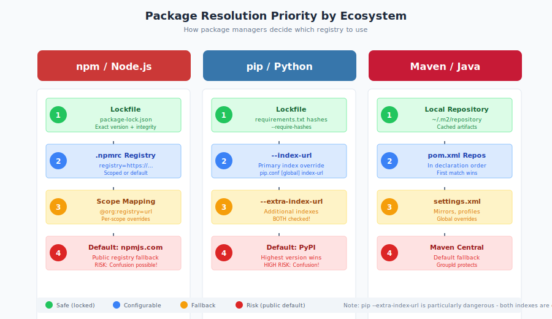

# 7.3 Case Study: 3CX Desktop App Compromise (2023)

In March 2023, customers of 3CX, a popular business communications platform, discovered that the official desktop application had been trojanized. The incident would have been concerning enough as a standalone supply chain attack—but investigation revealed something more troubling. 3CX had not been directly compromised. Instead, attackers had first compromised Trading Technologies, a financial software vendor, and used that access to infect a 3CX employee's machine, which then led to compromise of 3CX's build environment.

This **cascading supply chain attack** demonstrated a new dimension of supply chain risk: your security depends not only on your direct vendors but on your vendors' vendors, creating chains of trust that extend far beyond what organizations typically assess.

#### Background: 3CX and Business Communications

3CX develops a software-based Private Branch Exchange (PBX) system that provides voice over IP (VoIP), video conferencing, and messaging capabilities. The platform is used by organizations worldwide for business communications.

At the time of the attack, [3CX reported][3cx-advisory]:

- Over **600,000 customer organizations**
- More than **12 million daily users**
- Customers in 190 countries
- Deployments across industries including healthcare, hospitality, and professional services

The **3CX Desktop App** provides users with a softphone client for making and receiving calls, participating in video conferences, and messaging colleagues. It runs on Windows and macOS, with mobile versions for iOS and Android.

Like SolarWinds Orion (see Section 7.2), the 3CX Desktop App represented a trusted application installed across numerous endpoints in customer environments. Users had no reason to suspect that an official, signed update from 3CX would contain malicious code.

#### The Cascading Attack: From Trading Technologies to 3CX

The 3CX compromise was not a direct attack on 3CX's infrastructure. It was the result of an earlier, separate supply chain attack.

**Stage 1: Trading Technologies Compromise (2022)**

Trading Technologies International provides software for financial trading. Their **X_TRADER** application was used by traders and financial professionals for market analysis and execution.

At some point in 2022, attackers compromised Trading Technologies' build environment and inserted malicious code into the X_TRADER installer. Users who downloaded the trojanized version received malware along with the legitimate application.

**Stage 2: 3CX Employee Infection (Early 2023)**

A 3CX employee downloaded and installed the compromised X_TRADER software on a personal machine—likely for personal trading or financial analysis. The malware from X_TRADER infected this machine.

The attacker, having gained a foothold on a 3CX employee's system, harvested credentials and established persistent access. From this personal machine, they pivoted to 3CX's corporate environment.

**Stage 3: 3CX Build Environment Compromise (Early 2023)**

With access to 3CX's internal systems, the attackers reached the build infrastructure used to compile and sign the 3CX Desktop App. They inserted malicious code into the build process.

**Stage 4: Distribution to 3CX Customers (March 2023)**

The trojanized 3CX Desktop App was distributed through official channels. Updates were signed with 3CX's legitimate code signing certificate. Customers received malicious software through the update mechanism they had every reason to trust.

This chain—from Trading Technologies to a 3CX employee to 3CX's build systems to 3CX customers—illustrated how supply chain attacks can cascade through multiple organizations.

#### Technical Details: The Malicious Application

The trojanized 3CX Desktop App employed sophisticated techniques to deliver its payload:

**DLL Side-Loading:**

The attack used a technique called **DLL side-loading**, where a legitimate application loads a malicious DLL. The 3CX installer included two malicious files:

- `ffmpeg.dll` (Windows) / `libffmpeg.dylib` (macOS): A legitimate multimedia library replaced with a trojanized version
- `d3dcompiler_47.dll`: A malicious DLL containing encrypted payload

When the 3CX Desktop App launched, it loaded the trojanized FFmpeg library, which in turn loaded the malicious DLL and executed the payload.

**Staged Payload Delivery:**

The initial malware was a loader that:

1. Slept for 7 days before activating (similar to SUNBURST's dormancy period)
2. Downloaded icon files from a GitHub repository
3. Extracted encrypted command and control (C2) URLs from the icon files
4. Connected to C2 servers to download additional payloads
5. In some cases, deployed a full-featured backdoor (dubbed "Gopuram" by Kaspersky)

**Multi-Platform Impact:**

Unlike many supply chain attacks that target only Windows, the 3CX compromise affected both Windows and macOS versions:

- **Windows versions 18.12.407 and 18.12.416** (Electron-based app)
- **macOS versions 18.11.1213 through 18.12.416**

This demonstrated deliberate effort to maximize reach across different operating systems.

**Selective Targeting:**

Similar to SUNBURST, the attackers did not exploit all infected systems. The final-stage backdoor was deployed selectively, with apparent focus on cryptocurrency-related companies. Kaspersky reported that fewer than 10 organizations received the Gopuram backdoor, despite thousands of infections.

This selectivity—consistent with North Korean threat actors' focus on cryptocurrency theft—helped the attack remain undetected longer by limiting anomalous network behavior.

#### Detection: EDR Alerts Initially Dismissed

The detection of the 3CX compromise exposed a troubling pattern: security tools flagged the malicious behavior, but alerts were dismissed as false positives.

**March 22, 2023:**

Users on security forums and Reddit reported that endpoint detection and response (EDR) tools were flagging the 3CX Desktop App as malicious. Multiple vendors' tools—including CrowdStrike Falcon and SentinelOne—detected suspicious behavior.

**March 22-28, 2023:**

3CX support initially suggested the alerts were false positives, recommending customers allowlist the application. Many organizations, trusting their vendor, did exactly that—overriding security controls that had correctly identified malicious behavior.

A 3CX support representative responded that with "hundreds if not thousands of AV solutions," the company couldn't reach out to all of them, suggesting instead that "it makes more sense if the SentinelOne customers contact their security software provider."[^3cx-forum] The response treated legitimate detections as a vendor problem rather than a security incident.

[^3cx-forum]: 3CX Community Forums, "Threat alerts from SentinelOne for desktop update," March 2023, https://www.3cx.com/community/threads/threat-alerts-from-sentinelone-for-desktop-update-initiated-from-desktop-client.119806/

**March 29, 2023:**

CrowdStrike published an official [advisory][crowdstrike-3cx] confirming that the 3CX Desktop App was compromised. 3CX acknowledged the supply chain attack and recommended customers uninstall the affected versions.

**March 30, 2023:**

Mandiant was retained to investigate. CISA issued an [advisory][cisa-3cx] on the compromise.

The gap between initial detection (March 22) and official confirmation (March 29) represented a week during which organizations dismissed legitimate security alerts and continued running compromised software.

#### The False Positive Problem

The initial dismissal of security alerts deserves particular attention. This pattern—vendor assures customers that security detections are false positives—has occurred repeatedly:

- Security tools correctly identified malicious behavior
- Customers reported alerts to the vendor
- The vendor, unaware of their own compromise, dismissed the alerts
- Customers suppressed the security warnings
- The compromise continued

This creates a dilemma for organizations:

**Trusting the vendor** means overriding security tools based on the vendor's assurance—but the vendor may not know their software is compromised.

**Trusting the security tool** means potentially breaking business operations if the detection really is a false positive.

The 3CX incident demonstrated that security teams should treat unexpected security detections of trusted software as potential supply chain indicators, even when vendors claim otherwise. Investigation should confirm or refute the alert rather than simply accepting vendor assurances.

#### Attribution: Lazarus Group

[Security researchers attributed][mandiant-3cx] the 3CX attack to **Lazarus Group**, a threat actor associated with North Korea's Reconnaissance General Bureau.

Indicators supporting this attribution included:

- **Tooling similarities**: The malware shared code and techniques with previously identified Lazarus tools
- **Targeting patterns**: Focus on cryptocurrency companies aligned with Lazarus's financial objectives
- **Operational tradecraft**: Techniques consistent with prior Lazarus operations
- **Infrastructure overlap**: Command and control infrastructure linked to previous Lazarus activity

Lazarus Group has been responsible for numerous financially-motivated attacks, including the 2016 Bangladesh Bank heist ($81 million stolen) and multiple cryptocurrency exchange compromises. The group generates revenue for North Korea, which faces international sanctions limiting traditional financial access.

The 3CX attack represented an evolution in Lazarus techniques—moving from direct attacks on cryptocurrency companies to supply chain attacks that could provide access to many targets through a single compromise.

#### Comparison to SolarWinds

The 3CX and SolarWinds attacks shared significant similarities while differing in important ways:

**Similarities:**

| Aspect | SolarWinds (2020) | 3CX (2023) |
|--------|-------------------|------------|
| Attack type | Build system compromise | Build system compromise |
| Distribution | Legitimate signed updates | Legitimate signed updates |
| Dormancy | 12-14 day delay | 7 day delay |
| Selectivity | Targeted exploitation | Targeted exploitation |
| Detection evasion | Anti-analysis checks | Icon file-based C2 |
| Attribution | Nation-state (Russia/SVR) | Nation-state (North Korea/Lazarus) |

**Differences:**

| Aspect | SolarWinds | 3CX |
|--------|------------|-----|
| Initial access | Direct infrastructure compromise | Cascading from another supply chain attack |
| Objective | Espionage | Financial (cryptocurrency focus) |
| Scale | ~18,000 victims | ~600,000 customer organizations |
| Discovery | Internal investigation | EDR alerts (initially dismissed) |
| Attacker patience | Years of presence | Months of presence |

The cascading nature of the 3CX attack distinguished it from SolarWinds. The SolarWinds attackers directly compromised their target's build environment. The 3CX attackers first compromised Trading Technologies, used that to reach a 3CX employee, and then pivoted to 3CX's build systems—a supply chain attack used to enable a second supply chain attack.

#### Supply Chains Within Supply Chains

The 3CX incident highlighted a dimension of supply chain risk that organizations often underestimate: **supply chain depth**.

Organizations assess their direct vendors. Does 3CX follow secure development practices? Is their build infrastructure protected? These are reasonable questions in vendor risk assessment.

But 3CX's security was undermined not by their own failures but by a compromise at Trading Technologies—a company 3CX had no business relationship with. The only connection was an employee who happened to use their software.

This creates a seemingly intractable problem:

- Organizations cannot assess every vendor their employees might use personally
- Vendors cannot prevent employees from running software on personal devices
- Personal devices may connect to corporate networks or systems
- Attackers can use personal device compromises to pivot to corporate targets

The attack chain exploited these realities:

1. **Trading Technologies** was a legitimate financial software vendor with no connection to 3CX
2. **An individual employee** made a personal decision to install trading software
3. **The personal device** had some connection to corporate resources
4. **Corporate credentials** were accessible from the compromised personal device
5. **Build infrastructure** was reachable from within the corporate network

Each step was individually unremarkable. Together, they created a path from one software vendor's compromise to another's.

#### Impact and Response

**Customer Impact:**

With 600,000 customer organizations and 12 million users, the potential reach of the 3CX compromise was substantial. However, the selective targeting meant that most infections did not receive final-stage payloads.

Affected customers faced:

- Emergency uninstallation of the compromised application
- Forensic investigation of potentially compromised systems
- Uncertainty about data exfiltration during the infection window
- Business disruption as communications systems were taken offline

**3CX Response:**

3CX took several actions following confirmation of the compromise:

- Recommended immediate uninstallation of affected versions
- Released clean versions of the desktop application
- Engaged Mandiant for investigation
- Published updates on investigation progress
- Implemented additional security measures in their build process

**Industry Response:**

The incident reinforced lessons from SolarWinds:

- Build infrastructure requires robust security controls
- Signed software from trusted vendors can still be malicious
- EDR alerts about trusted software should be investigated, not dismissed
- Supply chain risk extends beyond direct vendor relationships

#### Lessons Learned

The 3CX compromise provided specific lessons that expand on those from SolarWinds:

**1. Supply chain attacks can cascade through multiple organizations.**

Your risk depends not only on your vendors' security but on your vendors' vendors' security—a chain that can extend indefinitely. Risk assessment must acknowledge this depth.

**2. Personal devices create supply chain entry points.**

An employee's personal software choices can create attack paths to corporate systems. Network segmentation, credential management, and access controls must account for personal device risks.

**3. Security tool alerts about trusted software require investigation, not dismissal.**

When EDR tools flag official, signed software as malicious, the correct response is investigation—not whitelisting. Vendors may not know they are compromised.

**4. Vendors cannot definitively vouch for their own software's integrity.**

3CX confidently assured customers that alerts were false positives—while unknowingly distributing malware. Vendors may sincerely believe their software is safe while unaware of compromise.

**5. Multi-platform attacks require multi-platform defenses.**

The 3CX attackers targeted both Windows and macOS. Organizations should not assume that supply chain attacks only affect Windows environments.

**6. Dormancy periods defeat time-limited analysis.**

Like SUNBURST's 12-14 day delay, the 3CX malware's 7-day sleep period evaded sandbox-based detection. Behavioral analysis must account for patient malware.

**7. Selective targeting limits detection but not risk.**

Attackers may choose to exploit only some victims, but this does not reduce risk for those selected. It simply means that some organizations will be targeted while others serve only as potential vectors.

**8. Vendor risk assessment must include supply chain depth.**

Questionnaires asking "Do you follow secure development practices?" are insufficient. Organizations should ask how vendors protect against supply chain attacks on their own suppliers and what controls exist to detect compromise.

The 3CX incident demonstrated that supply chain security cannot stop at the first tier of vendors. The interconnected nature of modern software development creates chains of trust that attackers can exploit at any point. Organizations must recognize this depth and implement defenses—detection, segmentation, least-privilege access—that limit the damage when any link in the chain fails.

[crowdstrike-3cx]: https://www.crowdstrike.com/blog/crowdstrike-detects-and-prevents-active-intrusion-campaign-targeting-3cxdesktopapp-customers/
[cisa-3cx]: https://www.cisa.gov/news-events/alerts/2023/03/30/supply-chain-attack-against-3cxdesktopapp
[mandiant-3cx]: https://www.mandiant.com/resources/blog/3cx-software-supply-chain-compromise
[kaspersky-gopuram]: https://securelist.com/gopuram-backdoor-deployed-through-3cx-supply-chain-attack/109344/
[3cx-advisory]: https://www.3cx.com/blog/news/desktopapp-security-alert/

