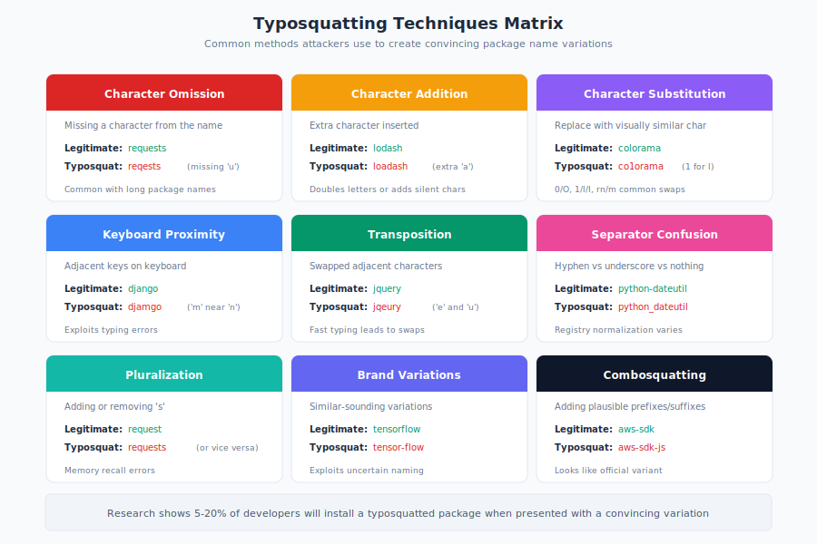

# 8.2 Malicious Commits and Pull Requests

While account takeover provides attackers direct publishing access, a more subtle approach targets the code review process itself. Attackers can submit malicious code through normal contribution channels—pull requests, patches, or direct commits—hoping that reviewers will approve harmful changes. This attack vector exploits the fundamental tension in open source: projects want contributions to grow and improve, but each contribution is potential attack surface.

The XZ Utils backdoor (Section 7.5) demonstrated this approach at its most sophisticated: years of legitimate contributions building trust, followed by carefully hidden malicious code that evaded review. But not all attacks require such patience. Clever obfuscation, reviewer fatigue, and the inherent limitations of human code review create opportunities for attackers at every experience level.

## The Challenge: Detecting Malice in Code

!!! warning "Code Review Was Not Designed as a Security Control"

    Intent is invisible. Context is limited. Time is finite. Expertise varies. Trust accumulates and can be exploited. A subtle bug and a deliberately planted vulnerability may look identical.

Code review is designed to catch bugs, improve quality, and maintain consistency. It was not designed as a security control, and treating it as one reveals significant limitations.

A reviewer examining a pull request faces fundamental challenges:

- **Intent is invisible**: Code does what it does, regardless of the submitter's motivation. A subtle bug and a deliberately planted vulnerability may look identical.

- **Context is limited**: Reviewers typically see the diff, not the full codebase context. Understanding how a change interacts with existing code requires mental reconstruction.

- **Time is finite**: Reviewers have limited time and attention. Thorough security analysis of every change is impractical for active projects.

- **Expertise varies**: Security vulnerabilities require specialized knowledge to identify. General-purpose reviewers may miss subtle issues that security experts would catch.

- **Trust accumulates**: Contributors who submit good changes build trust. This trust can be exploited for later malicious contributions.

Attackers exploit each of these limitations through techniques ranging from simple obfuscation to sophisticated long-term campaigns.

## Obfuscation Techniques: A Taxonomy

Attackers use various techniques to make malicious code appear benign:

**Innocent-Looking Changes:**

The most effective disguise is code that genuinely appears harmless. Techniques include:

- **Off-by-one errors**: A loop that iterates one time too many or too few can cause buffer overflows. As a "bug fix," reversing the correct bounds and introducing an overflow appears like a legitimate correction.

- **Missing checks**: Removing or failing to add a bounds check, null check, or permission verification creates vulnerabilities. The absence of code is harder to review than its presence.

- **Subtle type confusion**: In languages with implicit conversions, changes to types or comparisons can introduce vulnerabilities while looking like cleanup.

- **Error handling modifications**: Changes to error handling paths—which are often less tested—can introduce vulnerabilities in code that only executes during failures.

**Homoglyph and Unicode Attacks:**

Unicode provides multiple characters that appear identical to ASCII equivalents. Attackers can use:

- Cyrillic characters that look like Latin letters (е vs. e, а vs. a)
- Zero-width characters that are invisible but affect parsing
- Right-to-left override characters that reverse displayed text order

!!! info "Trojan Source Attacks"

    Research by Cambridge University (2021) demonstrated attacks using bidirectional text override characters to create code that appears benign when displayed but executes differently. A code comment could visually mask an actual code statement.

[Research by Cambridge University in 2021][trojan-source] demonstrated "Trojan Source" attacks using bidirectional text override characters to create code that appears benign when displayed but executes differently.

**Large Changeset Hiding:**

Large pull requests create review fatigue. Attackers exploit this by:

- Bundling malicious changes with large legitimate refactoring
- Adding malicious code to tedious, repetitive changes (logging, formatting)
- Timing submissions during high-activity periods when reviewers are overwhelmed
- Splitting attacks across multiple PRs that are individually benign

The XZ Utils attack included malicious code hidden in binary test files within a commit that also included numerous legitimate changes.

**Build System and Configuration Manipulation:**

Build configurations receive less scrutiny than source code. Attackers target:

- Makefiles and build scripts
- CI/CD configuration files
- Compiler flags and preprocessing directives
- Dependency specifications

Changes like "optimize build performance" or "update CI configuration" may receive cursory review even when they introduce code execution vectors.

**Test File Abuse:**

Test files are expected to contain arbitrary data, making them ideal hiding places. The XZ Utils backdoor hid compressed malicious code in files named to appear as test data (`bad-3-corrupt_lzma2.xz`). Reviewers rarely scrutinize test data contents.

## The Hypocrite Commits Controversy

In 2021, [researchers from the University of Minnesota submitted a paper][hypocrite-commits] titled "On the Feasibility of Stealthily Introducing Vulnerabilities in Open-Source Software via Hypocrite Commits" to the IEEE Symposium on Security and Privacy.

The research methodology was controversial: the researchers submitted intentionally vulnerable patches to the Linux kernel to test whether maintainers would detect them. The patches introduced subtle vulnerabilities while appearing to be legitimate bug fixes.

**The Research Findings:**

The researchers reported that some patches containing vulnerabilities were initially accepted by maintainers, suggesting that code review alone was insufficient to catch all security issues. However, the experimental methodology raised serious ethical concerns.

**The Linux Kernel Response:**

When the research became public, the Linux kernel community reacted strongly:

!!! quote "Greg Kroah-Hartman, Linux Kernel Maintainer"

    "Our community does not appreciate being experimented on, and being 'tested' by submitting known-bad patches to see if we catch them."

The Linux kernel maintainers:

- Reverted all commits from University of Minnesota email addresses
- Banned further contributions from the university pending review
- Demanded identification of all intentionally vulnerable patches
- Called for institutional review board oversight of such research

**Lessons and Implications:**

The controversy highlighted several important points:

1. **Code review has limits**: The research demonstrated that even experienced maintainers could miss subtle vulnerabilities—a finding with genuine security implications.

2. **Ethics matter**: Testing security by attacking production systems without consent violates research ethics and community trust.

3. **Trust is fragile**: The university's entire contribution history became suspect, requiring extensive review of previously-accepted patches.

4. **Institutional responses**: The kernel community developed new policies requiring research involving their project to follow ethical guidelines.

The incident demonstrated both that malicious commits are a viable attack vector and that exploiting this vector—even for research—damages the trust relationships that open source depends upon.

## Reviewer Fatigue and Its Exploitation

Maintainers of popular projects face overwhelming review burdens. [Research on code review effectiveness][code-review-quality] found that review thoroughness decreased significantly as:

- PR size increased beyond 200 lines of changes
- Review backlog grew
- Reviewers handled multiple PRs in succession
- Reviews occurred late in the work day

Attackers can exploit these patterns:

**Volume-Based Attacks:**

Submit many legitimate contributions to build both trust and review fatigue. When reviewers are accustomed to approving a contributor's PRs, they may apply less scrutiny.

**Timing Attacks:**

Submit malicious PRs when maintainers are likely to be fatigued:

- Late Friday afternoon (pressure to clear backlog before weekend)
- During major releases (attention focused elsewhere)
- Immediately after another large contribution (reviewer already invested in the contributor)

**Complexity Exploitation:**

Make malicious changes depend on understanding complex existing code. Reviewers may approve changes they don't fully understand rather than admit knowledge gaps or block forward progress.

The XZ Utils attack exploited reviewer fatigue systematically: the legitimate "Jia Tan" contributions accustomed the maintainer to approving their work, and the pressure campaign from sock puppet accounts created additional stress encouraging acceptance of help.

## Code Review as a Security Control: Limitations

Organizations often cite code review as a security control. Understanding its limitations is essential for realistic security planning:

**What Code Review Can Catch:**

- Obvious malicious code: clear backdoors, exfiltration, or destruction
- Known vulnerability patterns: SQL injection, buffer overflows, XSS
- Deviations from project standards: unusual patterns that trigger closer inspection
- Logical errors visible in the diff context

**What Code Review Often Misses:**

- **Subtle vulnerabilities**: Off-by-one errors, race conditions, and implicit type conversions that require deep understanding of execution context

- **Distributed attacks**: Malicious functionality split across multiple innocent-looking changes that only become dangerous in combination

- **Data-driven attacks**: Code that behaves correctly but processes attacker-controlled data that triggers vulnerability

- **Build-time attacks**: Malicious behavior hidden in build configuration, activated only during certain builds (like XZ Utils)

- **Binary content**: Reviewers cannot meaningfully review binary files, compressed data, or encoded content

**Inherent Structural Limitations:**

Code review operates under constraints that advantage attackers:

- Reviewers have less time to analyze than attackers have to craft submissions
- Attackers know exactly where malicious code is; reviewers must find it
- A single missed review can enable an attack; consistent detection is required for defense
- False positives (rejecting legitimate contributions) have costs that true negatives don't

Linux kernel maintainers have noted that expecting code review to catch all sophisticated attacks is unrealistic—it raises the bar for attackers but cannot provide absolute guarantees, similar to other security screening processes.

## Automated Detection of Suspicious Commits

Given human review limitations, automated tools can help identify suspicious contributions:

**Static Analysis Integration:**

Tools like **Semgrep**, **CodeQL**, and **Coverity** can run automatically on pull requests, flagging code matching known vulnerability patterns. These tools catch patterns that tired reviewers might miss.

**Behavioral Analysis:**

Some tools analyze contribution patterns rather than code content:

- **Contributor reputation**: New contributors or those with unusual patterns receive additional scrutiny
- **Change characteristics**: Large changes to security-sensitive files, unusual file types, or modifications to build configuration trigger alerts
- **Historical patterns**: Changes similar to past malicious commits are flagged

**Diff Analysis Tools:**

Specialized tools can detect obfuscation attempts:

- **Unicode detection**: Flag homoglyphs, zero-width characters, and bidirectional overrides
- **Entropy analysis**: Identify encoded or obfuscated content that may hide malicious code
- **Binary change detection**: Alert on modifications to binary files or addition of new binary content

**Provenance and Attribution:**

Tools that track contributor identity and verify commit signing can detect:

- Commits claiming to be from different authors than the pusher
- Contributions from newly-created accounts
- Patterns suggesting automated or coordinated submission

**Examples of Integrated Solutions:**

- **GitHub Advanced Security** includes code scanning, secret scanning, and dependency review integrated into the PR workflow
- **GitGuardian** focuses on detecting secrets and sensitive data in commits
- **Scorecard** evaluates project security practices including code review requirements
- **Allstar** enforces security policies on GitHub repositories

## Best Practices for Security-Focused Code Review

For maintainers seeking to harden code review as a security control:

**1. Require multiple reviewers for sensitive changes.**

Changes to authentication, authorization, cryptography, and serialization should require review from maintainers with security expertise.

**2. Implement mandatory CI checks.**

Automated security scanning should block merging of PRs with identified issues. This catches known patterns without relying on human attention.

**3. Scrutinize build configuration changes.**

Changes to build scripts, CI configuration, and dependency specifications deserve extra attention. These are common attack vectors precisely because they're often overlooked.

**4. Review binary and data files carefully.**

Binary files, test data, and encoded content can hide malicious code. Consider policies restricting such additions or requiring additional justification.

**5. Maintain healthy suspicion of urgent requests.**

Pressure to merge quickly—whether from the contributor or external circumstances—should trigger additional scrutiny, not less.

**6. Establish contributor verification.**

For critical projects, consider requiring verified identity for contributors with merge access. Anonymous contribution to the codebase may be acceptable; anonymous merge authority is riskier.

**7. Use cryptographic commit signing.**

Requiring signed commits ensures that commits claiming to be from specific authors actually came from those individuals.

**8. Document security-sensitive areas.**

Maintain documentation identifying code areas with security implications. Changes to these areas can be automatically flagged for additional review.

**9. Rotate reviewers for regular contributors.**

When the same reviewer consistently approves a contributor's PRs, trust may accumulate excessively. Fresh eyes provide additional perspective.

**10. Conduct periodic retrospective reviews.**

Periodically review accepted contributions from new or occasional contributors. Malicious code hidden in past commits may be detectable with hindsight.

Code review remains valuable—it catches bugs, improves quality, and raises the bar for attackers. But treating it as a comprehensive security control is unrealistic. Defense in depth requires combining code review with automated analysis, contributor verification, build integrity, and monitoring. The XZ Utils attack succeeded despite code review because it was designed specifically to evade review. Organizations must build security architectures that remain effective even when individual controls fail.

[hypocrite-commits]: https://github.com/QiushiWu/qiushiwu.github.io/blob/main/papers/OpenSourceInsecurity.pdf
[trojan-source]: https://trojansource.codes/
[code-review-quality]: https://research.google/pubs/modern-code-review-a-case-study-at-google/
[kroah-hartman-response]: https://lore.kernel.org/lkml/YH%2FfM%2FTsbmcZzwnX@kroah.com/

