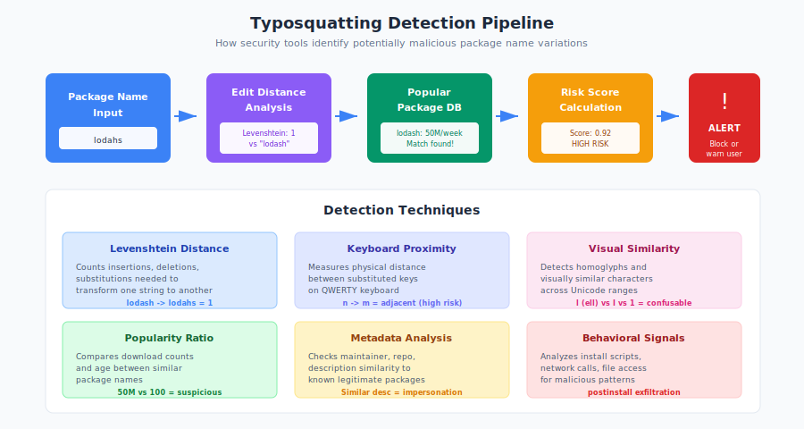

# 8.3 Social Engineering Targeting Maintainers

Technical security controls—authentication, code signing, automated scanning—form important defenses against supply chain attacks. But attackers increasingly bypass these controls by targeting the humans who operate them. Open source maintainers, often working in isolation with limited resources, present attractive targets for **social engineering**: the manipulation of people into taking actions that benefit the attacker.

[The XZ Utils backdoor][xz-backdoor] (Section 7.5) demonstrated this approach at its most sophisticated: a multi-year campaign combining fake identity construction, trust building through legitimate contributions, and coordinated pressure from sock puppet accounts. But social engineering against maintainers takes many forms, from crude phishing to elaborate relationship building. Understanding these tactics is essential for maintainers seeking to protect themselves and their projects.

## A Taxonomy of Social Engineering Tactics

Attackers use various approaches to manipulate maintainers:

**Relationship Building:**

The most patient attackers invest months or years building genuine-seeming relationships:

- Contributing quality code that solves real problems
- Participating helpfully in community discussions
- Offering to take on maintenance burden from overworked maintainers
- Building reputation through conference talks, blog posts, or other visible activity

This approach is expensive in time and effort but highly effective. A contributor with established history faces less scrutiny than a newcomer.

**Urgency and Pressure:**

Attackers create artificial urgency to rush maintainers into decisions:

- Reporting "critical" vulnerabilities that require immediate patches
- Creating artificial deadlines ("our company needs this by Friday")
- Manufacturing community pressure through sock puppet accounts
- Threatening public disclosure if demands aren't met

Under pressure, maintainers may skip normal review processes or accept help from unknown parties.

**Authority and Expertise:**

Attackers claim credentials or authority to establish trust:

- Impersonating security researchers reporting vulnerabilities
- Claiming affiliation with prestigious organizations
- Presenting fabricated credentials or employment history
- Using technical jargon to appear more knowledgeable than they are

**Sympathy and Obligation:**

Attackers exploit maintainers' desire to be helpful:

- Describing personal circumstances requiring urgent help
- Emphasizing their reliance on the project for critical work
- Making maintainers feel guilty for not accepting contributions
- Framing requests as helping the community

**Frustration and Criticism:**

Attackers weaponize community expectations:

- Publicly criticizing slow progress or unmerged contributions
- Comparing unfavorably to competing projects
- Threatening to fork or abandon the project
- Creating perception of community discontent

## XZ Utils: A Masterclass in Long-Term Social Engineering

The XZ Utils attack represents the most sophisticated social engineering campaign ever documented against an open source project. Analyzing it in detail provides essential lessons for the community.

**Phase 1: Establishing the Persona (2021)**

The "Jia Tan" identity (JiaT75 on GitHub) was created in early 2021, with [the first XZ Utils contribution submitted in February 2022][xz-timeline]. The early contributions were technically competent but unremarkable—exactly what a genuine new contributor might submit.

Key characteristics of the persona construction:

- **Consistent identity**: The same name, email address, and communication style across all interactions
- **Technical credibility**: Patches that solved real problems and demonstrated understanding of compression algorithms
- **Patience**: No rush to gain access or influence; contributions accumulated gradually
- **Normal behavior**: No unusual patterns that would trigger suspicion

The persona was designed to be forgettable—one more helpful contributor among many.

**Phase 2: The Pressure Campaign (2022)**

While Jia Tan built a contribution record, other apparent personas began pressuring the sole maintainer, Lasse Collin. [Analysis of mailing list archives][xz-mailing-list] revealed accounts that appeared coordinated:

A user named "Jigar Kumar" posted complaints in June 2022:

> "Progress will not happen until there is new maintainer. XZ for C has sparse commit log too. Dennis you are better off waiting until new maintainer happens or fork yourself. Submitting patches here has no purpose these days. The current maintainer lost interest or doesn't care to maintain anymore."

Another account, "[Dennis Ens][xz-ens]," echoed similar frustrations:

> "I am sorry about your mental health issues, but its important to be aware of your own limits. I get that this is a hobby project for all contributors, but the community desires more."

These messages created coordinated pressure on the maintainer, framing Collin's reasonable pace as neglect and explicitly calling for new maintainers—precisely what Jia Tan would become.

[Collin's response][xz-response] revealed his vulnerability:

> "I haven't lost interest but my ability to care has been limited mostly due to longterm mental health issues but also due to some other things... It's also good to keep in mind that this is an unpaid hobby project."

This response—honest about his struggles—provided exactly the opening the attackers needed. Here was an exhausted maintainer explicitly acknowledging limited capacity, primed to accept help from a seemingly trustworthy contributor.

**Phase 3: Gaining Maintainer Access (2022-2023)**

With the pressure campaign establishing that the project needed additional maintainers, and Jia Tan having built a track record of helpful contributions, the path to maintainer access was clear. By late 2022, Jia Tan had commit access to the repository.

Over 2023, Jia Tan became increasingly central to the project:

- Making releases
- Responding to issues
- Reviewing contributions from others
- Effectively becoming the primary active maintainer

Collin, dealing with health issues and grateful for the help, reduced his involvement. This was entirely reasonable behavior—exactly what any overwhelmed maintainer might do when a capable contributor stepped up.

**Phase 4: Inserting the Backdoor (2024)**

With maintainer access established and Collin's reduced involvement, Jia Tan inserted the backdoor components. The technical sophistication matched the social engineering sophistication:

- Malicious code hidden in binary test files
- Build-time activation that evaded source code review  
- Careful targeting of specific build environments
- Gradual introduction across multiple commits

The attack was discovered by chance—a performance regression that attracted the attention of Andres Freund. Without that accident, the backdoor would likely have reached stable Linux distributions, affecting virtually every Linux server in the world.

## Sock Puppets and Manufactured Reputation

The XZ Utils attack used **sock puppet accounts**—fake personas created to simulate community support or pressure. This technique is increasingly common against open source projects.

**Coordinated Pressure:**

Multiple fake accounts expressing similar complaints creates the illusion of widespread community sentiment. Maintainers may capitulate to pressure they believe represents many users.

**Manufactured Endorsements:**

Fake accounts can vouch for attackers' contributions, provide positive reviews, or support their proposals. This manufactured consensus influences genuine community members.

**Detection Challenges:**

Sock puppets are difficult to detect:

- Each account may have different creation dates, activity patterns, and communication styles
- Some accounts may make genuine contributions alongside their coordinated activity
- The accounts' true connection may only become apparent after the attack succeeds

**Red Flags for Sock Puppets:**

- Multiple new accounts making similar requests
- Accounts with minimal contribution history expressing strong opinions
- Coordinated timing of messages across accounts
- Unusual language patterns or machine translation artifacts
- Accounts that only interact with the targeted project

## Impersonation Across Platforms

Attackers may impersonate maintainers or trusted contributors across different platforms:

**Cross-Platform Impersonation:**

A maintainer's username on GitHub might be impersonated on Discord, Matrix, or social media. Users assume the same name belongs to the same person.

**Claiming False Affiliation:**

Attackers may claim to represent maintainers in conversations on other platforms, gathering information or making commitments that create pressure on the real maintainer.

**Package Manager Impersonation:**

When package names are available on registries where a project hasn't claimed them, attackers may register packages appearing to be official. Users searching for the project find the malicious version.

**Defensive Measures:**

- Maintain verified presence on platforms where your project is discussed
- Link official accounts from your primary project page
- Monitor for impersonation using alerts and search tools
- Consider claiming namespaces on major registries even if not actively used

## Exploiting Maintainer Vulnerability

Social engineering succeeds because it targets human psychology. Maintainers are especially vulnerable due to conditions common in open source:

**Isolation:**

Many critical projects have single maintainers or very small teams. There's no one to consult when suspicious requests arrive, no second opinion on whether a new contributor seems trustworthy.

**Burnout:**

Maintaining open source is often thankless work. Exhausted maintainers may be more susceptible to offers of help and less thorough in vetting new contributors.

**Guilt:**

Maintainers often feel guilty about unreviewed issues, slow response times, and unmerged contributions. Attackers exploit this guilt by framing their involvement as helping clear backlogs.

**Financial Pressure:**

Unpaid maintenance competes with paid work. Offers of sponsorship, employment, or consulting work related to the project can be used to build relationships that later turn exploitative.

**Impostor Syndrome:**

Maintainers may doubt their own judgment, especially when seemingly qualified newcomers challenge their decisions. This self-doubt can be exploited to pressure acceptance of changes.

## Red Flags and Warning Signs

Maintainers should be alert to patterns that may indicate social engineering:

**Contributor Red Flags:**

- Contributor pushes for accelerated access or trust
- Pressure to merge changes without normal review
- Frustration or anger when reasonable process is followed
- Contributions that seem designed to demonstrate specific capabilities
- Reluctance to verify identity or provide context about themselves
- Activity patterns inconsistent with claimed timezone or location

**Community Pressure Red Flags:**

- Multiple new accounts expressing similar complaints
- Coordinated timing of criticism or demands
- Pressure campaigns that emerge suddenly rather than building organically
- Threats to fork, abandon, or publicly criticize if demands aren't met
- Urgency that doesn't match actual project needs

**Request Red Flags:**

- Requests for access disproportionate to demonstrated need
- Framing that makes refusing seem unreasonable
- Artificial deadlines or time pressure
- Requests that bypass normal contribution channels
- Offers of help contingent on gaining specific access

## Defensive Guidance for Maintainers

**Slow Down:**

The most important defense against social engineering is refusing to be rushed. Legitimate contributors understand that trust takes time to build. Requests for accelerated access or immediate action are warning signs.

**Maintain Skepticism:**

Approach unsolicited offers of help with healthy skepticism, especially when they coincide with pressure or criticism. Consider whether the timing seems organic or manufactured.

**Verify Independently:**

When someone claims affiliation, expertise, or endorsement, verify it through independent channels. Don't rely on information the person provides about themselves.

**Document Decisions:**

Keep records of why you granted or denied access, merged or rejected contributions. This documentation helps identify patterns and justify decisions.

**Consult Others:**

For significant decisions—especially granting maintainer access—consult other trusted community members, other projects' maintainers, or security contacts. Isolation increases vulnerability.

**Trust Your Instincts:**

If something feels wrong, it may be. Experienced maintainers often sense manipulation even when they can't articulate why. Take those feelings seriously.

**Accept That Saying No Is Okay:**

You are not obligated to accept contributions, grant access, or respond to demands. The project is yours to steward. Legitimate community members understand reasonable boundaries.

## Resources for Maintainers Under Pressure

Maintainers facing suspicious activity or coordinated pressure should know where to turn:

**Security Contacts:**

- **[OpenSSF][openssf]**: The Open Source Security Foundation provides resources and may be able to connect maintainers with security expertise
- **Platform Security Teams**: GitHub, GitLab, and other platforms have security teams that investigate suspicious activity
- **Distribution Security Teams**: Debian, Fedora, and other distributions have security teams interested in threats to packages they distribute

**Community Resources:**

- **[Tidelift][tidelift]**: Provides maintainer support services including security guidance
- **[GitHub Sponsors][github-sponsors]**: Funding can enable maintainers to dedicate time to security review
- **Industry Partners**: Companies depending on your project may provide security resources if asked

**Personal Support:**

- **Maintainer communities**: Groups like [Maintainerati][maintainerati] connect maintainers for mutual support
- **Mental health resources**: Organizations like [OSMI][osmi] (Open Sourcing Mental Illness) provide resources specific to technology workers

**Incident Response:**

If you believe your project is under social engineering attack:

1. Pause any pending access grants or significant merges
2. Document all suspicious interactions with screenshots and archives
3. Contact platform security teams with your concerns
4. Notify other maintainers and trusted community members
5. Consider public disclosure if the threat appears imminent

## Recommendations for Communities

Beyond individual maintainer awareness, communities can implement structural defenses:

**Multi-Person Maintainer Requirements:**

Critical projects should require multiple maintainers with independent identities. The XZ Utils attack succeeded partly because a single maintainer could grant access.

**Maintainer Onboarding Procedures:**

Formal procedures for granting maintainer access—including waiting periods, identity verification, and multiple approvals—raise the bar for attackers.

**Community Health Monitoring:**

Watch for patterns suggesting coordinated activity: sudden surges in complaints, new accounts pushing similar narratives, or unusual pressure on maintainers.

**Support Structures:**

Create channels for maintainers to consult others about suspicious situations. Mentorship relationships between experienced and new maintainers help transfer security awareness.

**Sustainable Funding:**

Projects with sustainable funding can afford dedicated security attention and reduce the isolation and burnout that make maintainers vulnerable.

The XZ Utils attack succeeded because it was designed to exploit the realities of open source maintenance: isolated maintainers, limited resources, genuine community pressure, and the fundamental openness that makes open source work. Defending against such attacks requires both individual awareness and systemic changes that reduce maintainer vulnerability while preserving the collaborative nature of open source development.

[xz-backdoor]: https://en.wikipedia.org/wiki/XZ_Utils_backdoor
[xz-timeline]: https://research.swtch.com/xz-timeline
[xz-mailing-list]: https://www.mail-archive.com/xz-devel@tukaani.org/msg00568.html
[xz-ens]: https://www.mail-archive.com/xz-devel@tukaani.org/msg00569.html
[xz-response]: https://www.mail-archive.com/xz-devel@tukaani.org/msg00567.html
[openssf]: https://openssf.org/
[tidelift]: https://tidelift.com/
[github-sponsors]: https://github.com/sponsors
[maintainerati]: https://maintainerati.org/
[osmi]: https://osmihelp.org/

