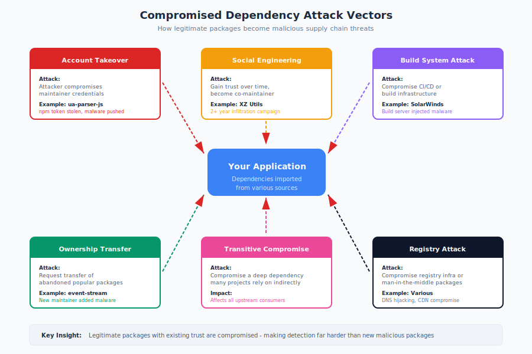

# 9.1 Mobile Application Supply Chains

Mobile applications operate in a supply chain environment distinct from server-side or desktop software. The iOS and Android platforms impose unique constraints: sandboxed execution, platform-controlled distribution, mandatory review processes, and proprietary SDKs. These constraints provide some security benefits—app store review catches certain threats—but they also create blind spots. Mobile developers integrate dozens of third-party SDKs for analytics, advertising, authentication, and other functionality, often with limited visibility into what these components actually do.

!!! warning "Hidden Dependencies"

    Mobile SDKs often operate as black boxes, with limited visibility into their behavior. A crash reporting SDK might depend on networking libraries, serialization frameworks, and other components—each a potential vulnerability source. Enterprise security teams commonly discover hundreds of transitive dependencies from seemingly simple SDK integrations.

Understanding mobile supply chain risks requires examining both the dependency management systems that mirror server-side ecosystems and the mobile-specific elements—SDKs, platform APIs, and distribution channels—that create unique attack surfaces.

## iOS Supply Chain Architecture

iOS development relies on several dependency management systems:

**CocoaPods:**

!!! warning "CocoaPods Read-Only Deadline: December 2026"

    CocoaPods Trunk will become **permanently read-only on December 2nd, 2026**. New projects should use Swift Package Manager. Existing projects should plan migration by Q3 2026. See [Section 2.4](../chapter-02/ch-2.4.md#swiftobjective-c-cocoapods-and-swift-package-manager) for detailed CocoaPods history and vulnerabilities.

**CocoaPods** has historically been the most widely used dependency manager for iOS, with [over 100,000 libraries available][cocoapods]. However, the project is now in **maintenance mode** with no active feature development. Usage is sustained primarily by React Native and Flutter ecosystems that depend on CocoaPods as a hidden abstraction layer. CocoaPods uses a centralized specification repository that defines how to fetch and build dependencies.

CocoaPods pods are typically distributed as source code, built locally during application compilation. This provides some transparency—developers can inspect what they're integrating—but the volume of dependencies often exceeds practical review capacity.

Security considerations specific to CocoaPods include:

- **Trunk account security**: Pod authors register through CocoaPods Trunk. Compromised Trunk accounts can push malicious updates (similar to npm account compromises)
- **Podspec manipulation**: The centralized specs repository is a single point of trust
- **Build script execution**: Podspecs can include build scripts that execute during `pod install`
- **Remote Code Execution vulnerabilities** (2023): Three separate RCE vulnerabilities were discovered in Trunk by evasec.io, including pod takeover via the claim process, email verification exploits, and shell command execution. All user sessions were reset following patching.
- **`prepare_command` restrictions** (May 2025): New pods using `prepare_command` are now blocked to prevent script-based attacks during pod installation

[In 2021, security researchers disclosed][cocoapods-vuln] that the CocoaPods Trunk server contained vulnerabilities allowing account takeover, potentially enabling attackers to modify widely-used pods. Additional RCE vulnerabilities discovered in 2023 further demonstrated the ongoing security challenges of centralized package registries.

**Swift Package Manager:**

Apple's **Swift Package Manager (SPM)** has grown in adoption since Xcode integration improved. SPM packages are fetched directly from Git repositories, eliminating the centralized registry as a single point of failure.

SPM security considerations:

- Dependencies are specified by Git URL and version, creating direct dependency on source repository security
- Package manifest files (`Package.swift`) are executable Swift code
- No centralized security scanning of the ecosystem

**Carthage:**

**Carthage** takes a decentralized approach, building frameworks from source repositories. It has lower adoption than CocoaPods but remains used for some projects.

## Android Supply Chain Architecture

Android development centers on Gradle and the Maven ecosystem:

**Gradle and Maven Central:**

Android projects use **Gradle** as their build system, fetching dependencies primarily from **Maven Central** and **Google's Maven Repository**. The dependency resolution process mirrors Java/JVM ecosystems (covered in Section 9.4).

Key Android-specific considerations:

- **Google Play Services**: Many apps depend on Google's proprietary libraries for location, authentication, and other platform features. These are distributed as binary AARs without source access.
- **Android Jetpack**: Google's Jetpack libraries provide core functionality and are updated independently of the Android OS—creating a supply chain distinct from the platform itself.
- **JCenter sunset**: The 2021 shutdown of JCenter, previously a major Android repository, forced ecosystem migration and revealed fragile dependency on infrastructure.

**Android-Specific Dependency Risks:**

Android's more open ecosystem creates additional attack surfaces:

- **Multiple repository sources**: Projects may pull from Maven Central, Google's repository, JCenter archives, and custom repositories
- **Transitive dependencies**: Complex dependency trees, often deeper than iOS equivalents
- **Native library inclusion**: Android apps frequently include native (C/C++) libraries, adding complexity invisible to Java/Kotlin analysis

## Mobile SDKs as Hidden Risk

Both platforms share a critical supply chain element: **Software Development Kits (SDKs)** that provide ready-made functionality. Research consistently shows that mobile apps integrate numerous SDKs:[^appfigures-sdks]

!!! note inline end "SDK Scale"

    Average iOS apps include **26 SDKs**, Android apps approximately **18 SDKs**, and popular apps often exceed **40 integrated SDKs**.

- A 2023 study by Appfigures found the average iOS app includes **26 SDKs**
- Average Android apps include approximately **18 SDKs**
- Popular apps from major publishers often exceed **40 integrated SDKs**

[^appfigures-sdks]: Appfigures, "Average App Has 26 SDKs," 2023, https://appfigures.com/resources/insights/20230203

!!! tip "SDK Due Diligence"

    Before integrating any SDK: audit data collection practices, use network monitoring during development to observe unexpected connections, and maintain an inventory of all integrated SDKs with their permissions and purposes.

**Common SDK Categories:**

- **Analytics**: Firebase Analytics, Mixpanel, Amplitude
- **Advertising**: AdMob, Facebook Audience Network, ironSource
- **Crash reporting**: Crashlytics, Sentry, Bugsnag
- **Authentication**: Facebook Login, Google Sign-In, Apple Sign-In
- **Push notifications**: OneSignal, Firebase Cloud Messaging
- **Attribution**: AppsFlyer, Adjust, Branch

**SDK Transparency Concerns:**

SDKs often operate as black boxes, with limited visibility into their behavior:

- **Data collection**: Many SDKs collect user data beyond what developers expect. Advertising SDKs may harvest device identifiers, location data, and browsing patterns.
- **Network activity**: SDKs make network requests to third-party servers. These requests may transmit data or receive instructions unknown to the app developer.
- **Binary distribution**: Many SDKs are distributed as pre-compiled binaries, preventing source code review.
- **Dynamic behavior**: Some SDKs download additional code or configuration at runtime, changing behavior after app store review.

**Hidden Dependencies:**

SDKs themselves have dependencies, creating supply chains within supply chains. A crash reporting SDK might depend on networking libraries, serialization frameworks, and other components—each a potential vulnerability source. Enterprise security teams auditing mobile apps commonly discover hundreds of transitive dependencies introduced by seemingly simple SDK integrations.

## Case Study: XcodeGhost (2015)

**XcodeGhost** remains the most significant iOS supply chain attack documented, demonstrating how attackers can compromise the development toolchain itself.

!!! danger "Toolchain Attacks"

    XcodeGhost infected over 4,000 apps including WeChat—attackers targeted the IDE itself, infecting every app built with it. App Store review did not detect the malicious code.

**What Happened:**

Attackers distributed modified versions of Apple's Xcode IDE through Chinese file-sharing services. Developers in China, where downloading the multi-gigabyte Xcode from Apple's servers was slow, used these unofficial distributions.

The modified Xcode contained a malicious library that was automatically included in every app built with it. The library:

- Collected device and app information
- Uploaded data to attacker-controlled servers
- Could potentially receive remote commands

**Impact:**

- [Initial reports identified 39 infected apps][xcodeghost-paloalto], though [later analysis by FireEye][xcodeghost-fireeye] reported over 4,000 apps were infected, including widely-used apps like WeChat (hundreds of millions of users)
- Infected apps reached the App Store because the malicious code was inside otherwise-legitimate applications
- Apple removed affected apps but the infection had already reached massive scale

**Lessons:**

1. **Development tools are supply chain targets**: Attackers targeted the IDE itself, infecting every app built with it
2. **App Store review has limits**: Apple's review did not detect the malicious code
3. **Distribution matters**: Developers using unofficial sources introduced the compromise
4. **Regional targeting**: Attackers exploited conditions specific to Chinese developers

## Case Study: Malicious Android SDKs

Multiple campaigns have distributed malicious SDKs targeting Android developers:

**SWAnalytics SDK (2019):**

[A malicious SDK named SWAnalytics][swanalytics] was integrated into 12 observed Android apps distributed primarily through Chinese third-party app stores (Tencent MyApp, Wandoujia, Huawei, Xiaomi), with total downloads exceeding 111 million in Tencent MyApp alone. The SDK:

- Masqueraded as a legitimate analytics tool
- Stole contact lists and device information
- Performed ad fraud operations
- Was distributed through developer communities targeting Chinese developers

**Goldoson SDK (2023):**

[Security researchers discovered the Goldoson malware library][goldoson] embedded in 60 apps on Google Play with more than 100 million combined downloads, plus additional distribution through ONE store in South Korea. The SDK:

- Collected installed app lists, WiFi device information, and GPS data
- Performed ad fraud by loading and clicking advertisements in the background
- Was integrated into popular legitimate apps through a compromised SDK

The apps were developed by legitimate companies that had unknowingly integrated a malicious advertising SDK.

## App Store Review: Capabilities and Limitations

Both Apple's App Store and Google Play implement review processes intended to catch malicious apps:

**What Review Catches:**

- **Known malware signatures**: Both platforms scan for recognized malicious code
- **Obvious policy violations**: Undisclosed data collection, prohibited functionality
- **Static analysis findings**: Suspicious code patterns, dangerous API usage
- **Basic behavioral testing**: Apps are run to observe obvious malicious behavior

**What Review Misses:**

- **Obfuscated code**: Sophisticated malware evades signature-based detection
- **Time-delayed activation**: Malicious functionality that activates after a period evades review-time testing
- **Server-controlled behavior**: Apps that behave normally until receiving server instructions
- **Legitimate-appearing functionality**: Malicious data collection disguised as normal SDK behavior
- **Supply chain compromises**: Code that appears legitimate because it came from a trusted SDK

**Update Dynamics:**

Initial app submission receives the most scrutiny. Updates may receive lighter review, creating opportunity for attackers to:

1. Submit a benign initial version
2. Build user base and trust
3. Push an update containing malicious code

This pattern has been documented repeatedly in both iOS and Android ecosystems.

## Side-Loading and Alternative Distribution

**Android Side-Loading:**

Android allows installation from "unknown sources" outside Google Play. This enables:

- Enterprise app distribution without Play Store presence
- Alternative app stores (Amazon, Samsung, regional stores)
- Direct APK distribution through websites

Each alternative distribution channel operates its own supply chain with varying security review. Enterprise Mobile Device Management (MDM) solutions often enable side-loading for corporate apps, creating internal supply chains that must be secured.

**iOS Alternative Distribution:**

iOS historically restricted distribution to the App Store, TestFlight (beta testing), and enterprise certificates. This is changing:

- **EU Digital Markets Act**: Requires Apple to allow alternative app stores in the EU
- **Enterprise certificates**: Have been abused to distribute malware and policy-violating apps

The expansion of iOS alternative distribution will create new supply chain considerations as the iOS ecosystem becomes more open.

## Mobile-Specific Malware Patterns

Supply chain attacks on mobile platforms follow patterns shaped by platform constraints:

**SDK-Based Attacks:**

- Distribute malicious functionality through SDKs that developers willingly integrate
- Piggyback on legitimate apps rather than distributing standalone malware
- Use legitimate-appearing functionality (ads, analytics) to mask malicious behavior

**Staged Payloads:**

- Initial app contains benign code that passes review
- Malicious functionality downloads from remote servers after installation
- Updates introduce malware after establishing user base

**Platform API Abuse:**

- Misuse of accessibility services for credential theft
- Abuse of notification access for data exfiltration
- Exploitation of background execution capabilities

**Repackaging Attacks:**

- Take legitimate popular apps
- Inject malicious code
- Redistribute through alternative channels

## Recommendations

**For Mobile Developers:**

1. **Audit your SDKs.** Maintain an inventory of all integrated SDKs. Understand what data each collects and what permissions it requires.

2. **Use official sources.** Download development tools only from official sources. Verify checksums where available.

3. **Review SDK behavior.** Use network monitoring during development to observe SDK network activity. Tools like Charles Proxy or mitmproxy reveal unexpected connections.

4. **Minimize SDK footprint.** Each SDK increases supply chain risk. Evaluate whether functionality justifies the risk.

5. **Pin dependency versions.** Use specific versions rather than ranges. Review changes before updating.

6. **Monitor for SDK security advisories.** Subscribe to security notifications for SDKs you use.

**For Enterprise Mobile Security Teams:**

1. **Implement mobile app vetting.** Scan apps before enterprise deployment using tools that analyze SDK composition and behavior.

2. **Maintain SDK allowlists.** Define approved SDKs for internal development. Require security review for additions.

3. **Monitor deployed apps.** Use runtime application self-protection (RASP) or behavioral analysis to detect post-deployment anomalies.

4. **Control alternative distribution.** If allowing side-loading, implement strong controls on what sources are permitted.

5. **Audit third-party apps.** Apps from external vendors used by your organization carry supply chain risk. Request SDK documentation and security attestations.

**For Platform Operators:**

1. **Enhance SDK transparency.** Require SDK documentation and data collection disclosure.

2. **Implement SDK-level scanning.** Analyze SDK components, not just final apps.

3. **Enable developer verification.** Provide tools for developers to verify SDK integrity.

4. **Publish SDK security research.** Share findings about malicious SDKs with the developer community.

Mobile supply chains combine the dependency challenges of server-side development with unique factors: platform-controlled distribution, opaque SDK ecosystems, and the concentration of sensitive data on user devices. The XcodeGhost and malicious SDK incidents demonstrate that attackers understand these dynamics. Effective mobile security requires treating SDK integration as seriously as any other dependency decision and recognizing that app store review, while valuable, does not guarantee supply chain integrity.

[cocoapods]: https://cocoapods.org/
[cocoapods-vuln]: https://www.evasec.io/blog/eva-discovered-supply-chain-vulnerabities-in-cocoapods
[xcodeghost-paloalto]: https://unit42.paloaltonetworks.com/malware-xcodeghost-infects-39-ios-apps-including-wechat-affecting-hundreds-of-millions-of-users/
[xcodeghost-fireeye]: https://www.ciodive.com/news/fireeye-many-us-enterprises-still-running-infected-apple-apps/408639/
[swanalytics]: https://research.checkpoint.com/2019/operation-sheep-pilfer-analytics-sdk-in-action/
[goldoson]: https://www.mcafee.com/blogs/other-blogs/mcafee-labs/goldoson-privacy-invasive-and-clicker-android-adware-found-in-popular-apps-in-south-korea/

