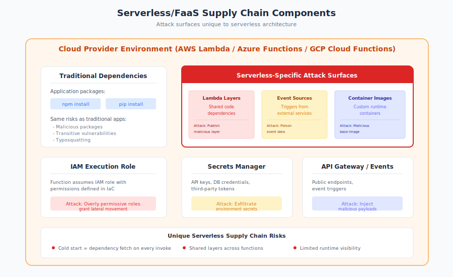

# 9.5 Serverless and Function-as-a-Service Supply Chains

Serverless architectures abstract away infrastructure management, allowing developers to focus on code rather than servers. AWS Lambda, Azure Functions, Google Cloud Functions, and similar platforms manage the underlying compute, scaling, and runtime environments. This abstraction provides operational benefits—but it also creates unique supply chain considerations. Dependencies exist not only in your code but in shared layers, managed runtimes, and platform-provided components that you don't directly control.

Understanding serverless supply chains requires examining both the traditional dependencies you bundle with your code and the platform-provided components that execute invisibly.

## Lambda Layers and Shared Code Risks

**Lambda Layers** (and equivalent mechanisms on other platforms) allow sharing code across multiple functions. A layer contains libraries, custom runtimes, or other dependencies that functions can reference rather than bundling directly.

**How Layers Work:**

A Lambda function can include up to five layers. When the function initializes, Lambda extracts layer contents into the execution environment. Layers can provide:

- Common libraries (AWS SDK, database drivers, utilities)
- Custom runtimes (non-standard languages)
- Shared business logic
- Configuration or secrets

**Supply Chain Implications:**

Layers create dependencies that may not be visible in function code:

- **Third-party layers**: AWS provides some layers; organizations can publish layers; and public layer repositories exist. Each is a trust relationship.
- **Version management**: Layers have versions. A function pinned to `arn:aws:lambda:...:layer:my-layer:3` depends on that specific version—but organizations may update layer content while keeping version numbers.
- **Transitive dependencies**: Layers contain their own dependencies. A "database utilities" layer might include ORM libraries, connection pooling, and their dependencies.

**Malicious Layer Risks:**

An attacker who can publish or modify layers gains code execution in every function using that layer:

- **Account compromise**: Attackers with layer publishing permissions can push malicious versions
- **Layer reference manipulation**: Changing layer ARNs in function configuration redirects to different code
- **Public layer trust**: Using public layers from unknown publishers mirrors npm trust risks

**Azure and Google Equivalents:**

- **Azure Functions Extensions**: Binding extensions provide similar shared functionality
- **Google Cloud Functions**: Uses standard dependency mechanisms but supports private artifact registries

## Cold Start and Initialization Security

Serverless functions experience **cold starts**—initialization periods when the platform provisions execution environments. During cold starts:

1. Platform provisions compute resources
2. Runtime initializes (Node.js, Python, etc.)
3. Your deployment package is loaded
4. Layers are extracted and merged
5. Initialization code executes (module imports, global setup)
6. Handler becomes ready for invocation

**Security Implications:**

**Initialization code runs before handlers**: Code at the module level (outside handler functions) executes during cold start. This includes:

- Import statements that trigger module initialization
- Global variable assignment
- Connection establishment

A malicious dependency that runs code on import can execute during cold starts, potentially:

- Exfiltrating environment variables (including secrets)
- Establishing persistence mechanisms
- Modifying the runtime environment

**Initialization attacks are stealthy**: Cold starts happen infrequently after the first invocation. Malicious initialization code might execute once per environment lifecycle, making detection through handler monitoring difficult.

**Environment variable exposure**: Serverless functions commonly receive secrets through environment variables. During cold start, all environment variables are accessible—making initialization the ideal time for credential theft.

## Cloud Provider-Managed Runtimes

Serverless platforms provide managed runtimes—the language interpreters and base environments your code runs on. You select a runtime (Node.js 18.x, Python 3.11, etc.) but don't control its specific implementation.

**Hidden Dependencies:**

Managed runtimes include components you didn't choose:

- **Base operating system**: Amazon Linux 2, Debian-based images
- **System libraries**: OpenSSL, glibc, and other native libraries
- **Language runtime**: The specific interpreter version and configuration
- **AWS SDK** (for Lambda): Pre-installed AWS SDK versions

These components are dependencies in your supply chain, even though you didn't explicitly add them.

**Version Management:**

Providers manage runtime versions with varying policies:

- **Major versions**: You select (Node.js 18.x vs 20.x)
- **Minor/patch versions**: Provider controls, may update without notice
- **Security patches**: Applied by provider on their schedule

**The Shared Responsibility Model:**

AWS describes this as [shared responsibility][aws-shared-responsibility]:

AWS is responsible for security of the cloud; customers are responsible for security in the cloud.

For Lambda, this means:

- **AWS responsibility**: Runtime security patches, hypervisor security, network isolation
- **Customer responsibility**: Code security, dependency management, IAM permissions, data protection

The challenge is that "dependency management" interacts with provider-managed components. A vulnerability in a system library affects you even though you didn't install it.

**Runtime Deprecation:**

Providers eventually deprecate runtimes. When Node.js 14 reaches end-of-life, Lambda deprecates it. Functions on deprecated runtimes:

- Stop receiving security updates
- Eventually cannot be updated or deployed
- May be forcibly migrated

Planning for runtime transitions is part of serverless supply chain management.

## Ephemeral Compute: Forensics Challenges

Serverless execution environments are ephemeral—they exist briefly and are destroyed without persistent storage. This creates significant forensics and incident response challenges.

**What's Lost:**

When a Lambda execution environment terminates:

- Filesystem contents disappear
- Memory contents are released
- Process state is gone
- Only logs and explicitly-stored data persist

If a malicious dependency executed during an invocation, evidence may exist only in CloudWatch Logs (if the function logged relevant information) and external destinations (if the attacker exfiltrated data to visible endpoints).

**Detection Challenges:**

- **No disk forensics**: Traditional malware analysis examining disk artifacts isn't possible
- **No memory analysis**: No core dumps or memory snapshots
- **No process trees**: Can't examine process relationships post-facto
- **Limited network visibility**: VPC flow logs capture connections but not content

**Incident Response Implications:**

When investigating serverless compromises:

1. **Logs are primary evidence**: CloudWatch Logs, X-Ray traces, and CloudTrail API logs become essential
2. **Environment recreation may be impossible**: The exact conditions of a compromised execution may not be reproducible
3. **Attacker awareness**: Sophisticated attackers understand serverless forensics limitations

**Mitigation Approaches:**

- Enable comprehensive logging before incidents occur
- Use Lambda Extensions for runtime monitoring
- Implement tracing (X-Ray, third-party APM)
- Export logs to persistent, immutable storage
- Consider custom logging of dependency loading

## Least Privilege for Serverless Functions

Serverless functions execute with IAM permissions that define what cloud resources they can access. Overly permissive IAM roles amplify supply chain compromise impact.

**The Risk:**

A compromised dependency executing in a Lambda function operates with that function's IAM permissions. If the function has broad permissions:

- Access to S3 buckets containing sensitive data
- Ability to invoke other functions
- DynamoDB read/write access
- Secrets Manager access
- Potentially administrative capabilities

**Common Anti-Patterns:**

- **Reused roles**: Multiple functions sharing one IAM role with combined permissions
- **Wildcard permissions**: `"Resource": "*"` granting access to all resources of a type
- **Over-provisioning**: Permissions "just in case" they're needed
- **Admin roles for convenience**: Development shortcuts that persist to production

**Best Practices:**

1. **One role per function**: Each function should have dedicated permissions
2. **Least privilege scoping**: Permission only for specific resources the function needs
3. **Condition constraints**: Use IAM conditions to restrict by source IP, time, etc.
4. **Regular audits**: Review permissions as function requirements evolve
5. **Permission boundaries**: Set maximum permission limits

**Tools:**

- **[AWS IAM Access Analyzer][iam-analyzer]**: Identifies overly permissive policies
- **[Prowler][prowler]**: Open-source AWS security assessment
- **[Cloudsplaining][cloudsplaining]**: IAM security assessment tool
- **[Repokid][repokid]**: Automated least-privilege policy generation based on actual usage

## Deployment Package Security

Serverless functions are deployed as packages—ZIP files (Lambda, Azure Functions) or container images. These packages contain your code and bundled dependencies.

**What Goes Into the Package:**

A typical Node.js Lambda deployment includes:

- Your handler code
- `node_modules/` with production dependencies
- Potentially development dependencies (if not excluded)
- Configuration files
- Possibly secrets accidentally included

**Supply Chain Scanning:**

Deployment packages should be scanned for:

- **Known vulnerabilities**: CVEs in dependencies (npm audit, Snyk, etc.)
- **Malicious packages**: Known malicious dependencies
- **Secrets**: Accidentally included credentials
- **Excessive dependencies**: Bloat indicating poor dependency hygiene

**Container Images:**

Serverless platforms increasingly support container images. Container supply chains add considerations:

- Base image selection and updating
- Container scanning (Trivy, Clair, Snyk Container)
- Image provenance and signing

**Deployment Pipeline Security:**

The pipeline deploying serverless functions is part of the supply chain:

- CI/CD credentials with deployment permissions
- Build environments where dependencies are resolved
- Infrastructure-as-code templates defining function configuration

A compromise anywhere in this pipeline can inject malicious code into production functions.

## Monitoring and Observability

Traditional monitoring approaches require adaptation for serverless environments.

**Built-in Capabilities:**

- **CloudWatch Logs**: Function output and errors
- **CloudWatch Metrics**: Invocations, duration, errors, throttles
- **X-Ray**: Distributed tracing
- **CloudTrail**: API activity (deployments, configuration changes)

**Visibility Gaps:**

Standard monitoring may miss:

- Dependency-level behavior
- Network connections from dependencies
- File system activity during execution
- Subtle behavioral anomalies

**Enhanced Monitoring Approaches:**

**Lambda Extensions:**

Lambda Extensions run alongside function code, providing:

- Runtime behavior monitoring
- Log enrichment
- Security agent capabilities

Security vendors like [Datadog][datadog-lambda], [Contrast Security][contrast], and [Aqua Security][aqua] offer serverless security solutions, some deployable as Lambda Extensions or Layers.

**Runtime Application Self-Protection (RASP):**

RASP solutions instrument the runtime to detect malicious behavior:

- Unexpected network connections
- Credential access patterns
- Injection attempts

**Behavioral Baselines:**

Establish what normal function behavior looks like:

- Expected network destinations
- Typical resource access patterns
- Normal invocation frequencies

Deviations may indicate compromise.

## Recommendations

**For Serverless Developers:**

1. **Scan deployment packages.** Integrate vulnerability scanning into CI/CD pipelines. Scan before deployment, not just during development.

2. **Minimize dependencies.** Serverless cold starts penalize large packages anyway. Fewer dependencies mean reduced attack surface.

3. **Pin layer versions.** Reference specific layer versions rather than `$LATEST`. Understand what each layer contains.

4. **Audit initialization code.** Review what executes at module load time. Malicious dependencies often strike during initialization.

5. **Avoid public layers from unknown sources.** Treat layer selection as seriously as npm package selection.

**For Security Teams:**

1. **Implement least-privilege IAM.** Every function should have minimal, function-specific permissions. Audit regularly.

2. **Enable comprehensive logging.** Configure CloudWatch Logs with appropriate retention. Export to immutable storage for forensics capability.

3. **Monitor for behavioral anomalies.** Use Lambda Extensions or third-party tools to detect unusual function behavior.

4. **Scan container images.** For container-based serverless, implement container security scanning.

5. **Audit deployment pipelines.** CI/CD systems with serverless deployment permissions are high-value targets.

**For Cloud Architects:**

1. **Design for observability.** Build logging and tracing into serverless architectures from the start.

2. **Plan for runtime transitions.** Track runtime deprecation schedules. Budget time for upgrades.

3. **Understand shared responsibility.** Know what the provider manages versus what you're responsible for.

4. **Isolate sensitive functions.** Functions handling sensitive data warrant additional monitoring and tighter permissions.

5. **Use infrastructure-as-code.** Define function configurations, including IAM roles, in version-controlled templates for auditability.

Serverless architectures shift some supply chain risks to cloud providers while creating new ones through layers, managed runtimes, and ephemeral execution. The abstraction that makes serverless attractive also reduces visibility into what's actually running. Effective serverless security requires understanding these hidden dependencies, implementing appropriate monitoring, and applying least privilege rigorously—because when dependencies go wrong, the blast radius extends to everything the function can access.

[aws-shared-responsibility]: https://aws.amazon.com/compliance/shared-responsibility-model/
[iam-analyzer]: https://docs.aws.amazon.com/IAM/latest/UserGuide/what-is-access-analyzer.html
[prowler]: https://github.com/prowler-cloud/prowler
[cloudsplaining]: https://github.com/salesforce/cloudsplaining
[repokid]: https://github.com/Netflix/repokid
[datadog-lambda]: https://docs.datadoghq.com/serverless/aws_lambda/
[contrast]: https://www.contrastsecurity.com/
[aqua]: https://www.aquasec.com/

