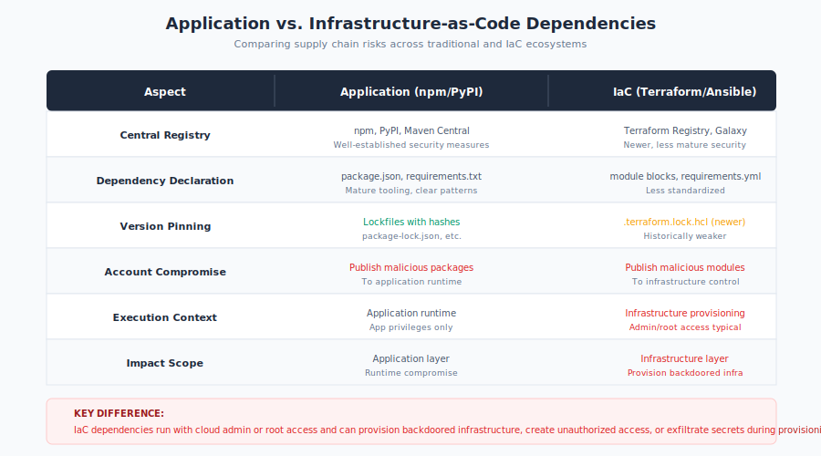

# 9.6 Infrastructure-as-Code Supply Chains

Infrastructure-as-Code (IaC) has transformed how organizations provision and manage infrastructure. Terraform, Ansible, Helm, and similar tools enable version-controlled, repeatable infrastructure deployments. But these tools operate through modules, providers, roles, and charts—dependencies that carry supply chain risk just like application packages. The difference is stakes: a compromised npm package might steal credentials; a compromised Terraform module can provision backdoored infrastructure, create unauthorized access, or exfiltrate secrets from the provisioning process itself.

IaC supply chains deserve the same scrutiny as application dependencies, yet often receive less attention because infrastructure teams may not think of modules as "software dependencies" in the traditional sense.

#### Terraform Modules and Providers

[Terraform][terraform] dominates the IaC landscape and is widely adopted by organizations practicing infrastructure automation. Its supply chain consists of two primary components:

**Providers:**

Terraform **providers** are plugins that interface with APIs—AWS, Azure, GCP, Kubernetes, and hundreds of other services. Providers translate Terraform configuration into API calls.

- **Official providers**: Maintained by HashiCorp (AWS, Azure, GCP, Kubernetes)
- **Partner providers**: Maintained by technology partners with HashiCorp verification
- **Community providers**: Maintained by community members without formal verification

Providers execute during `terraform apply` with access to:

- Cloud credentials in environment variables or configuration
- State files containing sensitive infrastructure details
- The network context of wherever Terraform runs

A malicious provider could exfiltrate credentials, modify infrastructure beyond declared configuration, or establish persistent access.

**Modules:**

Terraform **modules** package reusable infrastructure configurations. Rather than writing VPC configuration from scratch, teams reference community or internal modules:

```hcl
module "vpc" {
  source  = "terraform-aws-modules/vpc/aws"
  version = "5.0.0"
  
  # configuration...
}
```

The [Terraform Registry][terraform-registry] hosts thousands of modules:

- Thousands of modules are available in the Terraform Registry
- The most popular modules have millions of downloads
- No formal security review process exists for public modules

**Registry Trust Model:**

The Terraform Registry operates similarly to npm or PyPI:

- Anyone can publish modules with a GitHub account
- No mandatory security review
- Namespace is tied to GitHub username/organization
- Verification badges exist for HashiCorp partners but don't indicate security review

**Supply Chain Risks:**

1. **Module source substitution**: If a module reference uses flexible versioning or unverified sources, attackers can inject malicious versions

2. **Provider impersonation**: Typosquatting on provider names (`aws` vs `awss`)

3. **Embedded credentials**: Modules may contain hardcoded credentials or secrets

4. **Excessive permissions**: Modules may create resources with overly permissive IAM policies

5. **Remote execution**: Terraform's `local-exec` and `remote-exec` provisioners can run arbitrary commands

**Version Pinning:**

Unlike application dependencies, Terraform historically had weak version pinning:

```hcl
# DANGEROUS: Uses latest version
module "vpc" {
  source = "terraform-aws-modules/vpc/aws"
}

# BETTER: Pins to specific version
module "vpc" {
  source  = "terraform-aws-modules/vpc/aws"
  version = "5.0.0"
}

# BEST: Also verifies checksums via lock file
# terraform.lock.hcl maintains hashes
```

Terraform 0.14 introduced [`.terraform.lock.hcl`][terraform-lock] for provider checksums, providing npm-lockfile-equivalent verification.

#### Ansible Roles and Galaxy

[Ansible][ansible] automates configuration management through **playbooks** that reference **roles**—reusable configuration packages. **[Ansible Galaxy][ansible-galaxy]** serves as the public repository for community roles.

**Galaxy Security Model:**

Ansible Galaxy has historically offered [minimal security assurances][galaxy-security]:

- No code review for published roles
- Limited verification of publisher identity
- Namespace based on Galaxy accounts, not strongly tied to identity
- No mandatory signing or checksum verification

**Role Execution Context:**

Ansible roles execute on target systems, typically with elevated privileges:

- SSH access to target machines
- Often running as root or with sudo
- Access to inventory variables containing credentials
- Network access from target systems

A malicious role can:

- Install backdoors on managed systems
- Exfiltrate secrets from inventory or variables
- Modify configurations beyond declared scope
- Establish persistence mechanisms

**Ansible Collections:**

Red Hat has promoted **Ansible Collections** as the modern distribution format, with improved namespacing and the possibility of signature verification. Collections from `ansible.builtin` and certified collections receive more scrutiny than Galaxy-sourced community content.

**Version Pinning:**

```yaml
# requirements.yml
roles:
  - name: geerlingguy.docker
    version: 6.1.0  # Pin specific version

collections:
  - name: community.general
    version: 7.0.0
```

Without explicit version pinning, `ansible-galaxy install` fetches the latest version—creating the same update-as-attack-vector risk seen in other ecosystems.

#### Helm Charts and Kubernetes Operators

Kubernetes deployments commonly use **Helm charts** to package applications and **operators** to manage complex stateful workloads. Both introduce supply chain considerations.

**Helm Charts:**

Helm charts contain:

- Kubernetes manifests (Deployments, Services, ConfigMaps)
- Values files with configuration defaults
- Templates with Go templating logic
- Hooks that execute during install/upgrade

**What to Verify:**

1. **Container images**: Charts reference images that may come from untrusted registries
2. **Security contexts**: Whether pods run as root, with privileged access
3. **RBAC definitions**: What permissions the chart requests
4. **NetworkPolicies**: Whether the chart restricts network access appropriately
5. **Hooks and jobs**: What executes during chart lifecycle events

**Chart Repositories:**

Charts are distributed through repositories:

- **[Artifact Hub][artifact-hub]**: Aggregates charts from many sources
- **[Bitnami][bitnami]**: Popular chart repository with regular updates
- **Organization-specific registries**: Internal Helm repositories

No central authority reviews charts for security. Artifact Hub provides metadata but not security verification.

**Helm Chart Signing:**

[Helm][helm] supports [provenance files][helm-provenance] (`.prov`) for signature verification:

```bash
helm verify mychart-1.0.0.tgz
```

In practice, few charts are signed, and few organizations verify signatures.

**Kubernetes Operators:**

Operators extend Kubernetes with custom controllers. They run with cluster-level permissions and can:

- Create, modify, and delete any Kubernetes resources
- Access secrets across namespaces
- Execute arbitrary code in the cluster

Operators are typically installed via:

- Helm charts (inheriting Helm supply chain risks)
- Operator Lifecycle Manager (OLM) with OperatorHub
- Direct manifest application

OperatorHub provides some curation for "certified" operators, but community operators have minimal review.

#### Policy-as-Code Supply Chains

Policy-as-code tools like **[Open Policy Agent (OPA)][opa]**, **[Kyverno][kyverno]**, and **[Conftest][conftest]** enforce security and compliance policies. These tools have their own supply chains:

**OPA and Rego Policies:**

OPA policies written in Rego can be:

- Bundled and distributed as policy bundles
- Referenced from remote locations
- Included from shared libraries

A compromised policy could:

- Approve resources that should be denied
- Deny legitimate resources (availability impact)
- Leak information through policy evaluation side effects

**Kyverno Policies:**

Kyverno policies are Kubernetes resources that can be packaged and distributed. The Kyverno Policy Library provides community policies—useful but unverified.

**Policy Supply Chain Risks:**

- **Malicious policy approval**: Policies that permit insecure configurations
- **Policy bypass**: Subtle logic errors (intentional or not) that allow circumvention
- **Policy denial of service**: Policies that block legitimate operations

**Verification Approaches:**

- Test policies against known-good and known-bad configurations
- Peer review policy changes like code changes
- Use policy testing frameworks (OPA's testing, Kyverno's policy testing)

#### GitOps Security Considerations

**GitOps** uses Git repositories as the source of truth for infrastructure. Tools like **[Argo CD][argocd]** and **[Flux][flux]** continuously reconcile cluster state with repository contents. This creates a direct path from repository to infrastructure.

**The Repository as Attack Vector:**

In GitOps:

- Repository content directly determines infrastructure state
- Push access to the repository equals infrastructure access
- Repository compromise equals infrastructure compromise

This is simultaneously a security benefit (all changes are version-controlled and auditable) and a concentration of risk (the repository becomes a critical target).

**GitOps Supply Chain Risks:**

1. **Repository access control**: Over-permissive access grants infrastructure control to unintended parties

2. **Branch protection**: Without proper protection, unauthorized changes can reach production

3. **External references**: Charts, modules, or images referenced in GitOps repos have all their native supply chain risks

4. **Secrets management**: GitOps repos may contain or reference secrets (encrypted or via external secret operators)

5. **Sync automation**: Continuous sync means malicious changes deploy automatically

**GitOps Security Practices:**

- Strict branch protection on deployment branches
- Required reviews for infrastructure changes
- Signed commits for audit trail
- Separation between application and infrastructure repos
- Secret management through external systems (HashiCorp Vault, AWS Secrets Manager)

#### Parallels to Application Dependencies

IaC supply chains mirror application package manager risks:

| Aspect | Application (npm/PyPI) | IaC (Terraform/Ansible) |
|--------|----------------------|-------------------------|
| Central registry | npm, PyPI | Terraform Registry, Galaxy |
| Dependency declaration | package.json, requirements.txt | modules blocks, requirements.yml |
| Version pinning | Lockfiles | .terraform.lock.hcl, versions |
| Account compromise | Publish malicious packages | Publish malicious modules |
| Typosquatting | Misspelled packages | Misspelled modules/providers |
| Transitive deps | Deep dependency trees | Nested modules |
| Execution context | Application runtime | Infrastructure provisioning |

**Key Differences:**

- **Impact scope**: IaC dependencies affect infrastructure, not just applications
- **Privilege level**: IaC typically runs with cloud admin or root access
- **Execution frequency**: IaC runs during provisioning, not continuously
- **Visibility**: IaC supply chains may be less monitored than application deps

#### Vetting and Pinning IaC Dependencies

**Vetting Practices:**

Before adopting IaC modules:

1. **Review source code**: Examine what the module actually does, not just what it claims

2. **Check maintenance status**: Active maintenance, responsive to issues, recent updates

3. **Assess publisher reputation**: Is this from a known, trusted source?

4. **Evaluate permissions**: What access does the module require? Is it justified?

5. **Scan for secrets**: Check for hardcoded credentials or secrets

6. **Test in isolation**: Run in a sandbox environment before production

**Version Pinning:**

Always pin IaC dependencies to specific versions:

```hcl
# Terraform
terraform {
  required_providers {
    aws = {
      source  = "hashicorp/aws"
      version = "5.31.0"  # Exact version
    }
  }
}

module "vpc" {
  source  = "terraform-aws-modules/vpc/aws"
  version = "5.0.0"  # Exact version
}
```

```yaml
# Ansible requirements.yml
collections:
  - name: amazon.aws
    version: 6.5.0  # Exact version
```

**Checksum Verification:**

Where supported, verify checksums:

- Terraform lock files (`.terraform.lock.hcl`) contain provider checksums
- Helm chart provenance files enable signature verification
- Container image digests (rather than tags) ensure specific content

#### Recommendations

**For Platform Engineers:**

1. **Treat IaC modules as code dependencies.** Apply the same scrutiny to Terraform modules as to npm packages. They're both software dependencies.

2. **Pin all versions explicitly.** Never rely on implicit "latest" versions. Use exact version constraints and lock files.

3. **Maintain an internal module registry.** For critical infrastructure, curate approved modules in an internal registry rather than pulling directly from public sources.

4. **Scan IaC for security issues.** Use tools like Checkov, tfsec, or Terrascan to analyze Terraform; ansible-lint and molecule for Ansible.

5. **Review module updates before applying.** When updating modules, review changes rather than blindly accepting new versions.

**For Security Teams:**

1. **Audit IaC supply chains.** Include Terraform modules, Ansible roles, and Helm charts in dependency inventories.

2. **Monitor for suspicious module activity.** Track module publication dates, ownership changes, and unusual update patterns.

3. **Implement policy-as-code carefully.** Policies themselves are code dependencies. Test and review policies before deployment.

4. **Secure GitOps repositories.** Treat deployment repos as infrastructure admin access. Implement strict access controls and branch protection.

5. **Limit provisioning credentials.** Apply least privilege to credentials used during IaC execution. Segment by environment.

**For Organizations Adopting GitOps:**

1. **Implement strong repository access controls.** Push access to GitOps repos equals infrastructure access.

2. **Require signed commits.** Ensure audit trails for all infrastructure changes.

3. **Separate concerns.** Use different repositories or branches for different environments and criticality levels.

4. **Externalize secrets.** Don't store secrets in GitOps repos, even encrypted. Use external secret management.

5. **Monitor sync operations.** Alert on unexpected or unauthorized sync events.

Infrastructure-as-Code supply chains represent a convergence of software dependency risks with infrastructure-level impact. The same patterns—untrusted registries, version flexibility, transitive dependencies—that create risk in npm or PyPI create amplified risk when the "dependency" provisions cloud infrastructure or configures production servers. Organizations that have matured their application supply chain practices should extend those practices to their IaC ecosystems before supply chain attackers recognize the opportunity that infrastructure modules present.

[terraform]: https://www.terraform.io/
[terraform-registry]: https://registry.terraform.io/
[terraform-lock]: https://developer.hashicorp.com/terraform/language/files/dependency-lock
[ansible]: https://www.ansible.com/
[ansible-galaxy]: https://galaxy.ansible.com/
[galaxy-security]: https://docs.ansible.com/ansible/latest/galaxy/user_guide.html
[helm]: https://helm.sh/
[artifact-hub]: https://artifacthub.io/
[bitnami]: https://bitnami.com/
[helm-provenance]: https://helm.sh/docs/topics/provenance/
[opa]: https://www.openpolicyagent.org/
[kyverno]: https://kyverno.io/
[conftest]: https://www.conftest.dev/
[argocd]: https://argo-cd.readthedocs.io/
[flux]: https://fluxcd.io/

