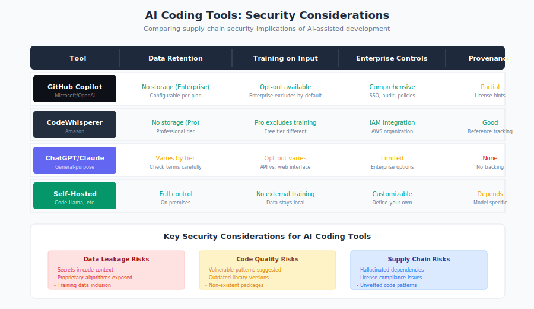

# 10.1 AI Coding Assistants and Supply Chain Risk

The integration of AI into software development represents the most significant change to development workflows in decades. Tools like GitHub Copilot, Cursor, Claude Code, Amazon CodeWhisperer, and Codeium now suggest code, complete functions, and recommend dependencies in real-time. These assistants have moved from novelty to necessity for many developers—GitHub reports that Copilot users accept AI suggestions for over 30% of their code.[^copilot-acceptance] But this integration introduces a new intermediary in the supply chain: an AI system that influences which packages are imported, which patterns are followed, and which libraries developers encounter.

[^copilot-acceptance]: GitHub, "Research: Quantifying GitHub Copilot's Impact in the Enterprise," GitHub Blog, 2024; "GitHub Copilot Research Findings," GitHub Innovation Graph, 2024.

This chapter examines how AI-assisted development creates new supply chain considerations, from the hallucinated packages that enable slopsquatting (Section 6.6) to the autonomous coding agents that may make dependency decisions with minimal human oversight.

#### The Rise of AI Coding Assistants

AI coding assistants have achieved remarkable adoption in a short time:

**Market Leaders:**

- **GitHub Copilot**: The dominant tool, with over 1.8 million paying subscribers as of 2024 and integration with VS Code, JetBrains, and other editors[^copilot-subscribers]
- **Cursor**: AI-native editor with aggressive inline completion and chat-based coding
- **Claude Code**: Anthropic's command-line and agentic coding tool
- **Amazon CodeWhisperer**: AWS-integrated assistant with security scanning
- **Codeium**: Free alternative with broad language support
- **Tabnine**: Privacy-focused assistant with on-premises options

[^copilot-subscribers]: GitHub, "GitHub Copilot now has over 1.8M paid subscribers," GitHub Blog, November 2024.

**Adoption Statistics:**

Stack Overflow's 2024 Developer Survey found:[^stackoverflow-ai-2024]

- **76% of developers** are using or planning to use AI coding tools
- **44%** currently use AI tools in their development workflow
- Copilot represents the majority of usage, followed by ChatGPT for code generation

[^stackoverflow-ai-2024]: Stack Overflow, "2024 Developer Survey: AI," Stack Overflow Blog, 2024, https://survey.stackoverflow.co/2024/

Enterprise adoption is accelerating. [GitHub reports][github-copilot-stats] that Copilot users accept approximately 30% of AI suggestions, with rates approaching 34-35% after six months of use.

#### How AI Assistants Influence Dependency Selection

AI coding assistants actively shape dependency choices through several mechanisms:

**Import Statement Suggestions:**

When a developer begins typing an import, AI assistants suggest completions:

```python
import requests  # Developer types "import req..."
from flask import Flask  # Developer types "from fla..."
```

The AI's training data influences which packages it suggests. Popular packages from the training corpus appear more frequently in suggestions.

**Code Pattern Suggestions:**

When solving problems, AI assistants suggest patterns that include specific libraries:

```python
# Developer describes: "parse JSON from API"
# AI suggests:
import requests
import json

response = requests.get(url)
data = response.json()
```

The developer may not have specifically chosen `requests`—the AI made that dependency decision.

**Example-Driven Learning:**

Developers often describe what they want, and AI provides complete implementations:

```
Developer: "Add logging to my Flask application"

AI suggests:
from flask import Flask
import logging
from logging.handlers import RotatingFileHandler
# ... complete implementation
```

The specific logging approach, handlers, and patterns all come from the AI's training, not developer choice.

**Transitive Influence:**

Once an AI suggests one library, subsequent suggestions often assume that library:

- Initial suggestion uses `pandas` for data processing
- Subsequent suggestions build on pandas patterns
- Developer accumulates pandas ecosystem without explicit decision

#### Security Implications

AI suggestions introduce security concerns at multiple levels:

**Vulnerable Pattern Suggestions:**

Research has consistently found that AI assistants suggest insecure code patterns. A [Stanford study][stanford-ai-security] ("Do Users Write More Insecure Code with AI Assistants?", 2023) by Neil Perry, Megha Srivastava, Deepak Kumar, and Dan Boneh found:

- Participants with AI assistance wrote **significantly less secure code** than those without
- AI-assisted participants were **more confident** in their code's security despite it being less secure
- Specific vulnerability patterns (SQL injection, path traversal) appeared in AI suggestions

**Outdated Library Recommendations:**

AI training data includes historical code. Suggestions may recommend:

- Libraries that have been deprecated
- Older versions of libraries with known vulnerabilities
- Packages that have been superseded by better alternatives
- Libraries with known security issues

For example, an AI trained on code from 2020-2022 might suggest `request` (npm package that was deprecated and removed for security reasons) rather than modern alternatives.

**Vulnerable Version Patterns:**

AI suggestions often omit version specifications:

```python
# AI suggests:
flask==2.0.1  # Specific but possibly outdated

# Or worse:
flask  # No version, uses latest (unpredictable)
```

Neither pattern follows security best practices of pinning to known-secure versions.

**Insecure Defaults:**

AI may suggest configurations with insecure defaults:

```python
# AI suggestion for quick development:
app.run(debug=True)  # Insecure for production

# AI suggestion for database connection:
ssl_mode='disable'  # Prioritizes compatibility over security
```

These patterns are common in training data (tutorials, examples) but inappropriate for production.

#### The "Vibe Coding" Phenomenon

The term **"vibe coding"** was [coined by AI researcher Andrej Karpathy][karpathy-vibe] in February 2025, describing development where programmers accept AI suggestions based on intuition rather than understanding—code that "vibes" correctly without detailed review. The term captures a real behavioral shift.

**Characteristics of Vibe Coding:**

- Accepting suggestions because they "look right"
- Not reading suggested code carefully before accepting
- Trusting AI judgment on library selection
- Moving quickly through AI suggestions without verification
- Assuming AI-suggested patterns are secure

**Why It Happens:**

- AI suggestions are often correct enough to work
- Speed pressure encourages quick acceptance
- Detailed review of every suggestion is exhausting
- Developers trust AI as an expert system
- Working code creates immediate positive feedback

**Supply Chain Implications:**

Vibe coding directly impacts supply chain security:

1. **Unreviewed imports**: Developers accept package imports without checking the package
2. **Unverified packages**: AI-suggested packages may not exist (slopsquatting risk)
3. **Outdated patterns**: Suggestions based on old training data go unquestioned
4. **Accumulated dependencies**: Projects accumulate AI-chosen dependencies

Security practitioners report observing developers who couldn't identify what packages their applications use—the AI chose them, they work, and that's often where investigation ends.

#### Training Data Provenance

AI coding assistants learn from vast code corpora, including sources with significant security limitations:

**Training Data Sources:**

- **Public GitHub repositories**: Includes student code, tutorials, abandoned projects
- **Stack Overflow**: Answers optimized for clarity, not security
- **Documentation examples**: Often simplified, omitting security considerations
- **Historical code**: Patterns that were acceptable years ago but are now insecure

**Quality Concerns:**

Not all training data is equal:

- Student projects may contain fundamental security errors
- Tutorial code prioritizes simplicity over security
- Copy-pasted code perpetuates outdated patterns
- Deprecated libraries appear in historical code

**Temporal Mismatch:**

Training data has a cutoff date. AI assistants may not know about:

- Recently discovered vulnerabilities
- Newly deprecated packages
- Current best practices
- Recent security advisories

An AI trained before December 2021 wouldn't know about Log4Shell (§5.1) and might suggest Log4j usage patterns that are now known to be dangerous.

**The Stack Overflow Effect:**

[Research has shown][stackoverflow-security] that Stack Overflow answers frequently contain security vulnerabilities. Since Stack Overflow is a significant training data source, these patterns propagate to AI suggestions. Studies have found:

- SQL injection vulnerabilities in accepted answers
- Insecure cryptographic patterns
- Disabled security features for convenience
- Outdated library recommendations

#### Over-Reliance and Reduced Verification

The convenience of AI assistance creates behavioral changes that compound supply chain risk:

**Trust Calibration:**

Developers must calibrate how much to trust AI suggestions. Research shows:

- Developers often over-trust AI suggestions
- Correct suggestions build confidence that persists through incorrect ones
- Time pressure encourages accepting rather than verifying
- Expert developers may assume AI knows things they don't

**Reduced Manual Research:**

Without AI, adding a package involved:

1. Researching options
2. Comparing alternatives
3. Checking security history
4. Reading documentation
5. Making an explicit choice

With AI:

1. AI suggests a package
2. Developer accepts

The research phase often disappears entirely.

**Compound Effects:**

Over time, AI-assisted projects may accumulate:

- More dependencies than necessary
- Dependencies the team doesn't understand
- Outdated patterns embedded in the codebase
- Technical debt from AI-suggested shortcuts

#### Comparison of AI Tools' Security Postures

Different AI coding assistants take varying approaches to security:

| Tool | Security Scanning | Vulnerability Warnings | License Checking | Training Data Control |
|------|------------------|----------------------|------------------|---------------------|
| GitHub Copilot | Basic secret detection | Limited | Limited | Public code filtering |
| Amazon CodeWhisperer | Built-in security scanning | Yes | Yes | AWS curated training |
| Tabnine | Enterprise options | Limited | Enterprise only | Private deployment option |
| Cursor | Relies on model providers | Limited | No | Model-dependent |
| Codeium | Limited | No | No | Public models |

**CodeWhisperer's Security Features:**

Amazon CodeWhisperer includes:
- Security scanning of generated code
- Flagging of suggestions similar to known vulnerable code
- Reference tracking for suggestions matching training data

**Enterprise Considerations:**

Organizations selecting AI tools should evaluate:
- Can the tool be configured to prefer secure patterns?
- Does it warn about known-vulnerable suggestions?
- Can suggestions be filtered against organizational policies?
- What training data controls exist?

#### Organizational Policies for AI-Assisted Development

Organizations need policies addressing AI coding assistant use:

**Policy Framework Elements:**

1. **Approved Tools**
   - Which AI assistants are permitted
   - Configuration requirements
   - Enterprise vs. individual licensing

2. **Usage Boundaries**
   - Where AI assistance is appropriate
   - Restrictions for security-sensitive code
   - Review requirements for AI-generated code

3. **Verification Requirements**
   - Dependency verification before addition
   - Security scanning of AI-suggested code
   - Review standards for AI-assisted contributions

4. **Training and Awareness**
   - Developer training on AI limitations
   - Security implications of AI suggestions
   - Recognition of slopsquatting and hallucination risks

5. **Audit and Monitoring**
   - Tracking AI-assisted contributions
   - Monitoring for AI-introduced vulnerabilities
   - Review of AI-suggested dependencies

**Sample Policy Elements:**

> All dependencies suggested by AI coding assistants must be verified to exist in the intended registry before use. Developers must confirm package name spelling against official registry listings.

> AI-generated code touching authentication, cryptography, or access control must receive security-focused code review regardless of other review requirements.

> AI coding assistants must not be used in environments with access to production secrets, credentials, or sensitive source code unless specifically approved.

#### Recommendations

**For Developers:**

1. **Verify AI-suggested packages.** Before using any AI-suggested import, confirm the package exists and is what you expect. Check the registry directly.

2. **Review AI-generated code.** Don't just accept suggestions—read them. Understand what the code does before integrating it.

3. **Be skeptical of patterns.** AI may suggest outdated or insecure patterns. Verify that suggested approaches match current best practices.

4. **Maintain security awareness.** AI assistance doesn't replace security knowledge. Continue learning about secure coding practices.

5. **Document AI-assisted decisions.** When AI influences significant decisions (library selection, architecture), document the rationale for future reference.

**For Security Practitioners:**

1. **Include AI in threat models.** AI-assisted development is a new input channel that introduces risk. Model it appropriately.

2. **Scan AI-generated code.** Apply security scanning to all code, with awareness that AI-generated code may contain distinct vulnerability patterns.

3. **Monitor for hallucinated packages.** Watch for installation failures or unusual packages that may indicate slopsquatting attempts.

4. **Train developers on AI risks.** Ensure developers understand the security implications of AI assistance.

5. **Audit AI-assisted projects.** Review projects developed with heavy AI assistance for accumulation of unnecessary or insecure dependencies.

**For Engineering Managers:**

1. **Establish AI usage policies.** Define acceptable use, required verification steps, and review requirements.

2. **Select tools with security features.** Prefer AI assistants that include security scanning and vulnerability warnings.

3. **Balance productivity and security.** AI assistance provides real productivity benefits, but not at the cost of security fundamentals.

4. **Provide time for verification.** If developers are pressured to move fast, verification steps get skipped. Build verification into expected timelines.

5. **Monitor team practices.** Understand how your team uses AI assistance and whether they're following security policies.

AI coding assistants are transforming development, and that transformation affects supply chains. The packages developers use, the patterns they follow, and the security of their code are all influenced by AI suggestions. Section 6.6 examined slopsquatting—attackers registering packages that AI assistants hallucinate. The following sections explore AI-generated code vulnerabilities (10.2), model supply chains (10.3), and autonomous coding agents (10.4), each adding dimensions to how AI reshapes software supply chain risk.

[github-copilot-stats]: https://github.blog/news-insights/product-news/github-copilot-in-vscode-free/
[stanford-ai-security]: https://arxiv.org/abs/2211.03622
[karpathy-vibe]: https://x.com/karpathy
[stackoverflow-security]: https://ieeexplore.ieee.org/document/9636616

