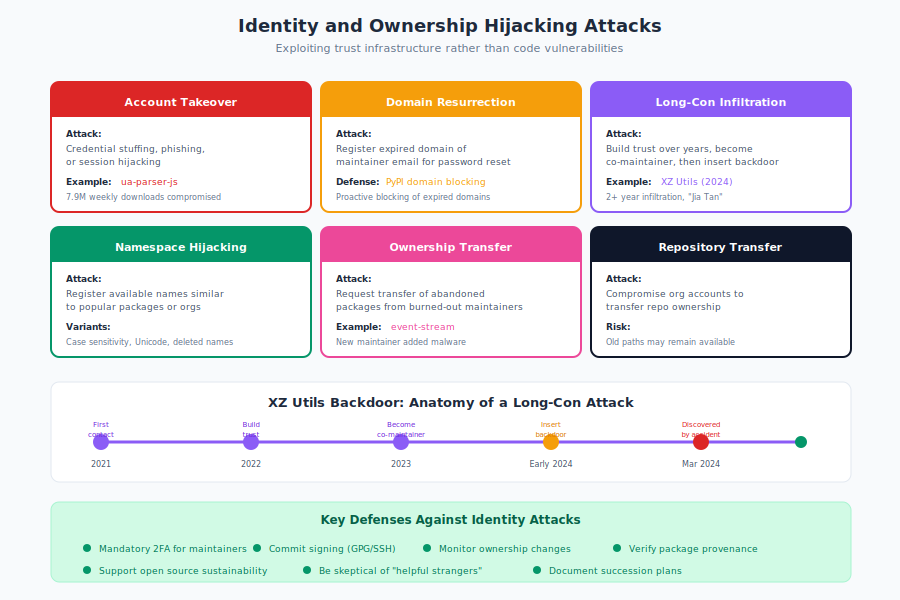

# 10.12 Identity and Ownership Hijacking

Software supply chain attacks don't always require exploiting code vulnerabilities. Some of the most effective attacks exploit **identity and ownership**—gaining control of a project's publishing credentials, maintainer accounts, or infrastructure. These "control handoff" attacks are particularly dangerous because they turn legitimate projects into attack vectors while maintaining the appearance of authenticity.

The XZ Utils backdoor incident demonstrated how patient attackers can infiltrate a project through social engineering and trust-building over years. But faster attacks are also effective: domain expiration, account takeovers, and repository transfers can give attackers control in hours.

!!! warning "Control Handoff Attacks"

    Identity attacks turn legitimate projects into attack vectors while maintaining the appearance of authenticity. Patient attackers infiltrate over years (XZ Utils); fast attackers exploit domain expiration or account takeover in hours.

## The Taxonomy of Identity Attacks

Identity and ownership attacks target the trust infrastructure of open source:

| Attack Type | Target | Attacker Goal | Example |
|-------------|--------|---------------|---------|
| Maintainer takeover | Developer accounts | Control package publishing | ua-parser-js compromise |
| Domain resurrection | Expired maintainer domains | Password reset access | PyPI domain blocking |
| Repository transfer | Git hosting accounts | Control source code | Malicious repo transfers |
| Namespace hijacking | Abandoned package names | Publish under trusted name | PyPI namespace attacks |
| Social engineering | Human maintainers | Gain commit access | XZ Utils backdoor |
| Organization infiltration | Open source orgs | Become trusted insider | Long-con maintainer attacks |

## Domain Resurrection Attacks

!!! danger "Domain Resurrection"

    Attacker registers an expired maintainer email domain, requests password reset, and gains control of the registry account. Domains require ongoing payment; registry accounts don't expire.

Package registry accounts are often tied to email addresses. When the domain of that email expires, attackers can register it and gain access to password reset flows.

**Attack mechanism:**

1. Attacker identifies a package maintained by `developer@expired-domain.com`
2. Domain `expired-domain.com` has expired or is available
3. Attacker registers the domain
4. Attacker requests password reset for the registry account
5. Reset email goes to attacker-controlled domain
6. Attacker gains control of the package

**Why this works:**

- Maintainers change jobs, projects, or email providers
- Domains require ongoing payment; accounts don't expire
- Registries don't verify continued email ownership
- Password reset is the standard account recovery method

**PyPI's Response:**

In 2024-2025, PyPI began blocking packages[^pypi-domains] with dependencies on expired or potentially compromised domains. This proactive measure prevents the most obvious domain resurrection attacks but highlights the systemic nature of the problem.

**Indicators of domain resurrection risk:**

- Maintainer email domains that are no longer active
- Packages with no updates but continued downloads
- Maintainer accounts with no recent activity
- Contact information that bounces or is undeliverable

## The XZ Utils Backdoor: A Case Study in Long-Con Infiltration

!!! example "XZ Utils: Two-Year Infiltration"

    "Jia Tan" began contributing in 2021, became co-maintainer in 2023, and introduced the backdoor in 2024. Fake contributors pressured the overwhelmed maintainer to accept help. The backdoor was hidden in test files.

The XZ Utils backdoor, discovered in March 2024, represents the most sophisticated supply chain attack targeting open source identity and trust. CISA's analysis[^cisa-xz] emphasized that the attack was fundamentally social and operational, not just technical.

**Timeline of infiltration:**

1. **2021-2022**: An individual using the name "Jia Tan" begins contributing to XZ Utils
2. **2022-2023**: Jia Tan establishes credibility through legitimate contributions
3. **2023**: Other personas apply social pressure on the maintainer, suggesting the project needs more help
4. **Late 2023**: Jia Tan becomes a co-maintainer with commit and release access
5. **Early 2024**: Malicious code is introduced through obfuscated test files
6. **March 2024**: Backdoor is discovered by a vigilant developer noticing SSH latency issues

**Key elements:**

- **Patience**: The attack developed over approximately two years
- **Social engineering**: Fake contributors pressured the maintainer to accept help
- **Legitimate contributions**: Jia Tan made real, valuable contributions first
- **Trust building**: Gradually gained elevated permissions
- **Obfuscation**: Backdoor was hidden in test files, not main source code

**Lessons from XZ Utils:**

- **Maintainer burnout enables attacks**: The original maintainer was overwhelmed and welcomed help
- **Identity verification is insufficient**: Jia Tan's identity was never verified
- **Code review isn't enough**: The backdoor evaded code review through clever obfuscation
- **Single points of failure**: One maintainer's trust decision affected millions of systems

## Maintainer Account Takeover

Beyond domain resurrection, attackers directly target maintainer accounts:

**Attack vectors:**

- **Credential stuffing**: Using leaked passwords from other breaches
- **Phishing**: Fake login pages or security alerts
- **Session hijacking**: Stealing active session tokens
- **Malware**: Keyloggers or browser extensions capturing credentials
- **Social engineering**: Convincing support staff to reset access

**Notable incidents:**

The compromise of popular npm packages like `ua-parser-js` (7.9 million weekly downloads at the time) occurred through maintainer account takeover. The attacker published malicious versions that installed cryptocurrency miners and credential stealers.

**Impact amplification:**

When attackers control a maintainer account, they can:

- Publish malicious package updates
- Add malicious dependencies
- Modify README and documentation
- Transfer repository ownership
- Invite additional malicious collaborators

## Namespace and Package Name Hijacking

Package registries have namespace rules that attackers exploit:

**Namespace gaps:**

- **Abandoned packages**: Maintainer deletes account; name becomes available
- **Organization confusion**: Similar names across organizations
- **Case sensitivity**: `Package` vs `package` in some registries
- **Character confusables**: Unicode characters that look like ASCII

**Registry-specific risks:**

- **npm**: Package names can be reused after deletion (with restrictions)
- **PyPI**: Deleted package names are reserved but subject to policy exceptions
- **RubyGems**: Similar name reuse policies
- **Maven**: Namespace is based on domain ownership, which can change

**Typosquatting overlap:**

Namespace hijacking overlaps with typosquatting when attackers register variations of popular package names. The difference is intent: namespace hijacking specifically targets previously legitimate names.

## Repository Transfer Attacks

Source code repositories can be transferred between owners, creating attack opportunities:

**Transfer attack scenarios:**

1. **Compromised account transfer**: Attacker gains access to owner account and transfers to their control
2. **Social engineering transfer**: Convincing maintainer to transfer ownership
3. **Organization account takeover**: Compromising organization admin accounts
4. **Rename and claim**: When repositories are renamed, old names may become available

**GitHub-specific risks:**

- Repository renames leave the old path available
- Transferred repositories may retain CI/CD secrets
- Forks may not update to reflect new ownership
- Stars and trust signals persist through transfers

**Mitigations:**

- Monitor critical dependency repositories for ownership changes
- Verify maintainer identity before trusting transferred projects
- Check repository history for unexplained ownership events
- Be suspicious of repositories that recently changed hands

## Organization Infiltration

Attackers increasingly target the governance of open source organizations:

**Infiltration paths:**

- **Becoming a contributor**: Start with legitimate contributions
- **Volunteering for governance**: Participate in working groups, committees
- **Exploiting burnout**: Offer to take over from exhausted maintainers
- **Building relationships**: Establish trust over time

**Warning signs:**

- New contributors pushing for elevated access quickly
- Pressure to accept help from unknown individuals
- Contributors with no verifiable history or identity
- Coordinated social pressure from multiple new accounts

**The "helpful stranger" pattern:**

A common attack pattern involves:

1. Multiple new accounts report issues or feature requests
2. These accounts complain about slow maintenance
3. A "helpful" new contributor offers to take over
4. Pressure mounts on the maintainer to accept help
5. The helpful stranger gains commit access

This pattern was visible in the XZ Utils attack and has been observed elsewhere.

## Identity Verification Challenges

Verifying contributor identity in open source is genuinely difficult:

**Why verification is hard:**

- **Pseudonymity norm**: Many legitimate contributors use pseudonyms
- **Global participation**: Contributors span jurisdictions and cultures
- **Low barriers**: Open source values accessibility
- **Privacy concerns**: Verification may deter legitimate contributors
- **Cost**: Verification at scale is expensive

**Partial solutions:**

- **Commit signing**: GPG or SSH key signing provides cryptographic identity
- **Verified emails**: Confirming email ownership (not identity)
- **GitHub Vigilant Mode**: Marking unsigned commits
- **Web of trust**: Vouching by known community members
- **Multi-factor authentication**: Reducing account takeover risk

**Limitations:**

These measures verify account control, not human identity. An attacker with a long-term presence can establish a verifiable identity that is still malicious.

## Registry and Platform Defenses

Registries are implementing defenses against identity attacks:

**PyPI:**

- Mandatory 2FA for critical projects
- Domain blocking for expired maintainer domains
- Package name reservation after deletion
- Trusted publisher workflow (OIDC-based publishing)

**npm:**

- Mandatory 2FA for high-impact packages
- Provenance attestation (linking packages to source)
- Organization 2FA requirements
- Audit logging for publishing events

**GitHub:**

- Vigilant mode for commit verification
- Organization security settings
- Secret scanning for leaked credentials
- Dependabot alerts for dependency changes

**Maven Central:**

- Namespace verification through domain ownership
- GPG signing requirements
- Publishing through verified accounts

## Detecting Ownership Changes

Organizations should monitor for ownership changes in critical dependencies:

**What to monitor:**

- Maintainer changes in package metadata
- Repository ownership transfers
- New collaborators added to projects
- Publishing key rotations
- Domain registration changes for maintainer emails

**Automated detection:**

```yaml
# Example: GitHub Action to detect maintainer changes
name: Monitor dependency ownership
on:
  schedule:
    - cron: '0 0 * * *'  # Daily
jobs:
  check-ownership:
    runs-on: ubuntu-latest
    steps:
      - name: Check maintainer consistency
        run: |
          # Compare current maintainers to baseline
          # Alert on unexpected changes
```

**Manual review triggers:**

- Package update from a new maintainer
- Repository recently transferred
- Maintainer email domain changed
- Unusual patterns in commit history

## Sustainable Open Source as Security

Many identity attacks exploit maintainer burnout and project abandonment. Sustainable open source practices improve security:

**Connection to security:**

- **Well-resourced projects** can implement better security practices
- **Multiple maintainers** reduce single points of failure
- **Funded maintenance** means maintainers don't abandon projects
- **Community health** makes social engineering harder

**What organizations can do:**

- Fund the open source projects you depend on
- Contribute engineering time, not just money
- Reduce maintainer burden through good bug reports
- Participate in governance of critical projects
- Support initiatives like the OpenSSF and Tidelift

## Recommendations

**For Maintainers:**

1. **Secure your accounts.** Use strong, unique passwords and hardware 2FA for registry and repository accounts.

2. **Use a stable email.** Maintain an email address you control permanently, or use registry-provided verified emails.

3. **Enable commit signing.** Sign commits with GPG or SSH keys to prove authorship.

4. **Be skeptical of help.** Verify the identity and intentions of new contributors, especially those seeking elevated access quickly.

5. **Document succession.** Plan for project handoff; don't let burnout force hasty decisions.

**For Security Teams:**

1. **Monitor ownership changes.** Track maintainer, repository, and domain changes for critical dependencies.

2. **Verify package provenance.** Use npm provenance, PyPI trusted publishers, and similar features where available.

3. **Audit dependency trust.** Understand who maintains your critical dependencies and their security practices.

4. **Plan for compromise.** Have procedures for discovering that a dependency's maintainer was compromised.

**For Organizations:**

1. **Support open source sustainability.** Fund and contribute to projects you depend on. Security is a byproduct of project health.

2. **Implement defense in depth.** Don't rely solely on maintainer trustworthiness; verify packages independently.

3. **Establish dependency policies.** Define criteria for dependency adoption including maintainer verification.

4. **Participate in ecosystem security.** Report suspicious activity; contribute to shared threat intelligence.

Identity and ownership attacks exploit the trust that makes open source possible. While technical controls help, the fundamental challenge is social: building sustainable communities where maintainers aren't vulnerable to burnout or social engineering. Organizations that consume open source without contributing to its sustainability are increasing their own supply chain risk.

[^pypi-domains]: TechRadar, "PyPI is blocking hundreds of expired domains to halt malware attacks," 2024, https://www.techradar.com/pro/security/pypl-is-blocking-hundreds-of-expired-domains-to-halt-malware-attacks

[^cisa-xz]: CISA, "Lessons from XZ Utils: Achieving a More Sustainable Open Source Ecosystem," 2024, https://www.cisa.gov/news-events/news/lessons-xz-utils-achieving-more-sustainable-open-source-ecosystem


