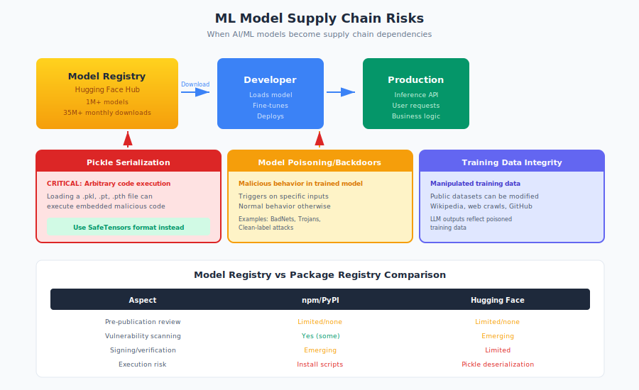

# 10.5 AI/ML Model Supply Chains

Previous sections examined how AI tools influence software development. This section addresses a different supply chain dimension: machine learning models themselves as dependencies. When you download a pre-trained model from Hugging Face or use a model from TensorFlow Hub, you're making a supply chain trust decision analogous to installing an npm package. But ML models bring unique risks—including serialization vulnerabilities that can achieve code execution simply by loading a model file, and poisoning attacks that can embed malicious behaviors invisible to inspection.

As organizations increasingly build on pre-trained models rather than training from scratch, the ML model supply chain becomes critical infrastructure requiring its own security framework.

## ML-Specific Supply Chain Assets

Machine learning systems depend on several categories of artifacts, each with supply chain considerations:

**Models:**

Trained model files contain learned parameters—weights and biases that encode the model's behavior. Models range from megabytes (small classifiers) to hundreds of gigabytes (large language models). They are the primary ML supply chain artifact.

**Datasets:**

Training and evaluation data shapes model behavior. Datasets may be:

- Public collections (ImageNet, Common Crawl, Wikipedia)
- Curated domain-specific data
- Proprietary organizational data
- Synthetic or generated data

Dataset integrity directly affects model behavior.

**Training Pipelines:**

Code and configuration that produces models:

- Training scripts and hyperparameters
- Data preprocessing code
- Evaluation metrics and procedures
- Infrastructure configuration

Compromised pipelines produce compromised models.

**Model Configurations:**

Settings that define model architecture and behavior:

- Architecture definitions (layer sizes, attention patterns)
- Tokenizers and vocabularies
- Inference parameters (temperature, sampling)

Configuration manipulation can alter model behavior without changing weights.

**Checkpoints and Intermediate Artifacts:**

Training produces intermediate states:

- Periodic checkpoint saves
- Optimizer states
- Gradient histories

These artifacts may be distributed and carry similar risks to final models.

## Model Registries: The New Package Registries

Model registries have emerged as the distribution infrastructure for ML artifacts, paralleling npm, PyPI, and other package registries.

**Hugging Face Hub:**

Hugging Face has become the dominant model registry:

!!! note inline end "Model Registry Scale"

    Hugging Face hosts over **1 million models** and **150,000 datasets** with **35 million+ monthly downloads**—and no mandatory security review before publication.

- Over **1 million models** available as of late 2024[^huggingface-stats]
- Over **150,000 datasets**
- **35 million+ monthly downloads** for popular models

[^huggingface-stats]: Hugging Face platform statistics, https://huggingface.co/metrics

- Integration with major ML frameworks (PyTorch, TensorFlow, JAX)

Hugging Face operates with a model similar to GitHub:

- Anyone can create an account and upload models
- Organizations can create verified namespaces
- Community ratings and downloads indicate popularity
- No mandatory security review before publication

**Other Registries:**

- **TensorFlow Hub**: Google's model registry for TensorFlow models
- **PyTorch Hub**: PyTorch's model distribution mechanism
- **Model Zoo**: Framework-specific collections
- **Cloud provider registries**: AWS, Azure, GCP model catalogs

**Trust Model Comparison:**

| Aspect | npm/PyPI | Hugging Face |
|--------|----------|--------------|
| Upload restriction | Account required | Account required |
| Pre-publication review | Limited/none | Limited/none |
| Namespace verification | Limited | Organization verification |
| Vulnerability scanning | Yes (some) | Emerging |
| Download statistics | Yes | Yes |
| Signing/verification | Emerging | Limited |

The trust model closely mirrors package registries—with all their limitations.

**Hugging Face Security Features:**

Hugging Face has implemented security measures:

- **Malware scanning**: Detection of known malicious patterns
- **Pickle scanning**: Flagging of potentially dangerous serialized code
- **Secret detection**: Identifying accidentally committed credentials
- **Model cards**: Structured documentation including intended use and limitations
- **Gated models**: Access restrictions for sensitive models

However, these measures are not comprehensive protections against sophisticated attacks.

## Pickle and Serialization Vulnerabilities

The most immediate ML supply chain risk comes from how models are stored and loaded.

!!! danger "Pickle = Arbitrary Code Execution"

    Loading a pickle file deserializes content including executing arbitrary code. Simply loading a malicious model file can execute shell commands, establish reverse shells, and exfiltrate data—no explicit execution required.

**The Pickle Problem:**

Python's `pickle` format is widely used for model serialization. When you load a pickle file, Python deserializes the contents—including executing arbitrary code embedded in the file.

```python
# This is all it takes to execute malicious code
import pickle

# Loading an untrusted pickle file = arbitrary code execution
model = pickle.load(open("downloaded_model.pkl", "rb"))
```

**Attack Mechanism:**

A malicious pickle file can:

1. Execute shell commands
2. Download and run additional payloads
3. Establish reverse shells
4. Exfiltrate data
5. Modify other files
6. Install persistence mechanisms

All of this happens simply by loading the file—no explicit execution required.

**Real-World Examples:**

Security researchers have demonstrated:

- Models uploaded to Hugging Face with embedded reverse shells
- Pickle files that exfiltrate environment variables (including API keys)
- "Model" files that are actually just arbitrary code execution payloads

In 2023, researchers discovered active malicious models on Hugging Face containing code to steal AWS credentials and other sensitive information.

**Affected Formats:**

Pickle vulnerabilities affect multiple ML serialization formats:

- **`.pkl`, `.pickle`**: Direct pickle files
- **`.pt`, `.pth`**: PyTorch model files (use pickle internally)
- **`.joblib`**: scikit-learn models (pickle-based)
- **`.npy`, `.npz`**: NumPy files (can be configured to allow pickle)

!!! tip "Use SafeTensors"

    SafeTensors is a format designed to avoid serialization vulnerabilities—it only stores tensor data, cannot execute code on load, and is compatible with major ML frameworks. Prefer SafeTensors over pickle-based formats.

**SafeTensors: A Secure Alternative:**

**SafeTensors** is a format designed to avoid serialization vulnerabilities:

- Only stores tensor data, not arbitrary Python objects
- Cannot execute code on load
- Supports memory mapping for efficiency
- Compatible with major ML frameworks

```python
# SafeTensors loading - no code execution risk
from safetensors import safe_open

with safe_open("model.safetensors", framework="pt") as f:
    tensor = f.get_tensor("weight")
```

Hugging Face and other platforms are encouraging migration to SafeTensors, but many models still use pickle-based formats.

## Model Poisoning: Backdoors in Trained Models

Beyond serialization vulnerabilities, the model's learned behavior itself can be malicious.

**Backdoor Attacks:**

A **backdoored model** behaves normally on most inputs but exhibits specific malicious behavior when triggered:

- An image classifier that correctly identifies most images but misclassifies when a specific pattern is present
- A sentiment analyzer that works correctly unless text contains a trigger phrase
- A code generation model that suggests vulnerable patterns when certain conditions are met

**Research Examples:**

Academic research has demonstrated numerous model backdoor techniques:

- **BadNets** (2017): Adding small visual triggers that cause misclassification
- **Trojan attacks**: Embedding triggers during training that persist through fine-tuning
- **Clean-label attacks**: Poisoning models without modifying labels, making detection harder

**Detection Challenges:**

Backdoors are difficult to detect because:

- Models are essentially opaque functions
- Backdoors can be designed to trigger rarely
- Normal testing may never encounter triggers
- Behavior on standard benchmarks appears correct

**Supply Chain Implications:**

When you download a pre-trained model:

- You cannot easily verify what training data was used
- You cannot observe the training process
- You may not know the model's true provenance
- Testing on standard benchmarks won't reveal backdoors

## Dataset Integrity and Data Poisoning

Training data directly shapes model behavior. Compromised data produces compromised models.

**Data Poisoning Attacks:**

Attackers can influence models by manipulating training data:

- **Label flipping**: Changing labels to teach incorrect associations
- **Trigger injection**: Adding backdoor triggers to training examples
- **Gradient manipulation**: Crafting examples that push learning in specific directions
- **Clean-label attacks**: Manipulating feature space without changing labels

**Attack Vectors:**

Training data may be compromised through:

- **Public dataset manipulation**: Editing Wikipedia, contributing to Common Crawl, modifying open datasets
- **Crowdsourced labeling**: Malicious labelers introducing errors
- **Data augmentation pipelines**: Compromised preprocessing code
- **Scraped web data**: Adversarial content placed where it will be scraped

**Case Example:**

In 2023, researchers demonstrated that by modifying a small number of Wikipedia articles, they could influence language models trained on web data to produce incorrect responses about specific topics. The modifications persisted through model training and appeared in model outputs.

**Scale of Exposure:**

Large language models train on vast datasets:

- **Common Crawl**: Petabytes of web content, inherently untrusted
- **GitHub code**: Includes intentionally malicious examples, vulnerable code
- **Social media**: Easily manipulated by motivated actors

Models trained on internet-scale data inherit internet-scale trust issues.

## Fine-Tuning and Transfer Learning Risks

Most ML applications don't train from scratch—they fine-tune pre-trained models on domain-specific data.

**Transfer Learning Supply Chain:**

Fine-tuning creates a layered supply chain:

1. Base model (pre-trained on large data, often by third party)
2. Fine-tuning data (organization's specific data)
3. Fine-tuned model (combination of both)

Issues in the base model propagate to fine-tuned versions.

**Inherited Vulnerabilities:**

Fine-tuned models inherit from their base models:

- Backdoors may persist through fine-tuning
- Biases in base models appear in fine-tuned versions
- Vulnerabilities in base model architecture carry forward

Research has shown that backdoors inserted during pre-training can survive fine-tuning, affecting all downstream applications.

**Fine-Tuning Data Risks:**

The data used for fine-tuning also requires scrutiny:

- Is fine-tuning data from trusted sources?
- Could adversaries have influenced fine-tuning data?
- Are there quality controls on fine-tuning datasets?

**LoRA and Adapter Security:**

Low-Rank Adaptation (LoRA) and similar techniques produce small adapter files that modify base model behavior. These adapters:

- Can be shared independently of base models
- May contain malicious behavioral modifications
- Inherit the trust model of base models plus adapter-specific risks

## Adversarial Attacks and Model Extraction

Beyond supply chain compromise during distribution, deployed models face ongoing threats:

**Adversarial Examples:**

Carefully crafted inputs can cause models to misbehave:

- Image perturbations invisible to humans but causing misclassification
- Text modifications that bypass content filters
- Audio inputs that trigger unintended speech recognition

While not strictly supply chain issues, adversarial robustness relates to model integrity.

**Model Extraction:**

Attackers with API access to models can potentially:

- Reconstruct model behavior through queries
- Steal intellectual property embedded in models
- Create copies that bypass access controls
- Identify vulnerabilities through systematic probing

**Training Data Extraction:**

Research has demonstrated that models sometimes memorize and can reproduce training data:

- Personal information present in training data
- API keys and credentials from code training data
- Copyrighted content

This creates both privacy and security risks.

## Open Source vs. Proprietary Risk Profiles

Open source and proprietary models present different supply chain considerations:

**Open Source Models:**

Advantages:

- Weights and architecture are inspectable
- Training details may be documented
- Community review possible
- Can be run locally without external dependencies

Risks:

- Anyone can publish models claiming to be official
- No guaranteed security review
- Fork confusion (which version is authentic?)
- Serialization vulnerabilities if pickle-based

**Proprietary/API Models:**

Advantages:

- Provider handles security of model artifacts
- No serialization vulnerabilities (API access only)
- Provider may implement security measures
- Clear accountability for model behavior

Risks:

- Cannot inspect model internals
- Provider becomes single point of trust
- API access creates availability dependency
- Provider's training practices are opaque

**Hybrid Approaches:**

Many organizations use combinations:

- Open source base models with proprietary fine-tuning
- Local deployment of open models for sensitive applications
- API access for general use, local models for critical paths

## Model Cards and Transparency

**Model cards** provide structured documentation about model provenance and characteristics:

**Standard Model Card Elements:**

- Model description and intended uses
- Training data description
- Evaluation results and limitations
- Ethical considerations and biases
- Environmental impact of training

**Supply Chain Relevance:**

Model cards can document:

- Who trained the model and when
- What data was used
- What safety evaluations were performed
- Known limitations and risks

However, model cards are self-reported by publishers—they don't provide verification.

**Emerging Standards:**

- **MITRE ATLAS**: Framework for ML threat modeling
- **ML BOM**: Bill of materials concepts for ML systems
- **Model signing**: Cryptographic verification of model provenance

## Recommendations

**For ML Practitioners:**

1. **Use SafeTensors when possible.** Prefer models distributed in SafeTensors format. Convert pickle-based models before deploying.

2. **Verify model sources.** Download from official repositories. Verify organization accounts. Check for verified badges on Hugging Face.

3. **Scan before loading.** Use tools like `picklescan` to check pickle files before loading. Never load untrusted pickle files.

4. **Review model cards.** Understand training data, intended uses, and limitations before deployment.

5. **Test beyond benchmarks.** Standard evaluations don't reveal backdoors. Test with adversarial and edge cases.

6. **Document your model supply chain.** Track which base models you use, their sources, and any fine-tuning applied.

**For Security Practitioners:**

1. **Include ML in threat models.** Model files are code execution vectors. Treat them with appropriate caution.

2. **Establish model approval processes.** Require security review before new models are deployed.

3. **Monitor model registries.** Watch for suspicious uploads or modifications to models your organization uses.

4. **Implement model scanning.** Deploy automated scanning for serialization vulnerabilities in ML pipelines.

5. **Consider model provenance.** Evaluate not just the model but its training lineage—base models, datasets, and fine-tuning sources.

**For Organizations:**

1. **Define ML supply chain policies.** Specify approved sources, required formats, and security requirements for models.

2. **Isolate model loading.** Load untrusted models in sandboxed environments to contain potential exploitation.

3. **Maintain model inventory.** Track deployed models, their sources, and versions for vulnerability management.

4. **Plan for model incidents.** Know how you'll respond if a model you depend on is found to be compromised.

5. **Invest in ML security expertise.** Traditional security practitioners may not understand ML-specific threats. Build or acquire relevant expertise.

The ML model supply chain is younger and less mature than traditional software supply chains. Many security lessons from decades of package manager experience apply—but ML introduces unique risks around poisoning, backdoors, and serialization. As organizations increasingly build on pre-trained models, establishing robust ML supply chain security practices becomes essential. The models you depend on are as important to secure as the code you run.

