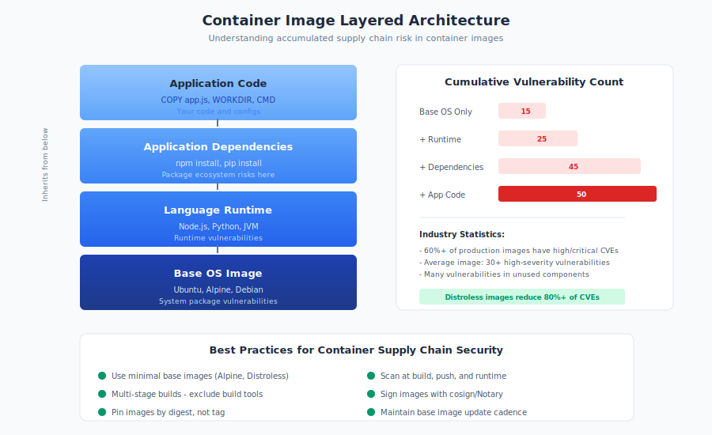

# 10.7 Container and Image Supply Chains

Containers have become the standard unit of software deployment, with Docker images running everything from microservices to machine learning workloads. But containers introduce their own supply chain layer—one that sits between application dependencies and infrastructure. When you deploy a container, you're trusting not just your application code but base images, system packages, and every layer that contributes to the final image. Container registries become another set of package managers to secure, and container images become another category of artifact requiring provenance and verification.

Understanding container supply chains is essential because containers often aggregate risks from multiple other supply chains—application packages, operating system components, and build tooling—into a single deployable artifact.

## Container Images: Layers of Accumulated Risk

Container images use a **layered architecture** where each layer adds to or modifies the layers beneath it. A typical application image might include:

1. **Base OS layer**: Ubuntu, Alpine, or Debian base image
2. **Runtime layer**: Python, Node.js, or JVM installation
3. **Dependency layer**: Application packages and libraries
4. **Application layer**: Your actual code

Each layer inherits everything from layers below and can add new content.

**Inherited Vulnerabilities:**

A vulnerability in any layer affects all images built upon it:

- Base image contains vulnerable OpenSSL → All derived images vulnerable
- Runtime layer includes vulnerable library → All applications using that runtime affected
- Dependency layer pulls vulnerable package → Application compromised

This creates **transitive vulnerability** at the image level, compounding the transitive dependency problem from package ecosystems.

**Layer Visibility Challenges:**

Understanding what's in a container image requires examining all layers:

```bash
# Inspect image layers
docker history myimage:latest
```

Many users never examine image contents, trusting that official images are secure. This trust is often misplaced—even official images frequently contain vulnerabilities.

**Statistics:**

Research from Sysdig and other container security vendors consistently finds:

- Over **60% of container images** in production contain high or critical vulnerabilities[^sysdig-2024]
- The average container image contains **30+ high-severity CVEs**
- Many vulnerabilities exist in base image components never used by the application

## Base Image Selection and Maintenance

Base image selection is one of the most consequential supply chain decisions in containerized applications.

**Common Base Image Options:**

| Base Image | Size | Packages | Security Posture |
|-----------|------|----------|------------------|
| Ubuntu | ~77MB | Full package ecosystem | Regular security updates |
| Debian | ~124MB | Full package ecosystem | Stable, well-maintained |
| Alpine | ~7MB | Minimal, musl-based | Smaller attack surface |
| Distroless | ~2-20MB | No package manager | Minimal attack surface |
| Scratch | ~0MB | Empty | Application-only |

**Selection Criteria:**

When choosing base images, consider:

1. **Update frequency**: How quickly are security patches applied?
2. **Maintenance status**: Is the image actively maintained?
3. **Attack surface**: How many unnecessary components are included?
4. **Compatibility**: Does your application work with minimal images?
5. **Provenance**: Who publishes the image? Is it verified?

**Official vs. Community Images:**

Docker Hub distinguishes between:

- **Official images**: Curated, maintained by Docker and upstream projects
- **Verified publisher images**: From Docker's verified publisher program
- **Community images**: Published by anyone, with no verification

Official images receive more scrutiny but are not vulnerability-free. Community images may be abandoned, unmaintained, or malicious.

**Maintenance Burden:**

Base images require ongoing attention:

- Rebuild images when base images receive security updates
- Monitor for CVEs in base image components
- Update base image references regularly
- Retire images built on deprecated bases

Many organizations fail at ongoing maintenance, running images with years-old vulnerabilities.

## Container Registry Security

Container registries store and distribute images, functioning as package managers for containers.

**Major Registries:**

- **Docker Hub**: The default public registry, largest image collection
- **Amazon ECR**: AWS's managed registry service
- **Google Container Registry (GCR) / Artifact Registry**: Google Cloud's offering
- **Azure Container Registry (ACR)**: Microsoft's managed registry
- **Quay.io**: Red Hat's registry, also available as self-hosted
- **Harbor**: CNCF project for self-hosted registry with security features
- **GitHub Container Registry (GHCR)**: Integrated with GitHub ecosystem

**Registry Security Features:**

| Registry | Image Scanning | Content Trust | Access Control | SBOM Support |
|----------|---------------|---------------|----------------|--------------|
| Docker Hub | Yes (paid) | Yes (Notary) | Basic | Limited |
| Amazon ECR | Yes | Yes (Sigstore) | IAM integration | Yes |
| Google Artifact Registry | Yes | Yes | IAM integration | Yes |
| Azure ACR | Yes | Yes | Azure AD | Yes |
| Harbor | Yes (integrated) | Yes (Notary/cosign) | RBAC | Yes |
| Quay | Yes | Yes | RBAC | Yes |

**Trust Model Considerations:**

Registry trust involves multiple factors:

- **Pull authentication**: Who can download images?
- **Push authentication**: Who can publish images?
- **Content verification**: Can you verify image integrity and provenance?
- **Namespace control**: Who controls image names?
- **Vulnerability data**: Is vulnerability information available?

**Image Tag Mutability:**

A critical registry security issue is tag mutability. The tag `myimage:latest` or even `myimage:v1.2.3` can point to different content over time:

```bash
# Both of these could refer to different actual images
docker pull myapp:latest  # Changes with every push
docker pull myapp:v1.2.3  # Could be overwritten
```

Image digests provide immutable references:

```bash
# Immutable reference to specific image content
docker pull myapp@sha256:abc123...
```

Use digests in production deployments to ensure consistency.

## OCI Artifacts Beyond Containers

The **Open Container Initiative (OCI)** specification extends beyond container images to other artifact types:

**Artifact Types:**

- **Helm charts**: Kubernetes application packages stored in OCI registries
- **WASM modules**: WebAssembly binaries for various runtimes
- **SBOM documents**: Software bill of materials attached to images
- **Signatures**: Cryptographic attestations for images
- **Policy bundles**: OPA/Gatekeeper policies

**Supply Chain Implications:**

OCI registries become general-purpose artifact stores, creating supply chain considerations for each artifact type:

- Helm charts contain Kubernetes manifests with security implications
- WASM modules execute code in various contexts
- Attached signatures require verification workflows
- Policy bundles control cluster security

Each artifact type needs appropriate security treatment.

## Image Provenance and Signing

Verifying that images come from expected sources and haven't been modified is essential for container supply chain security.

**Notary (Docker Content Trust):**

**Docker Content Trust** uses Notary to sign images:

```bash
# Enable content trust
export DOCKER_CONTENT_TRUST=1

# Push signed image
docker push myregistry/myimage:v1.0.0
```

Notary provides:
- Publisher identity verification
- Image integrity verification
- Timestamp verification
- Delegation support

However, Notary adoption has been limited due to complexity.

**Sigstore and cosign:**

**cosign**, part of the Sigstore project, provides simplified container signing:

```bash
# Sign an image
cosign sign myregistry/myimage@sha256:abc123...

# Verify a signature
cosign verify myregistry/myimage@sha256:abc123...
```

cosign advantages:
- **Keyless signing**: Use OIDC identity (GitHub, Google) instead of managing keys
- **Transparency log**: Signatures recorded in public Rekor transparency log
- **Simpler workflow**: Easier integration into CI/CD pipelines

**SLSA for Containers:**

SLSA (Supply-chain Levels for Software Artifacts) provenance can be generated for container builds:

```bash
# Generate SLSA provenance attestation
cosign attest --predicate provenance.json myregistry/myimage@sha256:abc123...
```

Provenance attestations document:
- Build inputs (source repository, commit)
- Build process (builder identity, commands)
- Build outputs (image digest)

**Verification in Kubernetes:**

Policy engines can enforce signature verification:

```yaml
# Kyverno policy requiring signed images
apiVersion: kyverno.io/v1
kind: ClusterPolicy
metadata:
  name: require-signed-images
spec:
  validationFailureAction: Enforce
  rules:
  - name: verify-signature
    match:
      resources:
        kinds:
        - Pod
    verifyImages:
    - imageReferences:
      - "*"
      attestors:
      - entries:
        - keyless:
            issuer: "https://token.actions.githubusercontent.com"
```

Similar policies work with OPA Gatekeeper and other admission controllers.

## Distroless and Minimal Images

**Distroless images** contain only the application and runtime dependencies—no shell, package manager, or other operating system utilities.

**Benefits:**

- **Reduced attack surface**: Fewer components means fewer vulnerabilities
- **Smaller size**: Less data to store, transfer, and scan
- **No package manager attacks**: Cannot install additional software at runtime
- **Harder exploitation**: No shell for attackers to use post-compromise

**Google Distroless Images:**

Google maintains distroless images for common runtimes:

```dockerfile
# Python distroless example
FROM gcr.io/distroless/python3-debian12

COPY app.py /app.py
CMD ["app.py"]
```

**Limitations:**

- **Debugging difficulty**: No shell for troubleshooting
- **Compatibility issues**: Some applications expect OS utilities
- **Build complexity**: May require multi-stage builds
- **Limited runtime flexibility**: Cannot install tools when needed

**Alternatives:**

- **Alpine**: Minimal but includes package manager
- **Slim variants**: Official image slim versions (e.g., `python:3.11-slim`)
- **Scratch**: Empty image for compiled languages (Go, Rust)

**Defense in Depth:**

Minimal images are part of defense in depth, not complete protection. Even distroless images can contain vulnerabilities in included components.

## Multi-Stage Builds

**Multi-stage builds** separate build-time and runtime dependencies, reducing what ships in production images.

**The Problem:**

Single-stage builds include build tools in runtime images:

```dockerfile
# Bad: Build tools in production image
FROM node:18
WORKDIR /app
COPY package*.json ./
RUN npm install
COPY . .
RUN npm run build
CMD ["node", "dist/server.js"]
```

This image includes npm, build tools, dev dependencies—all unnecessary at runtime.

**Multi-Stage Solution:**

```dockerfile
# Build stage
FROM node:18 AS builder
WORKDIR /app
COPY package*.json ./
RUN npm ci
COPY . .
RUN npm run build

# Production stage
FROM node:18-slim
WORKDIR /app
COPY --from=builder /app/dist ./dist
COPY --from=builder /app/node_modules ./node_modules
CMD ["node", "dist/server.js"]
```

Production image contains only runtime requirements.

**Security Benefits:**

- Smaller attack surface
- Build secrets stay in build stage
- Dev dependencies excluded
- Build tools unavailable to attackers

## Vulnerability Scanning

Container vulnerability scanning identifies known CVEs in image contents.

**Scanning Tools:**

- **Trivy**: Open source, comprehensive, widely adopted
- **Grype**: Anchore's open source scanner
- **Clair**: Open source static analysis
- **Snyk Container**: Commercial with open source components
- **Sysdig**: Commercial container security platform
- **Aqua Security**: Commercial container security

**Scanning Points:**

Scan at multiple points in the lifecycle:

1. **Development**: Local scanning during development
2. **CI/CD**: Automated scanning in build pipelines
3. **Registry**: Scanning when images are pushed
4. **Runtime**: Continuous scanning of deployed images

**Limitations:**

Scanning has significant limitations:

- Only finds **known vulnerabilities** with CVE entries
- May not understand application context
- False positives require investigation
- Language-specific packages may not be detected
- Scanning is point-in-time; new CVEs emerge daily

## Recommendations

**For DevOps Engineers:**

1. **Use minimal base images.** Start with distroless or slim images where possible. Justify larger images explicitly.

2. **Pin image references by digest.** Use SHA256 digests instead of mutable tags for production deployments.

3. **Implement multi-stage builds.** Separate build and runtime dependencies to reduce attack surface.

4. **Scan images at multiple points.** Integrate scanning into CI/CD, registry, and runtime monitoring.

5. **Sign and verify images.** Use cosign for signing and enforce verification through admission control.

**For Platform Engineers:**

1. **Provide approved base images.** Curate and maintain organizational base images with security updates.

2. **Implement registry security.** Configure access controls, enable scanning, and enforce signing requirements.

3. **Deploy admission control.** Use Kyverno, OPA Gatekeeper, or similar to enforce image policies in Kubernetes.

4. **Monitor running images.** Continuously scan deployed images for new vulnerabilities.

5. **Automate base image updates.** Implement processes to rebuild application images when base images are updated.

**For Security Practitioners:**

1. **Include containers in threat models.** Model registry compromise, base image attacks, and runtime vulnerabilities.

2. **Define container security policies.** Specify approved registries, base images, scanning requirements, and signing policies.

3. **Audit container configurations.** Review Dockerfiles, pod security contexts, and runtime settings.

4. **Track container SBOM.** Maintain software bill of materials for container contents.

5. **Plan for container incidents.** Know how you'll respond to vulnerabilities in deployed images.

Containers aggregate multiple supply chains into deployable artifacts. The base image brings operating system packages, runtime layers bring language ecosystems, and application layers bring your dependencies. Each layer inherits risks from below and can add its own. Effective container supply chain security requires attention at every layer—from base image selection through signing and runtime monitoring. Organizations that treat container security as an afterthought often discover that their minimal application code runs atop vast accumulations of vulnerable components.

