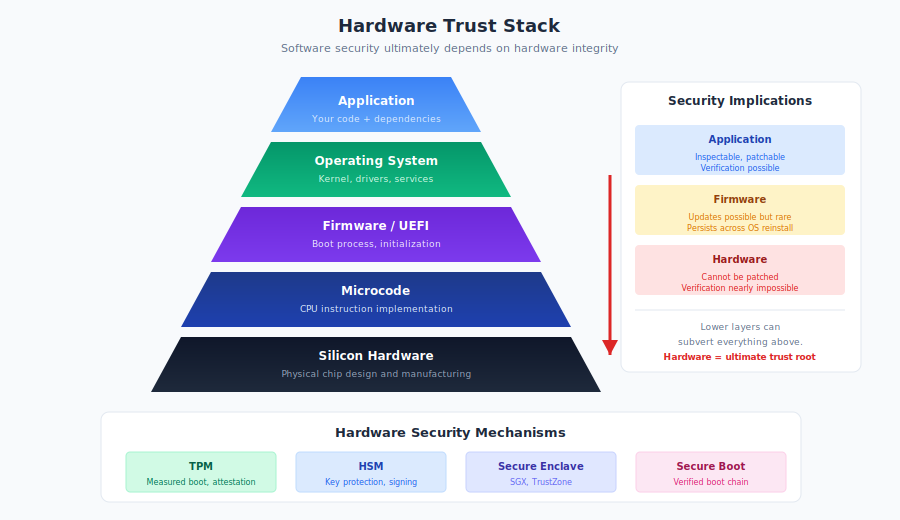

# 10.8 Hardware and Firmware Considerations

Every software supply chain ultimately rests on hardware. The most rigorously verified software means nothing if the processor executing it, the memory storing it, or the firmware bootstrapping it has been compromised. Hardware supply chains present the most challenging security problems: verification is nearly impossible, detection is difficult, and remediation may require physical replacement. While most organizations focus on software dependencies they can control, the hardware beneath deserves consideration—especially as geopolitical tensions elevate concerns about where and how hardware is manufactured.

This section acknowledges hardware as the foundation of the software supply chain, examining firmware risks, hardware trust mechanisms, and the intersection between hardware and software security.

!!! danger "The Foundation of All Trust"

    Each software layer trusts the layers below. Firmware, microcode, and silicon form the foundation—and cannot be easily inspected. Hardware must often be trusted rather than verified.

## The Hardware Trust Stack

Software security depends on an implicit hierarchy of trust extending down to silicon:

**The Trust Stack:**

1. **Application software**: Your code and dependencies
2. **Operating system**: Kernel, drivers, system services
3. **Firmware/BIOS/UEFI**: Boot process, hardware initialization
4. **Microcode**: Processor instruction implementation
5. **Silicon**: Physical chip design and manufacturing

Each layer trusts the layers below. A compromise at any lower layer can potentially subvert all layers above.

**Why Hardware Matters for Software Security:**

- **Cryptographic operations**: Software relies on hardware for secure key storage and cryptographic acceleration
- **Boot integrity**: Firmware verifies OS integrity; compromised firmware can bypass verification
- **Isolation guarantees**: Hardware enforces process isolation, memory protection, virtualization boundaries
- **Random number generation**: Cryptography depends on hardware random number generators
- **Side channels**: Hardware implementation details can leak secrets through timing, power consumption, or electromagnetic emissions

**The Verification Problem:**

Software can be inspected, analyzed, and verified (at least in principle). Hardware verification is fundamentally harder:

- Chip designs are proprietary and not publicly available
- Physical inspection requires expensive equipment and expertise
- Runtime modification is theoretically possible
- Verification at scale is impractical

This asymmetry means hardware must often be trusted rather than verified.

## Firmware and BIOS/UEFI Supply Chains

**Firmware**—software embedded in hardware devices—bridges hardware and software supply chains with characteristics of both.

**Firmware Types:**

- **BIOS/UEFI**: System boot firmware that initializes hardware and loads the operating system
- **BMC firmware**: Baseboard Management Controller for server remote management
- **Peripheral firmware**: Network cards, storage controllers, GPUs, USB devices
- **Embedded controllers**: Keyboard controllers, power management

**Firmware Supply Chain Risks:**

Firmware updates follow supply chains similar to software:

- Updates distributed through manufacturer websites
- Automatic update mechanisms
- Third-party management tools

Each distribution path can be compromised:

- **Watering hole attacks**: Compromised manufacturer websites serving malicious firmware
- **Update mechanism exploitation**: Intercepting or replacing legitimate updates
- **Signed malware**: Compromised signing keys producing authentic-appearing malicious firmware

**UEFI Bootkits:**

Advanced persistent threats have targeted UEFI firmware:

!!! warning "UEFI Persistence"

    UEFI bootkits survive OS reinstallation and disk replacement, persisting in firmware. LoJax (2018), MosaicRegressor (2020), and ESPecter (2021) demonstrate this capability in the wild.

- **LoJax (2018)**: First UEFI rootkit discovered in the wild, attributed to APT28
- **MosaicRegressor (2020)**: UEFI implant discovered by Kaspersky researchers
- **ESPecter (2021)**: UEFI bootkit targeting Windows systems

These implants survive OS reinstallation and disk replacement, persisting in firmware.

**BMC Risks:**

Baseboard Management Controllers provide out-of-band server management—powerful access that attackers covet:

- BMC has access to all system memory
- Can operate when the main system is powered off
- Often runs outdated firmware with known vulnerabilities
- Frequently accessible via network

Compromised BMC firmware provides near-complete control over the system it manages.

## Hardware Implants: Theory and Reality

The possibility of malicious hardware implants represents the extreme end of hardware supply chain risk.

**The Bloomberg Controversy (2018):**

In October 2018, Bloomberg Businessweek reported that Chinese intelligence had implanted tiny chips on Super Micro server motherboards, affecting Apple, Amazon, and approximately 30 other companies.

The story was vigorously denied by all named companies and by Super Micro. No physical evidence was ever publicly produced. The NSA and UK's NCSC stated they had no reason to doubt the denials.

**Evaluating the Claims:**

The Bloomberg story remains controversial because:

- Unprecedented level of detail for unverified claims
- Categorical denials from companies with strong incentive to disclose if true (regulatory requirements, insurance implications)
- No corroborating evidence from security researchers
- Technical details questioned by hardware experts

However, the story remains unretracted.

**Real Hardware Risks:**

Regardless of the Bloomberg claims, hardware supply chain risks are real:

- **Interdiction**: Intelligence agencies intercepting hardware in transit to implant monitoring devices (documented in NSA ANT catalog leaks)
- **Manufacturing compromise**: Theoretical ability to modify chip designs or manufacturing processes
- **Counterfeit components**: Fake or recycled components with unknown characteristics
- **Economic espionage**: Components designed to fail or expose information

**Detection Challenges:**

Hardware implants are extremely difficult to detect:

- Visual inspection may not reveal sub-millimeter additions
- Behavioral testing may not trigger dormant implants
- X-ray and other imaging requires baseline comparisons
- Implants can be designed to activate only under specific conditions

For most organizations, hardware implant detection is beyond practical capability.

## Geopolitical Manufacturing Considerations

Hardware manufacturing is globally concentrated, creating supply chain dependencies with geopolitical dimensions.

**Manufacturing Geography:**

- Semiconductor fabrication concentrated in Taiwan (TSMC), South Korea (Samsung), and the United States (Intel, smaller fabs)
- Electronics assembly largely in China and Southeast Asia
- Critical materials sourced from various regions (rare earths from China, cobalt from DRC)

**Policy Implications:**

Government and enterprise policy increasingly considers manufacturing location:

- **CHIPS Act (US, 2022)**: $52 billion investment to expand domestic semiconductor manufacturing
- **EU Chips Act**: Similar European initiative
- **Defense procurement**: Requirements for trusted manufacturing for sensitive applications
- **Enterprise policies**: Some organizations require hardware from specific regions for sensitive systems

**Trust Implications:**

Manufacturing location affects trust assessment:

- **Access during manufacturing**: Ability to insert implants or modifications
- **Supply disruption risk**: Geopolitical events can interrupt supply
- **Legal jurisdiction**: Different countries have different requirements for manufacturer cooperation with intelligence agencies

**Practical Limitations:**

Complete supply chain separation is impractical:

- Even "domestic" products contain globally-sourced components
- Complete visibility into multi-tier supply chains is nearly impossible
- Cost and capability tradeoffs often favor global suppliers

Most organizations accept some geopolitical risk while implementing practical mitigations.

## Hardware Security Modules and Trusted Platform Modules

Dedicated security hardware can strengthen software supply chain security.

**Hardware Security Modules (HSMs):**

**HSMs** are dedicated devices for cryptographic operations and key management:

- Generate and store cryptographic keys
- Perform signing and encryption operations
- Resist physical and logical tampering
- Provide audit logging

**Supply Chain Applications:**

HSMs support software supply chain security:

- **Code signing**: Sign software releases with keys protected by HSM
- **Certificate management**: Protect CA private keys
- **Timestamp authority**: Provide trusted timestamps for signatures
- **Key ceremony**: Manage root key generation with hardware protection

Major code signing compromises (DigiNotar, Stuxnet certificate theft) often exploited inadequate key protection. HSMs mitigate these risks.

**Trusted Platform Modules (TPMs):**

**TPMs** are security chips integrated into computers:

- Secure key storage
- Platform integrity measurement
- Cryptographic operations

**TPM Supply Chain Applications:**

- **Measured boot**: Create cryptographic measurements of boot process
- **Platform attestation**: Prove system configuration to remote parties
- **Secure storage**: Protect secrets bound to specific hardware

TPMs enable **remote attestation**, allowing systems to prove their configuration—useful for verifying build environment integrity.

**Limitations:**

Hardware security mechanisms have constraints:

- HSMs are expensive and complex to operate
- TPM availability and capabilities vary
- Neither protects against all attack classes
- Both require proper integration to be effective

## Open Source Firmware Initiatives

Proprietary firmware creates opacity in the trust stack. Open source firmware initiatives aim to bring software supply chain transparency principles to firmware.

**coreboot:**

**coreboot** is an open source firmware project replacing proprietary BIOS/UEFI:

- Minimal footprint focused on hardware initialization
- Payloads for various use cases (Linux, GRUB, SeaBIOS)
- Support for various platforms (limited compared to proprietary firmware)
- Used in Google Chromebooks and select server platforms

Benefits for supply chain security:

- Auditable code
- Reduced attack surface
- Community review and contribution

**OpenBMC:**

**OpenBMC** provides open source firmware for Baseboard Management Controllers:

- Linux-based BMC firmware
- Supported by major vendors (Google, Facebook, Microsoft, Intel)
- Deployed in some cloud provider infrastructure
- Active security development

**Limitations of Open Source Firmware:**

Open source firmware has adoption challenges:

- Hardware vendor support required
- Limited platform coverage
- Potential compatibility issues
- May void warranties

Most organizations use proprietary firmware; open source firmware is primarily for specialized deployments or security-sensitive applications.

**Transparency Benefits:**

Even without full open source adoption, transparency initiatives help:

- Firmware bill of materials
- Published security update policies
- Third-party security audits
- Documented security architecture

## Intersection with Software Supply Chain Security

Hardware and software supply chain security intersect at several points:

**Signing Key Protection:**

Software signing is only as secure as key protection. Keys stored on disk can be stolen; keys in HSMs cannot be extracted.

**Build Environment Integrity:**

Software build integrity depends on hardware integrity. TPM-based measured boot can attest to build environment configuration.

**Runtime Protection:**

Hardware features protect software at runtime:

- Memory encryption (AMD SEV, Intel TDX)
- Secure enclaves (Intel SGX, ARM TrustZone)
- Hardware-enforced isolation

**Verification Bootstrap:**

Hardware provides the trust root for software verification:

- TPM-measured boot creates verification chain
- Secure boot prevents unsigned code execution
- Hardware roots of trust anchor software security

## Recommendations

**For Security Architects:**

1. **Map your hardware trust dependencies.** Understand where your software security depends on hardware integrity. Document assumptions about hardware trust.

2. **Protect signing keys with HSMs.** Critical signing operations should use hardware key protection. Budget for HSM acquisition and operation.

3. **Enable hardware security features.** Use Secure Boot, TPM-based attestation, and other available hardware security where appropriate.

4. **Implement firmware update policies.** Treat firmware updates like software updates: track versions, apply security patches, verify authenticity.

5. **Consider supply chain diversity.** For critical systems, evaluate supplier diversity to reduce single-source dependencies.

**For Executives:**

1. **Include hardware in supply chain risk assessment.** Software supply chain programs should acknowledge hardware dependencies.

2. **Evaluate geopolitical exposure.** Understand where critical hardware is manufactured and implications for your risk profile.

3. **Budget for hardware security.** HSMs, TPMs, and secure hardware have costs but enable security capabilities not achievable with software alone.

4. **Monitor policy developments.** Government policies on hardware supply chains are evolving; stay informed about requirements and incentives.

**For Organizations:**

1. **Establish firmware inventory.** Know what firmware runs in your environment and its version status.

2. **Define trusted hardware sources.** Establish policies for hardware procurement, especially for security-sensitive systems.

3. **Plan for hardware incidents.** Know how you'll respond if hardware vulnerabilities (like Spectre/Meltdown) or supply chain concerns emerge.

4. **Evaluate open source firmware options.** For new deployments, consider whether open source firmware is appropriate for your security requirements.

Hardware supply chain security is both the most fundamental and most difficult layer to address. Most organizations cannot verify chip fabrication or detect sophisticated implants. But this difficulty doesn't justify ignoring hardware—it justifies appropriate risk management: using hardware security features where available, protecting the software operations (like signing) that depend on hardware, and maintaining awareness of hardware dependencies. The software supply chain, however well-secured, ultimately stands on a hardware foundation.

