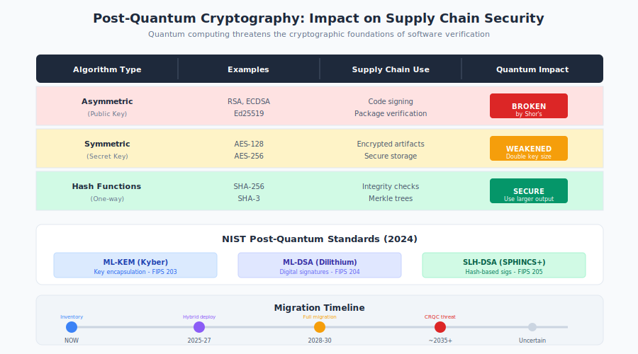

# 10.9 Post-Quantum Cryptography Transition

The software supply chain depends fundamentally on cryptography. Code signing verifies that software comes from expected sources. TLS protects package downloads. Certificate authorities establish trust hierarchies. These systems rely on mathematical problems that current computers cannot efficiently solve—but quantum computers may change that equation. A sufficiently powerful quantum computer could forge code signatures, compromise certificate authorities, and undermine the cryptographic foundations of software verification.

The timeline for this threat remains uncertain, but the preparation timeline is not: cryptographic transitions take years to decades. Organizations building supply chain security today must consider how their systems will withstand tomorrow's quantum capabilities.

!!! info "Timeline Uncertainty"

    Expert estimates for cryptographically relevant quantum computers range from 10 to 30+ years. But cryptographic transitions take years to decades—and "harvest now, decrypt later" attacks make the threat timeline effectively now.

## The Quantum Threat Timeline

**Cryptographically relevant quantum computers (CRQCs)** are quantum systems powerful enough to break current public-key cryptography. Estimating when CRQCs will exist involves substantial uncertainty.

**Current Estimates:**

Expert assessments vary widely:

- **NIST**: Plans for migration assume threat could materialize within 10-20 years
- **NSA/CISA**: Recommend beginning transition planning immediately
- **Academic estimates**: Range from 10 to 30+ years, with significant uncertainty
- **Industry surveys**: Most experts cluster around 15-20 years for serious concern

**What Quantum Computers Threaten:**

Quantum algorithms threaten specific cryptographic primitives:

- **Shor's algorithm**: Efficiently solves integer factorization and discrete logarithm problems, breaking RSA, DSA, ECDSA, ECDH
- **Grover's algorithm**: Provides quadratic speedup for symmetric key search, effectively halving key strength

**Impact by Algorithm Type:**

| Algorithm Type | Examples | Quantum Impact |
|---------------|----------|----------------|
| RSA signatures | RSA-2048, RSA-4096 | Broken by Shor's |
| Elliptic curve | ECDSA, Ed25519 | Broken by Shor's |
| Symmetric encryption | AES-128, AES-256 | Weakened (double key sizes) |
| Hash functions | SHA-256, SHA-3 | Weakened (use larger outputs) |

Most supply chain cryptography relies on the primitives Shor's algorithm threatens.

!!! danger "Harvest Now, Decrypt Later"

    Adversaries can capture encrypted communications today and decrypt when quantum computers become available. Sensitive encrypted data transmitted today has a security lifetime limited by quantum computing progress.

**The "Harvest Now, Decrypt Later" Threat:**

For encryption, the threat timeline is effectively now. Adversaries can:

1. Capture encrypted communications and artifacts today
2. Store them indefinitely
3. Decrypt when quantum computers become available

This **harvest now, decrypt later (HNDL)** strategy means sensitive encrypted data transmitted today has a security lifetime limited by quantum computing progress.

For supply chain security, HNDL implications include:

- Encrypted software artifacts could be decrypted retroactively
- Private keys transmitted encrypted could be recovered
- Signed artifacts remain verifiable, but signatures could be forged on new malicious artifacts

## Impact on Supply Chain Cryptography

Quantum computing threatens supply chain security infrastructure at multiple points.

**Code Signing:**

Code signing relies almost entirely on public-key cryptography:

- RSA and ECDSA signatures dominate code signing
- Package registries verify signatures using these algorithms
- Sigstore uses Ed25519 and ECDSA
- Software bill of materials (SBOM) signatures use standard algorithms

When signatures can be forged:

- Attackers could sign malicious packages as any publisher
- Historical signatures become untrustworthy
- Certificate authority trust collapses if CA keys are compromised

**Transparency Logs:**

Sigstore's Rekor and Certificate Transparency logs use cryptographic signatures:

- Log entries are signed
- Signed Certificate Timestamps (SCTs) prove log inclusion
- Merkle tree roots provide integrity

Quantum-forged signatures could:

- Create fraudulent log entries
- Undermine log integrity verification
- Compromise the entire transparency infrastructure

**TLS and Transport Security:**

Package downloads depend on TLS:

- npm, PyPI, Maven Central all use HTTPS
- Certificate validation relies on signature verification
- Key exchange uses algorithms vulnerable to quantum attack

Compromised TLS would enable:

- Man-in-the-middle attacks on package downloads
- Fraudulent certificates for package registries
- Interception of credentials and tokens

**Long-Lived Artifacts:**

Software artifacts often have long lifespans:

- Package signatures verified years after creation
- Compliance requirements mandate signature retention
- Historical verification needed for audits

Signatures made today with quantum-vulnerable algorithms may need verification decades from now—potentially after quantum computers can forge them.

## NIST Post-Quantum Standards

The **National Institute of Standards and Technology (NIST)** has led standardization of post-quantum cryptographic algorithms since 2016.

**Standardized Algorithms (2024):**

NIST has standardized three primary algorithms:

**ML-KEM (CRYSTALS-Kyber)**:

- Key encapsulation mechanism for key exchange
- Based on lattice problems
- Replaces ECDH, RSA key exchange
- Standardized as FIPS 203

**ML-DSA (CRYSTALS-Dilithium)**:

- Digital signature algorithm
- Based on lattice problems
- Replaces RSA, ECDSA, Ed25519 signatures
- Standardized as FIPS 204

**SLH-DSA (SPHINCS+)**:

- Digital signature algorithm
- Based on hash functions (different mathematical basis than lattices)
- Larger signatures but conservative security assumptions
- Standardized as FIPS 205

**Algorithm Selection Considerations:**

| Algorithm | Use Case | Key Size | Signature Size | Performance |
|-----------|----------|----------|----------------|-------------|
| ML-KEM-768 | Key exchange | ~1KB | N/A | Fast |
| ML-DSA-65 | General signing | ~2KB | ~3KB | Fast |
| SLH-DSA-128s | Conservative signing | ~32B | ~8KB | Slower |

Signature sizes are notably larger than classical algorithms (ECDSA signatures are ~64 bytes), with implications for package managers and transparency logs.

**Ongoing Standardization:**

Additional algorithms are under consideration:

- **FALCON**: Lattice-based signatures with smaller sizes
- **Classic McEliece**: Code-based encryption with very large keys
- Additional signature schemes for specific use cases

## Hybrid Cryptographic Approaches

During the transition period, **hybrid cryptography** combines classical and post-quantum algorithms.

**Why Hybrid:**

- **Hedge against PQC weaknesses**: New algorithms may have undiscovered vulnerabilities
- **Maintain compatibility**: Systems not yet PQC-ready can still verify classical signatures
- **Gradual transition**: Allows incremental deployment

**Hybrid Implementation Patterns:**

For signatures:

```
hybrid_signature = classical_sign(data) || pqc_sign(data)
verification = classical_verify(data, sig1) AND pqc_verify(data, sig2)
```

Both signatures must verify—an attacker must break both algorithms.

For key exchange:

```
shared_secret = KDF(classical_key_exchange() || pqc_key_exchange())
```

Compromise of either algorithm alone doesn't reveal the shared secret.

**Deployment Considerations:**

- **Size increase**: Hybrid approaches roughly double signature and key sizes
- **Compatibility**: Requires protocol support at both endpoints
- **Performance**: Additional cryptographic operations

**Industry Adoption:**

Some organizations are already deploying hybrid approaches:

- **Signal**: Uses PQXDH combining X25519 with ML-KEM
- **Google Chrome**: Testing hybrid key exchange for TLS
- **Apple**: iMessage uses hybrid encryption

## Cryptographic Library Readiness

Software supply chains depend on cryptographic libraries. Library PQC support varies.

**Library Status (as of 2024):**

| Library | PQC Support | Status |
|---------|-------------|--------|
| liboqs (Open Quantum Safe) | Comprehensive | Research/early production |
| BoringSSL | ML-KEM | Production |
| OpenSSL | 3.0+ provider architecture | Experimental |
| AWS-LC | ML-KEM, ML-DSA | Production |
| wolfSSL | Multiple algorithms | Production |
| Go crypto | Experimental | Development |

**Open Quantum Safe (OQS):**

The **Open Quantum Safe** project provides:

- liboqs: C library implementing PQC algorithms
- OQS-OpenSSL: PQC-enabled OpenSSL fork
- Language bindings for Python, Java, and others

OQS enables experimentation and early adoption.

**Dependency Implications:**

Organizations must consider:

- When will standard libraries in your language support PQC?
- Are your dependencies using libraries with PQC roadmaps?
- Can you update cryptographic libraries independently of other dependencies?

**Signing Tool Support:**

Supply chain signing tools are beginning to add PQC support:

- **cosign**: Plans for PQC algorithm support
- **Notary**: Future versions will need PQC
- **GPG**: PQC support in development

Upgrade paths require tooling availability.

## Algorithm Agility

**Algorithm agility** is the ability to change cryptographic algorithms without major system redesign. It's essential for surviving the PQC transition—and future cryptographic evolution.

**Why Agility Matters:**

- **PQC algorithms may need replacement**: Early PQC algorithms could have weaknesses discovered
- **Standards evolve**: New algorithms may offer better performance or security
- **Compliance requirements change**: Regulations may mandate specific algorithms

**Agility Design Principles:**

1. **Algorithm identification**: Include algorithm identifiers with cryptographic outputs
2. **Version negotiation**: Support multiple algorithms simultaneously
3. **Clean abstraction**: Isolate cryptographic operations behind interfaces
4. **Configuration-driven selection**: Allow algorithm changes without code changes

**Current Agility Gaps:**

Many supply chain systems lack algorithm agility:

- Hard-coded algorithm assumptions
- Formats without algorithm fields
- No migration path for existing signatures
- Verification logic tied to specific algorithms

**Building Agility:**

New systems should design for agility:

```python
# Good: Algorithm agility
def sign(data, algorithm="ML-DSA-65"):
    return SignatureWithAlgorithm(
        algorithm=algorithm,
        signature=get_signer(algorithm).sign(data)
    )

# Bad: Hard-coded algorithm
def sign(data):
    return ed25519_sign(data)
```

## Planning for Transition

Organizations should begin PQC transition planning now, even though the threat may be years away.

**Assessment Phase:**

1. **Inventory cryptographic usage**: Where is cryptography used in your supply chain?
2. **Identify vulnerable algorithms**: Which uses depend on quantum-vulnerable primitives?
3. **Assess data longevity**: How long must signatures remain verifiable?
4. **Evaluate dependencies**: When will your libraries and tools support PQC?

**Planning Phase:**

1. **Define transition timeline**: Based on your threat model and data sensitivity
2. **Prioritize by risk**: Highest sensitivity and longest-lived data first
3. **Select algorithms**: Align with NIST standards; consider hybrid approaches
4. **Plan testing**: PQC algorithms behave differently (larger sizes, different performance)

**Implementation Phase:**

1. **Enable algorithm agility**: Update systems to support multiple algorithms
2. **Deploy hybrid approaches**: Add PQC alongside classical where possible
3. **Update dependencies**: Migrate to PQC-capable libraries
4. **Re-sign critical artifacts**: For long-lived artifacts, create PQC signatures

**Monitoring Phase:**

1. **Track quantum computing progress**: Adjust timeline as estimates evolve
2. **Monitor algorithm security**: Watch for attacks on PQC algorithms
3. **Follow standards evolution**: Stay current with NIST and other bodies
4. **Audit compliance**: Verify migration progress against plan

## Recommendations

**For Security Architects:**

1. **Assess your cryptographic exposure.** Inventory where your supply chain depends on quantum-vulnerable cryptography. Prioritize by sensitivity and longevity.

2. **Design for algorithm agility.** New systems should support algorithm negotiation and easy algorithm updates. Avoid hard-coded cryptographic assumptions.

3. **Plan hybrid deployment.** For sensitive applications, plan to deploy hybrid classical+PQC cryptography as libraries become available.

4. **Engage with standards.** Follow NIST PQC standardization and implement standardized algorithms rather than experimental ones.

**For Organizations:**

1. **Start planning now.** Cryptographic transitions take years. Beginning assessment now provides time for thoughtful migration.

2. **Update procurement requirements.** New systems should demonstrate algorithm agility and PQC roadmaps.

3. **Consider HNDL risks.** For highly sensitive data, the threat is effectively immediate. Prioritize encryption transitions.

4. **Budget for transition.** PQC migration will require engineering investment. Include it in long-term planning.

**For the Supply Chain Ecosystem:**

1. **Build PQC into standards.** Signing standards, transparency log specifications, and verification protocols should plan for PQC.

2. **Support hybrid signatures.** Package managers and verification tools should support verifying hybrid signatures.

3. **Coordinate transition.** Interoperability requires coordinated algorithm adoption across the ecosystem.

4. **Provide migration guidance.** Help maintainers and users understand when and how to transition.

The quantum computing threat to supply chain cryptography is not immediate—but neither is the solution. Organizations that begin planning now will be positioned to transition smoothly. Those that wait until quantum computers are imminent will face rushed migrations with limited options. The same cryptographic infrastructure that secures today's supply chain will eventually need replacement. Building that replacement thoughtfully, with algorithm agility and hybrid approaches, ensures that software verification remains trustworthy through the quantum transition and whatever comes after.

