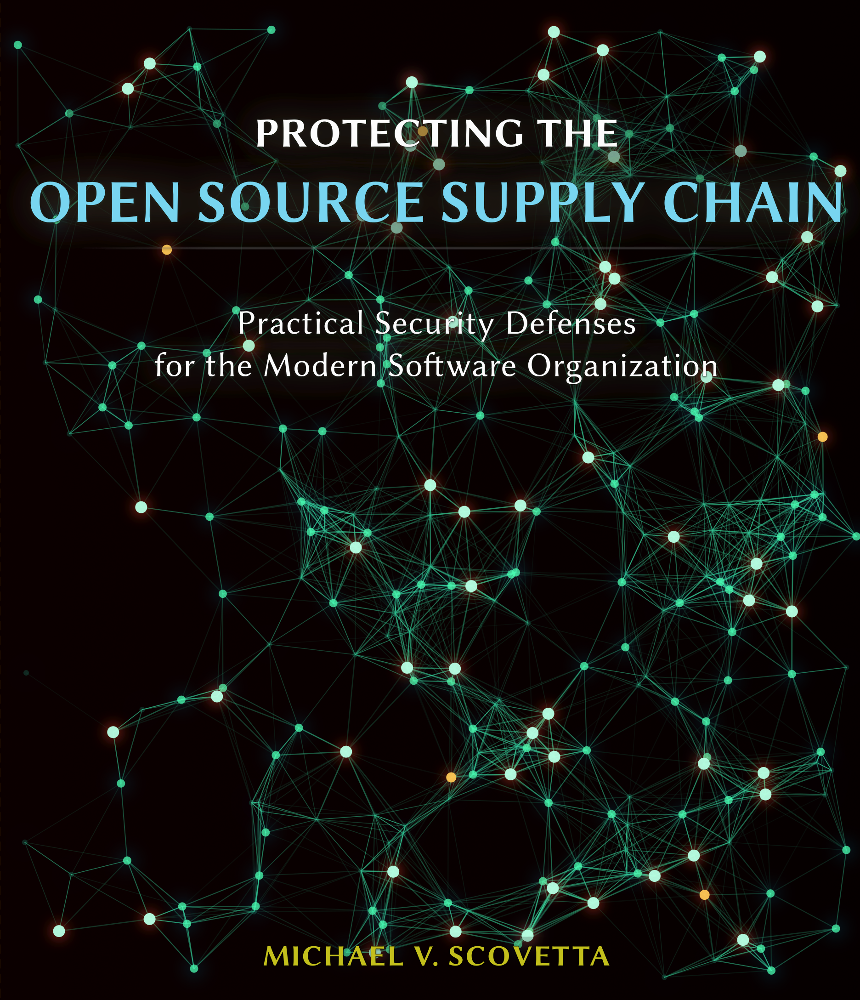
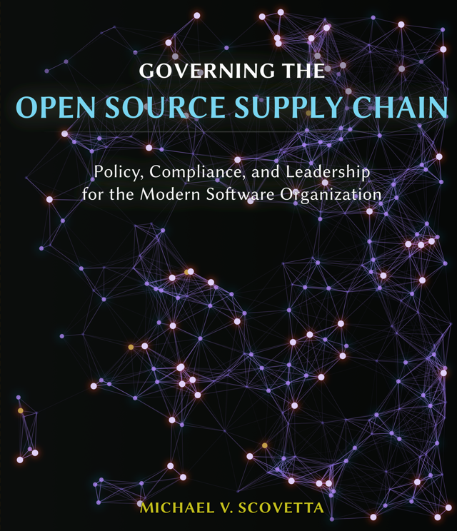

# Open Source Software Supply Chain Security

A comprehensive guide to understanding, protecting, and governing the open source software supply chain.

| Understanding the Software Supply Chain | Protecting the Software Supply Chain | Governing the Software Supply Chain |
|:-:|:-:|:-:|
|  |  |  |
| [ [Read Online](book1) ] [ [Download PDF](book-1-understanding-the-software-supply-chain.pdf) ] | [ [Read Online](book2) ] [ [Download PDF](book-2-protecting-the-software-supply-chain.pdf) ] | [ [Read Online](book3) ] [ [Download PDF](book-3-governing-the-software-supply-chain.pdf) ]|

---

## About This Book Series

Modern software is built from thousands of components sourced from global repositories, open source projects, and third-party vendors. This interconnected ecosystem delivers unprecedented productivity but creates complex webs of trust that attackers increasingly exploit.

This three-book series provides practitioners with the knowledge and tools to secure their software supply chains, from understanding the threats to implementing defenses to building organizational programs.

---

## The Books

### Book 1: Understanding the Software Supply Chain

**Chapters 1-10** | Foundations and Attack Patterns

Provides a comprehensive foundation for understanding software supply chain security. Examines how software is actually built today, explores the threat landscape in depth, and analyzes attack patterns in granular detail.

- **Part I - Foundations**: How software is built, supply chain threats, historical attacks
- **Part II - Attack Patterns**: Malicious packages, dependency confusion, typosquatting, build system attacks, insider threats, social engineering

[Start Reading Book 1](book1/chapter-01/)

[Download PDF](book-1-understanding-the-software-supply-chain.pdf)

---

### Book 2: Protecting the Software Supply Chain

**Chapters 11-22** | Practical Defenses and Incident Response

Translates threat knowledge into practical defenses across the development lifecycle, from dependency selection through production deployment.

- **Part III - Risk Assessment & Testing**: Risk measurement, SBOMs, dependency management, security testing, red teaming
- **Part IV - Defense & Response**: Securing development environments, CI/CD pipelines, distribution, incident response, crisis communication
- **Part V - Operationalizing Defense**: Building security programs, platform engineering

[Start Reading Book 2](book2/chapter-11/)

[Download PDF](book-2-protecting-the-software-supply-chain.pdf)

---

### Book 3: Governing the Software Supply Chain

**Chapters 23-33** | Policy, Compliance, and Organizational Strategy

Addresses human, policy, and strategic dimensions: organizational commitment, regulatory compliance, economic incentives, and industry collaboration.

- **Part V - People & Organizations**: Training and security culture, open source maintainers, vendor risk management
- **Part VI - Regulatory & Legal**: Regulatory landscape, compliance frameworks, legal considerations, industry initiatives
- **Part VII - Context & Future**: Economics, geopolitics, lessons from other industries, future directions

[Start Reading Book 3](book3/chapter-23/)

[Download PDF](book-3-governing-the-software-supply-chain.pdf)

---

## Appendices

- [Appendix A: Glossary](appendices/appendix-a.md) - Key terms and definitions
- [Appendix B: Resource Guide](appendices/appendix-b.md) - Curated resources for further learning
- [Appendix C: SBOM and AI-BOM Guide](appendices/appendix-c.md) - Practical guidance on software bills of materials
- [Appendix D: Security Checklist](appendices/appendix-d.md) - Actionable security checklists
- [Appendix E: Sample Policies and Templates](appendices/appendix-e.md) - Ready-to-use policy templates
- [Appendix F: Incident Timeline](appendices/appendix-f.md) - Historical supply chain incidents
- [Appendix G: Ecosystem Guides](appendices/appendix-g.md) - Language and ecosystem-specific guidance
- [Appendix H: Compliance Mapping](appendices/appendix-h.md) - Mapping to compliance frameworks

---

## How to Use This Resource

**For security practitioners**: Start with Book 2 for immediate, actionable defenses, then reference Book 1 for deeper threat understanding.

**For developers**: Begin with Book 1, Chapter 1 to understand the landscape, then jump to Book 2's chapters on dependency management and secure development.

**For executives and managers**: Book 3 covers organizational programs, regulatory requirements, and strategic considerations.

**For open source maintainers**: See Chapter 24 in Book 3 for guidance specific to your role.

Use the **search** feature to find specific topics across all three books.

---

## License

This work is dedicated to the public domain under CC0 1.0 Universal[^cc0-license]. You can copy, modify, distribute, and use the work, even for commercial purposes, without asking permission.

[^cc0-license]: Creative Commons, "CC0 1.0 Universal," https://creativecommons.org/publicdomain/zero/1.0/
