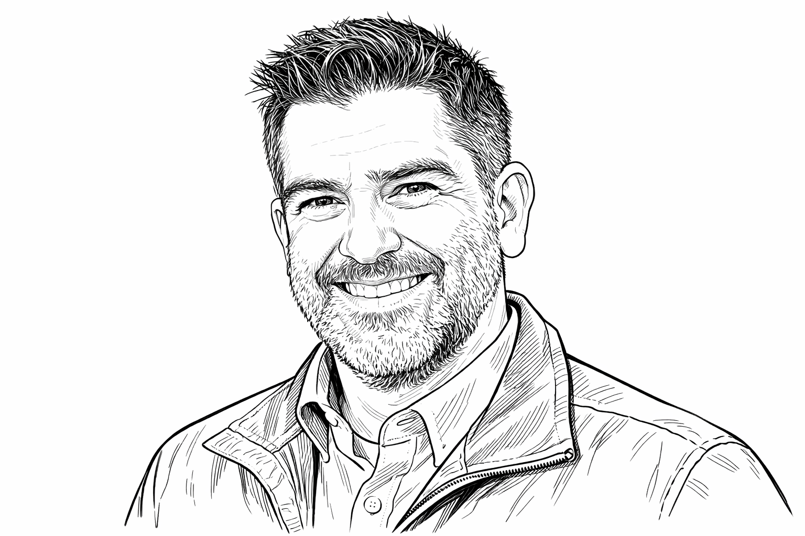

# About the Author

**Michael Scovetta** is a Principal Security Assurance Manager at Microsoft, where he leads a team dedicated to understanding and addressing emerging security threats in open source software. With over 25 years of experience in software engineering and security (more than a decade focused specifically on open source) Michael is dedicated to improve the security of the open source software we all depend on.

Michael is also co-founder/co-lead of Alpha-Omega[^alpha-omega], associated with the Open Source Security Foundation (OpenSSF), an initiative focused on improving the security of critical open source projects. He led the OpenSSF Identifying Security Threats working group, authored the white paper Threats, Risks and Mitigations in the Open Source Ecosystem[^threats-risks-mitigations], and contributed to multiple other initiatives.

At Microsoft, Michael and his team created and released various open source security tools, including Application Inspector[^application-inspector], Attack Surface Analyzer[^attack-surface-analyzer], and OSS Gadget[^oss-gadget]. His team's tooling spans package ecosystem analysis, reproducible build verification, cryptographic implementation detection, typosquatting identification, malware analysis, and more.

Prior to Microsoft, Michael held security and software engineering roles at CBS, CA Technologies, Cigital, and UBS Financial Services. He earned a Master of Engineering degree in Computer Science from Cornell University and a Bachelor of Science degree from Hofstra University.

Michael is a regular speaker at security conferences, including the Microsoft Research Summit, LocoMocoSec, and AngelBeat workshops, where he presents on topics ranging from software supply chain security to managing open source risk in the enterprise.

---

## A Note on AI-Generated and AI-Assisted Content

In the spirit of transparency, the author wishes to disclose that artificial intelligence tools were used in the creation of this book. Specifically, various large language models assisted with drafting, editing, research synthesis, and content organization throughout the writing process. All content has been reviewed and is believed to be accurate, but if you encounter any mistakes, please open an issue on the book's repository[^book-issues] and it will be promptly addressed.

This disclosure reflects our belief that transparency about AI use is essential, particularly in a book about supply chain trust and integrity. Just as we advocate for transparency in software dependencies, we believe readers deserve to understand how the content they consume was produced.

[^alpha-omega]: Alpha-Omega, https://alpha-omega.dev

[^threats-risks-mitigations]: OpenSSF, "Threats, Risks and Mitigations in the Open Source Ecosystem," https://github.com/ossf/wg-metrics-and-metadata/tree/main/publications/threats-risks-mitigations

[^application-inspector]: Microsoft, "Application Inspector," https://github.com/Microsoft/ApplicationInspector

[^attack-surface-analyzer]: Microsoft, "Attack Surface Analyzer," https://github.com/Microsoft/AttackSurfaceAnalyzer

[^oss-gadget]: Microsoft, "OSS Gadget," https://github.com/Microsoft/OSSGadget

[^book-issues]: GitHub, "oss-supply-chain Issues," https://github.com/scovetta/oss-supply-chain/issues
